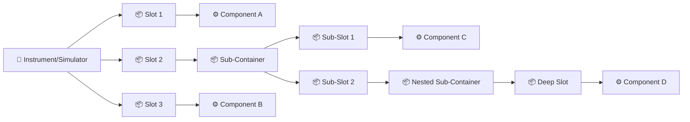
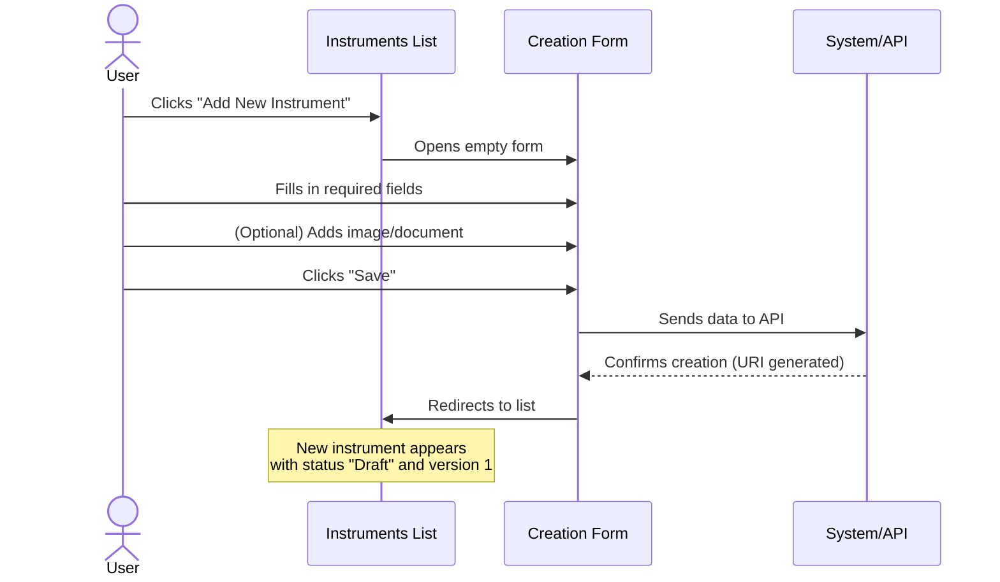
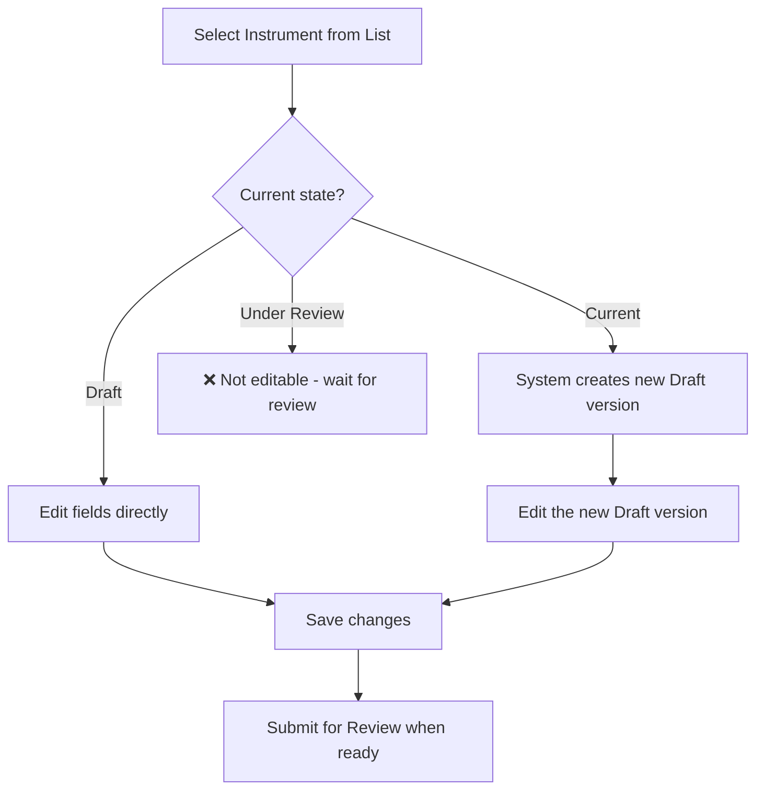
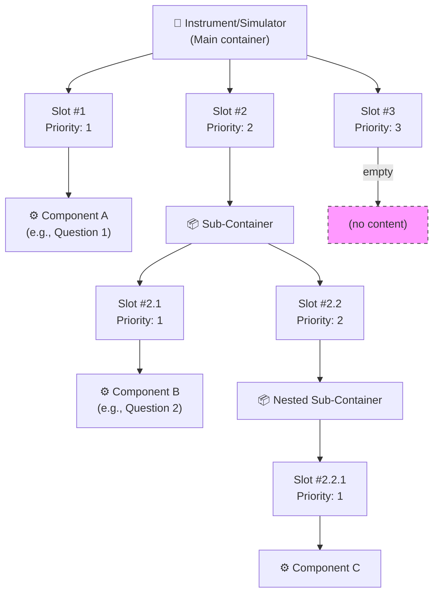
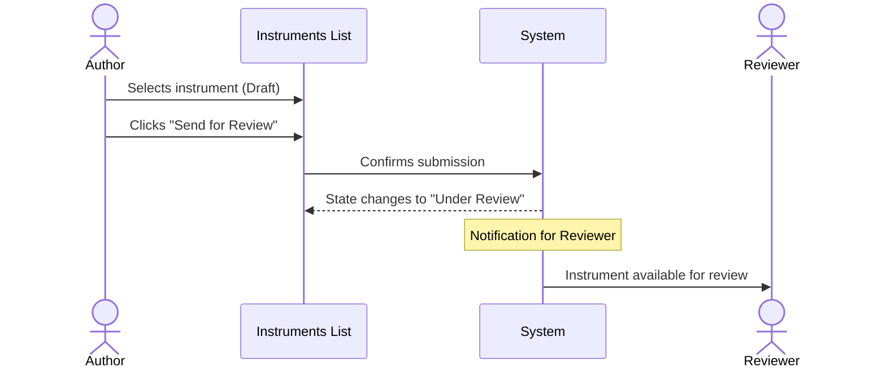
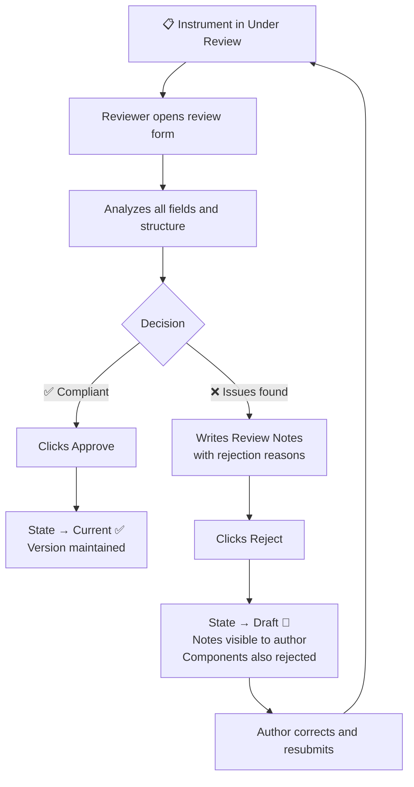
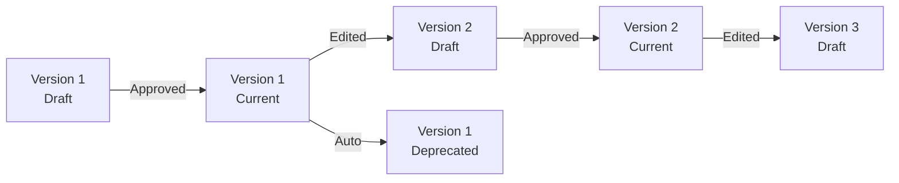

# Manual 1 - How to Create and Edit Instruments / Simulators

**Module:** SIR (Semantic Instrument Repository)  
**PMSR Context:** In PMSR, "Instrument" is typically referred to as **"Simulator"**  
**Version:** 1.0 | March 2026

> 🌐 **Portuguese version available:** [Open Portuguese version](01-MANUAL-INSTRUMENTS-SIMULATORS.md)

---

## Table of Contents

1. [Overview](#1-overview)
2. [Accessing Instrument/Simulator Management](#2-accessing-instrumentsimulator-management)
3. [The Management Page (List)](#3-the-management-page-list)
4. [Creating a New Instrument/Simulator](#4-creating-a-new-instrumentsimulator)
5. [Editing an Instrument/Simulator](#5-editing-an-instrumentsimulator)
6. [Container Slot Management (Internal Structure)](#6-container-slot-management-internal-structure)
7. [Submitting for Review](#7-submitting-for-review)
8. [The Review Process (Reviewer's Perspective)](#8-the-review-process-reviewers-perspective)
9. [Lifecycle and Versioning](#9-lifecycle-and-versioning)
10. [Field Reference](#10-field-reference)
11. [Troubleshooting](#11-troubleshooting)

---

## 1. Overview

An **Instrument** (or **Simulator** in the PMSR context) represents a measurement instrument, questionnaire, simulator, or data collection device in the semantic system. Examples in PMSR include pharmaceutical process simulators, quality measurement instruments, or assessment questionnaires.

Each Instrument/Simulator:
- Has a unique automatically generated **URI**
- Is classified by a **hierarchical type** (Parent Type)
- Contains **Container Slots** that hold **Components** or **sub-containers**, enabling recursive hierarchies (see 🔗 [Components Manual](03-MANUAL-COMPONENTS-EN.md))
- Follows a **review workflow**: Draft → Under Review → Current
- Has **automatic versioning**

> 📘 **Model vs. Instance:** An Instrument/Simulator is a **model (definition/design)** - it describes the instrument's structure, slots, and components. Think of it as a blueprint. To register **concrete physical units** of this model (with serial number, owner, location), see [Manual 04 - Instrument/Simulator Instances](04-MANUAL-INSTRUMENT-SIMULATOR-INSTANCES-EN.md). The same model can have multiple instances across different laboratories.

### Conceptual Diagram



> **PMSR Note:** The term displayed in the menu and forms depends on the **Preferred Names** configuration. If configured as "Simulator", all menus and labels will show "Simulator" instead of "Instrument".

---

## 2. Accessing Instrument/Simulator Management

### Navigation Path

```
Main Menu → Instrument Elements → Manage Elements → Manage Instruments
```

**Direct URL:** `https://www.pmsr.net/sir/select/instrument/1/9`

### Detailed Steps:

📋 **Step 1.** In the main navigation bar of the site, locate and click on **"Instrument Elements"** (or the name configured by PMSR).

📋 **Step 2.** In the submenu that appears, hover over **"Manage Elements"**.

📋 **Step 3.** Click on **"Manage Instruments"** (or "Manage Simulators" if configured).

You will be directed to the management page with the list of all Instruments you manage.

---

## 3. The Management Page (List)

The management page displays a list of Instruments/Simulators for which you are the author. It offers two views and several filtering options.

### Display Modes

| Button | Description |
|--------|-------------|
| **Table View** | Table view with detailed columns (recommended for management) |
| **Card View** | Card view with visual preview |

### Available Filters

| Filter | Description | Options |
|--------|-------------|---------|
| **Text Filter** | Keyword search by name/URI | Free text field |
| **Language** | Filters by instrument language | All / English / Português / etc. |
| **Status** | Filters by lifecycle state | All Status / Draft / Under Review / Current / Deprecated |

### Table Columns (Table View)

| Column | Description |
|--------|-------------|
| **URI** | Unique identifier (clickable link to the description page) |
| **Parent Type** | Hierarchical type of the instrument (clickable link) |
| **Abbreviation** | Short code/abbreviation |
| **Name** | Instrument name + version |
| **Language** | Language |
| **Downloads** | Download links in formats: TXT, HTML, RDF, FHIR (when applicable) |
| **Status** | Current state: Draft, Under Review, Current, Deprecated |

> **Tip:** If an element was rejected by the Reviewer, the status will appear as **"Draft (Already Reviewed)"** to indicate that it has already been reviewed and returned.

### Action Buttons

| Button | Function | Condition |
|--------|----------|-----------|
| **Add New Instrument** | Opens the creation form | Always available |
| **Edit Selected** | Opens the editing form for the selected element | Requires selection of 1 element |
| **Delete Selected** | Deletes the selected element | Requires selection + confirmation |
| **Send for Review** | Submits for review | Only for elements in **Draft** state |

---

## 4. Creating a New Instrument/Simulator

### Creation Sequence



### Detailed Steps

📋 **Step 1.** On the management page, click the **"Add New Instrument"** (or "Add New Simulator") button.

📋 **Step 2.** Fill in the creation form with the following fields:

#### Form Fields

| Field | Type | Required | Detailed Description |
|-------|------|----------|----------------------|
| **Parent Type** | Modal selection (tree) | No | Defines the hierarchical type of the instrument. When clicked, a modal window opens with a tree of available types in the ontology. Select the most specific applicable type (e.g., `vstoi:Questionnaire`, `vstoi:Simulator`). If you are unsure which to choose, consult the administrator. |
| **Name** | Text field | **Yes** | Descriptive name of the instrument. Should be clear and unique within your context. E.g., "PHQ-9 Depression Screening", "Lyophilization Process Simulator". |
| **Abbreviation** | Text field | No | Short code or acronym. E.g., "PHQ-9", "SIM-LIO-01". Useful for quick reference. |
| **Maker** | Text field with autocomplete | No | Manufacturing/creating organization. Start typing and select from the list of registered organizations. |
| **Informant** | Dropdown list | No | Defines the language informant (e.g., en_US for American English). |
| **Language** | Dropdown list | **Yes** | Primary language of the instrument. Default: English (en). |
| **Version** | Field (read-only) | Auto | Automatic value: starts at 1. Increments automatically when editing Current versions. |
| **Description** | Text area | No | Detailed description of the instrument, its purpose, usage context, and any relevant notes. |

#### Image Fields

| Field | Description |
|-------|-------------|
| **Image Type** | Choose between **URL** (external link) or **Upload** (upload file) |
| **Image (URL)** | If you chose URL: paste the full image address |
| **Upload Image** | If you chose Upload: click to select a file. Accepted formats: PNG, JPG, JPEG. Maximum size: 2 MB |

#### Web Document Fields

| Field | Description |
|-------|-------------|
| **Web Document Type** | Choose between **URL** (external link) or **Upload** (upload file) |
| **Web Document (URL)** | If you chose URL: paste the full document address |
| **Upload Document** | If you chose Upload: click to select a file. Accepted formats: PDF, DOC, DOCX, TXT, XLS, XLSX. Maximum size: 2 MB |

📋 **Step 3.** After filling in all required fields, click **"Save"**.

📋 **Step 4.** The system creates the instrument with:
- Automatically generated **URI**
- **Version** = 1
- **Status** = Draft
- **Author** = your user email

You will be redirected to the management page, where the new instrument appears in the list.

> ⚠️ **Important:** The instrument is created in **Draft** state. For it to become available for use (Current state), it must be [submitted for review](#7-submitting-for-review) and approved by a Reviewer.

### Parent Type Selection (Tree Modal)

When you click the **Parent Type** field, a modal window opens with an 800px width containing a hierarchical type tree:

```
vstoi:Instrument
├── vstoi:Questionnaire
│   ├── vstoi:SelfAdministeredQuestionnaire
│   └── vstoi:InterviewerAdministeredQuestionnaire
├── vstoi:Simulator
│   ├── vstoi:ProcessSimulator
│   └── vstoi:PharmaceuticalSimulator
├── vstoi:PhysicalDevice
│   ├── vstoi:Sensor
│   └── vstoi:MeasurementDevice
└── ...
```

> **Note:** The type tree is defined by the system's ontology. Available types may vary depending on your environment's configuration.

**To select:** Click on the desired type in the tree. The field will be automatically populated and the modal window will close.

---

## 5. Editing an Instrument/Simulator

### How to Access Editing

📋 **Step 1.** On the management page, select the instrument you want to edit by clicking the corresponding radio button in the table.

📋 **Step 2.** Click the **"Edit Selected"** button.

📋 **Step 3.** The editing form opens with all fields populated with the current data.

### Editing Form

The editing form contains all the fields from the creation form, with the following differences:

| Difference | Description |
|------------|-------------|
| **URI** | Displayed as a read-only field (clickable link to the description page) |
| **Version** | Automatically calculated: if the current state is Current or Deprecated, the displayed version will be incremented (+1) |
| **Container Elements** | Additional section showing the internal structure of slots and components (see [section 6](#6-container-slot-management-internal-structure)) |
| **Review Notes** | If the instrument has already been reviewed, shows the Reviewer's notes (read-only) |
| **Reviewer Email** | Email of the last Reviewer (read-only) |

### Editing Process Diagram



> ⚠️ **Editing a Current instrument:** When you edit an instrument with **Current** status, the system automatically creates a new version in **Draft** state with an incremented version number. The Current version remains unchanged until the new version is approved.

#### Editing Form Buttons

| Button | Function |
|--------|----------|
| **Update** | Saves changes and redirects to the list |
| **Cancel** | Discards changes and returns to the list |

---

## 6. Container Slot Management (Internal Structure)

An Instrument/Simulator contains **Container Slots** - numbered positions where **Components** or **sub-containers** are associated. The structure is recursive: a sub-container can contain additional slots, which can in turn hold components or more sub-containers, allowing deep hierarchies. This section appears in the editing form, within the **"Container Elements"** section.

### Container Slots Concept



### 6.1 Adding Slots to an Instrument

📋 **Step 1.** In the Instrument editing form, locate the **"Container Elements"** section.

📋 **Step 2.** Click the **"Add Slots"** button (or + icon).

📋 **Step 3.** In the form that opens:

| Field | Description |
|-------|-------------|
| **Container** | URI of the instrument (automatically filled, read-only) |
| **Number of Slots** | Number of slots to add. Enter a positive integer. |

📋 **Step 4.** Click **"Save"**. The slots are created with sequential priorities.

> **Example:** Adding 5 slots creates Slot #1, Slot #2, ..., Slot #5 in the instrument.

### 6.2 Associating a Component with a Slot

📋 **Step 1.** In the **"Container Elements"** section of the Instrument editing form, identify the desired slot.

📋 **Step 2.** Click the slot's edit button (pencil icon or "Edit Slot").

📋 **Step 3.** In the slot editing form:

| Field | Description |
|-------|-------------|
| **Slot URI** | Slot identifier (read-only) |
| **Priority** | Slot priority/order (read-only) |
| **Component** | Click to open the component selection modal. In the tree, select the desired Component. |

📋 **Step 4.** Available options:

| Button | Function |
|--------|----------|
| **New Item** | Creates a new Component and associates it with this slot (redirects to the Component creation form - see 🔗 [Components Manual](03-MANUAL-COMPONENTS-EN.md)) |
| **Reset this Item** | Removes the Component currently associated with the slot (frees the slot) |
| **Update** | Saves the selected Component association (only active when a component is selected) |
| **Cancel** | Returns without making changes |

> ⚠️ **Recursive structure:** A slot can point to a Component **or** a sub-container. When it points to a sub-container, that sub-container has its own slots and can be nested further as needed.

### 6.3 Visual Structure of Container Slots

When editing an Instrument, the Container Elements section displays a hierarchical view similar to:

```
📦 Container Elements
├── Slot #1 (Priority: 1) - ⚙️ Component: "Inlet Temperature" [Edit] [Remove]
├── Slot #2 (Priority: 2) - 📦 Sub-Container: "Pressure Measurements" [Edit] [Remove]
│   ├── Slot #2.1 (Priority: 1) - ⚙️ Component: "Chamber Pressure" [Edit] [Remove]
│   └── Slot #2.2 (Priority: 2) - 📦 Sub-Container: "Fine Control" [Edit] [Remove]
│       └── Slot #2.2.1 (Priority: 1) - ⚙️ Component: "Pillow Pressure" [Edit] [Remove]
├── Slot #3 (Priority: 3) - 🔲 (empty) [Edit] [Add Component or Sub-Container]
└── [+ Add More Slots]
```

---

## 7. Submitting for Review

> ℹ️ **Note on permissions:** Submitting for review can be done by the element's author (authenticated user). Approval or rejection requires the **Content Editor** (Reviewer) permission.

After creating or editing an Instrument/Simulator in **Draft** state, you need to submit it for review so it can advance to the **Current** state.

### Submission Sequence



### Detailed Steps

📋 **Step 1.** On the management page, filter by **Status: Draft** to locate instruments ready for review.

📋 **Step 2.** Select the instrument you want to submit by clicking the corresponding radio button.

📋 **Step 3.** Click the **"Send for Review"** button.

📋 **Step 4.** A confirmation dialog appears: *"Are you sure you want to submit for Review selected entry?"*

📋 **Step 5.** Confirm by clicking **OK**.

📋 **Step 6.** The instrument's state changes to **Under Review**. From this moment:
- The instrument **cannot be edited** by the author
- The instrument becomes available for evaluation by a **Reviewer**
- The submission is **recursive**: all Components associated with the instrument are also submitted for review

> ⚠️ **Recursive submission:** When you submit an Instrument for review, all Components in its slots are automatically submitted as well. Make sure all Components are complete before submitting the Instrument.

---

## 8. The Review Process (Reviewer's Perspective)

> ⚠️ **Required permission:** This section describes actions available only to users with the **Content Editor** (Reviewer) role. It is included so you understand the full review workflow.

### Who is the Reviewer?

The **Reviewer** is a user with the **content_editor** role in the system. Their function is to evaluate whether submitted elements are compliant and correct before approving them for general use.

### Accessing the Review

```
Main Menu → Instrument Elements → Review Elements → Review Instruments
```

The Reviewer navigates to the list of Instruments with **Under Review** status.

### Review Form

The review form presents the instrument in **read-only mode** (the Reviewer does not edit the data), organized into:

1. **Vertical Tabs** with all instrument fields (name, type, description, image, document, etc.)
2. **Container Elements** - visualization of the slots and components structure
3. **Review Section** - Reviewer action fields

### Review Section Fields

| Field | Type | Required | Description |
|-------|------|----------|-------------|
| **Review Notes** | Text area | Yes (for rejection) | Reviewer's notes and comments. Required in case of rejection to indicate the reason. Optional in case of approval. |
| **Reviewer Email** | Text field (read-only) | Auto | Current Reviewer's email, automatically filled. |

### Reviewer Actions

| Action | Button | Notes Required? | Result |
|--------|--------|-----------------|--------|
| **Approve** | **Approve** | No (optional) | State → **Current**. The instrument becomes available for instantiation and deployment. Confirms that the instrument is compliant. |
| **Reject** | **Reject** | **Yes** (required) | State → **Draft**. The instrument returns to the author with the Reviewer's notes explaining the reasons for rejection. The rejection is **recursive**: all associated Components are rejected as well. |

### Review Flow Diagram



> **Tip for Reviewers:** When rejecting, be specific in the Review Notes. Indicate exactly which fields or aspects need correction so the author can resolve issues quickly.

---

## 9. Lifecycle and Versioning

### Possible States

| State | Description | Can Edit? | Can Deploy? |
|-------|-------------|-----------|-------------|
| **Draft** | Work in progress | ✅ Yes | ❌ No |
| **Under Review** | Awaiting Reviewer evaluation | ❌ No | ❌ No |
| **Current** | Approved and available for use | ⚠️ Creates new version | ✅ Yes |
| **Deprecated** | Discontinued, replaced by a newer version | ❌ No | ❌ No |

### Automatic Versioning



- **Creation:** Version starts at 1
- **Editing a Current version:** Creates a new version (incremented) in Draft state
- **Approval of new version:** Previous version is automatically Deprecated

---

## 10. Field Reference

### Complete Field Table - Creation Form

| Field | Technical Name | HTML Type | Required | Default Value | Validation |
|-------|---------------|-----------|----------|---------------|------------|
| Parent Type | `instrument_type` | Modal textfield | No | (empty) | Valid ontology URI |
| Name | `instrument_name` | Textfield | Yes | (empty) | Not empty |
| Abbreviation | `instrument_abbreviation` | Textfield | No | (empty) | - |
| Maker | `instrument_maker` | Textfield + autocomplete | No | (empty) | Valid organization |
| Informant | `instrument_informant` | Select | No | (empty) | Informants list |
| Language | `instrument_language` | Select | Yes | en | Languages list |
| Version | `instrument_version` | Textfield (disabled) | Auto | 1 | Positive integer |
| Description | `instrument_description` | Textarea | No | (empty) | - |
| Image Type | `instrument_image_type` | Select | No | (empty) | URL / Upload |
| Image URL | `instrument_image_url` | Textfield | Conditional | (empty) | Valid URL |
| Image Upload | `instrument_image_upload` | Managed file | Conditional | (empty) | PNG/JPG/JPEG, max 2MB |
| Web Doc Type | `instrument_webdocument_type` | Select | No | (empty) | URL / Upload |
| Web Doc URL | `instrument_webdocument_url` | Textfield | Conditional | (empty) | Valid URL |
| Web Doc Upload | `instrument_webdocument_upload` | Managed file | Conditional | (empty) | PDF/DOC/DOCX/TXT/XLS/XLSX, max 2MB |

---

## 11. Troubleshooting

| Problem | Possible Cause | Solution |
|---------|---------------|----------|
| I cannot see the "Send for Review" button | The instrument is not in Draft state | Check the state in the Status column. Only Draft elements can be submitted. |
| The instrument was rejected | The Reviewer found issues | Open the editing form and check the "Review Notes" field to see the reason for rejection. Correct and resubmit. |
| The Parent Type modal is empty | Connection issue with the ontology | Contact the system administrator. |
| The image does not upload | Invalid format or size | Check: PNG/JPG/JPEG, maximum 2MB. |
| I cannot edit - the fields are locked | The instrument is in Under Review state | Wait for the Reviewer's decision. Editing is not possible during review. |
| The version changed automatically | You edited a Current instrument | Expected behavior: the system creates a new (incremented) version in Draft. |

---

🔗 **Related Manuals:**
- [Components Manual](03-MANUAL-COMPONENTS-EN.md) - To associate components with Instrument slots
- [Component Stems Manual](02-MANUAL-COMPONENT-STEMS-EN.md) - Prerequisite for creating Components
- [Instrument/Simulator Instances Manual](04-MANUAL-INSTRUMENT-SIMULATOR-INSTANCES-EN.md) - To instantiate approved Instruments
- [Manuals Index](INDEX-EN.md)

---

*PMSR Working Group - March 2026*
