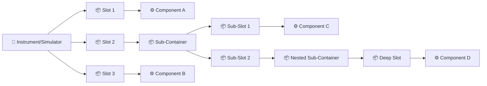
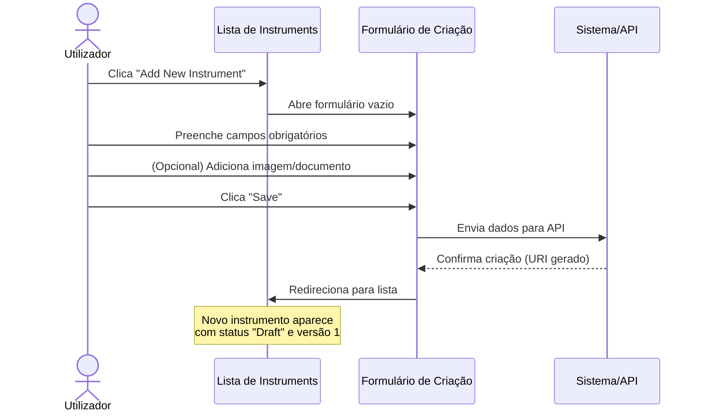
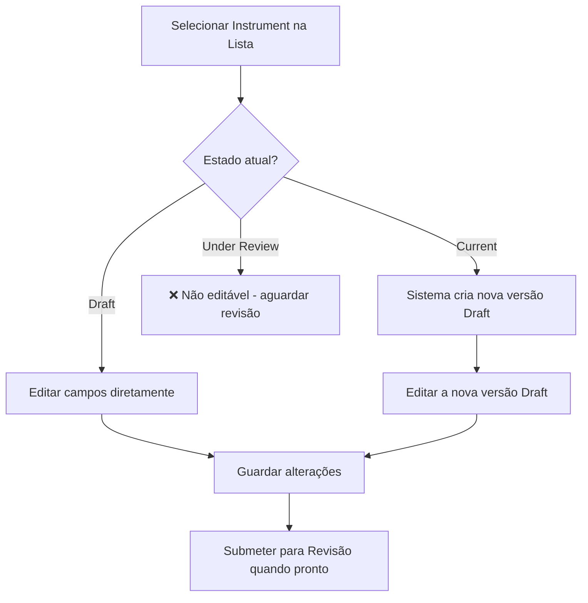
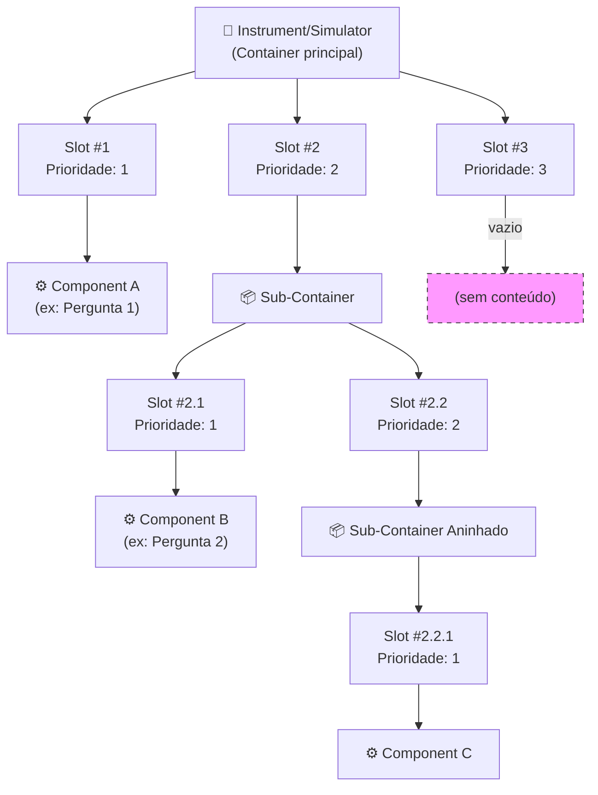
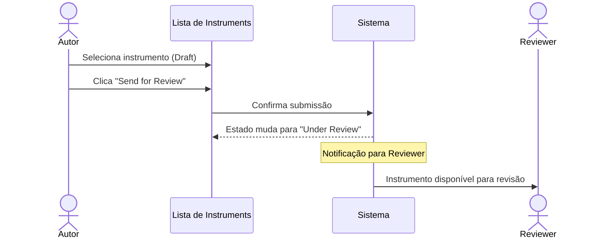
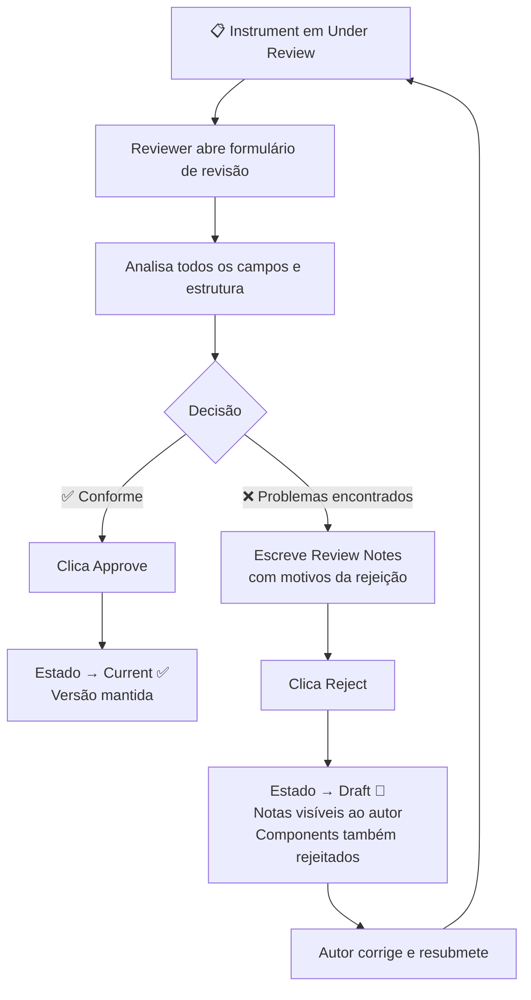
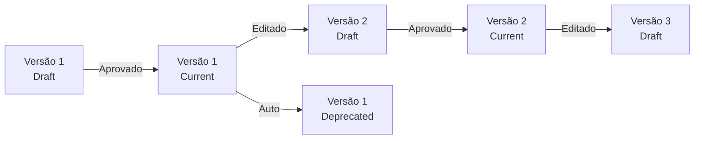

# Manual 1 - Como Criar e Editar Instruments / Simulators

**Módulo:** SIR (Semantic Instrument Repository)  
**Contexto PMSR:** No PMSR, "Instrument" é tipicamente referido como **"Simulator"**  
**Versão:** 1.0 | Março 2026

> 🌐 **Versão em inglês disponível:** [Open English version](01-MANUAL-INSTRUMENTS-SIMULATORS-EN.md)

---

## Índice

1. [Visão Geral](#1-visão-geral)
2. [Aceder à Gestão de Instruments/Simulators](#2-aceder-à-gestão-de-instrumentssimulators)
3. [A Página de Gestão (Lista)](#3-a-página-de-gestão-lista)
4. [Criar um Novo Instrument/Simulator](#4-criar-um-novo-instrumentsimulator)
5. [Editar um Instrument/Simulator](#5-editar-um-instrumentsimulator)
6. [Gestão de Container Slots (Estrutura Interna)](#6-gestão-de-container-slots-estrutura-interna)
7. [Submeter para Revisão](#7-submeter-para-revisão)
8. [O Processo de Revisão (Perspetiva do Reviewer)](#8-o-processo-de-revisão-perspetiva-do-reviewer)
9. [Ciclo de Vida e Versionamento](#9-ciclo-de-vida-e-versionamento)
10. [Referência de Campos](#10-referência-de-campos)
11. [Resolução de Problemas](#11-resolução-de-problemas)

---

## 1. Visão Geral

Um **Instrument** (ou **Simulator** no contexto PMSR) representa um instrumento de medição, questionário, simulador ou dispositivo de recolha de dados no sistema semântico. Exemplos no PMSR incluem simuladores de processos farmacêuticos, instrumentos de medição de qualidade, ou questionários de avaliação.

Cada Instrument/Simulator:
- Possui um **URI** único gerado automaticamente
- É classificado por um **tipo hierárquico** (Parent Type)
- Contém **Container Slots** que alojam **Components** ou **sub-containers**, permitindo estruturas recursivas (ver 🔗 [Manual de Components](03-MANUAL-COMPONENTS.md))
- Segue um **fluxo de revisão**: Draft → Under Review → Current
- Tem **versionamento automático**

> 📘 **Modelo vs. Instância:** Um Instrument/Simulator é um **modelo (definição/design)** - descreve a estrutura, slots e componentes do instrumento. É como um projeto ou blueprint. Para registar **unidades físicas concretas** deste modelo (com número de série, proprietário, localização), consulte o [Manual 04 - Instâncias de Instruments/Simulators](04-MANUAL-INSTRUMENT-SIMULATOR-INSTANCES.md). O mesmo modelo pode ter múltiplas instâncias em diferentes laboratórios.

### Diagrama Conceptual



> **Nota PMSR:** O termo exibido no menu e formulários depende da configuração de **Preferred Names**. Se configurado como "Simulator", todos os menus e labels mostrarão "Simulator" em vez de "Instrument".

---

## 2. Aceder à Gestão de Instruments/Simulators

### Caminho de Navegação

```
Menu Principal → Instrument Elements → Manage Elements → Manage Instruments
```

**URL direto:** `https://www.pmsr.net/sir/select/instrument/1/9`

### Passos detalhados:

📋 **Passo 1.** Na barra de navegação principal do site, localize e clique em **"Instrument Elements"** (ou o nome configurado pelo PMSR).

📋 **Passo 2.** No submenu que aparece, passe o cursor sobre **"Manage Elements"**.

📋 **Passo 3.** Clique em **"Manage Instruments"** (ou "Manage Simulators" se configurado).

Será direcionado para a página de gestão com a lista de todos os Instruments que gere.

---

## 3. A Página de Gestão (Lista)

A página de gestão apresenta uma lista dos Instruments/Simulators dos quais é utilizador/autor. Oferece duas vistas e várias opções de filtragem.

### Modos de Visualização

| Botão | Descrição |
|-------|-----------|
| **Table View** | Vista em tabela com colunas detalhadas (recomendado para gestão) |
| **Card View** | Vista em cartões com pré-visualização visual |

### Filtros Disponíveis

| Filtro | Descrição | Opções |
|--------|-----------|--------|
| **Filtro de Texto** | Pesquisa por palavra-chave no nome/URI | Campo de texto livre |
| **Language** | Filtra por idioma do instrumento | All / English / Português / etc. |
| **Status** | Filtra pelo estado do ciclo de vida | All Status / Draft / Under Review / Current / Deprecated |

### Colunas da Tabela (Table View)

| Coluna | Descrição |
|--------|-----------|
| **URI** | Identificador único (link clicável para página de descrição) |
| **Parent Type** | Tipo hierárquico do instrumento (link clicável) |
| **Abbreviation** | Abreviatura/código curto |
| **Name** | Nome do instrumento + versão |
| **Language** | Idioma |
| **Downloads** | Links para download em formatos: TXT, HTML, RDF, FHIR (quando aplicável) |
| **Status** | Estado atual: Draft, Under Review, Current, Deprecated |

> **Dica:** Se um elemento foi rejeitado pelo Reviewer, o status aparecerá como **"Draft (Already Reviewed)"** para indicar que já passou por revisão e foi devolvido.

### Botões de Ação

| Botão | Função | Condição |
|-------|--------|----------|
| **Add New Instrument** | Abre o formulário de criação | Sempre disponível |
| **Edit Selected** | Abre o formulário de edição do elemento selecionado | Requer seleção de 1 elemento |
| **Delete Selected** | Elimina o elemento selecionado | Requer seleção + confirmação |
| **Send for Review** | Submete para revisão | Apenas para elementos em estado **Draft** |

---

## 4. Criar um Novo Instrument/Simulator

### Sequência de Criação



### Passos Detalhados

📋 **Passo 1.** Na página de gestão, clique no botão **"Add New Instrument"** (ou "Add New Simulator").

📋 **Passo 2.** Preencha o formulário de criação com os seguintes campos:

#### Campos do Formulário

| Campo | Tipo | Obrigatório | Descrição Detalhada |
|-------|------|-------------|---------------------|
| **Parent Type** | Seleção por modal (árvore) | Não | Define o tipo hierárquico do instrumento. Ao clicar, abre uma janela modal com uma árvore de tipos disponíveis na ontologia. Selecione o tipo mais específico aplicável (ex: `vstoi:Questionnaire`, `vstoi:Simulator`). Se não souber qual escolher, consulte o administrador. |
| **Name** | Campo de texto | **Sim** | Nome descritivo do instrumento. Deve ser claro e único dentro do seu contexto. Ex: "PHQ-9 Depression Screening", "Simulador de Processo de Liofilização". |
| **Abbreviation** | Campo de texto | Não | Código curto ou sigla. Ex: "PHQ-9", "SIM-LIO-01". Útil para referência rápida. |
| **Maker** | Campo de texto com autocomplete | Não | Organização fabricante/criadora. Comece a escrever e selecione da lista de organizações registadas. |
| **Informant** | Lista de seleção | Não | Define o informante do idioma (ex: en_US para inglês americano). |
| **Language** | Lista de seleção | **Sim** | Idioma principal do instrumento. Predefinido: English (en). |
| **Version** | Campo (somente leitura) | Auto | Valor automático: começa em 1. Incrementa automaticamente em edições de versões Current. |
| **Description** | Área de texto | Não | Descrição detalhada do instrumento, seu propósito, contexto de utilização, e quaisquer notas relevantes. |

#### Campos de Imagem

| Campo | Descrição |
|-------|-----------|
| **Image Type** | Escolha entre **URL** (link externo) ou **Upload** (carregar ficheiro) |
| **Image (URL)** | Se escolheu URL: cole o endereço completo da imagem |
| **Upload Image** | Se escolheu Upload: clique para selecionar ficheiro. Formatos aceites: PNG, JPG, JPEG. Tamanho máximo: 2 MB |

#### Campos de Documento Web

| Campo | Descrição |
|-------|-----------|
| **Web Document Type** | Escolha entre **URL** (link externo) ou **Upload** (carregar ficheiro) |
| **Web Document (URL)** | Se escolheu URL: cole o endereço completo do documento |
| **Upload Document** | Se escolheu Upload: clique para selecionar ficheiro. Formatos aceites: PDF, DOC, DOCX, TXT, XLS, XLSX. Tamanho máximo: 2 MB |

📋 **Passo 3.** Após preencher todos os campos necessários, clique em **"Save"**.

📋 **Passo 4.** O sistema cria o instrumento com:
- **URI** gerado automaticamente
- **Versão** = 1
- **Status** = Draft
- **Utilizador** = o seu email de utilizador

Será redirecionado para a página de gestão, onde o novo instrumento aparece na lista.

> ⚠️ **Importante:** O instrumento é criado em estado **Draft**. Para que fique disponível para uso (estado Current), é necessário [submeter para revisão](#7-submeter-para-revisão) e ser aprovado por um Reviewer.

### Seleção do Parent Type (Modal de Árvore)

Quando clica no campo **Parent Type**, abre-se uma janela modal com largura de 800px contendo uma árvore hierárquica de tipos:

```
vstoi:Instrument
├── vstoi:Questionnaire
│   ├── vstoi:SelfAdministeredQuestionnaire
│   └── vstoi:InterviewerAdministeredQuestionnaire
├── vstoi:Simulator
│   ├── vstoi:ProcessSimulator
│   └── vstoi:PharmaceuticalSimulator
├── vstoi:PhysicalDevice
│   ├── vstoi:Sensor
│   └── vstoi:MeasurementDevice
└── ...
```

> **Nota:** A árvore de tipos é definida pela ontologia do sistema. Os tipos disponíveis podem variar conforme a configuração do seu ambiente.

**Para selecionar:** Clique no tipo desejado na árvore. O campo será preenchido automaticamente e a janela modal fecha-se.

---

## 5. Editar um Instrument/Simulator

### Como aceder à edição

📋 **Passo 1.** Na página de gestão, selecione o instrumento que deseja editar clicando no radio button correspondente na tabela.

📋 **Passo 2.** Clique no botão **"Edit Selected"**.

📋 **Passo 3.** O formulário de edição abre com todos os campos preenchidos com os dados atuais.

### Formulário de Edição

O formulário de edição contém todos os campos do formulário de criação, com as seguintes diferenças:

| Diferença | Descrição |
|-----------|-----------|
| **URI** | Exibido como campo somente leitura (link clicável para a página de descrição) |
| **Version** | Calculado automaticamente: se o estado atual é Current ou Deprecated, a versão exibida será incrementada (+1) |
| **Container Elements** | Secção adicional que mostra a estrutura interna de slots e componentes (ver [secção 6](#6-gestão-de-container-slots-estrutura-interna)) |
| **Review Notes** | Se o instrumento já foi revisto, mostra as notas do Reviewer (somente leitura) |
| **Reviewer Email** | Email do último Reviewer (somente leitura) |

### Diagrama do Processo de Edição



> ⚠️ **Editar um instrumento Current:** Quando edita um instrumento com estado **Current**, o sistema cria automaticamente uma nova versão em estado **Draft** com a versão incrementada. A versão Current permanece inalterada até que a nova versão seja aprovada.

#### Botões do Formulário de Edição

| Botão | Função |
|-------|--------|
| **Update** | Guarda as alterações e redireciona para a lista |
| **Cancel** | Descarta alterações e volta à lista |

---

## 6. Gestão de Container Slots (Estrutura Interna)

Um Instrument/Simulator contém **Container Slots** - posições numeradas onde se associam **Components** ou **sub-containers**. A estrutura é recursiva: um sub-container pode conter novos slots, que por sua vez podem conter components ou novos sub-containers, formando hierarquias profundas. Esta secção aparece no formulário de edição, dentro da secção **"Container Elements"**.

### Conceito de Container Slots



### 6.1 Adicionar Slots a um Instrument

📋 **Passo 1.** No formulário de edição do Instrument, localize a secção **"Container Elements"**.

📋 **Passo 2.** Clique no botão **"Add Slots"** (ou ícone de +).

📋 **Passo 3.** No formulário que abre:

| Campo | Descrição |
|-------|-----------|
| **Container** | URI do instrumento (preenchido automaticamente, somente leitura) |
| **Number of Slots** | Quantidade de slots a adicionar. Insira um número inteiro positivo. |

📋 **Passo 4.** Clique em **"Save"**. Os slots são criados com prioridades sequenciais.

> **Exemplo:** Adicionar 5 slots cria Slot #1, Slot #2, ..., Slot #5 no instrumento.

### 6.2 Associar um Component a um Slot

📋 **Passo 1.** Na secção **"Container Elements"** da edição do Instrument, identifique o slot desejado.

📋 **Passo 2.** Clique no botão de edição do slot (ícone de lápis ou "Edit Slot").

📋 **Passo 3.** No formulário de edição do slot:

| Campo | Descrição |
|-------|-----------|
| **Slot URI** | Identificador do slot (somente leitura) |
| **Priority** | Prioridade/ordem do slot (somente leitura) |
| **Component** | Clique para abrir a modal de seleção de componentes. Na árvore, selecione o Component desejado. |

📋 **Passo 4.** Opções disponíveis:

| Botão | Função |
|-------|--------|
| **New Item** | Cria um novo Component e associa-o a este slot (redireciona para o formulário de criação de Components - ver 🔗 [Manual de Components](03-MANUAL-COMPONENTS.md)) |
| **Reset this Item** | Remove o Component atualmente associado ao slot (liberta o slot) |
| **Update** | Guarda a associação do Component selecionado (só ativo quando um componente está selecionado) |
| **Cancel** | Volta sem alterar |

> ⚠️ **Estrutura recursiva:** Um slot pode apontar para um Component **ou** para um sub-container. Quando aponta para sub-container, esse sub-container terá os seus próprios slots e poderá continuar a ser aninhado conforme necessário.

### 6.3 Estrutura Visual dos Container Slots

Na edição de um Instrument, a secção Container Elements apresenta uma vista hierárquica semelhante a:

```
📦 Container Elements
├── Slot #1 (Prioridade: 1) - ⚙️ Component: "Temperatura de Entrada" [Edit] [Remove]
├── Slot #2 (Prioridade: 2) - 📦 Sub-Container: "Medições de Pressão" [Edit] [Remove]
│   ├── Slot #2.1 (Prioridade: 1) - ⚙️ Component: "Pressão de Câmara" [Edit] [Remove]
│   └── Slot #2.2 (Prioridade: 2) - 📦 Sub-Container: "Controlo Fino" [Edit] [Remove]
│       └── Slot #2.2.1 (Prioridade: 1) - ⚙️ Component: "Pressão de Almofada" [Edit] [Remove]
├── Slot #3 (Prioridade: 3) - 🔲 (vazio) [Edit] [Add Component ou Sub-Container]
└── [+ Add More Slots]
```

---

## 7. Submeter para Revisão

> ℹ️ **Nota sobre permissões:** A submissão para revisão pode ser feita pelo autor do elemento (utilizador autenticado). A aprovação ou rejeição requer a permissão **Content Editor** (Reviewer).

Após criar ou editar um Instrument/Simulator em estado **Draft**, é necessário submetê-lo para revisão para que possa avançar para o estado **Current**.

### Sequência de Submissão



### Passos Detalhados

📋 **Passo 1.** Na página de gestão, filtre por **Status: Draft** para localizar instrumentos prontos para revisão.

📋 **Passo 2.** Selecione o instrumento que deseja submeter clicando no radio button correspondente.

📋 **Passo 3.** Clique no botão **"Send for Review"**.

📋 **Passo 4.** Uma caixa de confirmação aparece: *"Are you sure you want to submit for Review selected entry?"*

📋 **Passo 5.** Confirme clicando **OK**.

📋 **Passo 6.** O estado do instrumento muda para **Under Review**. A partir deste momento:
- O instrumento **não pode ser editado** pelo autor
- O instrumento fica disponível para avaliação por um **Reviewer**
- A submissão é **recursiva**: todos os Components associados ao instrumento são também submetidos para revisão

> ⚠️ **Submissão recursiva:** Quando submete um Instrument para revisão, todos os Components nos seus slots são automaticamente submetidos também. Certifique-se de que todos os Components estão completos antes de submeter o Instrument.

---

## 8. O Processo de Revisão (Perspetiva do Reviewer)

> ⚠️ **Permissão necessária:** Esta secção descreve ações disponíveis apenas para utilizadores com a role **Content Editor** (Reviewer). É incluída para que compreenda o fluxo completo de revisão.

### Quem é o Reviewer?

O **Reviewer** é um utilizador com o papel **content_editor** no sistema. A sua função é avaliar se os elementos submetidos estão conformes e corretos antes de os aprovar para utilização geral.

### Aceder à Revisão

```
Menu Principal → Instrument Elements → Review Elements → Review Instruments
```

O Reviewer navega para a lista de Instruments com estado **Under Review**.

### Formulário de Revisão

O formulário de revisão apresenta o instrumento em **modo somente leitura** (o Reviewer não edita os dados), organizado em:

1. **Vertical Tabs** com todos os campos do instrumento (nome, tipo, descrição, imagem, documento, etc.)
2. **Container Elements** - visualização da estrutura de slots e componentes
3. **Secção de Revisão** - campos de ação do Reviewer

### Campos da Secção de Revisão

| Campo | Tipo | Obrigatório | Descrição |
|-------|------|-------------|-----------|
| **Review Notes** | Área de texto | Sim (para rejeição) | Notas e comentários do Reviewer. Obrigatórias em caso de rejeição para indicar o motivo. Opcionais em caso de aprovação. |
| **Reviewer Email** | Campo de texto (somente leitura) | Auto | Email do Reviewer atual, preenchido automaticamente. |

### Ações do Reviewer

| Ação | Botão | Notas Obrigatórias? | Resultado |
|------|-------|---------------------|-----------|
| **Aprovar** | **Approve** | Não (opcional) | Estado → **Current**. O instrumento fica disponível para instanciação e deployment. Confirma que o instrumento está conforme. |
| **Rejeitar** | **Reject** | **Sim** (obrigatórias) | Estado → **Draft**. O instrumento volta para o autor com as notas do Reviewer explicando os motivos da rejeição. A rejeição é **recursiva**: todos os Components associados são rejeitados também. |

### Diagrama do Fluxo de Revisão



> **Dica para Reviewers:** Ao rejeitar, seja específico nas Review Notes. Indique exatamente que campos ou aspetos precisam de correção para que o autor possa resolver rapidamente.

---

## 9. Ciclo de Vida e Versionamento

### Estados Possíveis

| Estado | Descrição | Pode Editar? | Pode Deploy? |
|--------|-----------|--------------|--------------|
| **Draft** | Rascunho em preparação | ✅ Sim | ❌ Não |
| **Under Review** | Aguarda avaliação do Reviewer | ❌ Não | ❌ Não |
| **Current** | Aprovado e disponível para uso | ⚠️ Cria nova versão | ✅ Sim |
| **Deprecated** | Descontinuado, substituído por versão mais recente | ❌ Não | ❌ Não |

### Versionamento Automático



- **Criação:** Versão começa em 1
- **Edição de Current:** Cria nova versão (incrementada) em estado Draft
- **Aprovação de nova versão:** Versão anterior é automaticamente Deprecated

---

## 10. Referência de Campos

### Tabela Completa de Campos - Formulário de Criação

| Campo | Nome Técnico | Tipo HTML | Obrigatório | Valor Padrão | Validação |
|-------|-------------|-----------|-------------|--------------|-----------|
| Parent Type | `instrument_type` | Modal textfield | Não | (vazio) | URI válido da ontologia |
| Name | `instrument_name` | Textfield | Sim | (vazio) | Não vazio |
| Abbreviation | `instrument_abbreviation` | Textfield | Não | (vazio) | - |
| Maker | `instrument_maker` | Textfield + autocomplete | Não | (vazio) | Organização válida |
| Informant | `instrument_informant` | Select | Não | (vazio) | Lista de informantes |
| Language | `instrument_language` | Select | Sim | en | Lista de idiomas |
| Version | `instrument_version` | Textfield (disabled) | Auto | 1 | Inteiro positivo |
| Description | `instrument_description` | Textarea | Não | (vazio) | - |
| Image Type | `instrument_image_type` | Select | Não | (vazio) | URL / Upload |
| Image URL | `instrument_image_url` | Textfield | Condicional | (vazio) | URL válido |
| Image Upload | `instrument_image_upload` | Managed file | Condicional | (vazio) | PNG/JPG/JPEG, max 2MB |
| Web Doc Type | `instrument_webdocument_type` | Select | Não | (vazio) | URL / Upload |
| Web Doc URL | `instrument_webdocument_url` | Textfield | Condicional | (vazio) | URL válido |
| Web Doc Upload | `instrument_webdocument_upload` | Managed file | Condicional | (vazio) | PDF/DOC/DOCX/TXT/XLS/XLSX, max 2MB |

---

## 11. Resolução de Problemas

| Problema | Causa Possível | Solução |
|----------|----------------|---------|
| Não consigo ver o botão "Send for Review" | O instrumento não está em estado Draft | Verifique o estado na coluna Status. Apenas elementos Draft podem ser submetidos. |
| O instrumento foi rejeitado | O Reviewer encontrou problemas | Abra o formulário de edição e consulte o campo "Review Notes" para ver o motivo da rejeição. Corrija e resubmeta. |
| A modal do Parent Type está vazia | Problema de conexão com a ontologia | Contacte o administrador do sistema. |
| A imagem não carrega | Formato ou tamanho inválido | Verifique: PNG/JPG/JPEG, máximo 2MB. |
| Não consigo editar - os campos estão bloqueados | O instrumento está em Under Review | Aguarde a decisão do Reviewer. Não é possível editar durante a revisão. |
| A versão mudou automaticamente | Editou um instrumento Current | Comportamento esperado: o sistema cria uma versão nova (incrementada) em Draft. |

---

🔗 **Manuais Relacionados:**
- [Manual de Components](03-MANUAL-COMPONENTS.md) - Para associar componentes aos slots do Instrument
- [Manual de Component Stems](02-MANUAL-COMPONENT-STEMS.md) - Pré-requisito para criar Components
- [Manual de Instâncias de Instruments/Simulators](04-MANUAL-INSTRUMENT-SIMULATOR-INSTANCES.md) - Para instanciar Instruments aprovados
- [Índice de Manuais](INDEX.md)

---

*Documento do Grupo de Trabalho PMSR - Março 2026*
