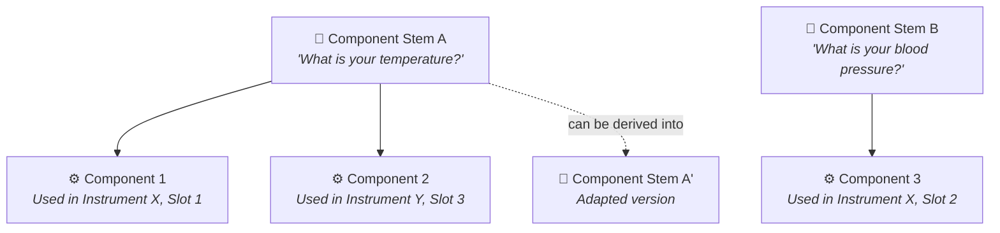
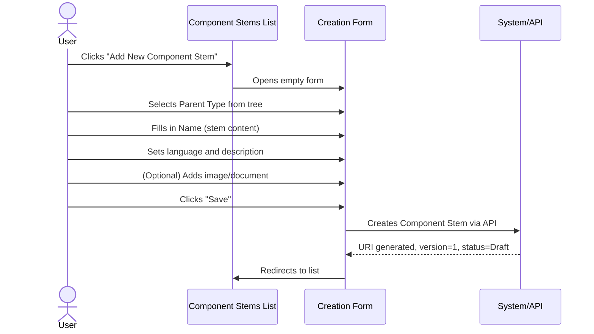
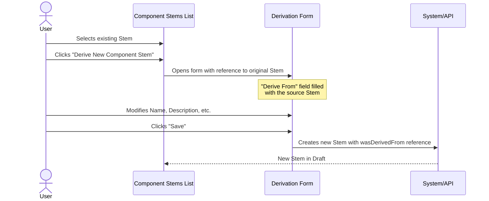
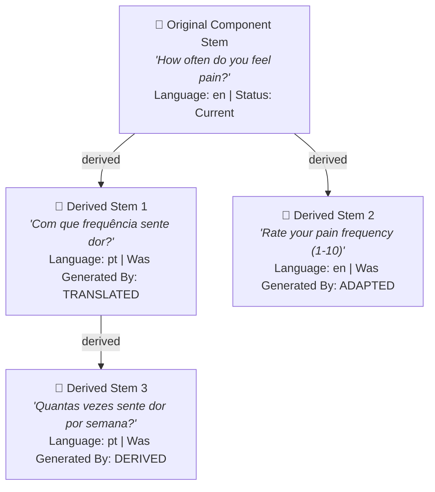
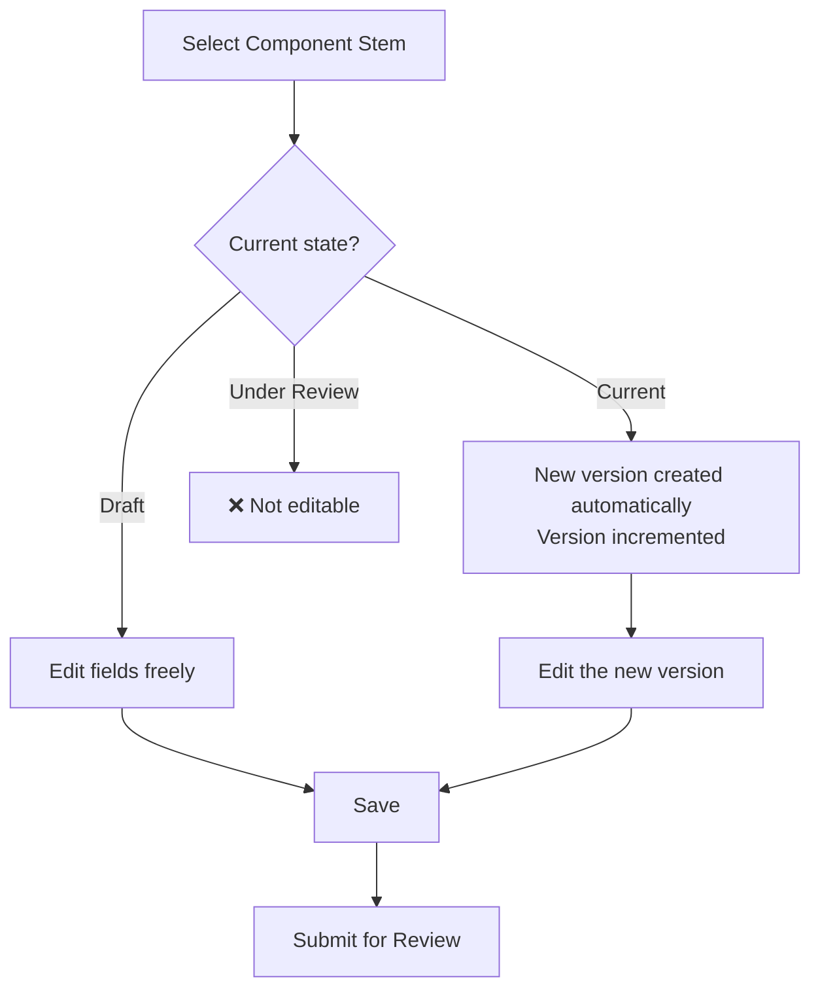
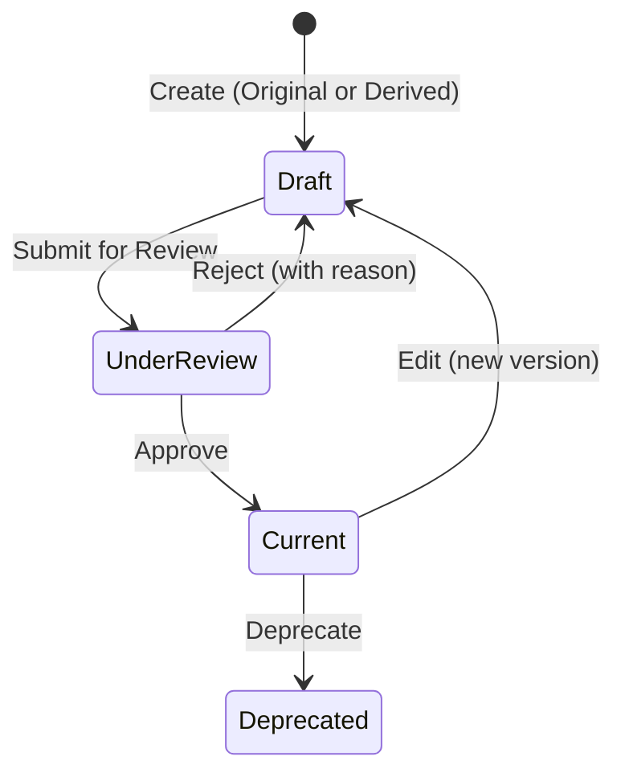
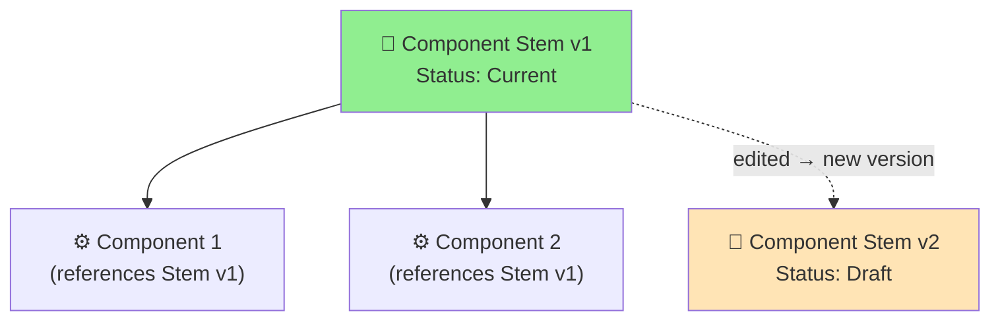

# Manual 2 - How to Create and Edit Component Stems

**Module:** SIR (Semantic Instrument Repository)  
**PMSR Context:** Component Stems are the reusable base templates for components  
**Version:** 1.0 | March 2026

> 🌐 **Portuguese version available:** [Open Portuguese version](02-MANUAL-COMPONENT-STEMS.md)

---

## Table of Contents

1. [Overview](#1-overview)
2. [What is a Component Stem?](#2-what-is-a-component-stem)
3. [Accessing Component Stem Management](#3-accessing-component-stem-management)
4. [The Management Page (List)](#4-the-management-page-list)
5. [Creating a New Component Stem](#5-creating-a-new-component-stem)
6. [Deriving a Component Stem](#6-deriving-a-component-stem)
7. [Editing a Component Stem](#7-editing-a-component-stem)
8. [Submitting for Review](#8-submitting-for-review)
9. [The Review Process (Reviewer's Perspective)](#9-the-review-process-reviewers-perspective)
10. [Lifecycle and Versioning](#10-lifecycle-and-versioning)
11. [Field Reference](#11-field-reference)
12. [Troubleshooting](#12-troubleshooting)

---

## 1. Overview

A **Component Stem** is a reusable template that defines the base properties of a component. It works as a "mold" from which concrete **Components** are created. Before creating a Component, it is **mandatory** that at least one suitable Component Stem exists.

> ⚠️ **Important dependency:** Creating Components depends on the existence of Component Stems. If you need to create a Component and cannot find a suitable Stem, you must first create the Stem following this manual, and then follow the 🔗 [Components Manual](03-MANUAL-COMPONENTS-EN.md).

> 📘 **What is a Component Stem?** A Component Stem is a **reusable template** - a "recipe" or base model for components. It defines the content (question, text, measurement) that can be reused across multiple Components and Instruments/Simulators. Think of it as a building block that can be adapted, translated, or derived for different contexts.

### Practical Analogy

Imagine a questionnaire:
- The **Component Stem** would be the *model question* (e.g., "How often do you feel X?")
- The **Component** would be the *concrete usage* of that question in a specific instrument (e.g., in a PHQ-9 questionnaire)

---

## 2. What is a Component Stem?

### Definition

A Component Stem is a semantic entity that defines:
- **Textual content** (the question, indicator, or base description)
- **Hierarchical type** in the ontology (e.g., `vstoi:ComponentStem`)
- **Language** of the content
- **Origin** (original or derived from another Stem)
- **Associated documentation** (images and documents)

### Relationship with other elements



> **A Component Stem can be used by multiple Components** across different Instruments. This promotes reuse and consistency.

### Note on historical terminology

> ⚠️ **Updated ontology:** The old term **"DetectorStem"** (prefix `DSM`) has been **discontinued**. Always use **"ComponentStem"** (prefix `CST`). If you encounter old entities with the `DSM` prefix, these reflect the previous naming convention and may need migration.

---

## 3. Accessing Component Stem Management

### Navigation Path

```
Main Menu → Instrument Elements → Manage Elements → Manage Component Stems
```

**Direct URL:** `https://www.pmsr.net/sir/select/componentstem/1/9`

### Detailed steps:

📋 **Step 1.** In the main navigation bar, click on **"Instrument Elements"**.

📋 **Step 2.** Hover over **"Manage Elements"**.

📋 **Step 3.** Click on **"Manage Component Stems"**.

---

## 4. The Management Page (List)

The page displays the list of Component Stems for which you are a user/author.

### Available Filters

| Filter | Description | Options |
|--------|-------------|---------|
| **Text Filter** | Keyword search in content/URI | Free text field |
| **Language** | Filter by language | All / English / Português / etc. |
| **Status** | Filter by state | All Status / Draft / Under Review / Current / Deprecated |

### Table Columns

| Column | Description |
|--------|-------------|
| **URI** | Unique identifier (clickable link) |
| **Content** | The text/content of the Stem (label) |
| **Version** | Version number |
| **Status** | Current state: Draft, Under Review, Current, Deprecated |

### Action Buttons

| Button | Function | Description |
|--------|----------|-------------|
| **Add New Component Stem** | Creates an original Stem | Opens creation form |
| **Derive New Component Stem** | Creates a Stem derived from the selected one | Opens pre-filled form with reference to the source Stem |
| **Edit Selected** | Edits the selected Stem | Opens editing form |
| **Delete Selected** | Deletes the selected Stem | With confirmation |
| **Send for Review** | Submits for review | Only for Stems in Draft state |

> **Note:** The **"Derive New Component Stem"** button is exclusive to Component Stems. It allows creating variants based on existing Stems.

---

## 5. Creating a New Component Stem

### Creation Sequence



### Detailed Steps

📋 **Step 1.** On the management page, click the **"Add New Component Stem"** button.

📋 **Step 2.** Fill in the form:

#### Creation Form Fields

| Field | Type | Required | Detailed Description |
|-------|------|----------|----------------------|
| **Parent Type** | Modal selection (tree) | **Yes** | Defines the Stem's hierarchical type in the ontology. When clicked, a modal window (800px) opens with the Component Stems type tree. Select the most appropriate type for your content. By default, the root type is `vstoi:ComponentStem`. |
| **Name** | Text field | **Yes** | The textual content of the Component Stem. This is the text that will be reused by Components referencing this Stem. **Example:** "How often do you experience headaches?", "Fluid inlet temperature (°C)", "Lyophilization chamber pressure". |
| **Language** | Selection list | **Yes** | Content language. Default: English (en). Select the language corresponding to the text in the Name field. |
| **Version** | Field (read-only) | Auto | Always starts at 1. Not editable. |
| **Description** | Text area | No | Additional description of the Stem: usage context, technical notes, scientific meaning, etc. |
| **Was Generated By** | Selection list | **Yes** | Indicates the Stem's origin. For Stems created from scratch, select **"ORIGINAL"**. Other options indicate derivation methods (automatic, adaptation, etc.). **Default: ORIGINAL.** |

#### Image Fields

| Field | Type | Description |
|-------|------|-------------|
| **Image Type** | Select | Choose between **URL** (external link) or **Upload** (upload file) |
| **Image (URL)** | Textfield | If URL: paste the full image address |
| **Upload Image** | File upload | If Upload: PNG, JPG, JPEG. Maximum 2 MB |

#### Web Document Fields

| Field | Type | Description |
|-------|------|-------------|
| **Web Document Type** | Select | Choose between **URL** or **Upload** |
| **Web Document (URL)** | Textfield | If URL: paste the full address |
| **Upload Document** | File upload | If Upload: PDF, DOC, DOCX, TXT, XLS, XLSX. Maximum 2 MB |

📋 **Step 3.** Click **"Save"** to create the Component Stem.

📋 **Step 4.** The system creates the Stem with:
- **URI** automatically generated (prefix `CST`)
- **Version** = 1
- **Status** = Draft
- **Was Generated By** = ORIGINAL

### Parent Type Selection (Tree Modal)

When clicking the **Parent Type** field, the modal opens with the hierarchical tree:

```
vstoi:ComponentStem
├── vstoi:QuestionStem
│   ├── vstoi:LikertQuestionStem
│   └── vstoi:OpenEndedQuestionStem
├── vstoi:SensorReadingStem
│   ├── vstoi:TemperatureStem
│   └── vstoi:PressureStem
└── ...
```

Click the desired type to select it. The field is populated and the modal closes.

---

## 6. Deriving a Component Stem

**Derivation** allows creating a new Component Stem based on an existing one, maintaining the reference to the source Stem. It is used when you want to create a variation (e.g., translation, adaptation, specialization).

### When to derive?

- Adapt a question for a different context
- Translate a Stem to another language
- Specialize a generic Stem for a specific domain

### Derivation Sequence



### Detailed Steps

📋 **Step 1.** In the Component Stems list, select the Stem that will serve as the base (radio button).

📋 **Step 2.** Click the **"Derive New Component Stem"** button.

📋 **Step 3.** The form opens with differences compared to the normal creation form:

| Difference | Description |
|------------|-------------|
| **Type field label** | Changes from "Parent Type" to **"Derive From"** |
| **Reference to original** | The field shows the selected source Stem |
| **Was Generated By** | The "ORIGINAL" option is **removed**. You must select the derivation method (e.g., DERIVED, ADAPTED, TRANSLATED). |

📋 **Step 4.** Modify the fields as needed:
- Change the **Name** to the new content
- Adjust the **Language** if it is a translation
- Update the **Description** to reflect the nature of the derivation
- Select the method in **Was Generated By** (e.g., "DERIVED" for derivation, "ADAPTED" for adaptation)

📋 **Step 5.** Click **"Save"**.

The new Stem is created with a reference (`wasDerivedFrom`) to the original Stem, enabling traceability.

### Derivation Diagram



---

## 7. Editing a Component Stem

### How to access editing

📋 **Step 1.** In the Component Stems list, select the Stem to edit (radio button).

📋 **Step 2.** Click **"Edit Selected"**.

### Editing Form

The editing form contains all the fields from the creation form, with additional elements:

| Additional Element | Description |
|--------------------|-------------|
| **URI** | Displayed as a read-only field (clickable link) |
| **Version** | If the state is Current or Deprecated, the version is automatically incremented |
| **Derived From** | If the Stem was derived, shows the source Stem URI with a **"Check Element"** button to view details |
| **Review Notes** | If previously reviewed, shows the Reviewer's notes (read-only) |
| **Reviewer Email** | Email of the last Reviewer (read-only) |

### Editing Flow



> ⚠️ **Editing a Current Stem:** When editing a Component Stem with **Current** state, the system creates a new version in **Draft** with an incremented version number. The Current version remains until the new one is approved.

---

## 8. Submitting for Review

### Steps

📋 **Step 1.** In the list, filter by **Status: Draft**.

📋 **Step 2.** Select the Component Stem to submit.

📋 **Step 3.** Click **"Send for Review"**.

📋 **Step 4.** Confirm in the dialog box: *"Are you sure you want to submit for Review selected entry?"*

📋 **Step 5.** The state changes to **Under Review**.

> **Note:** Unlike Instruments, submitting a Component Stem is **individual** - it does not affect other elements.

> ℹ️ **Note on permissions:** Submitting for review can be done by the element's author (authenticated user). Approval or rejection requires the **Content Editor** (Reviewer) permission.

---

## 9. The Review Process (Reviewer's Perspective)

> ⚠️ **Required permission:** This section describes actions available only to users with the **Content Editor** (Reviewer) role. It is included so you understand the full review workflow.

### Accessing Component Stem Review

```
Main Menu → Instrument Elements → Review Elements → Review Component Stems
```

### Review Form

The Reviewer sees the Component Stem in **read-only** mode, with:

1. **Vertical Tabs** with: Type, Name, Language, Version, Description
2. **Derived From** (if applicable): link to the source Stem + "Check Element" button
3. **Was Derived By**: derivation/generation method
4. **Review Section**: Review Notes + Reviewer Email

### Reviewer Actions

| Action | Button | Notes Required? | Result |
|--------|--------|-----------------|--------|
| **Approve** | **Approve** | No | State → **Current**. The Stem becomes available for use in Components. |
| **Reject** | **Reject** | **Yes** | State → **Draft**. The author receives the notes with the reason for rejection. |

### What the Reviewer should verify

| Aspect | What to evaluate |
|--------|------------------|
| **Content (Name)** | Is the text clear, grammatically correct, and appropriate for the context? |
| **Type (Parent Type)** | Is the hierarchical type correct in the ontology? |
| **Language** | Does the selected language match the content? |
| **Derivation** | If derived, is the reference to the original valid? Is the derivation justified? |
| **Description** | Is the description sufficiently detailed? |

---

## 10. Lifecycle and Versioning

### State Diagram



### Impact on Dependent Components

> ⚠️ **Warning:** Changing or deprecating a Component Stem may impact all Components that reference it. Before deprecating a Stem, check whether there are active Components using it.



---

## 11. Field Reference

### Complete Table - Creation Form

| Field | Technical Name | Type | Required | Default Value | Description |
|-------|---------------|------|----------|---------------|-------------|
| Parent Type | `componentstem_type` | Modal textfield | Yes | (empty) | Type in the ontology, selected via modal tree |
| Name | `componentstem_content` | Textfield | Yes | (empty) | Textual content of the Stem |
| Language | `componentstem_language` | Select | Yes | en | Content language |
| Version | `componentstem_version` | Hidden / Textfield (disabled) | Auto | 1 | Numeric version |
| Description | `componentstem_description` | Textarea | No | (empty) | Detailed description |
| Was Generated By | `componentstem_was_generated_by` | Select | Yes | ORIGINAL | Creation/derivation method |
| Image Type | `componentstem_image_type` | Select | No | (empty) | URL or Upload |
| Image URL | `componentstem_image_url` | Textfield | Conditional | (empty) | Image URL (if URL type) |
| Image Upload | `componentstem_image_upload` | Managed file | Conditional | (empty) | File (PNG/JPG/JPEG, max 2MB) |
| Web Doc Type | `componentstem_webdocument_type` | Select | No | (empty) | URL or Upload |
| Web Doc URL | `componentstem_webdocument_url` | Textfield | Conditional | (empty) | Document URL (if URL type) |
| Web Doc Upload | `componentstem_webdocument_upload` | Managed file | Conditional | (empty) | File (PDF/DOC/DOCX/TXT/XLS/XLSX, max 2MB) |

### Additional Editing Fields

| Field | Technical Name | Type | Description |
|-------|---------------|------|-------------|
| URI | `componentstem_uri` | Item (read-only) | Clickable link to the description page |
| Derived From | (display) | Markup + Button | Source Stem URI + "Check Element" button |
| Review Notes | `componentstem_hasreviewnote` | Textarea (read-only) | Reviewer's notes (if any) |
| Reviewer Email | `componentstem_haseditoremail` | Textfield (read-only) | Last Reviewer's email |

### "Was Generated By" Field Options

| Option | Description | When to use |
|--------|-------------|-------------|
| **ORIGINAL** | Stem created from scratch | Direct creation (not based on another Stem) |
| **DERIVED** | Derived from another Stem | Variation or evolution of an existing Stem |
| **ADAPTED** | Adapted from another Stem | Adaptation for a different context |
| **TRANSLATED** | Translated from another Stem | Translation to another language |

> **Note:** When using the derivation form (via the "Derive New" button), the ORIGINAL option is automatically removed, since the Stem is being derived.

---

## 12. Troubleshooting

| Problem | Possible Cause | Solution |
|---------|----------------|----------|
| I cannot find the Stem I need to create a Component | The Stem may not exist or may be in another language | Create a new Stem or use "Derive" to create an adapted version |
| The "Derive" button is disabled | No Stem is selected in the list | Select a Stem by clicking the radio button before clicking "Derive" |
| The "Was Generated By" field does not show "ORIGINAL" | You are using the derivation form | Expected behavior for derivations. Use "Add New" to create original Stems. |
| The version incremented on its own | You edited a Stem with Current state | Expected behavior - new Draft version created automatically |
| The Stem was rejected in review | The Reviewer found issues | Open the editing form and check the Review Notes to see the reason |

---

🔗 **Related Manuals:**
- [Components Manual](03-MANUAL-COMPONENTS-EN.md) - Next step: use Stems to create Components
- [Instruments/Simulators Manual](01-MANUAL-INSTRUMENTS-SIMULATORS-EN.md) - The context where Components (and by extension, Stems) are used
- [Manuals Index](INDEX-EN.md)

---

*PMSR Working Group - March 2026*
