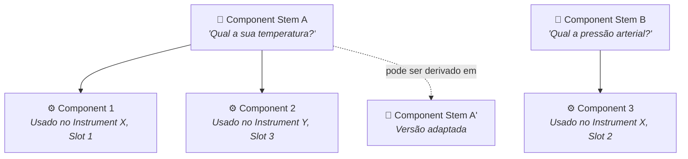
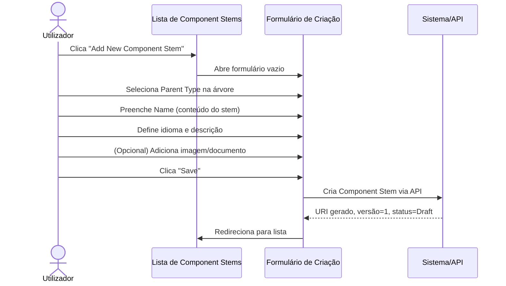
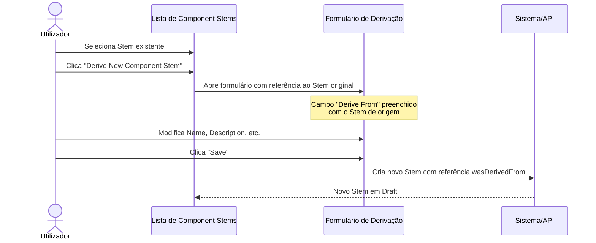
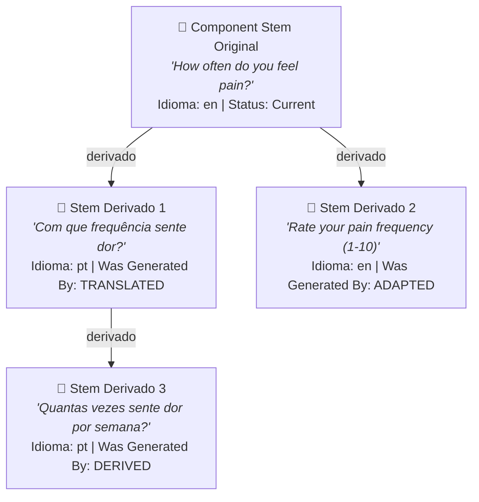
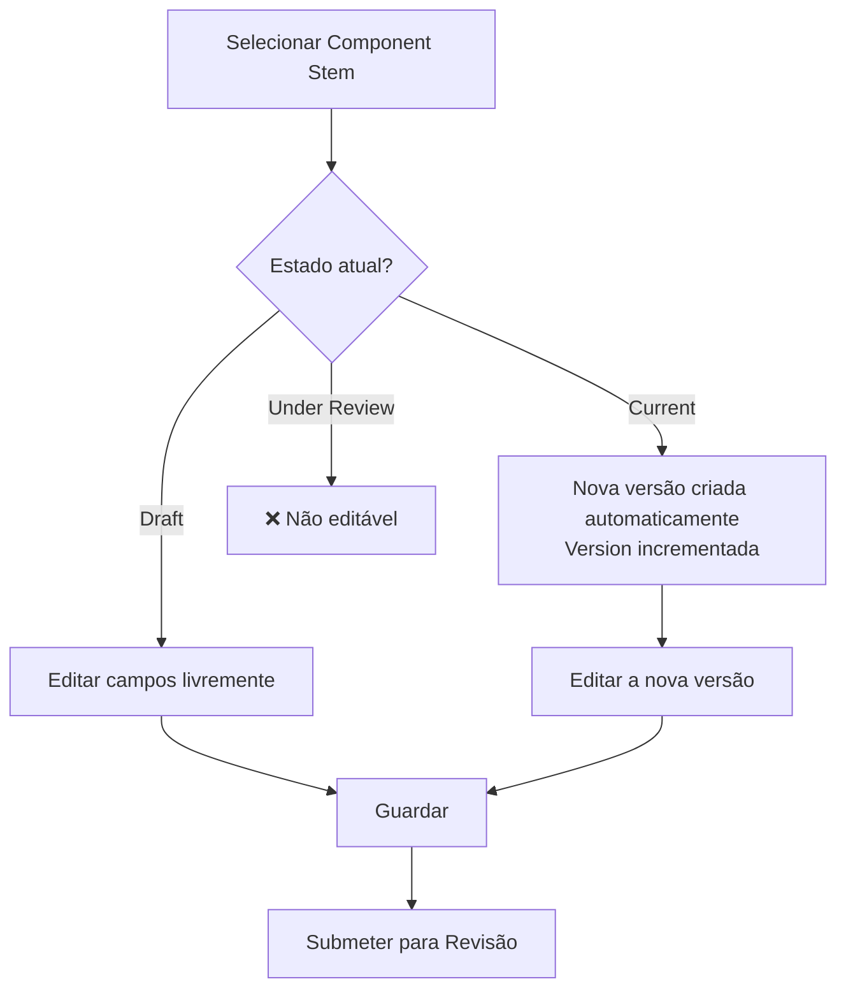
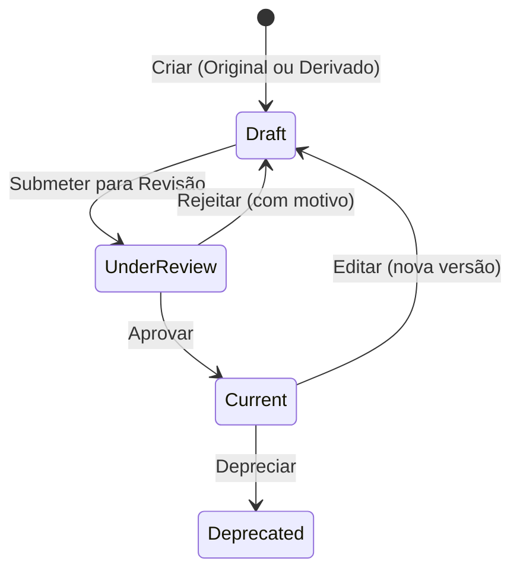
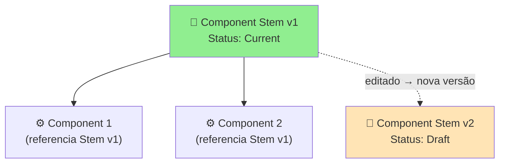

# Manual 2 - Como Criar e Editar Component Stems

**Módulo:** SIR (Semantic Instrument Repository)  
**Contexto PMSR:** Component Stems são os templates reutilizáveis base dos componentes  
**Versão:** 1.0 | Março 2026

> 🌐 **Versão em inglês disponível:** [Open English version](02-MANUAL-COMPONENT-STEMS-EN.md)

---

## Índice

1. [Visão Geral](#1-visão-geral)
2. [O que é um Component Stem?](#2-o-que-é-um-component-stem)
3. [Aceder à Gestão de Component Stems](#3-aceder-à-gestão-de-component-stems)
4. [A Página de Gestão (Lista)](#4-a-página-de-gestão-lista)
5. [Criar um Novo Component Stem](#5-criar-um-novo-component-stem)
6. [Derivar um Component Stem](#6-derivar-um-component-stem)
7. [Editar um Component Stem](#7-editar-um-component-stem)
8. [Submeter para Revisão](#8-submeter-para-revisão)
9. [O Processo de Revisão (Perspetiva do Reviewer)](#9-o-processo-de-revisão-perspetiva-do-reviewer)
10. [Ciclo de Vida e Versionamento](#10-ciclo-de-vida-e-versionamento)
11. [Referência de Campos](#11-referência-de-campos)
12. [Resolução de Problemas](#12-resolução-de-problemas)

---

## 1. Visão Geral

Um **Component Stem** é um template reutilizável que define as propriedades base de um componente. Funciona como um "molde" a partir do qual se criam **Components** concretos. Antes de criar um Component, é **obrigatório** que exista pelo menos um Component Stem adequado.

> ⚠️ **Dependência importante:** A criação de Components depende da existência de Component Stems. Se precisar de criar um Component e não encontrar um Stem adequado, terá de criar primeiro o Stem seguindo este manual, e depois seguir o 🔗 [Manual de Components](03-MANUAL-COMPONENTS.md).

> 📘 **O que é um Component Stem?** Um Component Stem é um **template reutilizável** - uma "receita" ou modelo base para componentes. Define o conteúdo (pergunta, texto, medição) que pode ser reutilizado em múltiplos Components e Instruments/Simulators. Pense nele como um bloco de construção que pode ser adaptado, traduzido ou derivado para diferentes contextos.

### Analogia Prática

Imagine um questionário:
- O **Component Stem** seria a *pergunta modelo* (ex: "Qual a frequência com que sente X?")
- O **Component** seria a *utilização concreta* dessa pergunta num instrumento específico (ex: num questionário PHQ-9)

---

## 2. O que é um Component Stem?

### Definição

Um Component Stem é uma entidade semântica que define:
- **Conteúdo textual** (a pergunta, indicador ou descrição base)
- **Tipo hierárquico** na ontologia (ex: `vstoi:ComponentStem`)
- **Idioma** do conteúdo
- **Origem** (original ou derivado de outro Stem)
- **Documentação** associada (imagens e documentos)

### Relação com outros elementos



> **Um Component Stem pode ser utilizado por múltiplos Components** em diferentes Instruments. Isso promove a reutilização e consistência.

### Nota sobre terminologia histórica

> ⚠️ **Ontologia atualizada:** O termo antigo **"DetectorStem"** (prefixo `DSM`) foi **descontinuado**. Utilize sempre **"ComponentStem"** (prefixo `CST`). Se encontrar entidades antigas com o prefixo `DSM`, estas refletem a nomenclatura anterior e podem necessitar de migração.

---

## 3. Aceder à Gestão de Component Stems

### Caminho de Navegação

```
Menu Principal → Instrument Elements → Manage Elements → Manage Component Stems
```

**URL direto:** `https://www.pmsr.net/sir/select/componentstem/1/9`

### Passos detalhados:

📋 **Passo 1.** Na barra de navegação principal, clique em **"Instrument Elements"**.

📋 **Passo 2.** Passe o cursor sobre **"Manage Elements"**.

📋 **Passo 3.** Clique em **"Manage Component Stems"**.

---

## 4. A Página de Gestão (Lista)

A página apresenta a lista de Component Stems dos quais é utilizador.

### Filtros Disponíveis

| Filtro | Descrição | Opções |
|--------|-----------|--------|
| **Filtro de Texto** | Pesquisa por palavra-chave no conteúdo/URI | Campo de texto livre |
| **Language** | Filtra por idioma | All / English / Português / etc. |
| **Status** | Filtra pelo estado | All Status / Draft / Under Review / Current / Deprecated |

### Colunas da Tabela

| Coluna | Descrição |
|--------|-----------|
| **URI** | Identificador único (link clicável) |
| **Content** | O texto/conteúdo do Stem (label) |
| **Version** | Número da versão |
| **Status** | Estado atual: Draft, Under Review, Current, Deprecated |

### Botões de Ação

| Botão | Função | Descrição |
|-------|--------|-----------|
| **Add New Component Stem** | Cria um Stem original | Abre formulário de criação |
| **Derive New Component Stem** | Cria um Stem derivado do selecionado | Abre formulário pré-preenchido com referência ao Stem de origem |
| **Edit Selected** | Edita o Stem selecionado | Abre formulário de edição |
| **Delete Selected** | Elimina o Stem selecionado | Com confirmação |
| **Send for Review** | Submete para revisão | Apenas para Stems em estado Draft |

> **Nota:** O botão **"Derive New Component Stem"** é exclusivo dos Component Stems. Permite criar variantes baseadas em Stems existentes.

---

## 5. Criar um Novo Component Stem

### Sequência de Criação



### Passos Detalhados

📋 **Passo 1.** Na página de gestão, clique no botão **"Add New Component Stem"**.

📋 **Passo 2.** Preencha o formulário:

#### Campos do Formulário de Criação

| Campo | Tipo | Obrigatório | Descrição Detalhada |
|-------|------|-------------|---------------------|
| **Parent Type** | Seleção por modal (árvore) | **Sim** | Define o tipo hierárquico do Stem na ontologia. Ao clicar, abre-se uma janela modal (800px) com a árvore de tipos de Component Stems. Selecione o tipo mais adequado para o seu conteúdo. Por defeito, o tipo raiz é `vstoi:ComponentStem`. |
| **Name** | Campo de texto | **Sim** | O conteúdo textual do Component Stem. Este é o texto que será reutilizado pelos Components que referenciam este Stem. **Exemplo:** "Com que frequência sente dor de cabeça?", "Temperatura de entrada do fluido (°C)", "Pressão da câmara de liofilização". |
| **Language** | Lista de seleção | **Sim** | Idioma do conteúdo. Predefinido: English (en). Selecione o idioma correspondente ao texto do campo Name. |
| **Version** | Campo (somente leitura) | Auto | Sempre começa em 1. Não editável. |
| **Description** | Área de texto | Não | Descrição adicional do Stem: contexto de utilização, notas técnicas, significado científico, etc. |
| **Was Generated By** | Lista de seleção | **Sim** | Indica a origem do Stem. Para Stems criados de raiz, selecione **"ORIGINAL"**. Outras opções indicam métodos de derivação (automática, adaptação, etc.). **Predefinido: ORIGINAL.** |

#### Campos de Imagem

| Campo | Tipo | Descrição |
|-------|------|-----------|
| **Image Type** | Select | Escolha entre **URL** (link externo) ou **Upload** (carregar ficheiro) |
| **Image (URL)** | Textfield | Se URL: cole o endereço completo da imagem |
| **Upload Image** | File upload | Se Upload: PNG, JPG, JPEG. Máximo 2 MB |

#### Campos de Documento Web

| Campo | Tipo | Descrição |
|-------|------|-----------|
| **Web Document Type** | Select | Escolha entre **URL** ou **Upload** |
| **Web Document (URL)** | Textfield | Se URL: cole o endereço completo |
| **Upload Document** | File upload | Se Upload: PDF, DOC, DOCX, TXT, XLS, XLSX. Máximo 2 MB |

📋 **Passo 3.** Clique em **"Save"** para criar o Component Stem.

📋 **Passo 4.** O sistema cria o Stem com:
- **URI** gerado automaticamente (prefixo `CST`)
- **Versão** = 1
- **Status** = Draft
- **Was Generated By** = ORIGINAL

### Seleção do Parent Type (Modal de Árvore)

Ao clicar no campo **Parent Type**, abre-se a modal com a árvore hierárquica:

```
vstoi:ComponentStem
├── vstoi:QuestionStem
│   ├── vstoi:LikertQuestionStem
│   └── vstoi:OpenEndedQuestionStem
├── vstoi:SensorReadingStem
│   ├── vstoi:TemperatureStem
│   └── vstoi:PressureStem
└── ...
```

Clique no tipo desejado para selecionar. O campo é preenchido e a modal fecha.

---

## 6. Derivar um Component Stem

A **derivação** permite criar um novo Component Stem baseado num existente, mantendo a referência ao Stem de origem. Usado quando se pretende criar uma variação (ex: tradução, adaptação, especialização).

### Quando derivar?

- Adaptar uma pergunta para um contexto diferente
- Traduzir um Stem para outro idioma
- Especializar um Stem genérico para um domínio específico

### Sequência de Derivação



### Passos Detalhados

📋 **Passo 1.** Na lista de Component Stems, selecione o Stem que servirá de base (radio button).

📋 **Passo 2.** Clique no botão **"Derive New Component Stem"**.

📋 **Passo 3.** O formulário abre com diferenças em relação ao formulário de criação normal:

| Diferença | Descrição |
|-----------|-----------|
| **Label do campo de tipo** | Muda de "Parent Type" para **"Derive From"** |
| **Referência ao original** | O campo mostra o Stem de origem selecionado |
| **Was Generated By** | A opção "ORIGINAL" é **removida**. Deve selecionar o método de derivação (ex: DERIVED, ADAPTED, TRANSLATED). |

📋 **Passo 4.** Modifique os campos conforme necessário:
- Altere o **Name** para o novo conteúdo
- Ajuste o **Language** se for uma tradução
- Atualize a **Description** para refletir a natureza da derivação
- Selecione o método em **Was Generated By** (ex: "DERIVED" para derivação, "ADAPTED" para adaptação)

📋 **Passo 5.** Clique em **"Save"**.

O novo Stem é criado com uma referência (`wasDerivedFrom`) ao Stem original, permitindo rastreabilidade.

### Diagrama de Derivação



---

## 7. Editar um Component Stem

### Como aceder à edição

📋 **Passo 1.** Na lista de Component Stems, selecione o Stem a editar (radio button).

📋 **Passo 2.** Clique em **"Edit Selected"**.

### Formulário de Edição

O formulário de edição contém todos os campos do formulário de criação, com elementos adicionais:

| Elemento Adicional | Descrição |
|--------------------|-----------|
| **URI** | Exibido como campo somente leitura (link clicável) |
| **Version** | Se o estado é Current ou Deprecated, a versão é automaticamente incrementada |
| **Derived From** | Se o Stem foi derivado, mostra o URI do Stem de origem com um botão **"Check Element"** para consultar detalhes |
| **Review Notes** | Se já foi revisto, mostra as notas do Reviewer (somente leitura) |
| **Reviewer Email** | Email do último Reviewer (somente leitura) |

### Fluxo de Edição



> ⚠️ **Editar um Stem Current:** Ao editar um Component Stem com estado **Current**, o sistema cria uma nova versão em **Draft** com a versão incrementada. A versão Current permanece até que a nova seja aprovada.

---

## 8. Submeter para Revisão

### Passos

📋 **Passo 1.** Na lista, filtre por **Status: Draft**.

📋 **Passo 2.** Selecione o Component Stem a submeter.

📋 **Passo 3.** Clique em **"Send for Review"**.

📋 **Passo 4.** Confirme na caixa de diálogo: *"Are you sure you want to submit for Review selected entry?"*

📋 **Passo 5.** O estado muda para **Under Review**.

> **Nota:** Ao contrário dos Instruments, a submissão de um Component Stem é **individual** - não afeta outros elementos.

> ℹ️ **Nota sobre permissões:** A submissão para revisão pode ser feita pelo autor do elemento (utilizador autenticado). A aprovação ou rejeição requer a permissão **Content Editor** (Reviewer).

---

## 9. O Processo de Revisão (Perspetiva do Reviewer)

> ⚠️ **Permissão necessária:** Esta secção descreve ações disponíveis apenas para utilizadores com a role **Content Editor** (Reviewer). É incluída para que compreenda o fluxo completo de revisão.

### Aceder à Revisão de Component Stems

```
Menu Principal → Instrument Elements → Review Elements → Review Component Stems
```

### Formulário de Revisão

O Reviewer vê o Component Stem em modo **somente leitura**, com:

1. **Vertical Tabs** com: Type, Name, Language, Version, Description
2. **Derived From** (se aplicável): link para o Stem de origem + botão "Check Element"
3. **Was Derived By**: método de derivação/geração
4. **Secção de Revisão**: Review Notes + Reviewer Email

### Ações do Reviewer

| Ação | Botão | Notas Obrigatórias? | Resultado |
|------|-------|---------------------|-----------|
| **Aprovar** | **Approve** | Não | Estado → **Current**. O Stem fica disponível para uso em Components. |
| **Rejeitar** | **Reject** | **Sim** | Estado → **Draft**. O autor recebe as notas com o motivo da rejeição. |

### O que o Reviewer deve verificar

| Aspeto | O que avaliar |
|--------|---------------|
| **Conteúdo (Name)** | O texto é claro, gramaticalmente correto e adequado ao contexto? |
| **Tipo (Parent Type)** | O tipo hierárquico está correto na ontologia? |
| **Idioma** | O idioma selecionado corresponde ao conteúdo? |
| **Derivação** | Se derivado, a referência ao original é válida? A derivação é justificada? |
| **Descrição** | A descrição é suficientemente detalhada? |

---

## 10. Ciclo de Vida e Versionamento

### Diagrama de Estados



### Impacto nos Components Dependentes

> ⚠️ **Atenção:** Alterar ou depreciar um Component Stem pode impactar todos os Components que o referenciam. Antes de depreciar um Stem, verifique se existem Components ativos que o utilizam.



---

## 11. Referência de Campos

### Tabela Completa - Formulário de Criação

| Campo | Nome Técnico | Tipo | Obrigatório | Valor Padrão | Descrição |
|-------|-------------|------|-------------|--------------|-----------|
| Parent Type | `componentstem_type` | Modal textfield | Sim | (vazio) | Tipo na ontologia, selecionado por árvore modal |
| Name | `componentstem_content` | Textfield | Sim | (vazio) | Conteúdo textual do Stem |
| Language | `componentstem_language` | Select | Sim | en | Idioma do conteúdo |
| Version | `componentstem_version` | Hidden / Textfield (disabled) | Auto | 1 | Versão numérica |
| Description | `componentstem_description` | Textarea | Não | (vazio) | Descrição detalhada |
| Was Generated By | `componentstem_was_generated_by` | Select | Sim | ORIGINAL | Método de criação/derivação |
| Image Type | `componentstem_image_type` | Select | Não | (vazio) | URL ou Upload |
| Image URL | `componentstem_image_url` | Textfield | Condicional | (vazio) | URL da imagem (se tipo URL) |
| Image Upload | `componentstem_image_upload` | Managed file | Condicional | (vazio) | Ficheiro (PNG/JPG/JPEG, max 2MB) |
| Web Doc Type | `componentstem_webdocument_type` | Select | Não | (vazio) | URL ou Upload |
| Web Doc URL | `componentstem_webdocument_url` | Textfield | Condicional | (vazio) | URL do documento (se tipo URL) |
| Web Doc Upload | `componentstem_webdocument_upload` | Managed file | Condicional | (vazio) | Ficheiro (PDF/DOC/DOCX/TXT/XLS/XLSX, max 2MB) |

### Campos Adicionais da Edição

| Campo | Nome Técnico | Tipo | Descrição |
|-------|-------------|------|-----------|
| URI | `componentstem_uri` | Item (read-only) | Link clicável para a página de descrição |
| Derived From | (display) | Markup + Button | URI do Stem de origem + botão "Check Element" |
| Review Notes | `componentstem_hasreviewnote` | Textarea (read-only) | Notas do Reviewer (se existirem) |
| Reviewer Email | `componentstem_haseditoremail` | Textfield (read-only) | Email do último Reviewer |

### Opções do Campo "Was Generated By"

| Opção | Descrição | Quando usar |
|-------|-----------|-------------|
| **ORIGINAL** | Stem criado de raiz | Criação direta (não baseado em outro Stem) |
| **DERIVED** | Derivado de outro Stem | Variação ou evolução de um Stem existente |
| **ADAPTED** | Adaptado de outro Stem | Adaptação para contexto diferente |
| **TRANSLATED** | Traduzido de outro Stem | Tradução para outro idioma |

> **Nota:** Quando se usa o formulário de derivação (via botão "Derive New"), a opção ORIGINAL é automaticamente removida, pois o Stem está a ser derivado.

---

## 12. Resolução de Problemas

| Problema | Causa Possível | Solução |
|----------|----------------|---------|
| Não encontro o Stem que preciso para criar um Component | O Stem pode não existir ou pode estar noutro idioma | Crie um novo Stem ou use "Derive" para criar uma versão adaptada |
| O botão "Derive" está desativado | Nenhum Stem está selecionado na lista | Selecione um Stem clicando no radio button antes de clicar "Derive" |
| O campo "Was Generated By" não mostra "ORIGINAL" | Está a usar o formulário de derivação | Comportamento esperado para derivações. Use "Add New" para criar Stems originais. |
| A versão incrementou sozinha | Editou um Stem com estado Current | Comportamento esperado - nova versão Draft criada automaticamente |
| O Stem foi rejeitado na revisão | O Reviewer encontrou problemas | Abra a edição e consulte as Review Notes para ver o motivo |

---

🔗 **Manuais Relacionados:**
- [Manual de Components](03-MANUAL-COMPONENTS.md) - Próximo passo: usar Stems para criar Components
- [Manual de Instruments/Simulators](01-MANUAL-INSTRUMENTS-SIMULATORS.md) - O contexto onde os Components (e por extensão, os Stems) são utilizados
- [Índice de Manuais](INDEX.md)

---

*Documento do Grupo de Trabalho PMSR - Março 2026*
