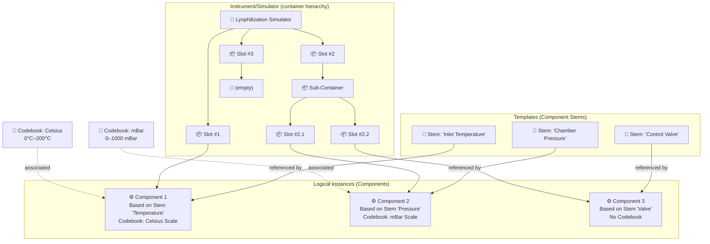
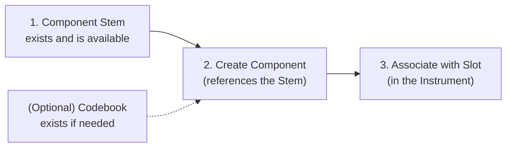
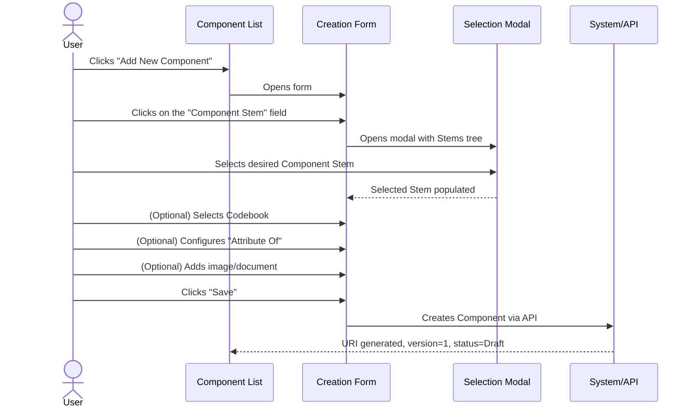
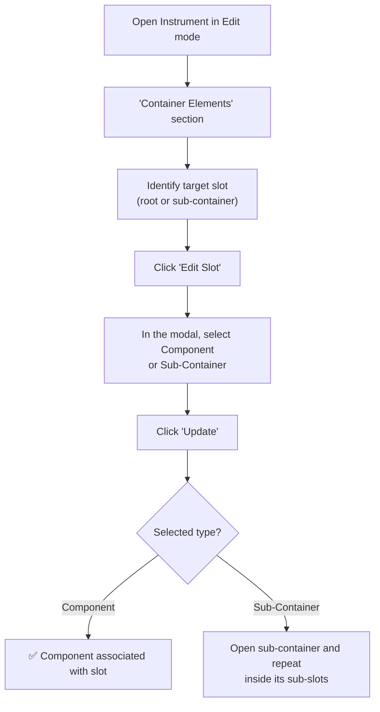
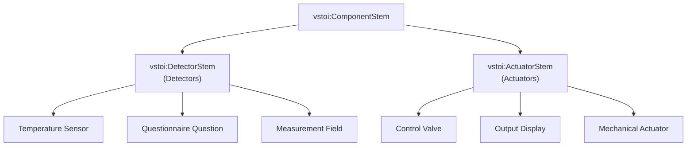
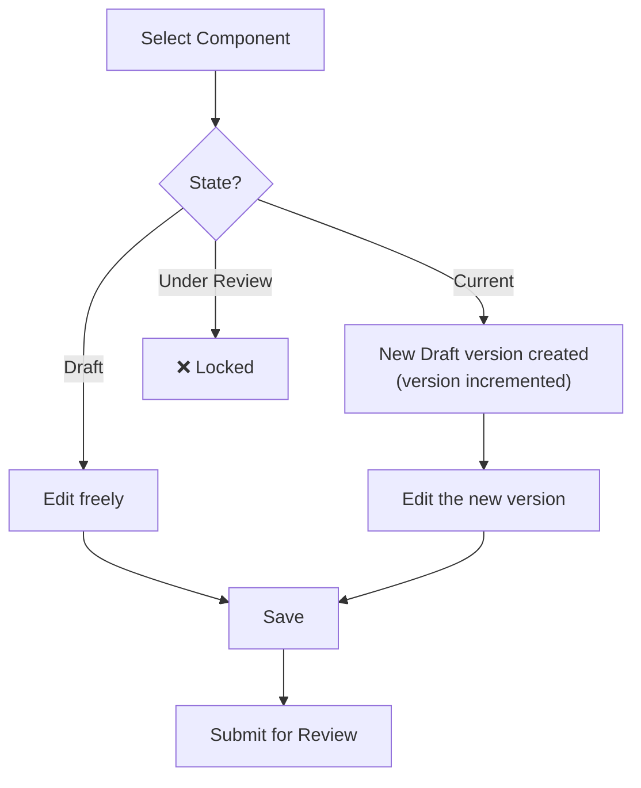
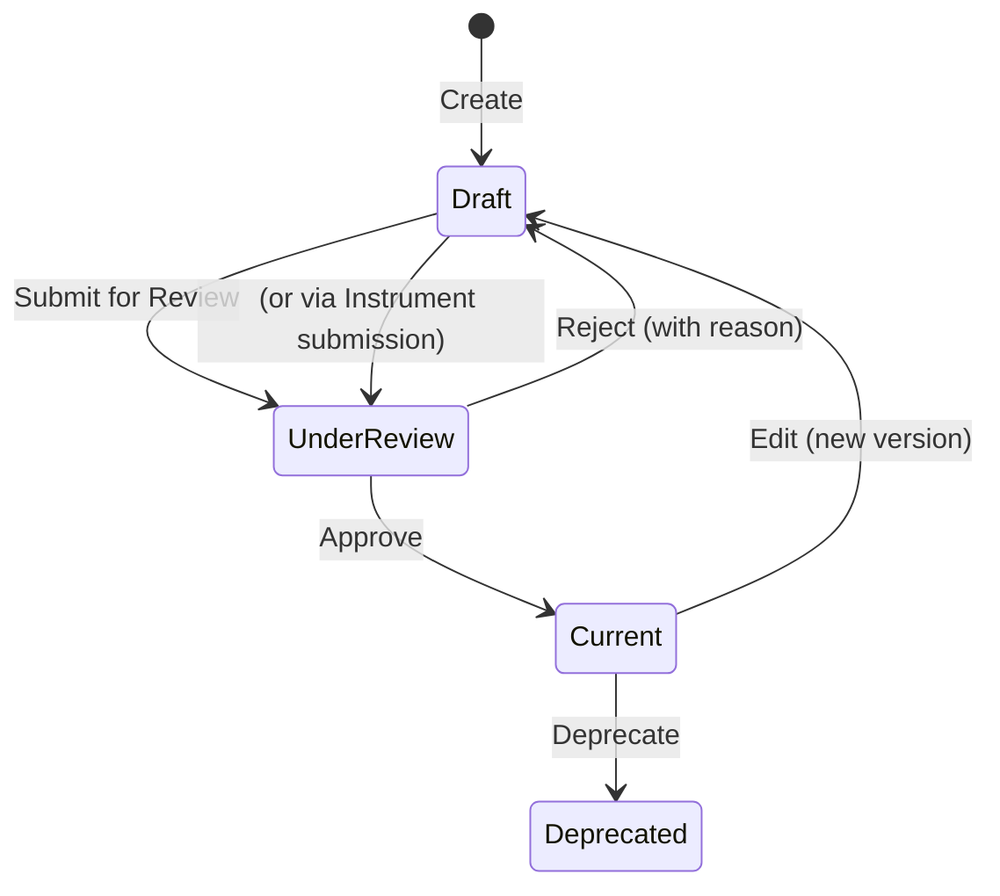
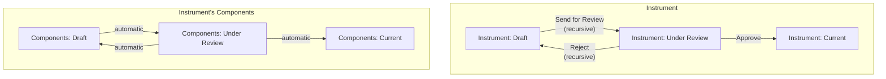

# Manual 3 - How to Create and Edit Components

**Module:** SIR (Semantic Instrument Repository)  
**PMSR Context:** Components represent the functional elements of a Simulator (detectors, actuators, questions, etc.)  
**Version:** 1.0 | March 2026

> 🌐 **Portuguese version available:** [Open Portuguese version](03-MANUAL-COMPONENTS.md)

---

## Table of Contents

1. [Overview](#1-overview)
2. [What is a Component?](#2-what-is-a-component)
3. [Prerequisites](#3-prerequisites)
4. [Accessing Component Management](#4-accessing-component-management)
5. [The Management Page (List)](#5-the-management-page-list)
6. [Creating a New Component](#6-creating-a-new-component)
7. [Associating a Component with a Slot (Container Slot)](#7-associating-a-component-with-a-slot-container-slot)
8. [Understanding Detectors and Actuators](#8-understanding-detectors-and-actuators)
9. [Editing a Component](#9-editing-a-component)
10. [Submitting for Review](#10-submitting-for-review)
11. [The Review Process (Reviewer's Perspective)](#11-the-review-process-reviewers-perspective)
12. [Lifecycle and Versioning](#12-lifecycle-and-versioning)
13. [Field Reference](#13-field-reference)
14. [Troubleshooting](#14-troubleshooting)

---

## 1. Overview

A **Component** is a logical instance of a **Component Stem** - the concrete materialization of a template in a specific context. Components are the "functional building blocks" that make up Instruments/Simulators, being associated with **Container Slots** (including slots inside sub-containers) within those instruments.

In the PMSR context, Components can represent:
- **Detectors** - sensors or questions that collect data (inputs)
- **Actuators** - elements that produce actions or outputs
- **Questionnaire questions** - assessment items
- **Measurements** - data collection points

> 📘 **Stem vs. Component:** A Component Stem (Manual 02) is the **reusable template** (the "recipe"). A Component is a **logical instance** of that template, associated with a specific slot within an Instrument/Simulator. When you place a Component Stem into an instrument's slot, a Component is created. Think of the Stem as the mold and the Component as the piece placed in the right position of the machine.

### Relationship Diagram



---

## 2. What is a Component?

### Definition

A Component is an entity that:
- **Mandatorily references** a **Component Stem** (its template)
- **May have** an associated **Codebook** (response/value scheme)
- **Is associated** with a **Container Slot** (at any hierarchy level) within an Instrument/Simulator
- **Follows** the review workflow (Draft → Under Review → Current)
- **Has automatic** versioning

### Difference Between Component Stem and Component

| Aspect | Component Stem | Component |
|--------|---------------|-----------|
| **Nature** | Reusable template | Concrete instance |
| **Content** | Defines the "base text" (question, description) | Inherits content from the Stem |
| **Reusability** | Can be used by multiple Components | Belongs to a specific context |
| **Codebook** | Does not have a Codebook | May have an associated Codebook |
| **Slot** | Not associated with slots | Associated with a slot in an Instrument or sub-container |

---

## 3. Prerequisites

Before creating a Component, make sure that:



| Prerequisite | Required? | Where to create? |
|--------------|-----------|-------------------|
| **Component Stem** | **Yes** | 🔗 [Component Stems Manual](02-MANUAL-COMPONENT-STEMS-EN.md) |
| **Codebook** | No | *Instrument Elements → Manage Elements → Manage Codebooks* |
| **Instrument/Simulator** (for slot association) | For association | 🔗 [Instruments/Simulators Manual](01-MANUAL-INSTRUMENTS-SIMULATORS-EN.md) |

> ⚠️ **If you cannot find a suitable Component Stem**, you must create it first. Refer to the 🔗 [Component Stems Manual](02-MANUAL-COMPONENT-STEMS-EN.md) and then return to this manual.

---

## 4. Accessing Component Management

### Navigation Path

```
Main Menu → Instrument Elements → Manage Elements → Manage Component
```

**Direct URL:** `https://www.pmsr.net/sir/select/component/1/9`

### Steps:

📋 **Step 1.** In the navigation bar, click on **"Instrument Elements"**.

📋 **Step 2.** Hover over **"Manage Elements"**.

📋 **Step 3.** Click on **"Manage Component"**.

---

## 5. The Management Page (List)

### Available Filters

| Filter | Description | Options |
|--------|-------------|---------|
| **Text Filter** | Search by content or URI | Free text field |
| **Language** | Filter by language | All / English / etc. |
| **Status** | Filter by state | All Status / Draft / Under Review / Current / Deprecated |

### Table Columns

| Column | Description |
|--------|-------------|
| **URI** | Unique identifier (clickable link to the description page) |
| **Content** | Component content/label (inherited from the Stem) |
| **Version** | Version number |
| **Codebook** | Associated Codebook (if any) - clickable label |
| **Attribute Of** | "Attribute Of" reference (if configured) |
| **Status** | State: Draft, Under Review, Current, Deprecated |

### Action Buttons

| Button | Function | Condition |
|--------|----------|-----------|
| **Add New Component** | Creates a new Component | Always available |
| **Edit Selected** | Edits the selected Component | Requires selection |
| **Delete Selected** | Deletes the selected Component | With confirmation |
| **Send for Review** | Submits for review | Only for Draft state |

---

## 6. Creating a New Component

### Complete Creation Sequence



### Detailed Steps

📋 **Step 1.** On the management page, click on **"Add New Component"**.

📋 **Step 2.** Fill in the form:

#### Creation Form Fields

| Field | Type | Required | Detailed Description |
|-------|------|----------|----------------------|
| **Component Stem** | Modal selection (tree) | **Yes** | The base template for this Component. Click on the field to open the modal with the tree of available Component Stems. Select the Stem that best matches the function of this Component. **If you cannot find a suitable Stem, close the form and create it first** (🔗 [Component Stems Manual](02-MANUAL-COMPONENT-STEMS-EN.md)). |
| **Codebook** | Autocomplete field | No | Response/value scheme associated with the Component. Start typing the Codebook name and select from the suggestion list. **E.g.:** "5-point Likert Scale", "Celsius Scale 0-200". Leave blank if the component does not require coded responses. |
| **Maker** | Autocomplete field | No | Manufacturer organization. |
| **Version** | Hidden (automatic) | Auto | Starts at 1. |
| **Attribute Of** | Modal selection (tree) | No | Optional: allows linking this Component as an attribute of another Component. Used to create measurement hierarchies (e.g., a sub-indicator belongs to a main indicator). |

#### Image Fields

| Field | Type | Description |
|-------|------|-------------|
| **Image Type** | Select | **URL** or **Upload** |
| **Image (URL)** | Textfield | Full image address (if URL) |
| **Upload Image** | File upload | PNG, JPG, JPEG. Maximum 2 MB |

#### Web Document Fields

| Field | Type | Description |
|-------|------|-------------|
| **Web Document Type** | Select | **URL** or **Upload** |
| **Web Document (URL)** | Textfield | Document address (if URL) |
| **Upload Document** | File upload | PDF, DOC, DOCX, TXT, XLS, XLSX. Maximum 2 MB |

📋 **Step 3.** Click on **"Save"**.

📋 **Step 4.** The Component is created with:
- **URI** generated automatically
- **Status** = Draft
- **Version** = 1

### Component Stem Selection (Modal)

When clicking on the **Component Stem** field, a modal (800px) opens with the hierarchical Stem tree:

```
vstoi:ComponentStem
├── vstoi:QuestionStem
│   ├── "How often do you...?"
│   ├── "Rate on a scale of 1 to 5..."
│   └── ...
├── vstoi:SensorReadingStem
│   ├── "Inlet temperature"
│   ├── "Chamber pressure"
│   └── ...
└── ...
```

Click on the desired Stem to select it. The field is populated automatically.

### Codebook Selection (Autocomplete)

In the **Codebook** field, start typing the Codebook name:

```
Codebook: [Likert Sc...]
           ├── 5-point Likert Scale (pmsr:/CB001)
           ├── 7-point Likert Scale (pmsr:/CB002)
           └── Likert Frequency (pmsr:/CB003)
```

Select the desired Codebook from the suggestion list. Each suggestion format includes the name and URI for clear identification.

---

## 7. Associating a Component with a Slot (Container Slot)

After creating a Component, it needs to be **associated with a Container Slot** within an Instrument/Simulator to become functional. This association can happen at the root instrument level or inside nested **sub-containers**.

### Association Methods

There are **two paths** to associate a Component with a Slot:

#### Method 1: From the Instrument (Recommended)



📋 **Step 1.** Navigate to the Instrument editing page (🔗 see [Instruments Manual](01-MANUAL-INSTRUMENTS-SIMULATORS-EN.md), section 5).

📋 **Step 2.** In the **"Container Elements"** section, identify the slot to which you want to associate the Component.

📋 **Step 3.** Click the slot edit button (**"Edit Slot"** or pencil icon).

📋 **Step 4.** In the slot edit form, click on the **"Component"** field to open the selection modal.

📋 **Step 5.** Select the desired Component from the tree.

📋 **Step 6.** Click **"Update"** to confirm the association.

#### Method 2: Create Component Directly in the Slot

📋 **Step 1.** In the Slot edit form, instead of selecting an existing Component, click on **"New Item"**.

📋 **Step 2.** The system redirects to the Component creation form, already pre-configured for association with this slot.

📋 **Step 3.** Fill in the Component fields (as in [section 6](#6-creating-a-new-component)).

📋 **Step 4.** Upon saving, the Component is created AND automatically associated with the slot.

### Container Slot Edit Form

| Field | Type | Description |
|-------|------|-------------|
| **Slot URI** | Text (read-only) | Slot identifier |
| **Priority** | Text (read-only) | Slot order/priority within the Instrument |
| **Component** | Modal (tree) | Associated Component - click to select |

| Button | Function |
|--------|----------|
| **New Item** | Creates a new Component and associates it with this slot |
| **Reset this Item** | Removes the Component from the slot (slot becomes empty) |
| **Update** | Saves the association (active only with a Component selected) |
| **Cancel** | Closes without changes |

> ⚠️ **Recursive structure:** The edited slot can belong to the main container or to a sub-container. The hierarchy can be nested across multiple levels.

### Complete Structure Visualization

After associating Components with Slots, the "Container Elements" section of the Instrument shows:

```
📦 Container Elements of the Lyophilization Simulator
│
├── Slot #1 (Priority: 1)
│   └── ⚙️ Component: "Inlet Temperature" (Stem: 'Inlet Temp.', Codebook: Celsius)
│       [Edit Component] [Remove from Slot]
│
├── Slot #2 (Priority: 2)
│   └── 📦 Sub-Container: "Pressure Measurements"
│       ├── Slot #2.1 (Priority: 1)
│       │   └── ⚙️ Component: "Chamber Pressure" (Stem: 'Chamber Pressure', Codebook: mBar)
│       │       [Edit Component] [Remove from Slot]
│       └── Slot #2.2 (Priority: 2)
│           └── 📦 Sub-Container: "Fine Control"
│               └── Slot #2.2.1 (Priority: 1)
│                   └── ⚙️ Component: "Pillow Pressure" [Edit Component] [Remove from Slot]
│
├── Slot #3 (Priority: 3)
│   └── 🔲 (empty)
│       [Add Component or Sub-Container] [Edit Slot]
│
└── [+ Add More Slots]
```

---

## 8. Understanding Detectors and Actuators

In the context of PMSR and the VSTOI ontology, Components can assume different roles depending on their **hierarchical type** (defined by the Component Stem):

### Detectors

**What they are:** Components that function as **sensors, inputs, or data collectors**. They capture information from the environment or from the user.

| PMSR Examples | Description |
|---------------|-------------|
| Temperature Sensor | Collects the inlet fluid temperature |
| Questionnaire Question | Collects the participant's response |
| Pressure Sensor | Measures the chamber pressure |
| Input Field | Receives numerical data from the operator |

### Actuators

**What they are:** Components that function as **action, output, or control elements**. They produce effects on the system or the environment.

| PMSR Examples | Description |
|---------------|-------------|
| Control Valve | Controls fluid flow |
| Result Display | Presents calculated results |
| Threshold Alert | Triggers a notification when a value exceeds a limit |
| Mechanical Actuator | Activates a physical component of the simulator |

### How is the Classification Done?

The classification as Detector or Actuator is determined by the **Component Stem** selected, which belongs to a specific branch of the ontology:



> **In practice:** When creating a Component, the classification as Detector or Actuator is **implicit** - it depends on the selected Component Stem. Choose the correct Stem and the classification will be automatic.

> **Note:** The current system interface does not explicitly display "Detector" or "Actuator" as labels in the forms. The distinction is made at the ontology level and is visible in the type hierarchy when selecting the Component Stem in the tree modal.

---

## 9. Editing a Component

### How to Access

📋 **Step 1.** In the Component list, select the Component to edit.

📋 **Step 2.** Click on **"Edit Selected"**.

### Edit Form

The form includes all creation fields, with additions:

| Additional Element | Description |
|--------------------|-------------|
| **URI** | Read-only link to the description page |
| **Component Stem** | Editable via modal - the associated Stem can be changed |
| **Codebook** | Shows label + URI of the current Codebook; editable |
| **Version** | Automatically incremented if state is Current/Deprecated |
| **Review Notes** | Reviewer's notes (read-only, if any) |
| **Reviewer Email** | Reviewer's email (read-only) |

### Edit Flow



---

## 10. Submitting for Review

### Steps

📋 **Step 1.** In the Component list, filter by **Status: Draft**.

📋 **Step 2.** Select the Component to submit.

📋 **Step 3.** Click on **"Send for Review"**.

📋 **Step 4.** Confirm: *"Are you sure you want to submit for Review selected entry?"*

📋 **Step 5.** The state changes to **Under Review**.

> **Note:** Components can also be submitted **automatically** when the Instrument containing them is submitted for review (recursive submission). See 🔗 [Instruments Manual](01-MANUAL-INSTRUMENTS-SIMULATORS-EN.md), section 7.

> ℹ️ **Note on permissions:** Submitting for review can be done by the element's author (authenticated user). Approval or rejection requires the **Content Editor** (Reviewer) permission.

---

## 11. The Review Process (Reviewer's Perspective)

> ⚠️ **Required permission:** This section describes actions available only to users with the **Content Editor** (Reviewer) role. It is included so you understand the full review workflow.

### Accessing the Review

```
Main Menu → Instrument Elements → Review Elements → Review Components
```

### Review Form

The Reviewer sees the Component in **read-only** mode:

1. **Component Details**: Associated Stem, Codebook, Attribute Of, version
2. **Reference links**: Clickable links to the associated Stem and Codebook
3. **Review Section**: Review Notes and Reviewer Email

### Reviewer Actions

| Action | Button | Notes Required? | Result |
|--------|--------|-----------------|--------|
| **Approve** | **Approve** | No | State → **Current** |
| **Reject** | **Reject** | **Yes** | State → **Draft** + reason notes |

### What the Reviewer Should Verify

| Aspect | What to Evaluate |
|--------|------------------|
| **Component Stem** | Is the selected Stem appropriate? Is it in Current state? |
| **Codebook** | Is the associated Codebook correct for this type of Component? |
| **Attribute Of** | Does the attribute relationship make sense in context? |
| **Completeness** | Are all necessary fields filled in? |

> ⚠️ **Recursive Instrument rejection:** If a Reviewer rejects an Instrument, all associated Components are automatically rejected as well. The Instrument's rejection notes are propagated.

---

## 12. Lifecycle and Versioning



### Relationship with the Instrument Lifecycle



---

## 13. Field Reference

### Complete Table - Creation Form

| Field | Technical Name | Type | Required | Default Value | Description |
|-------|---------------|------|----------|---------------|-------------|
| Component Stem | `component_stem` | Modal textfield | **Yes** | (empty) | Base template selected via modal tree |
| Codebook | `component_codebook` | Textfield + autocomplete | No | (empty) | Response/value scheme |
| Maker | `component_maker` | Textfield + autocomplete | No | (empty) | Manufacturer organization |
| Version | `component_version` | Hidden | Auto | 1 | Numeric version |
| Attribute Of | `component_isAttributeOf` | Modal textfield | No | (empty) | Parent component (attribute hierarchy) |
| Image Type | `component_image_type` | Select | No | (empty) | URL or Upload |
| Image URL | `component_image_url` | Textfield | Conditional | (empty) | Image URL |
| Image Upload | `component_image_upload` | Managed file | Conditional | (empty) | PNG/JPG/JPEG, max 2MB |
| Web Doc Type | `component_webdocument_type` | Select | No | (empty) | URL or Upload |
| Web Doc URL | `component_webdocument_url` | Textfield | Conditional | (empty) | Document URL |
| Web Doc Upload | `component_webdocument_upload` | Managed file | Conditional | (empty) | PDF/DOC/DOCX/TXT/XLS/XLSX, max 2MB |

### Route Parameters (Contextual)

| Parameter | Encoding | Description |
|-----------|----------|-------------|
| `{sourcecomponenturi}` | Base64 | Source Component URI (for derivation) |
| `{containersloturi}` | Base64 | Destination slot URI (for direct association) |

---

## 14. Troubleshooting

| Problem | Possible Cause | Solution |
|---------|----------------|----------|
| I cannot find the Component Stem I need | The Stem may not exist | Create it first: 🔗 [Component Stems Manual](02-MANUAL-COMPONENT-STEMS-EN.md) |
| The Codebook field does not show suggestions | No Codebooks have been created or the search term does not match | Check in *Manage Codebooks* whether Codebooks exist. Create one if needed. |
| I cannot associate the Component with the Slot | The slot may already be occupied or the Component is not correctly selected | Use "Reset this Item" on the slot to free it, then select again |
| The Component was rejected | Individual or recursive rejection (via Instrument) | Check the Review Notes in the edit form |
| "Attribute Of" - I don't know what to select | Optional field for measurement hierarchies | Leave blank unless the Component is a sub-attribute of another one |
| The "Update" button on the slot is disabled | No Component was selected in the modal | Open the Component field modal and select an item |

---

🔗 **Related Manuals:**
- [Component Stems Manual](02-MANUAL-COMPONENT-STEMS-EN.md) - Prerequisite: create Stems before Components
- [Instruments/Simulators Manual](01-MANUAL-INSTRUMENTS-SIMULATORS-EN.md) - Context: how to use Components within Instruments
- [Instrument/Simulator Instances Manual](04-MANUAL-INSTRUMENT-SIMULATOR-INSTANCES-EN.md) - Next step: instantiate Instruments with Components
- [Manuals Index](INDEX-EN.md)

---

*PMSR Working Group - March 2026*
