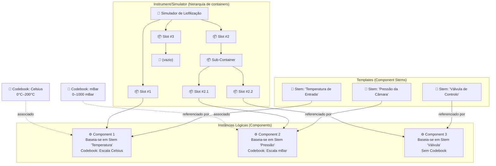
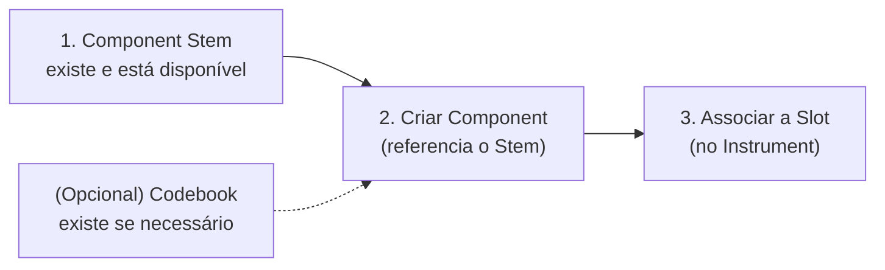
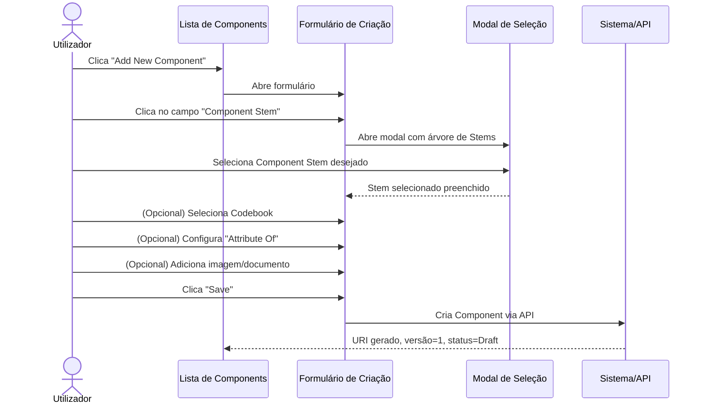
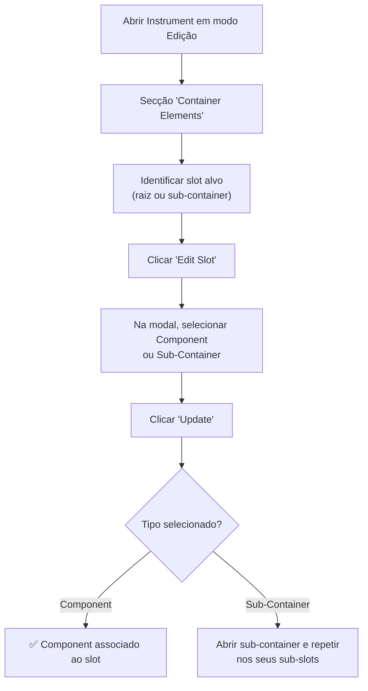
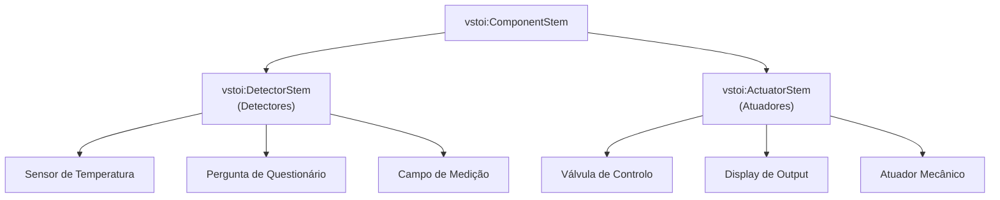
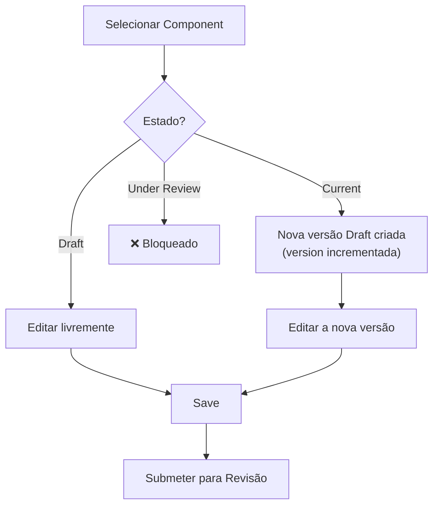
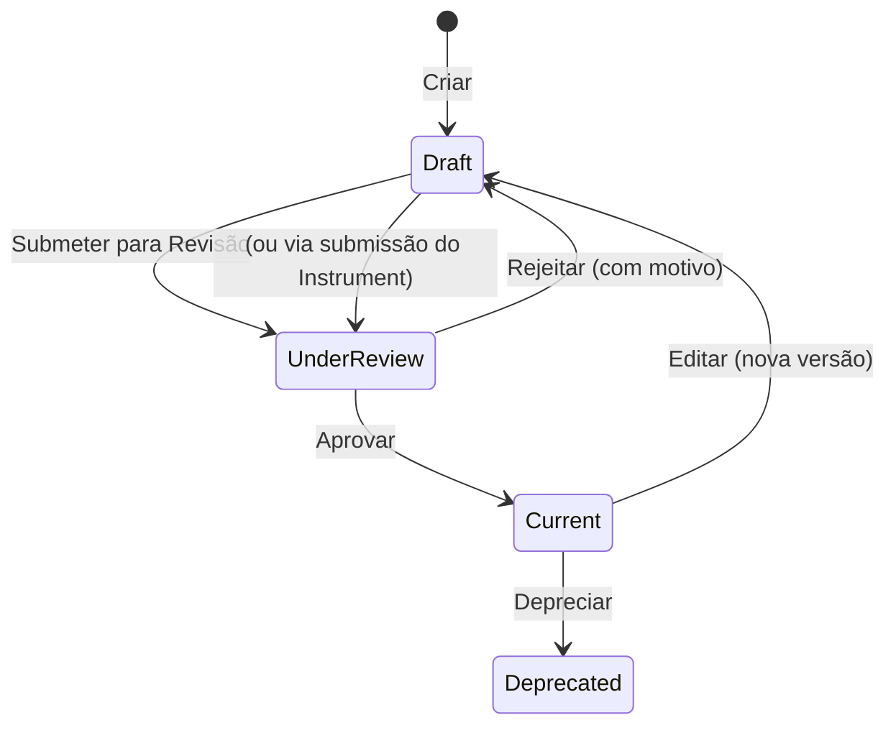
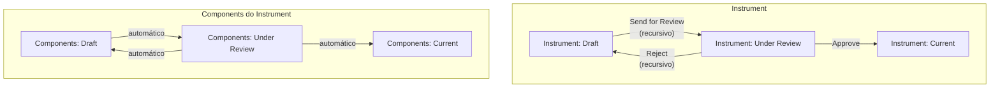

# Manual 3 - Como Criar e Editar Components

**Módulo:** SIR (Semantic Instrument Repository)  
**Contexto PMSR:** Components representam os elementos funcionais de um Simulator (detectores, atuadores, perguntas, etc.)  
**Versão:** 1.0 | Março 2026

> 🌐 **Versão em inglês disponível:** [Open English version](03-MANUAL-COMPONENTS-EN.md)

---

## Índice

1. [Visão Geral](#1-visão-geral)
2. [O que é um Component?](#2-o-que-é-um-component)
3. [Pré-requisitos](#3-pré-requisitos)
4. [Aceder à Gestão de Components](#4-aceder-à-gestão-de-components)
5. [A Página de Gestão (Lista)](#5-a-página-de-gestão-lista)
6. [Criar um Novo Component](#6-criar-um-novo-component)
7. [Associar um Component a um Slot (Container Slot)](#7-associar-um-component-a-um-slot-container-slot)
8. [Entender Detectores e Atuadores](#8-entender-detectores-e-atuadores)
9. [Editar um Component](#9-editar-um-component)
10. [Submeter para Revisão](#10-submeter-para-revisão)
11. [O Processo de Revisão (Perspetiva do Reviewer)](#11-o-processo-de-revisão-perspetiva-do-reviewer)
12. [Ciclo de Vida e Versionamento](#12-ciclo-de-vida-e-versionamento)
13. [Referência de Campos](#13-referência-de-campos)
14. [Resolução de Problemas](#14-resolução-de-problemas)

---

## 1. Visão Geral

Um **Component** é uma instância lógica de um **Component Stem** - a materialização concreta de um template num contexto específico. Os Components são os "blocos funcionais" que compõem os Instruments/Simulators, sendo associados a **Container Slots** (incluindo slots de sub-containers) dentro desses instrumentos.

No contexto PMSR, Components podem representar:
- **Detectores** - sensores ou perguntas que recolhem dados (inputs)
- **Atuadores** - elementos que produzem ações ou outputs
- **Perguntas de questionário** - itens de avaliação
- **Medições** - pontos de recolha de valores

> 📘 **Stem vs. Component:** Um Component Stem (Manual 02) é o **template reutilizável** (a "receita"). Um Component é uma **instância lógica** desse template, associada a um slot específico dentro de um Instrument/Simulator. Quando coloca um Component Stem num slot do instrumento, cria-se um Component. Pense no Stem como o molde e no Component como a peça colocada na posição certa da máquina.

### Diagrama de Relações



---

## 2. O que é um Component?

### Definição

Um Component é uma entidade que:
- **Referencia obrigatoriamente** um **Component Stem** (o seu template)
- **Pode ter** um **Codebook** associado (esquema de respostas/valores)
- **É associado** a um **Container Slot** (em qualquer nível da hierarquia) dentro de um Instrument/Simulator
- **Segue** o fluxo de revisão (Draft → Under Review → Current)
- **Tem versionamento** automático

### Diferença entre Component Stem e Component

| Aspeto | Component Stem | Component |
|--------|---------------|-----------|
| **Natureza** | Template reutilizável | Instância concreta |
| **Conteúdo** | Define o "texto base" (pergunta, descrição) | Herda o conteúdo do Stem |
| **Reutilização** | Pode ser usado por múltiplos Components | Pertence a um contexto específico |
| **Codebook** | Não tem Codebook | Pode ter Codebook associado |
| **Slot** | Não é associado a slots | É associado a um slot num Instrument ou sub-container |

---

## 3. Pré-requisitos

Antes de criar um Component, certifique-se de que:



| Pré-requisito | Obrigatório? | Onde criar? |
|---------------|-------------|-------------|
| **Component Stem** | **Sim** | 🔗 [Manual de Component Stems](02-MANUAL-COMPONENT-STEMS.md) |
| **Codebook** | Não | *Instrument Elements → Manage Elements → Manage Codebooks* |
| **Instrument/Simulator** (para associação a slot) | Para associação | 🔗 [Manual de Instruments/Simulators](01-MANUAL-INSTRUMENTS-SIMULATORS.md) |

> ⚠️ **Se não encontrar um Component Stem adequado**, deve criá-lo primeiro. Consulte o 🔗 [Manual de Component Stems](02-MANUAL-COMPONENT-STEMS.md) e depois volte a este manual.

---

## 4. Aceder à Gestão de Components

### Caminho de Navegação

```
Menu Principal → Instrument Elements → Manage Elements → Manage Component
```

**URL direto:** `https://www.pmsr.net/sir/select/component/1/9`

### Passos:

📋 **Passo 1.** Na barra de navegação, clique em **"Instrument Elements"**.

📋 **Passo 2.** Passe o cursor sobre **"Manage Elements"**.

📋 **Passo 3.** Clique em **"Manage Component"**.

---

## 5. A Página de Gestão (Lista)

### Filtros Disponíveis

| Filtro | Descrição | Opções |
|--------|-----------|--------|
| **Filtro de Texto** | Pesquisa por conteúdo ou URI | Campo de texto livre |
| **Language** | Filtra por idioma | All / English / etc. |
| **Status** | Filtra por estado | All Status / Draft / Under Review / Current / Deprecated |

### Colunas da Tabela

| Coluna | Descrição |
|--------|-----------|
| **URI** | Identificador único (link clicável para página de descrição) |
| **Content** | Conteúdo/label do Component (herdado do Stem) |
| **Version** | Número da versão |
| **Codebook** | Codebook associado (se existir) - label clicável |
| **Attribute Of** | Referência "Attribute Of" (se configurada) |
| **Status** | Estado: Draft, Under Review, Current, Deprecated |

### Botões de Ação

| Botão | Função | Condição |
|-------|--------|----------|
| **Add New Component** | Cria um novo Component | Sempre disponível |
| **Edit Selected** | Edita o Component selecionado | Requer seleção |
| **Delete Selected** | Elimina o Component selecionado | Com confirmação |
| **Send for Review** | Submete para revisão | Apenas para estado Draft |

---

## 6. Criar um Novo Component

### Sequência Completa de Criação



### Passos Detalhados

📋 **Passo 1.** Na página de gestão, clique em **"Add New Component"**.

📋 **Passo 2.** Preencha o formulário:

#### Campos do Formulário de Criação

| Campo | Tipo | Obrigatório | Descrição Detalhada |
|-------|------|-------------|---------------------|
| **Component Stem** | Seleção por modal (árvore) | **Sim** | O template base deste Component. Clique no campo para abrir a modal com a árvore de Component Stems disponíveis. Selecione o Stem que melhor corresponde à função deste Component. **Se não encontrar um Stem adequado, feche o formulário e crie-o primeiro** (🔗 [Manual de Component Stems](02-MANUAL-COMPONENT-STEMS.md)). |
| **Codebook** | Campo com autocomplete | Não | Esquema de respostas/valores associado ao Component. Comece a escrever o nome do Codebook e selecione da lista de sugestões. **Ex:** "Escala Likert 5 pontos", "Escala Celsius 0-200". Deixe em branco se o component não necessita de respostas codificadas. |
| **Maker** | Campo com autocomplete | Não | Organização fabricante. |
| **Version** | Hidden (automático) | Auto | Começa em 1. |
| **Attribute Of** | Seleção por modal (árvore) | Não | Opcional: permite ligar este Component como atributo de outro Component. Usado para criar hierarquias de medição (ex: um sub-indicador pertence a um indicador principal). |

#### Campos de Imagem

| Campo | Tipo | Descrição |
|-------|------|-----------|
| **Image Type** | Select | **URL** ou **Upload** |
| **Image (URL)** | Textfield | Endereço completo da imagem (se URL) |
| **Upload Image** | File upload | PNG, JPG, JPEG. Máximo 2 MB |

#### Campos de Documento Web

| Campo | Tipo | Descrição |
|-------|------|-----------|
| **Web Document Type** | Select | **URL** ou **Upload** |
| **Web Document (URL)** | Textfield | Endereço do documento (se URL) |
| **Upload Document** | File upload | PDF, DOC, DOCX, TXT, XLS, XLSX. Máximo 2 MB |

📋 **Passo 3.** Clique em **"Save"**.

📋 **Passo 4.** O Component é criado com:
- **URI** gerado automaticamente
- **Status** = Draft
- **Versão** = 1

### Seleção do Component Stem (Modal)

Ao clicar no campo **Component Stem**, abre-se a modal (800px) com a árvore hierárquica de Stems:

```
vstoi:ComponentStem
├── vstoi:QuestionStem
│   ├── "Qual a frequência de...?"
│   ├── "Avalie numa escala de 1 a 5..."
│   └── ...
├── vstoi:SensorReadingStem
│   ├── "Temperatura de entrada"
│   ├── "Pressão da câmara"
│   └── ...
└── ...
```

Clique no Stem desejado para selecionar. O campo é preenchido automaticamente.

### Seleção do Codebook (Autocomplete)

No campo **Codebook**, comece a escrever o nome do Codebook:

```
Codebook: [Escala Li...]
           ├── Escala Likert 5 pontos (pmsr:/CB001)
           ├── Escala Likert 7 pontos (pmsr:/CB002)
           └── Likert Frequência (pmsr:/CB003)
```

Selecione o Codebook desejado da lista de sugestões. O formato de cada sugestão inclui o nome e o URI para identificação clara.

---

## 7. Associar um Component a um Slot (Container Slot)

Após criar um Component, este precisa de ser **associado a um Container Slot** dentro de um Instrument/Simulator para se tornar funcional. Essa associação pode ocorrer no nível raiz do instrumento ou em **sub-containers** aninhados.

### Métodos de Associação

Existem **dois caminhos** para associar um Component a um Slot:

#### Método 1: A partir do Instrument (Recomendado)



📋 **Passo 1.** Navegue até a edição do Instrument (🔗 ver [Manual de Instruments](01-MANUAL-INSTRUMENTS-SIMULATORS.md), secção 5).

📋 **Passo 2.** Na secção **"Container Elements"**, identifique o slot ao qual quer associar o Component.

📋 **Passo 3.** Clique no botão de edição do slot (**"Edit Slot"** ou ícone de lápis).

📋 **Passo 4.** No formulário de edição do slot, clique no campo **"Component"** para abrir a modal de seleção.

📋 **Passo 5.** Selecione o Component desejado na árvore.

📋 **Passo 6.** Clique em **"Update"** para confirmar a associação.

#### Método 2: Criar Component diretamente no Slot

📋 **Passo 1.** No formulário de edição do Slot, em vez de selecionar um Component existente, clique em **"New Item"**.

📋 **Passo 2.** O sistema redireciona para o formulário de criação de Component, já pré-configurado para associação a este slot.

📋 **Passo 3.** Preencha os campos do Component (como na [secção 6](#6-criar-um-novo-component)).

📋 **Passo 4.** Ao guardar, o Component é criado E automaticamente associado ao slot.

### Formulário de Edição de Container Slot

| Campo | Tipo | Descrição |
|-------|------|-----------|
| **Slot URI** | Texto (somente leitura) | Identificador do slot |
| **Priority** | Texto (somente leitura) | Ordem/prioridade do slot no Instrument |
| **Component** | Modal (árvore) | Component associado - clique para selecionar |

| Botão | Função |
|-------|--------|
| **New Item** | Cria novo Component e associa a este slot |
| **Reset this Item** | Remove o Component do slot (slot fica vazio) |
| **Update** | Guarda a associação (ativo apenas com Component selecionado) |
| **Cancel** | Fecha sem alterar |

> ⚠️ **Estrutura recursiva:** O slot editado pode pertencer ao container principal ou a um sub-container. A hierarquia pode ser aninhada em múltiplos níveis.

### Visualização da Estrutura Completa

Após associar Components aos Slots, a secção "Container Elements" do Instrument mostra:

```
📦 Container Elements do Simulador de Liofilização
│
├── Slot #1 (Prioridade: 1)
│   └── ⚙️ Component: "Temperatura de Entrada" (Stem: 'Temp. Entrada', Codebook: Celsius)
│       [Edit Component] [Remove from Slot]
│
├── Slot #2 (Prioridade: 2)
│   └── 📦 Sub-Container: "Medições de Pressão"
│       ├── Slot #2.1 (Prioridade: 1)
│       │   └── ⚙️ Component: "Pressão da Câmara" (Stem: 'Pressão Câmara', Codebook: mBar)
│       │       [Edit Component] [Remove from Slot]
│       └── Slot #2.2 (Prioridade: 2)
│           └── 📦 Sub-Container: "Controlo Fino"
│               └── Slot #2.2.1 (Prioridade: 1)
│                   └── ⚙️ Component: "Pressão de Almofada" [Edit Component] [Remove from Slot]
│
├── Slot #3 (Prioridade: 3)
│   └── 🔲 (vazio)
│       [Add Component ou Sub-Container] [Edit Slot]
│
└── [+ Add More Slots]
```

---

## 8. Entender Detectores e Atuadores

No contexto do PMSR e da ontologia VSTOI, os Components podem assumir papéis diferentes dependendo do seu **tipo hierárquico** (definido pelo Component Stem):

### Detectores (Detectors)

**O que são:** Components que funcionam como **sensores, entradas ou recolectores de dados**. Captam informação do ambiente ou do utilizador.

| Exemplos no PMSR | Descrição |
|-------------------|-----------|
| Sensor de Temperatura | Recolhe a temperatura de entrada do fluido |
| Pergunta de Questionário | Recolhe a resposta do participante |
| Sensor de Pressão | Mede a pressão na câmara |
| Campo de Input | Recebe dados numéricos do operador |

### Atuadores (Actuators)

**O que são:** Components que funcionam como **elementos de ação, saída ou controlo**. Produzem efeitos no sistema ou no ambiente.

| Exemplos no PMSR | Descrição |
|-------------------|-----------|
| Válvula de Controlo | Controla o fluxo de fluido |
| Display de Resultado | Apresenta resultados calculados |
| Alerta de Limiar | Dispara notificação quando valor excede limite |
| Atuador Mecânico | Aciona componente físico do simulador |

### Como é feita a classificação?

A classificação como Detector ou Atuador é determinada pelo **Component Stem** selecionado, que pertence a um ramo específico da ontologia:



> **Na prática:** Ao criar um Component, a classificação como Detector ou Atuador é **implícita** - depende do Component Stem selecionado. Escolha o Stem correto e a classificação será automática.

> **Nota:** A interface atual do sistema não exibe explicitamente "Detector" ou "Atuador" como labels nos formulários. A distinção é feita ao nível da ontologia e é visível na hierarquia de tipos ao selecionar o Component Stem na modal de árvore.

---

## 9. Editar um Component

### Como aceder

📋 **Passo 1.** Na lista de Components, selecione o Component a editar.

📋 **Passo 2.** Clique em **"Edit Selected"**.

### Formulário de Edição

O formulário inclui todos os campos da criação, com adições:

| Elemento Adicional | Descrição |
|--------------------|-----------|
| **URI** | Link somente leitura para a página de descrição |
| **Component Stem** | Editável via modal - pode alterar o Stem associado |
| **Codebook** | Mostra label + URI do Codebook atual; editável |
| **Version** | Incrementada automaticamente se estado é Current/Deprecated |
| **Review Notes** | Notas do Reviewer (somente leitura, se existirem) |
| **Reviewer Email** | Email do Reviewer (somente leitura) |

### Fluxo de Edição



---

## 10. Submeter para Revisão

### Passos

📋 **Passo 1.** Na lista de Components, filtre por **Status: Draft**.

📋 **Passo 2.** Selecione o Component a submeter.

📋 **Passo 3.** Clique em **"Send for Review"**.

📋 **Passo 4.** Confirme: *"Are you sure you want to submit for Review selected entry?"*

📋 **Passo 5.** O estado muda para **Under Review**.

> ℹ️ **Nota sobre permissões:** A submissão para revisão pode ser feita pelo autor do elemento (utilizador autenticado). A aprovação ou rejeição requer a permissão **Content Editor** (Reviewer).

> **Nota:** Components também podem ser submetidos **automaticamente** quando o Instrument que os contém é submetido para revisão (submissão recursiva). Ver 🔗 [Manual de Instruments](01-MANUAL-INSTRUMENTS-SIMULATORS.md), secção 7.

---

## 11. O Processo de Revisão (Perspetiva do Reviewer)

> ⚠️ **Permissão necessária:** Esta secção descreve ações disponíveis apenas para utilizadores com a role **Content Editor** (Reviewer). É incluída para que compreenda o fluxo completo de revisão.

### Aceder à Revisão

```
Menu Principal → Instrument Elements → Review Elements → Review Components
```

### Formulário de Revisão

O Reviewer vê o Component em modo **somente leitura**:

1. **Detalhes do Component**: Stem associado, Codebook, Attribute Of, versão
2. **Links de referência**: Links clicáveis para o Stem e Codebook associados
3. **Secção de Revisão**: Review Notes e Reviewer Email

### Ações do Reviewer

| Ação | Botão | Notas Obrigatórias? | Resultado |
|------|-------|---------------------|-----------|
| **Aprovar** | **Approve** | Não | Estado → **Current** |
| **Rejeitar** | **Reject** | **Sim** | Estado → **Draft** + notas de motivo |

### O que o Reviewer deve verificar

| Aspeto | O que avaliar |
|--------|---------------|
| **Component Stem** | O Stem selecionado é adequado? Está em estado Current? |
| **Codebook** | O Codebook associado é correto para este tipo de Component? |
| **Attribute Of** | A relação de atributo faz sentido no contexto? |
| **Completude** | Todos os campos necessários estão preenchidos? |

> ⚠️ **Rejeição recursiva de Instruments:** Se um Reviewer rejeita um Instrument, todos os Components associados são automaticamente rejeitados também. As notas de rejeição do Instrument são propagadas.

---

## 12. Ciclo de Vida e Versionamento



### Relação com o Ciclo de Vida do Instrument



---

## 13. Referência de Campos

### Tabela Completa - Formulário de Criação

| Campo | Nome Técnico | Tipo | Obrigatório | Valor Padrão | Descrição |
|-------|-------------|------|-------------|--------------|-----------|
| Component Stem | `component_stem` | Modal textfield | **Sim** | (vazio) | Template base selecionado por árvore modal |
| Codebook | `component_codebook` | Textfield + autocomplete | Não | (vazio) | Esquema de respostas/valores |
| Maker | `component_maker` | Textfield + autocomplete | Não | (vazio) | Organização fabricante |
| Version | `component_version` | Hidden | Auto | 1 | Versão numérica |
| Attribute Of | `component_isAttributeOf` | Modal textfield | Não | (vazio) | Componente pai (hierarquia de atributos) |
| Image Type | `component_image_type` | Select | Não | (vazio) | URL ou Upload |
| Image URL | `component_image_url` | Textfield | Condicional | (vazio) | URL da imagem |
| Image Upload | `component_image_upload` | Managed file | Condicional | (vazio) | PNG/JPG/JPEG, max 2MB |
| Web Doc Type | `component_webdocument_type` | Select | Não | (vazio) | URL ou Upload |
| Web Doc URL | `component_webdocument_url` | Textfield | Condicional | (vazio) | URL do documento |
| Web Doc Upload | `component_webdocument_upload` | Managed file | Condicional | (vazio) | PDF/DOC/DOCX/TXT/XLS/XLSX, max 2MB |

### Parâmetros de Rota (Contextuais)

| Parâmetro | Codificação | Descrição |
|-----------|-------------|-----------|
| `{sourcecomponenturi}` | Base64 | URI do Component de origem (para derivação) |
| `{containersloturi}` | Base64 | URI do slot destino (para associação direta) |

---

## 14. Resolução de Problemas

| Problema | Causa Possível | Solução |
|----------|----------------|---------|
| Não encontro o Component Stem que preciso | O Stem pode não existir | Crie-o primeiro: 🔗 [Manual de Component Stems](02-MANUAL-COMPONENT-STEMS.md) |
| O campo Codebook não mostra sugestões | Não existem Codebooks criados ou o termo pesquisado não corresponde | Verifique em *Manage Codebooks* se existem Codebooks. Crie um se necessário. |
| Não consigo associar o Component ao Slot | O slot pode já estar ocupado ou o Component não está selecionado corretamente | Use "Reset this Item" no slot para libertá-lo, depois selecione novamente |
| O Component foi rejeitado | Rejeição individual ou recursiva (via Instrument) | Consulte as Review Notes no formulário de edição |
| "Attribute Of" - não sei o que selecionar | Campo opcional para hierarquias de medição | Deixe em branco a menos que o Component seja um sub-atributo de outro |
| O botão "Update" no slot está desativado | Nenhum Component foi selecionado na modal | Abra a modal do campo Component e selecione um item |

---

🔗 **Manuais Relacionados:**
- [Manual de Component Stems](02-MANUAL-COMPONENT-STEMS.md) - Pré-requisito: criar Stems antes de Components
- [Manual de Instruments/Simulators](01-MANUAL-INSTRUMENTS-SIMULATORS.md) - Contexto: como usar Components dentro de Instruments
- [Manual de Instâncias de Instruments/Simulators](04-MANUAL-INSTRUMENT-SIMULATOR-INSTANCES.md) - Próximo passo: instanciar Instruments com Components
- [Índice de Manuais](INDEX.md)

---

*Documento do Grupo de Trabalho PMSR - Março 2026*
