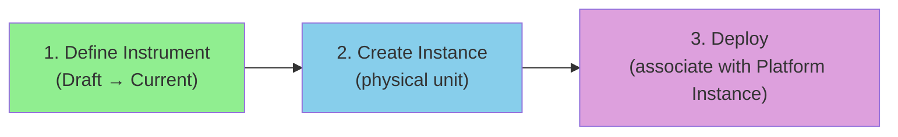
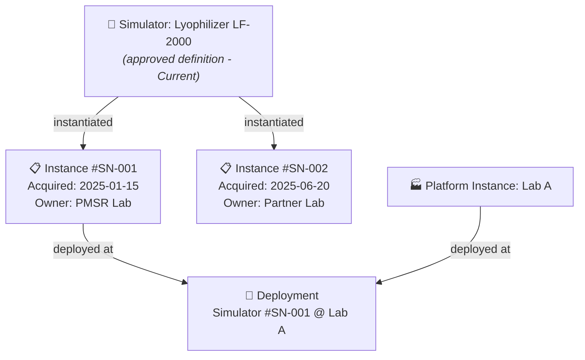
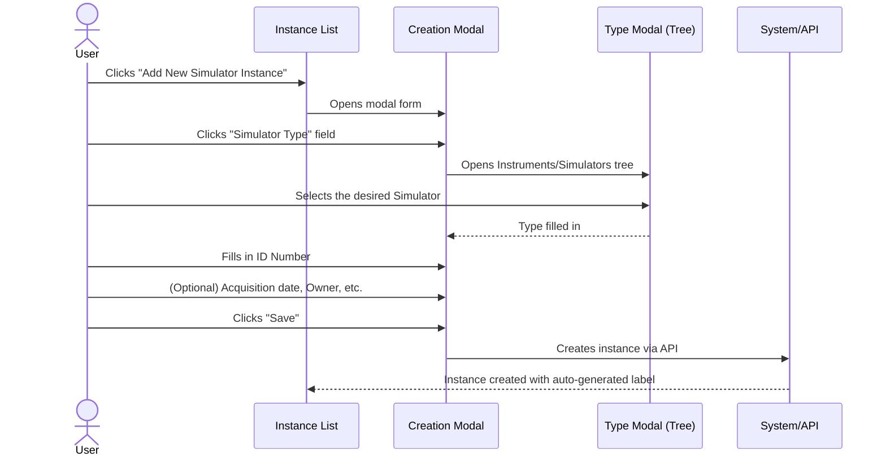
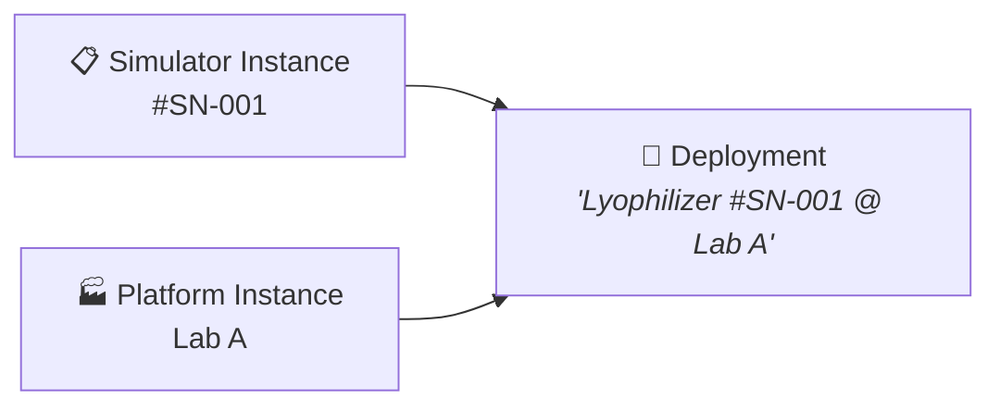

# Manual 4 - How to Create and Edit Instrument / Simulator Instances

**Module:** DPL (Deployment)  
**PMSR Context:** Instances represent physical/concrete units of a Simulator  
**Version:** 1.0 | March 2026

> 🌐 **Portuguese version available:** [Open Portuguese version](04-MANUAL-INSTRUMENT-SIMULATOR-INSTANCES.md)

---

## Table of Contents

1. [Overview](#1-overview)
2. [What is an Instrument/Simulator Instance?](#2-what-is-an-instrumentsimulator-instance)
3. [Prerequisites](#3-prerequisites)
4. [Accessing Instance Management](#4-accessing-instance-management)
5. [The Management Page (List)](#5-the-management-page-list)
6. [Creating a New Instance](#6-creating-a-new-instance)
7. [Editing an Instance](#7-editing-an-instance)
8. [Deployments - Associating Instances](#8-deployments---associating-instances)
9. [Field Reference](#9-field-reference)
10. [Troubleshooting](#10-troubleshooting)

---

## 1. Overview

An **Instrument Instance** (or **Simulator Instance** in PMSR) represents a **physical or concrete unit** of a previously defined and approved Instrument/Simulator. While the Instrument is the "definition" (the design), the Instance is a "real copy" of that design - a specific piece of equipment, with a serial number, acquisition date, owner, etc.

### Analogy

| Concept | Analogy |
|---------|---------|
| **Instrument/Simulator** | The *model* of a car (e.g., Toyota Corolla 2026) |
| **Instrument Instance** | A *specific car* of that model (e.g., license plate AA-00-BB, purchased on 03/15/2026) |

### Position in the General Flow



> **Important note:** Instrument Instances **do not follow the review flow** (Draft → Under Review → Current). They are created directly as operational records. The review flow applies only to the **definition** of the Instrument/Simulator.

> 📘 **Why create Instances?**
>
> In Manual 01, you created an **Instrument/Simulator** - this is the **model (definition/design)**, which describes the structure, slots, and components. It's like the engineering blueprint for a machine.
>
> An **Instance** is a **concrete physical unit** of that model. Each real machine in your laboratory is an instance:
> - The model "Lyophilization Simulator LF-2000" is defined **once**, approved once.
> - But you may have **3 physical machines** of that model: #SN-001 in Room 101, #SN-002 in Room 205, #SN-003 on the production line.
>
> Each instance has its own **serial number**, **owner**, and can be **deployed** (associated with a specific laboratory for operation).
>
> **Analogy:** The model is like a car model (e.g., "Toyota Corolla 2025"). The instance is the specific car you bought, with its own license plate and mileage.

---

## 2. What is an Instrument/Simulator Instance?

An Instance contains:
- **Reference to the source Instrument/Simulator** (the type/design)
- **Identification number** (serial number / ID)
- **Acquisition date**
- **Owner** (organization)
- **Maintenance responsible** (person)
- **Status** (operational or damaged)
- **Additional description**

### Relationship with Deployments



---

## 3. Prerequisites

| Prerequisite | Required? | Description |
|--------------|-----------|-------------|
| **Instrument/Simulator in Current state** | **Yes** | You can only instantiate Instruments that have been approved (Current state). See 🔗 [Instruments Manual](01-MANUAL-INSTRUMENTS-SIMULATORS-EN.md) |
| **Platform Instance** | For deploy | Only required if you want to create a Deployment. See 🔗 [Platform Instances Manual](06-MANUAL-PLATFORM-LABORATORY-INSTANCES-EN.md) |

---

## 4. Accessing Instance Management

### Navigation Path

```
Main Menu → Deployment Elements → Manage Elements → Manage Instrument Instances
```

> **PMSR Note:** The menu may show **"Manage Simulator Instances"** depending on the Preferred Names configuration, as configured by the system administrator.

**Direct URL:** `https://www.pmsr.net/dpl/select/instrumentinstance/1/9`

### Steps:

📋 **Step 1.** In the navigation bar, click on **"Deployment Elements"**.

📋 **Step 2.** Hover over **"Manage Elements"**.

📋 **Step 3.** Click on **"Manage Instrument Instances"** (or "Manage Simulator Instances").

---

## 5. The Management Page (List)

### View Modes

| Button | Description |
|--------|-------------|
| **Table View** | Table view |
| **Card View** | Card view |

### Table Columns

Columns are dynamically generated by the system. They typically include:

| Column | Description |
|--------|-------------|
| **URI** | Unique identifier of the instance |
| **Type** | Type of the source Instrument/Simulator |
| **ID Number** | Serial number / identification |
| **Label** | Automatically generated name (format: "Type with #ID (serial_number)") |
| **Owner** | Owner organization |
| **Status** | Operational status |

### Action Buttons

| Button | Function |
|--------|----------|
| **Add New [Simulator] Instance** | Opens creation form (modal) |
| **Back** | Returns to previous page |
| **Load More** | Loads more items (card view) |

---

## 6. Creating a New Instance

> 🔑 **Required Role:** You must be an **authenticated user** (User / Author) to create Instrument/Simulator instances.

### Creation Sequence



### Detailed Steps

📋 **Step 1.** On the management page, click on **"Add New Simulator Instance"** (or "Add New Instrument Instance").

📋 **Step 2.** A **modal form** (overlay window) opens.

📋 **Step 3.** Fill in the fields:

#### Creation Form Fields

| Field | Type | Required | Detailed Description |
|-------|------|----------|----------------------|
| **Simulator Type** (or Instrument Type) | Selection by modal (tree) | **Yes** | The Instrument/Simulator that this instance represents. Click to open the type tree. **Only elements in Current state are shown.** Select the specific design (e.g., "Lyophilizer LF-2000 v2"). |
| **ID Number** | Text field | **Yes** | Serial number or unique identification of this physical unit. **Examples:** "SN-001", "LF2000-PT-003", "EQ-2026-0042". This number must be unique and allow physical identification of the equipment. |
| **Acquisition Date** | Date picker | No | Date when this equipment was acquired/received. Format: calendar with day selection. |
| **Owner** | Field with autocomplete | No | Organization that owns the equipment. Start typing and select from the list of organizations registered in the system. |
| **Maintainer** | Field with autocomplete | No | Person responsible for equipment maintenance. Start typing and select from the list of people. |
| **Description** | Text area | No | Additional notes about this instance: location, condition, operational notes, etc. |

📋 **Step 4.** Click **"Save"**.

📋 **Step 5.** The instance is created with:
- **URI** automatically generated
- **Label** automatically generated in the format: `"[Type] with #ID ([serial_number])"`
  - Example: "Lyophilizer LF-2000 with #ID (SN-001)"
- **Version** = 1

### Type Selection (Modal)

When clicking on the type field, the modal shows the Instruments/Simulators tree in **Current** state:

```
Available Instruments / Simulators
├── Lyophilizer LF-2000 v2 (Current)
├── Compression Simulator SC-500 v1 (Current)
├── PHQ-9 Questionnaire v3 (Current)
└── ...
```

> ⚠️ **Only Instruments/Simulators in Current state** appear in the list. If the design you need does not appear, make sure it has been approved (see 🔗 [Instruments Manual](01-MANUAL-INSTRUMENTS-SIMULATORS-EN.md)).

---

## 7. Editing an Instance

> 🔑 **Required Role:** You must be an **authenticated user** (User / Author) to edit Instrument/Simulator instances.

### How to Access

📋 **Step 1.** In the instance list, select the instance to edit.

📋 **Step 2.** Click the edit button (pencil icon or "Edit").

### Edit Form

The form includes all the creation fields, plus:

| Additional Field | Type | Description |
|-----------------|------|-------------|
| **Damaged** | Checkbox | Check if the equipment is damaged |
| **Damage Date** | Date picker | Date of damage (visible only when Damaged is checked) |

### Editable Fields

| Field | Editable? | Notes |
|-------|-----------|-------|
| Simulator Type | Yes | You can change the source type/design |
| ID Number | Yes | You can correct the serial number |
| Acquisition Date | Yes | |
| Owner | Yes | |
| Maintainer | Yes | |
| Description | Yes | |
| Damaged | Yes | Check/uncheck damage status |
| Damage Date | Conditional | Appears only when Damaged is checked |

📋 After editing, click **"Save"** to save the changes.

---

## 8. Deployments - Associating Instances

> 🔑 **Required Role:** You must be an **authenticated user** (User / Author) to create and manage Deployments.

After creating instances of Instruments/Simulators and Platforms/Laboratories, you can create **Deployments** to associate a Simulator with a Laboratory.

### What is a Deployment?

A **Deployment** is the record that an Instrument/Simulator instance is **installed/operational** at a Platform/Laboratory instance.



### Creating a Deployment

```
Main Menu → Deployment Elements → Manage Elements → Manage Deployments
```

📋 **Step 1.** In Deployment management, click on **"Add New Deployment"**.

📋 **Step 2.** Fill in:

| Field | Type | Required | Description |
|-------|------|----------|-------------|
| **Platform Instance** | Autocomplete | **Yes** | The Platform/Laboratory instance where the equipment is installed |
| **Simulator Instance** | Autocomplete | **Yes** | The Instrument/Simulator instance to install |
| **Version** | Automatic | Auto | Version 1 |
| **Description** | Textarea | No | Notes about the deployment |

📋 **Step 3.** Click **"Save"**.

The system automatically generates the label: `"[Instrument Label] @ [Platform Label]"`.

---

## 9. Field Reference

### Creation Form - Complete Fields

| Field | Technical Name | Type | Required | Description |
|-------|---------------|------|----------|-------------|
| Type | `instance_type` | Modal textfield | Yes | Source Instrument/Simulator |
| ID Number | `instance_serial_number` | Textfield | Yes | Unique serial number |
| Acquisition Date | `instance_acquisition_date` | Date | No | Acquisition date |
| Owner | `instance_owner` | Textfield + autocomplete | No | Owner organization |
| Maintainer | `instance_maintainer` | Textfield + autocomplete | No | Person responsible for maintenance |
| Description | `instance_description` | Textarea | No | Additional notes |

### Edit Form - Additional Fields

| Field | Technical Name | Type | Description |
|-------|---------------|------|-------------|
| Damaged | `instance_damaged` | Checkbox | Equipment damage status |
| Damage Date | `instance_damage_date` | Date | Date of damage (conditional) |

---

## 10. Troubleshooting

| Problem | Possible Cause | Solution |
|---------|----------------|----------|
| The Instrument/Simulator I need does not appear in the type selection | The Instrument is not in Current state | Submit the Instrument for review and wait for approval. See 🔗 [Instruments Manual](01-MANUAL-INSTRUMENTS-SIMULATORS-EN.md) |
| The creation form appears as a very small modal | Normal behavior for instances | Instance creation uses a modal form (compact) |
| I cannot create a Deployment | Missing Platform or Instrument instances | Create both instances first: 🔗 [Platform Instances Manual](06-MANUAL-PLATFORM-LABORATORY-INSTANCES-EN.md) |
| The Owner/Maintainer field does not show suggestions | The Social module is not active or there are no registered organizations/people | Contact the administrator to check the Social module |
| The generated label is not correct | The ID Number may be incorrect | Edit the instance and correct the ID Number field |

---

🔗 **Related Manuals:**
- [Instruments/Simulators Manual](01-MANUAL-INSTRUMENTS-SIMULATORS-EN.md) - Prerequisite: define the Instrument design
- [Platforms/Laboratories Manual](05-MANUAL-PLATFORMS-LABORATORIES-EN.md) - To create Platforms for deployment
- [Platform/Laboratory Instances Manual](06-MANUAL-PLATFORM-LABORATORY-INSTANCES-EN.md) - To create Platform instances for Deployments
- [Manuals Index](INDEX-EN.md)

---

*PMSR Working Group - March 2026*
