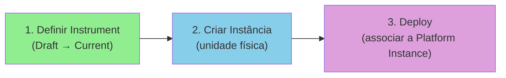
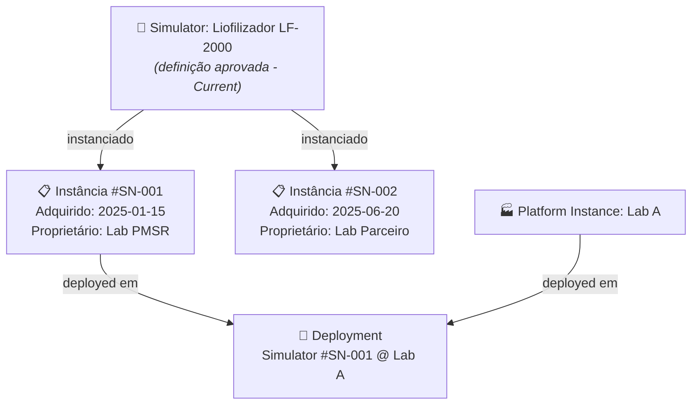
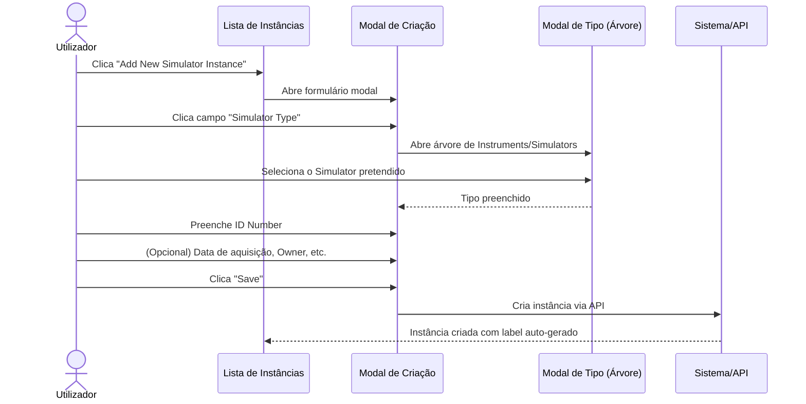
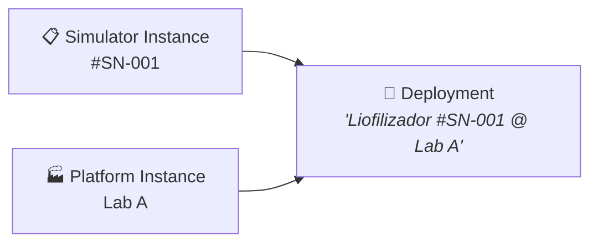

# Manual 4 - Como Criar e Editar Instâncias de Instruments / Simulators

**Módulo:** DPL (Deployment)  
**Contexto PMSR:** Instâncias representam unidades físicas/concretas de um Simulator  
**Versão:** 1.0 | Março 2026

> 🌐 **Versão em inglês disponível:** [Open English version](04-MANUAL-INSTRUMENT-SIMULATOR-INSTANCES-EN.md)

---

## Índice

1. [Visão Geral](#1-visão-geral)
2. [O que é uma Instância de Instrument/Simulator?](#2-o-que-é-uma-instância-de-instrumentsimulator)
3. [Pré-requisitos](#3-pré-requisitos)
4. [Aceder à Gestão de Instâncias](#4-aceder-à-gestão-de-instâncias)
5. [A Página de Gestão (Lista)](#5-a-página-de-gestão-lista)
6. [Criar uma Nova Instância](#6-criar-uma-nova-instância)
7. [Editar uma Instância](#7-editar-uma-instância)
8. [Deployments - Associar Instâncias](#8-deployments---associar-instâncias)
9. [Referência de Campos](#9-referência-de-campos)
10. [Resolução de Problemas](#10-resolução-de-problemas)

---

## 1. Visão Geral

Uma **Instância de Instrument** (ou **Instância de Simulator** no PMSR) representa uma **unidade física ou concreta** de um Instrument/Simulator previamente definido e aprovado. Enquanto o Instrument é a "definição" (o design), a Instância é uma "cópia real" desse design - um equipamento específico, com número de série, data de aquisição, proprietário, etc.

### Analogia

| Conceito | Analogia |
|----------|----------|
| **Instrument/Simulator** | O *modelo* de um carro (ex: Toyota Corolla 2026) |
| **Instância de Instrument** | Um *carro concreto* desse modelo (ex: matrícula AA-00-BB, comprado em 15/03/2026) |

### Posição no Fluxo Geral



> **Nota importante:** As instâncias de Instruments **não seguem o fluxo de revisão** (Draft → Under Review → Current). São criadas diretamente como registos operacionais. O fluxo de revisão aplica-se apenas à **definição** do Instrument/Simulator.

> 📘 **Porquê criar Instâncias?**
>
> No Manual 01, criou um **Instrument/Simulator** - este é o **modelo (definição/design)**, que descreve a estrutura, os slots e os componentes. É como o projeto de engenharia de uma máquina.
>
> Uma **Instância** é uma **unidade física concreta** desse modelo. Cada máquina real no seu laboratório é uma instância:
> - O modelo "Simulador de Liofilização LF-2000" é **um só**, aprovado uma vez.
> - Mas pode ter **3 máquinas físicas** desse modelo: #SN-001 na Sala 101, #SN-002 na Sala 205, #SN-003 na linha de produção.
>
> Cada instância tem o seu próprio **número de série**, **proprietário**, e pode ser **deployed** (associada a um laboratório específico para operação).
>
> **Analogia:** O modelo é como um modelo de carro (ex: "Toyota Corolla 2025"). A instância é o carro específico que comprou, com a sua matrícula e quilometragem.

---

## 2. O que é uma Instância de Instrument/Simulator?

Uma Instância contém:
- **Referência ao Instrument/Simulator** de origem (o tipo/design)
- **Número de identificação** (serial number / ID)
- **Data de aquisição**
- **Proprietário** (organização)
- **Responsável pela manutenção** (pessoa)
- **Estado** (operacional ou danificado)
- **Descrição** adicional

### Relação com Deployments



---

## 3. Pré-requisitos

| Pré-requisito | Obrigatório? | Descrição |
|---------------|-------------|-----------|
| **Instrument/Simulator em estado Current** | **Sim** | Só é possível instanciar Instruments que foram aprovados (estado Current). Ver 🔗 [Manual de Instruments](01-MANUAL-INSTRUMENTS-SIMULATORS.md) |
| **Platform Instance** | Para deploy | Necessária apenas se quiser criar um Deployment. Ver 🔗 [Manual de Platform Instances](06-MANUAL-PLATFORM-LABORATORY-INSTANCES.md) |

---

## 4. Aceder à Gestão de Instâncias

### Caminho de Navegação

```
Menu Principal → Deployment Elements → Manage Elements → Manage Instrument Instances
```

> **Nota PMSR:** O menu pode mostrar **"Manage Simulator Instances"** conforme configurado pelo administrador do sistema.

**URL direto:** `https://www.pmsr.net/dpl/select/instrumentinstance/1/9`

### Passos:

📋 **Passo 1.** Na barra de navegação, clique em **"Deployment Elements"**.

📋 **Passo 2.** Passe o cursor sobre **"Manage Elements"**.

📋 **Passo 3.** Clique em **"Manage Instrument Instances"** (ou "Manage Simulator Instances").

---

## 5. A Página de Gestão (Lista)

### Modos de Visualização

| Botão | Descrição |
|-------|-----------|
| **Table View** | Vista em tabela |
| **Card View** | Vista em cartões |

### Colunas da Tabela

As colunas são geradas dinamicamente pelo sistema. Tipicamente incluem:

| Coluna | Descrição |
|--------|-----------|
| **URI** | Identificador único da instância |
| **Type** | Tipo do Instrument/Simulator de origem |
| **ID Number** | Número de série / identificação |
| **Label** | Nome gerado automaticamente (formato: "Tipo com #ID (serial_number)") |
| **Owner** | Organização proprietária |
| **Status** | Estado operacional |

### Botões de Ação

| Botão | Função |
|-------|--------|
| **Add New [Simulator] Instance** | Abre formulário de criação (modal) |
| **Back** | Volta à página anterior |
| **Load More** | Carrega mais itens (vista de cartões) |

---

## 6. Criar uma Nova Instância

> 🔐 **Papel necessário:** Utilizador autenticado. Qualquer utilizador com sessão iniciada pode criar instâncias de Instruments/Simulators.

### Sequência de Criação



### Passos Detalhados

📋 **Passo 1.** Na página de gestão, clique em **"Add New Simulator Instance"** (ou "Add New Instrument Instance").

📋 **Passo 2.** Um **formulário modal** (janela sobreposta) abre-se.

📋 **Passo 3.** Preencha os campos:

#### Campos do Formulário de Criação

| Campo | Tipo | Obrigatório | Descrição Detalhada |
|-------|------|-------------|---------------------|
| **Simulator Type** (ou Instrument Type) | Seleção por modal (árvore) | **Sim** | O Instrument/Simulator que esta instância representa. Clique para abrir a árvore de tipos. **Apenas elementos em estado Current são mostrados.** Selecione o design específico (ex: "Liofilizador LF-2000 v2"). |
| **ID Number** | Campo de texto | **Sim** | Número de série ou identificação única desta unidade física. **Exemplos:** "SN-001", "LF2000-PT-003", "EQ-2026-0042". Este número deve ser único e permitir identificar fisicamente o equipamento. |
| **Acquisition Date** | Seletor de data | Não | Data em que este equipamento foi adquirido/recebido. Formato: calendário com seleção de dia. |
| **Owner** | Campo com autocomplete | Não | Organização proprietária do equipamento. Comece a escrever e selecione da lista de organizações registadas no sistema. |
| **Maintainer** | Campo com autocomplete | Não | Pessoa responsável pela manutenção do equipamento. Comece a escrever e selecione da lista de pessoas. |
| **Description** | Área de texto | Não | Notas adicionais sobre esta instância: localização, condição, notas operacionais, etc. |

📋 **Passo 4.** Clique em **"Save"**.

📋 **Passo 5.** A instância é criada com:
- **URI** gerado automaticamente
- **Label** automático no formato: `"[Tipo] com #ID ([serial_number])"`
  - Exemplo: "Liofilizador LF-2000 com #ID (SN-001)"
- **Versão** = 1

### Seleção do Tipo (Modal)

Ao clicar no campo de tipo, a modal mostra a árvore de Instruments/Simulators em estado **Current**:

```
Instruments / Simulators Disponíveis
├── Liofilizador LF-2000 v2 (Current)
├── Simulador de Compressão SC-500 v1 (Current)
├── PHQ-9 Questionário v3 (Current)
└── ...
```

> ⚠️ **Apenas Instruments/Simulators em estado Current** aparecem na lista. Se o design que precisa não aparece, certifique-se de que foi aprovado (ver 🔗 [Manual de Instruments](01-MANUAL-INSTRUMENTS-SIMULATORS.md)).

---

## 7. Editar uma Instância

> 🔐 **Papel necessário:** Utilizador autenticado. Apenas o utilizador que criou a instância ou um administrador pode editá-la.

### Como aceder

📋 **Passo 1.** Na lista de instâncias, selecione a instância a editar.

📋 **Passo 2.** Clique no botão de edição (ícone de lápis ou "Edit").

### Formulário de Edição

O formulário inclui todos os campos da criação, mais:

| Campo Adicional | Tipo | Descrição |
|----------------|------|-----------|
| **Damaged** | Checkbox | Marque se o equipamento está danificado |
| **Damage Date** | Seletor de data | Data do dano (visível apenas se Damaged está marcado) |

### Campos Editáveis

| Campo | Editável? | Notas |
|-------|-----------|-------|
| Simulator Type | Sim | Pode alterar o tipo/design de origem |
| ID Number | Sim | Pode corrigir o número de série |
| Acquisition Date | Sim | |
| Owner | Sim | |
| Maintainer | Sim | |
| Description | Sim | |
| Damaged | Sim | Marca/desmarca estado de dano |
| Damage Date | Condicional | Aparece apenas quando Damaged está marcado |

📋 Após editar, clique em **"Save"** para guardar as alterações.

---

## 8. Deployments - Associar Instâncias

> 🔐 **Papel necessário:** Utilizador autenticado com permissão de gestão de deployments. A criação de deployments pode requerer papel de administrador ou gestor de laboratório, conforme configurado pelo administrador do sistema.

Após criar instâncias de Instruments/Simulators e de Platforms/Laboratories, pode criar **Deployments** para associar um Simulator a um Laboratory.

### O que é um Deployment?

Um **Deployment** é o registo de que uma instância de Instrument/Simulator está **instalada/operacional** numa instância de Platform/Laboratory.



### Criar um Deployment

```
Menu Principal → Deployment Elements → Manage Elements → Manage Deployments
```

📋 **Passo 1.** Na gestão de Deployments, clique em **"Add New Deployment"**.

📋 **Passo 2.** Preencha:

| Campo | Tipo | Obrigatório | Descrição |
|-------|------|-------------|-----------|
| **Platform Instance** | Autocomplete | **Sim** | A instância de Platform/Laboratory onde o equipamento está instalado |
| **Simulator Instance** | Autocomplete | **Sim** | A instância do Instrument/Simulator a instalar |
| **Version** | Automático | Auto | Versão 1 |
| **Description** | Textarea | Não | Notas sobre o deployment |

📋 **Passo 3.** Clique em **"Save"**.

O sistema gera automaticamente o label: `"[Instrument Label] @ [Platform Label]"`.

---

## 9. Referência de Campos

### Formulário de Criação - Campos Completos

| Campo | Nome Técnico | Tipo | Obrigatório | Descrição |
|-------|-------------|------|-------------|-----------|
| Type | `instance_type` | Modal textfield | Sim | Instrument/Simulator de origem |
| ID Number | `instance_serial_number` | Textfield | Sim | Número de série único |
| Acquisition Date | `instance_acquisition_date` | Date | Não | Data de aquisição |
| Owner | `instance_owner` | Textfield + autocomplete | Não | Organização proprietária |
| Maintainer | `instance_maintainer` | Textfield + autocomplete | Não | Pessoa responsável pela manutenção |
| Description | `instance_description` | Textarea | Não | Notas adicionais |

### Formulário de Edição - Campos Adicionais

| Campo | Nome Técnico | Tipo | Descrição |
|-------|-------------|------|-----------|
| Damaged | `instance_damaged` | Checkbox | Estado de dano do equipamento |
| Damage Date | `instance_damage_date` | Date | Data do dano (condicional) |

---

## 10. Resolução de Problemas

| Problema | Causa Possível | Solução |
|----------|----------------|---------|
| O Instrument/Simulator que preciso não aparece na seleção de tipo | O Instrument não está em estado Current | Submeta o Instrument para revisão e aguarde aprovação. Ver 🔗 [Manual de Instruments](01-MANUAL-INSTRUMENTS-SIMULATORS.md) |
| O formulário de criação aparece como modal muito pequena | Comportamento normal para instâncias | A criação de instâncias usa formulário modal (compacto) |
| Não consigo criar Deployment | Faltam instâncias de Platform ou Instrument | Crie ambas as instâncias primeiro: 🔗 [Manual de Platform Instances](06-MANUAL-PLATFORM-LABORATORY-INSTANCES.md) |
| O campo Owner/Maintainer não mostra sugestões | O módulo Social não está ativo ou não existem organizações/pessoas registadas | Contacte o administrador para verificar o módulo Social |
| O label gerado não está correto | O ID Number pode estar incorreto | Edite a instância e corrija o campo ID Number |

---

🔗 **Manuais Relacionados:**
- [Manual de Instruments/Simulators](01-MANUAL-INSTRUMENTS-SIMULATORS.md) - Pré-requisito: definir o design do Instrument
- [Manual de Platforms/Laboratories](05-MANUAL-PLATFORMS-LABORATORIES.md) - Para criar Platforms onde fazer deploy
- [Manual de Platform/Laboratory Instances](06-MANUAL-PLATFORM-LABORATORY-INSTANCES.md) - Para criar instâncias de Platforms para Deployments
- [Índice de Manuais](INDEX.md)

---

*Documento do Grupo de Trabalho PMSR - Março 2026*
