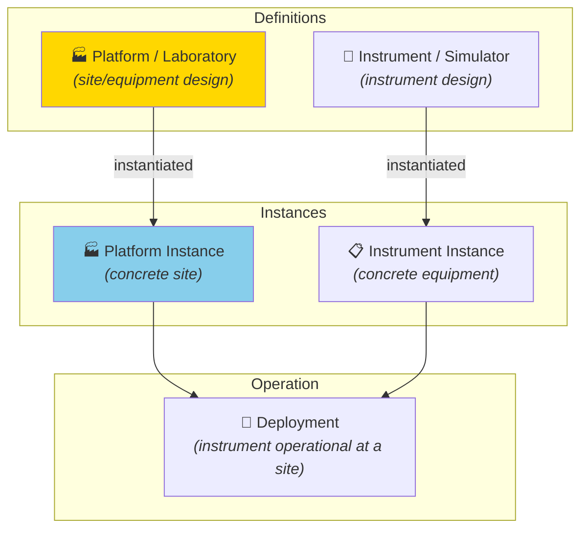
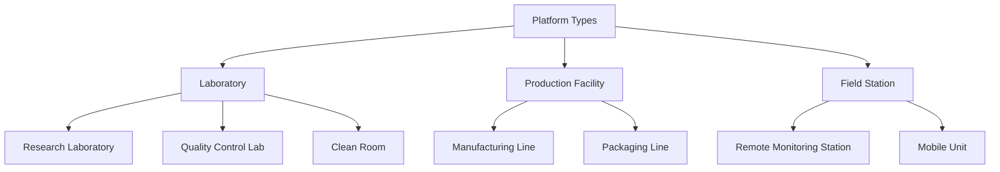
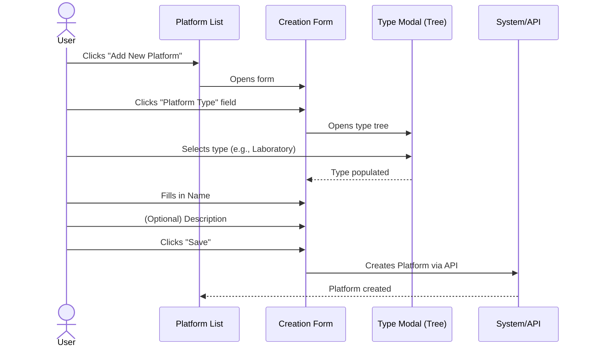
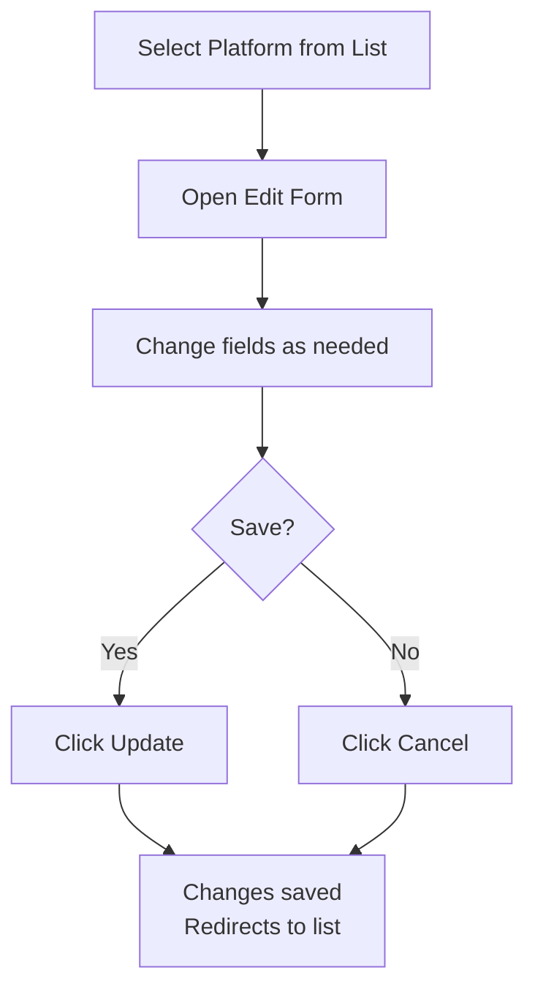

# Manual 5 - How to Create and Edit Platforms / Laboratories

**Module:** DPL (Deployment)  
**PMSR Context:** In PMSR, "Platform" can represent a **"Laboratory"** or operational site  
**Version:** 1.0 | March 2026

> 🌐 **Portuguese version available:** [Open Portuguese version](05-MANUAL-PLATFORMS-LABORATORIES.md)

---

## Table of Contents

1. [Overview](#1-overview)
2. [What is a Platform / Laboratory?](#2-what-is-a-platform--laboratory)
3. [Accessing Platform Management](#3-accessing-platform-management)
4. [The Management Page (List)](#4-the-management-page-list)
5. [Creating a New Platform / Laboratory](#5-creating-a-new-platform--laboratory)
6. [Editing a Platform / Laboratory](#6-editing-a-platform--laboratory)
7. [Field Reference](#7-field-reference)
8. [Troubleshooting](#8-troubleshooting)

---

## 1. Overview

A **Platform** (or **Laboratory** in the PMSR context) represents a **location, space, or infrastructure equipment** where instruments/simulators operate and data is collected. In PMSR, Platforms typically correspond to laboratories, simulation rooms, or industrial units.

### Position in the General Flow



> **Note:** Unlike Instruments and Components, Platforms **do not follow the full review flow** (Draft → Under Review → Current). Platform management is more streamlined.

> 📘 **Model vs. Instance:** A Platform/Laboratory is a **model (definition)** - it describes the type of platform or laboratory (e.g., "Lyophilization Laboratory Type A"). To register a **specific, concrete laboratory** (e.g., "Lyophilization Laboratory, Building B, Room 203"), create an **Instance** - see [Manual 06 - Platform/Laboratory Instances](06-MANUAL-PLATFORM-LABORATORY-INSTANCES-EN.md). The same model can have multiple instances across different locations.

---

## 2. What is a Platform / Laboratory?

### Definition

A Platform defines:
- **Hierarchical type** in the ontology (e.g., Laboratory, Clean Room, Production Floor)
- **Name** of the location or equipment
- **Version** of the design
- **Description** of the purpose and characteristics

### Examples in PMSR

| Type | Platform Example | Description |
|------|------------------|-------------|
| Laboratory | PMSR Lab - Room 101 | Main pharmaceutical simulation laboratory |
| Clean Room | Clean Room Class 100 | Clean room for sterile production |
| Industrial Unit | Production Line PL-3 | Lyophilized production line |
| Workstation | Control Station CS-2 | Process control station |

### Type Hierarchy

The Platform type selection is done through a **hierarchical tree** from the ontology:



> In the PMSR context, "Laboratory" is typically the most commonly used type. The displayed naming depends on the **Preferred Names** configuration.

---

## 3. Accessing Platform Management

### Navigation Path

```
Main Menu → Deployment Elements → Manage Elements → Manage Platforms
```

**Direct URL:** `https://www.pmsr.net/dpl/select/platform/1/9`

### Steps:

📋 **Step 1.** In the main navigation bar, click on **"Deployment Elements"**.

📋 **Step 2.** Hover over **"Manage Elements"**.

📋 **Step 3.** Click on **"Manage Platforms"**.

---

## 4. The Management Page (List)

### View Modes

| Button | Description |
|--------|-------------|
| **Table View** | Table view (recommended) |
| **Card View** | Card view |

### Table Columns

| Column | Description |
|--------|-------------|
| **URI** | Unique identifier of the Platform |
| **Name** | Name of the Platform/Laboratory |
| **Version** | Design version |

### Action Buttons

| Button | Function |
|--------|----------|
| **Add New Platform** | Opens the creation form |
| **Back** | Returns to the previous page |
| **Load More** | Loads more items (card view) |

---

## 5. Creating a New Platform / Laboratory

### Creation Sequence



> 🔐 **Required permission:** Creating and editing Platforms/Laboratories requires an authenticated user.

### Detailed Steps

📋 **Step 1.** On the management page, click **"Add New Platform"**.

📋 **Step 2.** The creation form opens.

📋 **Step 3.** Fill in the fields:

#### Form Fields

| Field | Type | Required | Detailed Description |
|-------|------|----------|----------------------|
| **Platform Type** | Selection via modal (tree) | **Yes** | Defines the hierarchical type of the Platform. When clicked, a modal window (800px) opens with the tree of available types in the ontology. **In PMSR, typically select "Laboratory" or the most specific subtype.** The tree shows the entire hierarchy of Platform types defined in the system. |
| **Name** | Text field | **Yes** | Descriptive and identifiable name for the Platform/Laboratory. Must be unique and clear. **Examples:** "PMSR Simulation Laboratory - Room 101", "GMP Clean Room - Building B", "Main Control Station CS-Main". |
| **Version** | Field (read-only) | Auto | Starts at 1. Not editable by the user. Increments automatically on subsequent edits. |
| **Description** | Text area | No | Detailed description of the Platform: physical location, capabilities, fixed equipment, access restrictions, environmental conditions, etc. |

📋 **Step 4.** Click **"Save"** to create.

📋 **Step 5.** The Platform is created and the system redirects to the management list.

### Platform Type Selection (Modal)

When clicking the **Platform Type** field, the modal displays the hierarchical tree:

```
Platform Types (Ontology)
├── 🏭 Laboratory
│   ├── Research Laboratory
│   ├── Quality Control Laboratory
│   ├── Clinical Laboratory
│   └── Clean Room
├── 🏗️ Production Facility
│   ├── Manufacturing Line
│   └── Packaging Area
├── 📡 Field Station
│   ├── Remote Monitoring Station
│   └── Mobile Unit
└── 💻 Workstation
    ├── Control Station
    └── Analysis Terminal
```

**To select:** Navigate through the tree and click on the desired type. The field is automatically populated and the modal closes.

> **PMSR Tip:** For most PMSR scenarios, select **"Laboratory"** or one of its subtypes. Consult the team if you are unsure which type to use.

---

## 6. Editing a Platform / Laboratory

> 🔐 **Required permission:** Creating and editing Platforms/Laboratories requires an authenticated user.

### How to Access

📋 **Step 1.** In the Platform list, locate the Platform you wish to edit.

📋 **Step 2.** Select it (radio button or click).

📋 **Step 3.** Click the edit button (or double-click).

### Edit Form

The form is similar to the creation form, with all fields editable:

| Field | Editable? | Notes |
|-------|-----------|-------|
| **Platform Type** | Yes | You can change the type via the tree modal |
| **Name** | Yes | You can change the name |
| **Version** | Read-only | Increments automatically if the current version is Current/Deprecated |
| **Description** | Yes | You can update the description |

### Buttons

| Button | Function |
|--------|----------|
| **Update** | Saves the changes |
| **Cancel** | Discards and returns to the list |

### Edit Flow



---

## 7. Field Reference

### Creation and Edit Form

| Field | Technical Name | HTML Type | Required | Default Value | Validation |
|-------|---------------|-----------|----------|---------------|------------|
| Platform Type | `platform_type` | Modal textfield | Yes | (empty) | Valid ontology URI |
| Name | `platform_name` | Textfield | Yes | (empty) | Not empty |
| Version | `platform_version` | Textfield (disabled) | Auto | 1 | Positive integer, managed by the system |
| Description | `platform_description` | Textarea | No | (empty) | - |

### Comparison with Instruments

| Aspect | Platform | Instrument |
|--------|----------|------------|
| **Number of fields** | 4 (simple) | 15+ (complex) |
| **Image/Document** | No | Yes |
| **Review flow** | No | Yes (Draft → Under Review → Current) |
| **Container Slots** | No | Yes |
| **Maker/Language** | No | Yes |

---

## 8. Troubleshooting

| Problem | Possible Cause | Solution |
|---------|----------------|----------|
| The Platform Type modal is empty | Connection issue with the ontology | Contact the system administrator |
| Cannot find the "Laboratory" type | The ontology may not have this exact subtype | Browse through the tree or contact the administrator to verify the available types |
| I want to add more details to the Platform | The form only has 4 fields | Use the Description field to include detailed information. Operational details are managed in Instances (🔗 [Platform Instances Manual](06-MANUAL-PLATFORM-LABORATORY-INSTANCES-EN.md)) |
| The version incremented on its own | Expected behavior when editing Current versions | Normal: the system creates a new version automatically |
| Cannot delete the Platform | There may be associated instances | Delete the associated instances and deployments first |

---

🔗 **Related Manuals:**
- [Platform/Laboratory Instances Manual](06-MANUAL-PLATFORM-LABORATORY-INSTANCES-EN.md) - Next step: creating Platform instances
- [Instruments/Simulators Manual](01-MANUAL-INSTRUMENTS-SIMULATORS-EN.md) - The Instruments that will be deployed on Platforms
- [Instrument/Simulator Instances Manual](04-MANUAL-INSTRUMENT-SIMULATOR-INSTANCES-EN.md) - Instrument Instances for Deployment
- [Manuals Index](INDEX-EN.md)

---

*PMSR Working Group - March 2026*
