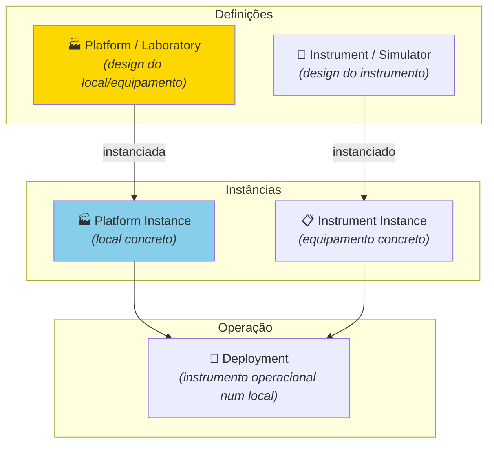
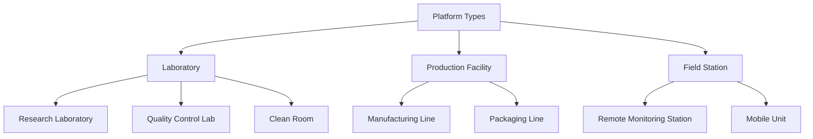
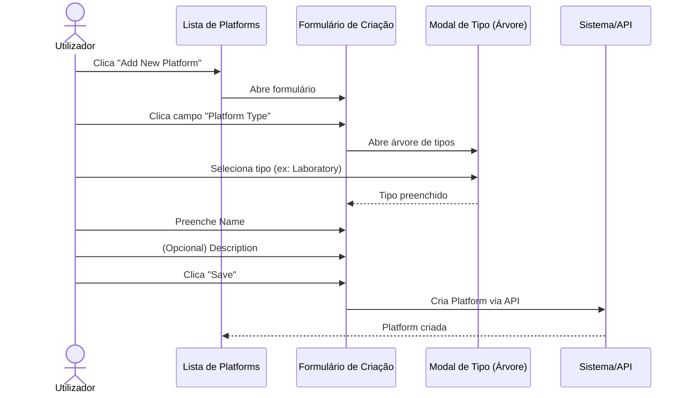
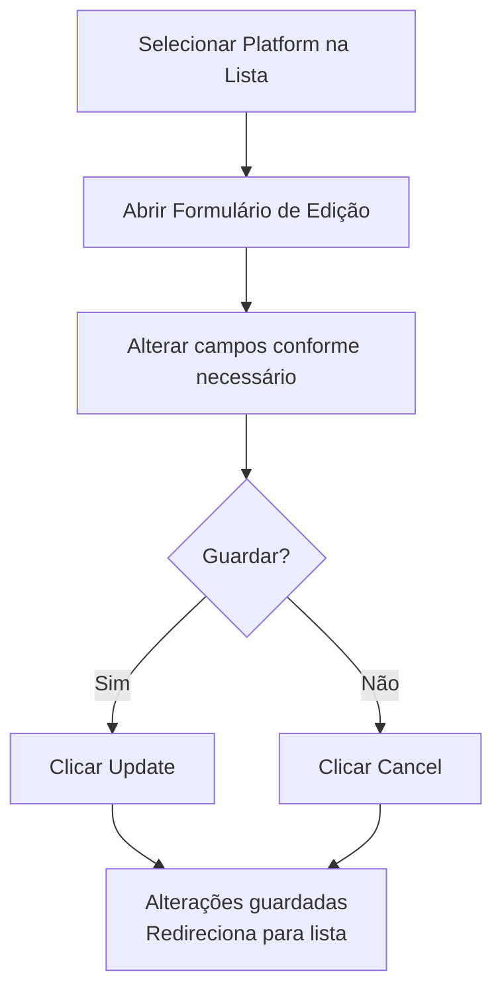

# Manual 5 - Como Criar e Editar Platforms / Laboratories

**Módulo:** DPL (Deployment)  
**Contexto PMSR:** No PMSR, "Platform" pode representar um **"Laboratory"** ou local de operação  
**Versão:** 1.0 | Março 2026

> 🌐 **Versão em inglês disponível:** [Open English version](05-MANUAL-PLATFORMS-LABORATORIES-EN.md)

---

## Índice

1. [Visão Geral](#1-visão-geral)
2. [O que é uma Platform / Laboratory?](#2-o-que-é-uma-platform--laboratory)
3. [Aceder à Gestão de Platforms](#3-aceder-à-gestão-de-platforms)
4. [A Página de Gestão (Lista)](#4-a-página-de-gestão-lista)
5. [Criar uma Nova Platform / Laboratory](#5-criar-uma-nova-platform--laboratory)
6. [Editar uma Platform / Laboratory](#6-editar-uma-platform--laboratory)
7. [Referência de Campos](#7-referência-de-campos)
8. [Resolução de Problemas](#8-resolução-de-problemas)

---

## 1. Visão Geral

Uma **Platform** (ou **Laboratory** no contexto PMSR) representa um **local, espaço ou equipamento de infraestrutura** onde instrumentos/simuladores operam e dados são recolhidos. No PMSR, Platforms tipicamente correspondem a laboratórios, salas de simulação, ou unidades industriais.

> 📘 **Modelo vs. Instância:** Uma Platform/Laboratory é um **modelo (definição)** - descreve o tipo de plataforma ou laboratório (ex: "Laboratório de Liofilização Tipo A"). Para registar um **laboratório concreto e específico** (ex: "Laboratório de Liofilização, Edifício B, Sala 203"), crie uma **Instância** - consulte o [Manual 06 - Instâncias de Platforms/Laboratories](06-MANUAL-PLATFORM-LABORATORY-INSTANCES.md). O mesmo modelo pode ter múltiplas instâncias em diferentes localizações.

### Posição no Fluxo Geral



> **Nota:** Ao contrário dos Instruments e Components, as Platforms **não seguem o fluxo de revisão** completo (Draft → Under Review → Current). A gestão de Platforms é mais simplificada.

---

## 2. O que é uma Platform / Laboratory?

### Definição

Uma Platform define:
- **Tipo hierárquico** na ontologia (ex: Laboratory, Clean Room, Production Floor)
- **Nome** do local ou equipamento
- **Versão** do design
- **Descrição** do propósito e características

### Exemplos no PMSR

| Tipo | Exemplo de Platform | Descrição |
|------|---------------------|-----------|
| Laboratório | Lab PMSR - Sala 101 | Laboratório principal de simulação farmacêutica |
| Sala Limpa | Clean Room Classe 100 | Sala limpa para produção estéril |
| Unidade Industrial | Linha de Produção LP-3 | Linha de produção de liofilizados |
| Estação de Trabalho | Estação de Controlo EC-2 | Estação de controlo de processos |

### Hierarquia de Tipos

A seleção do tipo de Platform é feita através de uma **árvore hierárquica** da ontologia:



> No contexto PMSR, "Laboratory" é tipicamente o tipo mais utilizado. A nomenclatura exibida depende da configuração de **Preferred Names**.

---

## 3. Aceder à Gestão de Platforms

### Caminho de Navegação

```
Menu Principal → Deployment Elements → Manage Elements → Manage Platforms
```

**URL direto:** `https://www.pmsr.net/dpl/select/platform/1/9`

### Passos:

📋 **Passo 1.** Na barra de navegação principal, clique em **"Deployment Elements"**.

📋 **Passo 2.** Passe o cursor sobre **"Manage Elements"**.

📋 **Passo 3.** Clique em **"Manage Platforms"**.

---

## 4. A Página de Gestão (Lista)

### Modos de Visualização

| Botão | Descrição |
|-------|-----------|
| **Table View** | Vista em tabela (recomendado) |
| **Card View** | Vista em cartões |

### Colunas da Tabela

| Coluna | Descrição |
|--------|-----------|
| **URI** | Identificador único da Platform |
| **Name** | Nome da Platform/Laboratory |
| **Version** | Versão do design |

### Botões de Ação

| Botão | Função |
|-------|--------|
| **Add New Platform** | Abre o formulário de criação |
| **Back** | Volta à página anterior |
| **Load More** | Carrega mais itens (vista de cartões) |

---

## 5. Criar uma Nova Platform / Laboratory

> 🔐 **Permissão necessária:** A criação e edição de Platforms/Laboratories requer um utilizador autenticado.

### Sequência de Criação



### Passos Detalhados

📋 **Passo 1.** Na página de gestão, clique em **"Add New Platform"**.

📋 **Passo 2.** O formulário de criação abre-se.

📋 **Passo 3.** Preencha os campos:

#### Campos do Formulário

| Campo | Tipo | Obrigatório | Descrição Detalhada |
|-------|------|-------------|---------------------|
| **Platform Type** | Seleção por modal (árvore) | **Sim** | Define o tipo hierárquico da Platform. Ao clicar, abre-se uma janela modal (800px) com a árvore de tipos disponíveis na ontologia. **No PMSR, selecione tipicamente "Laboratory" ou o subtipo mais específico.** A árvore mostra toda a hierarquia de tipos de Platform definidos no sistema. |
| **Name** | Campo de texto | **Sim** | Nome descritivo e identificável da Platform/Laboratory. Deve ser único e claro. **Exemplos:** "Laboratório de Simulação PMSR - Sala 101", "Clean Room GMP - Edifício B", "Estação de Controlo EC-Principal". |
| **Version** | Campo (somente leitura) | Auto | Inicia em 1. Não editável pelo utilizador. Incrementa automaticamente em edições posteriores. |
| **Description** | Área de texto | Não | Descrição detalhada da Platform: localização física, capacidades, equipamentos fixos, restrições de acesso, condições ambientais, etc. |

📋 **Passo 4.** Clique em **"Save"** para criar.

📋 **Passo 5.** A Platform é criada e o sistema redireciona para a lista de gestão.

### Seleção do Platform Type (Modal)

Ao clicar no campo **Platform Type**, a modal apresenta a árvore hierárquica:

```
Platform Types (Ontologia)
├── 🏭 Laboratory
│   ├── Research Laboratory
│   ├── Quality Control Laboratory
│   ├── Clinical Laboratory
│   └── Clean Room
├── 🏗️ Production Facility
│   ├── Manufacturing Line
│   └── Packaging Area
├── 📡 Field Station
│   ├── Remote Monitoring Station
│   └── Mobile Unit
└── 💻 Workstation
    ├── Control Station
    └── Analysis Terminal
```

**Para selecionar:** Navegue pela árvore e clique no tipo desejado. O campo é preenchido automaticamente e a modal fecha-se.

> **Dica PMSR:** Para a maioria dos cenários PMSR, selecione **"Laboratory"** ou um dos seus subtipos. Consulte a equipa se não tiver a certeza de qual tipo usar.

---

## 6. Editar uma Platform / Laboratory

> 🔐 **Permissão necessária:** A criação e edição de Platforms/Laboratories requer um utilizador autenticado.

### Como aceder

📋 **Passo 1.** Na lista de Platforms, localize a Platform que pretende editar.

📋 **Passo 2.** Selecione-a (radio button ou clique).

📋 **Passo 3.** Clique no botão de edição (ou dê duplo-clique).

### Formulário de Edição

O formulário é semelhante ao de criação, com todos os campos editáveis:

| Campo | Editável? | Notas |
|-------|-----------|-------|
| **Platform Type** | Sim | Pode alterar o tipo via modal de árvore |
| **Name** | Sim | Pode alterar o nome |
| **Version** | Somente leitura | Incrementa automaticamente se a versão atual é Current/Deprecated |
| **Description** | Sim | Pode atualizar a descrição |

### Botões

| Botão | Função |
|-------|--------|
| **Update** | Guarda as alterações |
| **Cancel** | Descarta e volta à lista |

### Fluxo de Edição



---

## 7. Referência de Campos

### Formulário de Criação e Edição

| Campo | Nome Técnico | Tipo HTML | Obrigatório | Valor Padrão | Validação |
|-------|-------------|-----------|-------------|--------------|-----------|
| Platform Type | `platform_type` | Modal textfield | Sim | (vazio) | URI válido da ontologia |
| Name | `platform_name` | Textfield | Sim | (vazio) | Não vazio |
| Version | `platform_version` | Textfield (disabled) | Auto | 1 | Inteiro positivo, gerido pelo sistema |
| Description | `platform_description` | Textarea | Não | (vazio) | - |

### Comparação com Instruments

| Aspeto | Platform | Instrument |
|--------|----------|------------|
| **Nº de campos** | 4 (simples) | 15+ (complexo) |
| **Imagem/Documento** | Não | Sim |
| **Fluxo de revisão** | Não | Sim (Draft → Under Review → Current) |
| **Container Slots** | Não | Sim |
| **Maker/Language** | Não | Sim |

---

## 8. Resolução de Problemas

| Problema | Causa Possível | Solução |
|----------|----------------|---------|
| A modal do Platform Type está vazia | Problema de conexão com a ontologia | Contacte o administrador do sistema |
| Não encontro o tipo "Laboratory" | A ontologia pode não ter este subtipo exato | Navegue pela árvore ou contacte o administrador para verificar os tipos disponíveis |
| Quero adicionar mais detalhes à Platform | O formulário só tem 4 campos | Use o campo Description para incluir informação detalhada. Detalhes operacionais são geridos nas Instâncias (🔗 [Manual de Platform Instances](06-MANUAL-PLATFORM-LABORATORY-INSTANCES.md)) |
| A versão incrementou sozinha | Comportamento esperado em edição de versões Current | Normal: o sistema cria nova versão automaticamente |
| Não consigo eliminar a Platform | Podem existir instâncias associadas | Elimine primeiro as instâncias e deployments associados |

---

🔗 **Manuais Relacionados:**
- [Manual de Platform/Laboratory Instances](06-MANUAL-PLATFORM-LABORATORY-INSTANCES.md) - Próximo passo: criar instâncias da Platform
- [Manual de Instruments/Simulators](01-MANUAL-INSTRUMENTS-SIMULATORS.md) - Os Instruments que serão deployed nas Platforms
- [Manual de Instrument/Simulator Instances](04-MANUAL-INSTRUMENT-SIMULATOR-INSTANCES.md) - Instâncias de Instruments para Deployment
- [Índice de Manuais](INDEX.md)

---

*Documento do Grupo de Trabalho PMSR - Março 2026*
