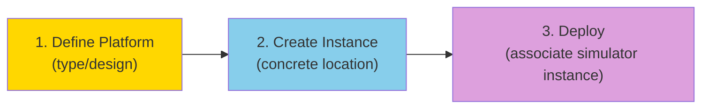
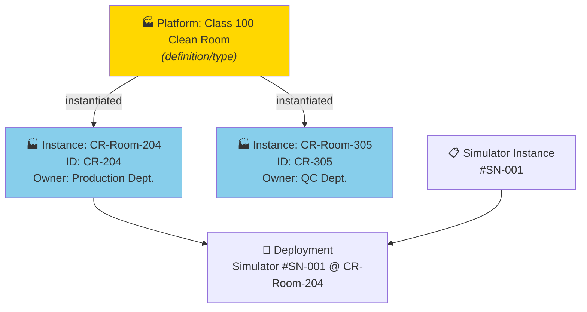
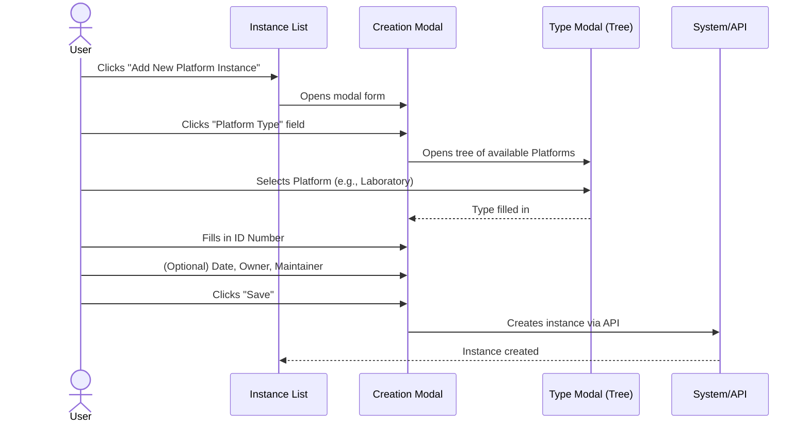
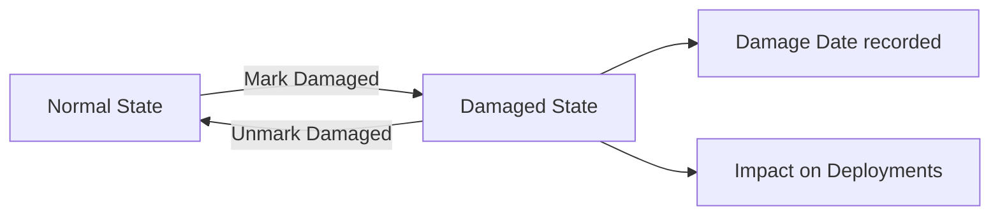
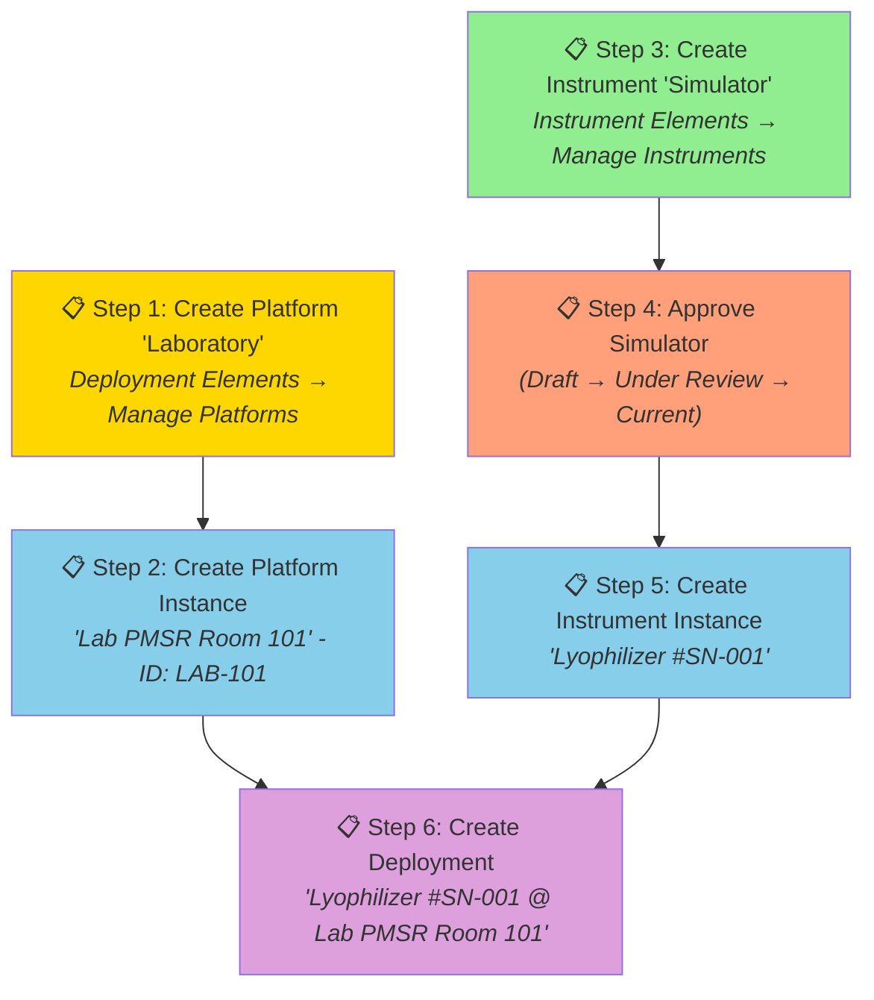

# Manual 6 - How to Create and Edit Platform / Laboratory Instances

**Module:** DPL (Deployment)  
**PMSR Context:** Instances represent physical/concrete units of a Laboratory  
**Version:** 1.0 | March 2026

> 🌐 **Portuguese version available:** [Open Portuguese version](06-MANUAL-PLATFORM-LABORATORY-INSTANCES.md)

---

## Table of Contents

1. [Overview](#1-overview)
2. [What is a Platform / Laboratory Instance?](#2-what-is-a-platform--laboratory-instance)
3. [Prerequisites](#3-prerequisites)
4. [Accessing Instance Management](#4-accessing-instance-management)
5. [The Management Page (List)](#5-the-management-page-list)
6. [Creating a New Instance](#6-creating-a-new-instance)
7. [Editing an Instance](#7-editing-an-instance)
8. [Complete Scenario: From Laboratory to Deployment](#8-complete-scenario-from-laboratory-to-deployment)
9. [Field Reference](#9-field-reference)
10. [Troubleshooting](#10-troubleshooting)

---

## 1. Overview

A **Platform Instance** (or **Laboratory Instance** in PMSR) represents a **concrete physical unit** of a previously defined Platform. While the Platform is the "design" or "type" of the location/infrastructure, the Instance is the **actual, specific, and identifiable location**.

### Analogy

| Concept | Analogy |
|---------|---------|
| **Platform / Laboratory** | The *blueprint* of a laboratory type (e.g., "Class 100 Clean Room") |
| **Platform Instance** | A *concrete laboratory* of that type (e.g., "Clean Room - Bldg. B, Room 204, ID: CR-204") |

### Position in the Pipeline



> 📘 **Why create Instances?**
>
> In Manual 05, you created a **Platform/Laboratory** - this is the **model (definition)**, which describes the type of platform or laboratory. It's like the standard blueprint for a laboratory.
>
> An **Instance** is a **specific, concrete laboratory** of that model:
> - The model "Lyophilization Laboratory Type A" is defined **once**.
> - But you may have **2 physical laboratories** of that type: one in Building B, Room 203 and another in Building D, Room 105.
>
> Each instance has its own **location**, **responsible person**, and can receive **deployments** (association of instrument/simulator instances).
>
> **Analogy:** The model is like the type of classroom (e.g., "Chemistry Laboratory"). The instance is the specific room (e.g., "Chemistry Lab, Block C, Room 301").

---

## 2. What is a Platform / Laboratory Instance?

A Platform Instance records:
- **Reference to the type** of Platform (the design/category)
- **Identification number** (unique ID of the location)
- **Acquisition/creation date**
- **Owner** (organization)
- **Maintenance responsible** (maintainer)
- **Status** (operational or damaged)
- **Operational description**

### Relationship with Deployments



---

## 3. Prerequisites

| Prerequisite | Required? | Description |
|-------------|-----------|-------------|
| **Platform / Laboratory defined** | **Yes** | The Platform must exist in the system. See 🔗 [Platforms/Laboratories Manual](05-MANUAL-PLATFORMS-LABORATORIES-EN.md) |
| **Instrument/Simulator Instance** | For deploy | Only needed to create Deployments. See 🔗 [Instrument Instances Manual](04-MANUAL-INSTRUMENT-SIMULATOR-INSTANCES-EN.md) |

---

## 4. Accessing Instance Management

### Navigation Path

```
Main Menu → Deployment Elements → Manage Elements → Manage Platform Instances
```

**Direct URL:** `https://www.pmsr.net/dpl/select/platforminstance/1/9`

### Steps:

📋 **Step 1.** In the navigation bar, click on **"Deployment Elements"**.

📋 **Step 2.** Hover over **"Manage Elements"**.

📋 **Step 3.** Click on **"Manage Platform Instances"**.

---

## 5. The Management Page (List)

### View Modes

| Button | Description |
|--------|-------------|
| **Table View** | Table view (recommended for management) |
| **Card View** | Card view with a more compact layout |

### Table Columns

| Column | Description |
|--------|-------------|
| **URI** | Unique identifier of the instance |
| **Type** | Source Platform type |
| **ID Number** | Location identification number |
| **Label** | Automatically generated name |
| **Owner** | Owning organization |
| **Status** | Operational status |

### Action Buttons

| Button | Function |
|--------|----------|
| **Add New Platform Instance** | Opens the creation form (modal) |
| **Back** | Returns to the previous page |
| **Load More** | Loads more items (card view) |

---

## 6. Creating a New Instance

> 🔐 **Required permission:** Creating instances requires an authenticated user.

### Creation Sequence



### Detailed Steps

📋 **Step 1.** On the management page, click **"Add New Platform Instance"**.

📋 **Step 2.** A **modal form** (overlay window) opens.

📋 **Step 3.** Fill in the fields:

#### Creation Form Fields

| Field | Type | Required | Detailed Description |
|-------|------|----------|---------------------|
| **Platform Type** | Modal selection (tree) | **Yes** | The Platform that this instance materializes. Click to open the tree of Platforms defined in the system. Select the appropriate Platform type. **PMSR Example:** Select "Class 100 Clean Room" or "Simulation Laboratory". |
| **ID Number** | Text field | **Yes** | Unique identifier for this instance/location. Must allow unambiguous identification. **Examples:** "ROOM-101", "CR-204", "LAB-PMSR-01", "LP3-EAST". Use a consistent naming convention within your organization. |
| **Acquisition Date** | Date picker | No | Date of inauguration, acquisition, or start of operation of the location. Click the field to open the calendar and select the date. |
| **Owner** | Autocomplete field | No | Owning organization or entity responsible for the location. Start typing the organization name and select from the list. **Example:** "PMSR Production Department". |
| **Maintainer** | Autocomplete field | No | Person responsible for maintenance and management of the space. Start typing the name and select from the list. |
| **Description** | Text area | No | Additional information: exact location (building, floor, wing), capacity, special conditions (controlled temperature, pressure, classification), operating hours, access restrictions, etc. |

📋 **Step 4.** Click **"Save"**.

📋 **Step 5.** The instance is created with:
- **URI** automatically generated
- **Label** automatically set: `"[Type] with #ID ([ID Number])"`
  - Example: "Class 100 Clean Room with #ID (CR-204)"
- **Version** = 1

### Platform Type Selection (Modal)

When clicking the type field, the modal shows the available Platforms:

```
Available Platforms
├── 🏭 Laboratory - PMSR Simulation Laboratory
├── 🏭 Class 100 Clean Room
├── 🏭 Production Line LP-3
├── 🏭 Main Control Station
└── ...
```

Select the appropriate Platform by clicking on it.

---

## 7. Editing an Instance

> 🔐 **Required permission:** Creating instances requires an authenticated user.

### How to Access

📋 **Step 1.** In the instance list, select the instance to edit.

📋 **Step 2.** Click the edit button.

### Edit Form

All creation fields are available for editing, plus additional fields:

| Field | Editable? | Notes |
|-------|-----------|-------|
| **Platform Type** | Yes | You can change the Platform type |
| **ID Number** | Yes | You can correct the identifier |
| **Acquisition Date** | Yes | |
| **Owner** | Yes | |
| **Maintainer** | Yes | |
| **Description** | Yes | |
| **Damaged** | Yes | Checkbox to mark damage status |
| **Damage Date** | Conditional | Only visible when Damaged is checked |

### Marking as Damaged

If the location/equipment suffers damage:

📋 **Step 1.** Open the edit form for the instance.

📋 **Step 2.** Check the **"Damaged"** checkbox.

📋 **Step 3.** The **"Damage Date"** field appears. Select the date when the damage occurred.

📋 **Step 4.** (Optional) Update the **Description** with details about the damage.

📋 **Step 5.** Click **"Save"**.



> ⚠️ **Impact:** Marking a Platform Instance as damaged may affect active Deployments at that location. Check the associated Deployments before making this change.

---

## 8. Complete Scenario: From Laboratory to Deployment

> 🔐 **Required permission:** Deployment management may require additional permissions beyond the basic authenticated user.

This scenario demonstrates the complete flow for a PMSR user, from defining a Laboratory to Deploying a Simulator at that location.

### Scenario Steps



| Step | Action | Reference Manual |
|------|--------|-----------------|
| 1 | Create Platform "Laboratory" | 🔗 [Platforms Manual](05-MANUAL-PLATFORMS-LABORATORIES-EN.md) (this manual, section 5) |
| 2 | Create Platform Instance "Lab PMSR Room 101" | This manual, [section 6](#6-creating-a-new-instance) |
| 3 | Create Instrument/Simulator | 🔗 [Instruments Manual](01-MANUAL-INSTRUMENTS-SIMULATORS-EN.md) |
| 4 | Submit and approve the Simulator | 🔗 [Instruments Manual](01-MANUAL-INSTRUMENTS-SIMULATORS-EN.md), sections 7-8 |
| 5 | Create Instrument Instance | 🔗 [Instrument Instances Manual](04-MANUAL-INSTRUMENT-SIMULATOR-INSTANCES-EN.md) |
| 6 | Create Deployment | 🔗 [Instrument Instances Manual](04-MANUAL-INSTRUMENT-SIMULATOR-INSTANCES-EN.md), section 8 |

### Final Result

After completing all steps:

```
🔗 Deployment: "Lyophilizer LF-2000 #SN-001 @ Lab PMSR Room 101"
├── 📋 Simulator Instance: Lyophilizer #SN-001
│   └── 🧪 Simulator: Lyophilizer LF-2000 v2 (Current)
│       ├── ⚙️ Component: Inlet Temperature (Slot #1)
│       ├── ⚙️ Component: Chamber Pressure (Slot #2)
│       └── ⚙️ Component: Control Valve (Slot #3)
└── 🏭 Platform Instance: Lab PMSR Room 101 (LAB-101)
    └── 🏭 Platform: PMSR Simulation Laboratory
```

---

## 9. Field Reference

### Creation Form

| Field | Technical Name | Type | Required | Default Value | Description |
|-------|---------------|------|----------|---------------|-------------|
| Platform Type | `instance_type` | Modal textfield | Yes | (empty) | Source Platform |
| ID Number | `instance_serial_number` | Textfield | Yes | (empty) | Unique identifier |
| Acquisition Date | `instance_acquisition_date` | Date | No | (empty) | Acquisition/inauguration date |
| Owner | `instance_owner` | Textfield + autocomplete | No | (empty) | Owning organization |
| Maintainer | `instance_maintainer` | Textfield + autocomplete | No | (empty) | Responsible person |
| Description | `instance_description` | Textarea | No | (empty) | Operational description |

### Edit Form - Additional Fields

| Field | Technical Name | Type | Description |
|-------|---------------|------|-------------|
| Damaged | `instance_damaged` | Checkbox | Indicates whether the location is damaged |
| Damage Date | `instance_damage_date` | Date | Date of damage (conditional) |

---

## 10. Troubleshooting

| Problem | Possible Cause | Solution |
|---------|---------------|----------|
| I cannot find the Platform I need in the type selection | The Platform has not been created yet | Create the Platform first: 🔗 [Platforms Manual](05-MANUAL-PLATFORMS-LABORATORIES-EN.md) |
| The Owner/Maintainer field does not show suggestions | Social module not active or no registered organizations | Contact the administrator |
| I want to associate a Simulator to this instance | You need to create a Deployment | Use *Manage Deployments* and follow the instructions in 🔗 [Instrument Instances Manual](04-MANUAL-INSTRUMENT-SIMULATOR-INSTANCES-EN.md), section 8 |
| I marked as Damaged by mistake | - | Open the edit form, uncheck the Damaged checkbox and Save |
| I cannot see Platform Instances | There may be no instances created | Create the first instance with "Add New Platform Instance" |
| The form appears too small | Normal behavior - instances use a modal | The modal form is compact by design |

---

🔗 **Related Manuals:**
- [Platforms/Laboratories Manual](05-MANUAL-PLATFORMS-LABORATORIES-EN.md) - Prerequisite: define the Platform
- [Instruments/Simulators Manual](01-MANUAL-INSTRUMENTS-SIMULATORS-EN.md) - To define the Instruments to install
- [Instrument/Simulator Instances Manual](04-MANUAL-INSTRUMENT-SIMULATOR-INSTANCES-EN.md) - To create Instrument Instances and Deployments
- [Manuals Index](INDEX-EN.md)

---

*PMSR Working Group - March 2026*
