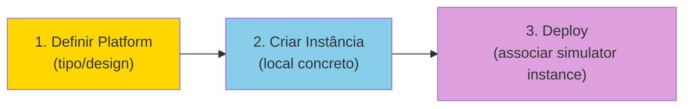
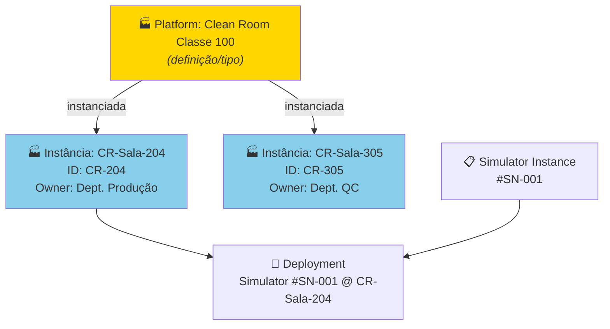
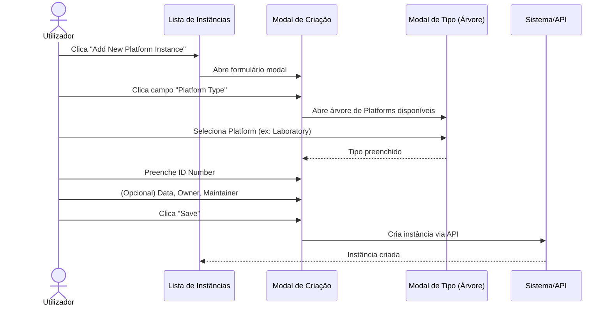
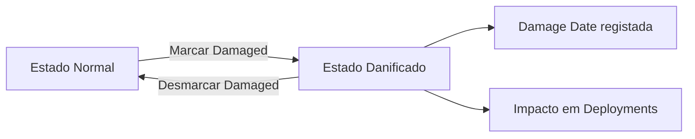
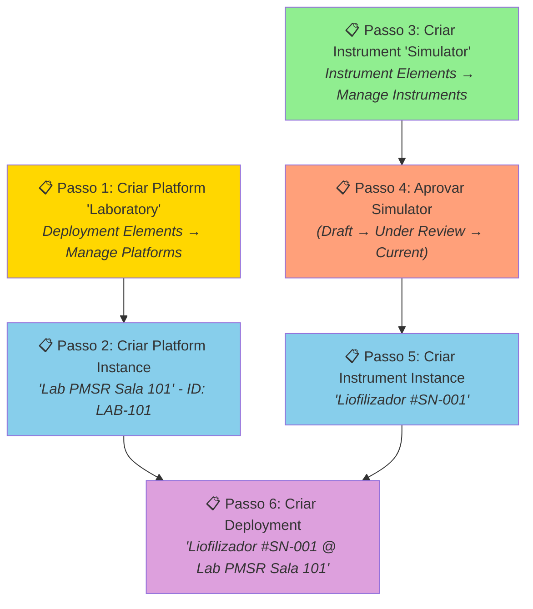

# Manual 6 - Como Criar e Editar Instâncias de Platforms / Laboratories

**Módulo:** DPL (Deployment)  
**Contexto PMSR:** Instâncias representam unidades físicas/concretas de um Laboratory  
**Versão:** 1.0 | Março 2026

> 🌐 **Versão em inglês disponível:** [Open English version](06-MANUAL-PLATFORM-LABORATORY-INSTANCES-EN.md)

---

## Índice

1. [Visão Geral](#1-visão-geral)
2. [O que é uma Instância de Platform / Laboratory?](#2-o-que-é-uma-instância-de-platform--laboratory)
3. [Pré-requisitos](#3-pré-requisitos)
4. [Aceder à Gestão de Instâncias](#4-aceder-à-gestão-de-instâncias)
5. [A Página de Gestão (Lista)](#5-a-página-de-gestão-lista)
6. [Criar uma Nova Instância](#6-criar-uma-nova-instância)
7. [Editar uma Instância](#7-editar-uma-instância)
8. [Cenário Completo: Do Laboratório ao Deployment](#8-cenário-completo-do-laboratório-ao-deployment)
9. [Referência de Campos](#9-referência-de-campos)
10. [Resolução de Problemas](#10-resolução-de-problemas)

---

## 1. Visão Geral

Uma **Instância de Platform** (ou **Instância de Laboratory** no PMSR) representa uma **unidade física concreta** de uma Platform previamente definida. Enquanto a Platform é o "design" ou "tipo" do local/infraestrutura, a Instância é o **local real, específico e identificável**.

### Analogia

| Conceito | Analogia |
|----------|----------|
| **Platform / Laboratory** | O *projeto* de um tipo de laboratório (ex: "Clean Room Classe 100") |
| **Instância de Platform** | Um *laboratório concreto* desse tipo (ex: "Clean Room - Edif. B, Sala 204, ID: CR-204") |

### Posição no Pipeline



> 📘 **Porquê criar Instâncias?**
> 
> No Manual 05, criou uma **Platform/Laboratory** - este é o **modelo (definição)**, que descreve o tipo de plataforma ou laboratório. É como a planta-tipo de um laboratório.
> 
> Uma **Instância** é um **laboratório concreto e específico** desse modelo:
> - O modelo "Laboratório de Liofilização Tipo A" é definido **uma vez**.
> - Mas pode ter **2 laboratórios físicos** desse tipo: um no Edifício B, Sala 203 e outro no Edifício D, Sala 105.
> 
> Cada instância tem a sua própria **localização**, **responsável** e pode receber **deployments** (associação de instâncias de instrumentos/simuladores).
> 
> **Analogia:** O modelo é como o tipo de sala de aula (ex: "Laboratório de Química"). A instância é a sala específica (ex: "Lab Química, Bloco C, Sala 301").

---

## 2. O que é uma Instância de Platform / Laboratory?

Uma Instância de Platform regista:
- **Referência ao tipo** de Platform (o design/categoria)
- **Número de identificação** (ID único do local)
- **Data de aquisição/criação**
- **Proprietário** (organização)
- **Responsável pela manutenção**
- **Estado** (operacional ou danificado)
- **Descrição** operacional

### Relação com Deployments



---

## 3. Pré-requisitos

| Pré-requisito | Obrigatório? | Descrição |
|---------------|-------------|-----------|
| **Platform / Laboratory definida** | **Sim** | A Platform deve existir no sistema. Ver 🔗 [Manual de Platforms/Laboratories](05-MANUAL-PLATFORMS-LABORATORIES.md) |
| **Instrument/Simulator Instance** | Para deploy | Necessária apenas para criar Deployments. Ver 🔗 [Manual de Instrument Instances](04-MANUAL-INSTRUMENT-SIMULATOR-INSTANCES.md) |

---

## 4. Aceder à Gestão de Instâncias

### Caminho de Navegação

```
Menu Principal → Deployment Elements → Manage Elements → Manage Platform Instances
```

**URL direto:** `https://www.pmsr.net/dpl/select/platforminstance/1/9`

### Passos:

📋 **Passo 1.** Na barra de navegação, clique em **"Deployment Elements"**.

📋 **Passo 2.** Passe o cursor sobre **"Manage Elements"**.

📋 **Passo 3.** Clique em **"Manage Platform Instances"**.

---

## 5. A Página de Gestão (Lista)

### Modos de Visualização

| Botão | Descrição |
|-------|-----------|
| **Table View** | Vista em tabela (recomendado para gestão) |
| **Card View** | Vista em cartões com visual mais compacto |

### Colunas da Tabela

| Coluna | Descrição |
|--------|-----------|
| **URI** | Identificador único da instância |
| **Type** | Tipo de Platform de origem |
| **ID Number** | Número de identificação do local |
| **Label** | Nome gerado automaticamente |
| **Owner** | Organização proprietária |
| **Status** | Estado operacional |

### Botões de Ação

| Botão | Função |
|-------|--------|
| **Add New Platform Instance** | Abre formulário de criação (modal) |
| **Back** | Volta à página anterior |
| **Load More** | Carrega mais itens (vista de cartões) |

---

## 6. Criar uma Nova Instância

> 🔐 **Permissão necessária:** A criação de instâncias requer um utilizador autenticado.

### Sequência de Criação



### Passos Detalhados

📋 **Passo 1.** Na página de gestão, clique em **"Add New Platform Instance"**.

📋 **Passo 2.** Um **formulário modal** (janela sobreposta) abre-se.

📋 **Passo 3.** Preencha os campos:

#### Campos do Formulário de Criação

| Campo | Tipo | Obrigatório | Descrição Detalhada |
|-------|------|-------------|---------------------|
| **Platform Type** | Seleção por modal (árvore) | **Sim** | A Platform que esta instância materializa. Clique para abrir a árvore de Platforms definidas no sistema. Selecione o tipo de Platform adequado. **Exemplo PMSR:** Selecione "Clean Room Classe 100" ou "Laboratório de Simulação". |
| **ID Number** | Campo de texto | **Sim** | Identificador único desta instância/local. Deve permitir identificação inequívoca. **Exemplos:** "SALA-101", "CR-204", "LAB-PMSR-01", "LP3-EAST". Use uma convenção consistente na sua organização. |
| **Acquisition Date** | Seletor de data | Não | Data de inauguração, aquisição ou início de operação do local. Clique no campo para abrir o calendário e selecione a data. |
| **Owner** | Campo com autocomplete | Não | Organização proprietária ou responsável pelo local. Comece a escrever o nome da organização e selecione da lista. **Exemplo:** "Departamento de Produção PMSR". |
| **Maintainer** | Campo com autocomplete | Não | Pessoa responsável pela manutenção e gestão do espaço. Comece a escrever o nome e selecione da lista. |
| **Description** | Área de texto | Não | Informações adicionais: localização exata (edifício, andar, ala), capacidade, condições especiais (temperatura controlada, pressão, classificação), horário de funcionamento, restrições de acesso, etc. |

📋 **Passo 4.** Clique em **"Save"**.

📋 **Passo 5.** A instância é criada com:
- **URI** gerado automaticamente
- **Label** automático: `"[Tipo] com #ID ([ID Number])"`
  - Exemplo: "Clean Room Classe 100 com #ID (CR-204)"
- **Versão** = 1

### Seleção do Platform Type (Modal)

Ao clicar no campo de tipo, a modal mostra as Platforms disponíveis:

```
Platforms Disponíveis
├── 🏭 Laboratory - Laboratório de Simulação PMSR
├── 🏭 Clean Room Classe 100
├── 🏭 Linha de Produção LP-3
├── 🏭 Estação de Controlo Principal
└── ...
```

Selecione a Platform adequada clicando sobre ela.

---

## 7. Editar uma Instância

> 🔐 **Permissão necessária:** A criação de instâncias requer um utilizador autenticado.

### Como aceder

📋 **Passo 1.** Na lista de instâncias, selecione a instância a editar.

📋 **Passo 2.** Clique no botão de edição.

### Formulário de Edição

Todos os campos da criação estão disponíveis para edição, mais campos adicionais:

| Campo | Editável? | Notas |
|-------|-----------|-------|
| **Platform Type** | Sim | Pode alterar o tipo de Platform |
| **ID Number** | Sim | Pode corrigir o identificador |
| **Acquisition Date** | Sim | |
| **Owner** | Sim | |
| **Maintainer** | Sim | |
| **Description** | Sim | |
| **Damaged** | Sim | Checkbox para marcar estado de dano |
| **Damage Date** | Condicional | Visível apenas quando Damaged está marcado |

### Marcar como Danificado

Se o local/equipamento sofrer danos:

📋 **Passo 1.** Abra o formulário de edição da instância.

📋 **Passo 2.** Marque a checkbox **"Damaged"**.

📋 **Passo 3.** O campo **"Damage Date"** aparece. Selecione a data em que o dano ocorreu.

📋 **Passo 4.** (Opcional) Atualize a **Description** com detalhes sobre o dano.

📋 **Passo 5.** Clique em **"Save"**.



> ⚠️ **Impacto:** Marcar uma Platform Instance como danificada pode afetar os Deployments ativos nesse local. Verifique os Deployments associados antes de efetuar esta alteração.

---

## 8. Cenário Completo: Do Laboratório ao Deployment

> 🔐 **Permissão necessária:** A gestão de deployments pode requerer permissões adicionais além do utilizador autenticado básico.

Este cenário demonstra o fluxo completo para um utilizador PMSR, desde a definição de um Laboratory até ao Deployment de um Simulator nesse local.

### Passos do Cenário



| Passo | Ação | Manual de Referência |
|-------|------|---------------------|
| 1 | Criar Platform "Laboratory" | 🔗 [Manual de Platforms](05-MANUAL-PLATFORMS-LABORATORIES.md) (este manual, secção 5) |
| 2 | Criar Platform Instance "Lab PMSR Sala 101" | Este manual, [secção 6](#6-criar-uma-nova-instância) |
| 3 | Criar Instrument/Simulator | 🔗 [Manual de Instruments](01-MANUAL-INSTRUMENTS-SIMULATORS.md) |
| 4 | Submeter e aprovar o Simulator | 🔗 [Manual de Instruments](01-MANUAL-INSTRUMENTS-SIMULATORS.md), secções 7-8 |
| 5 | Criar Instrument Instance | 🔗 [Manual de Instrument Instances](04-MANUAL-INSTRUMENT-SIMULATOR-INSTANCES.md) |
| 6 | Criar Deployment | 🔗 [Manual de Instrument Instances](04-MANUAL-INSTRUMENT-SIMULATOR-INSTANCES.md), secção 8 |

### Resultado Final

Após completar todos os passos:

```
🔗 Deployment: "Liofilizador LF-2000 #SN-001 @ Lab PMSR Sala 101"
├── 📋 Simulator Instance: Liofilizador #SN-001
│   └── 🧪 Simulator: Liofilizador LF-2000 v2 (Current)
│       ├── ⚙️ Component: Temperatura de Entrada (Slot #1)
│       ├── ⚙️ Component: Pressão da Câmara (Slot #2)
│       └── ⚙️ Component: Válvula de Controlo (Slot #3)
└── 🏭 Platform Instance: Lab PMSR Sala 101 (LAB-101)
    └── 🏭 Platform: Laboratory de Simulação PMSR
```

---

## 9. Referência de Campos

### Formulário de Criação

| Campo | Nome Técnico | Tipo | Obrigatório | Valor Padrão | Descrição |
|-------|-------------|------|-------------|--------------|-----------|
| Platform Type | `instance_type` | Modal textfield | Sim | (vazio) | Platform de origem |
| ID Number | `instance_serial_number` | Textfield | Sim | (vazio) | Identificador único |
| Acquisition Date | `instance_acquisition_date` | Date | Não | (vazio) | Data de aquisição/inauguração |
| Owner | `instance_owner` | Textfield + autocomplete | Não | (vazio) | Organização proprietária |
| Maintainer | `instance_maintainer` | Textfield + autocomplete | Não | (vazio) | Pessoa responsável |
| Description | `instance_description` | Textarea | Não | (vazio) | Descrição operacional |

### Formulário de Edição - Campos Adicionais

| Campo | Nome Técnico | Tipo | Descrição |
|-------|-------------|------|-----------|
| Damaged | `instance_damaged` | Checkbox | Indica se o local está danificado |
| Damage Date | `instance_damage_date` | Date | Data do dano (condicional) |

---

## 10. Resolução de Problemas

| Problema | Causa Possível | Solução |
|----------|----------------|---------|
| Não encontro a Platform que preciso na seleção de tipo | A Platform ainda não foi criada | Crie a Platform primeiro: 🔗 [Manual de Platforms](05-MANUAL-PLATFORMS-LABORATORIES.md) |
| O campo Owner/Maintainer não mostra sugestões | Módulo Social não ativo ou sem organizações registadas | Contacte o administrador |
| Quero associar um Simulator a esta instância | Precisa de criar um Deployment | Use *Manage Deployments* e siga as instruções na 🔗 [Manual de Instrument Instances](04-MANUAL-INSTRUMENT-SIMULATOR-INSTANCES.md), secção 8 |
| Marquei como Damaged por engano | - | Abra a edição, desmarque a checkbox Damaged e Save |
| Não consigo ver Platform Instances | Pode não ter instâncias criadas | Crie a primeira instância com "Add New Platform Instance" |
| O formulário aparece muito pequeno | Comportamento normal - instâncias usam modal | O formulário modal é compacto por design |

---

🔗 **Manuais Relacionados:**
- [Manual de Platforms/Laboratories](05-MANUAL-PLATFORMS-LABORATORIES.md) - Pré-requisito: definir a Platform
- [Manual de Instruments/Simulators](01-MANUAL-INSTRUMENTS-SIMULATORS.md) - Para definir os Instruments a instalar
- [Manual de Instrument/Simulator Instances](04-MANUAL-INSTRUMENT-SIMULATOR-INSTANCES.md) - Para criar Instâncias de Instruments e Deployments
- [Índice de Manuais](INDEX.md)

---

*Documento do Grupo de Trabalho PMSR - Março 2026*
