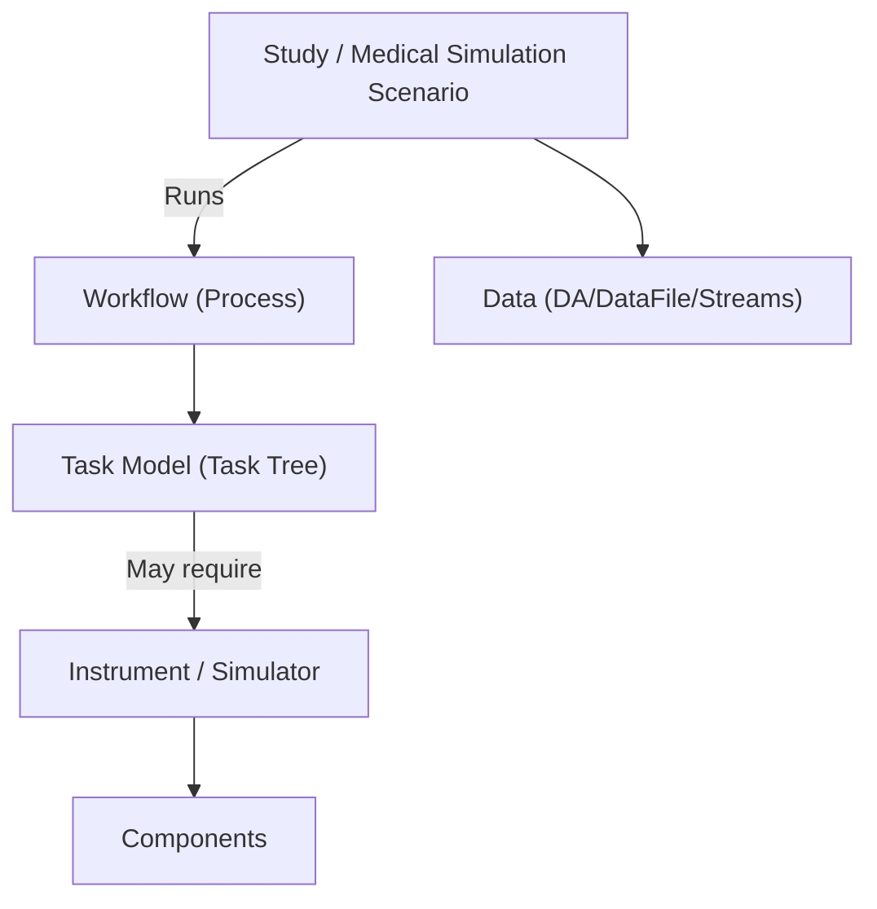
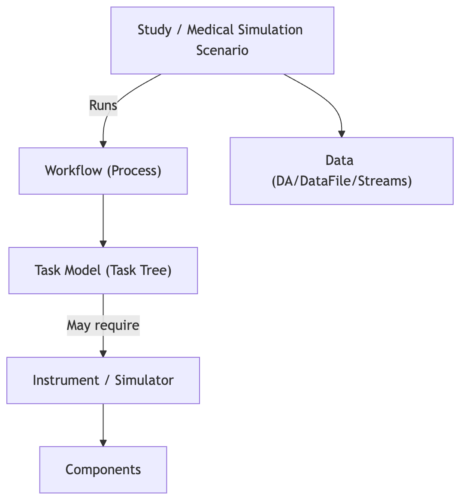
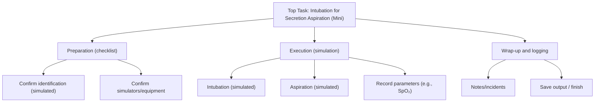
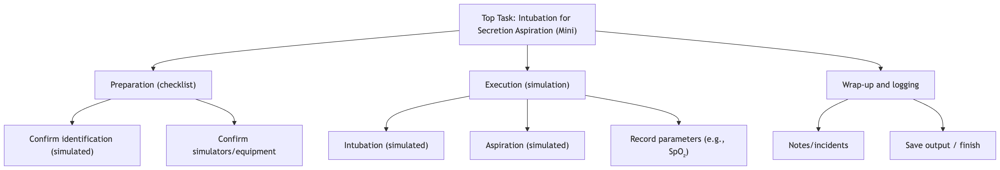

# Manual 7 - How to Create and Use Medical Simulation Scenarios (Studies)

**Module:** STD (Study Elements)  
**PMSR Context:** In PMSR, the technical element **Study** is presented as a **"Medical Simulation Scenario"**  
**Version:** 2.0 | April 2026

> 🌐 **Portuguese version available:** [Open Portuguese version](07-MANUAL-STUDIES-SIMULATION-SCENARIOS.md)

---

## Table of Contents

1. [Overview](#1-overview)
2. [Terminology and Key Concepts](#2-terminology-and-key-concepts)
3. [Accessing Scenario (Study) Management](#3-accessing-scenario-study-management)
4. [The Management Page (List)](#4-the-management-page-list)
5. [Creating a New Scenario](#5-creating-a-new-scenario)
6. [Editing a Scenario](#6-editing-a-scenario)
7. [Managing Scenario Elements (Manage Elements)](#7-managing-scenario-elements-manage-elements)
8. [Associating and Running a Workflow in a Scenario](#8-associating-and-running-a-workflow-in-a-scenario)
9. [Troubleshooting](#9-troubleshooting)

---

## 1. Overview

A **Medical Simulation Scenario** (technically, a **Study**) is the entity that represents the *context of a study/simulation* inside PMSR.

In practice, a Scenario is used to:
- Organize and contextualize simulation resources and data
- Aggregate “objects of interest” (e.g., **Object Collections**, **Virtual Columns**, **Roles**)
- Act as the entry point to run an associated **Workflow** (process)

> 🔗 This manual explains how to create and manage Scenarios. To create and model Workflows (including the task editor/CTT), see 🔗 [Manual 8 - Workflows](08-MANUAL-WORKFLOWS-EN.md).

### Conceptual diagram (Scenario ↔ Workflow)




> _PNG equivalent of the Mermaid diagram above. Place the file with this name under docs/images/diagrams/en/._

---

## 2. Terminology and Key Concepts

### Study vs. “Medical Simulation Scenario”

- **Study** is the technical name (API/code) of the entity.
- **Medical Simulation Scenario** is the functional/semantic name shown in PMSR via configuration (**Preferred Names**).

> **Note:** depending on the environment, menus may appear as **Study Elements → Manage Studies** or as **Scenario(s) → Manage Scenarios**. In this manual we use **Study/Scenario** to avoid ambiguity.

### What a Scenario contains (high level)

A Scenario aggregates multiple sub-elements that structure the simulation “world”:
- **Object Collections (SOCs)**: study object collections
- **Virtual Columns (Entities)**: relevant entities/virtual columns for the study
- **Roles**: study roles (may be limited/disabled in some deployments)
- **Streams, STR, Data Files**: data flows and files associated to the study

### How a Scenario uses a Workflow

A **Workflow** describes the *process* (steps/tasks) to be executed. In PMSR:
- The Workflow is created/managed in **Workflows** (STD)
- The Workflow “task model” is edited in the **CTT Workflow Editor**
- When running, the Scenario opens the editor in **Execution** mode to collect answers/values

---

## 3. Accessing Scenario (Study) Management

### Navigation Path

```
Main Menu → Study Elements → Manage Elements → Manage Studies
```

**Direct URL (list):** `https://www.pmsr.net/std/select/study/1/9`

---

## 4. The Management Page (List)

The **Manage Studies** page shows the Scenarios maintained by your user.

### View Modes

| Button | Description |
|--------|-------------|
| **Table View** | Table view with per-row columns and action buttons |
| **Card View** | Card view for more visual navigation |

### Available actions (Table View)

Typically, each row provides:
- **View**: opens the Scenario description page (URI)
- **Edit**: opens the Scenario edit form
- **Manage Elements**: opens the “Manage Study Elements” dashboard
- **Delete**: deletes the Scenario (requires confirmation)

> ⚠️ **Warning:** deleting a Scenario may affect data and associations (streams/data files). Use only if you are sure.

---

## 5. Creating a New Scenario

### Creation sequence (summary)

📋 **Step 1.** Open **Manage Studies**.

📋 **Step 2.** Click **Add New Study** (or equivalent via Preferred Names).

📋 **Step 3.** Fill in the fields and click **Save**.

**Direct URL (create):** `https://www.pmsr.net/std/manage/addstudy`

### Form fields

| Field | Type | Required | Description |
|------|------|----------|-------------|
| **Short Name** | Text | **Yes** | Scenario short name (e.g., internal code, acronym). Commonly used in lists. |
| **Long Name** | Text | **Yes** | Long, descriptive scenario name. |
| **PI** | Text | No | Principal investigator / responsible person (may be plain text depending on configuration). |
| **Institution** | Text with autocomplete | No | Organization associated with the Scenario. Suggestions come from the social registry (organization). |
| **Description** | Long text | No | Scenario context description. |

### Image and Web Document (optional)

Like other PMSR modules, a Scenario can have:
- **Image Type**: `URL` or `Upload`
- **Web Document Type**: `URL` or `Upload`

📋 **Step 4 (optional).** If you choose **Upload**, upload the file and keep it selected until you save.

> ⚠️ **Typical limits:** PNG/JPG (image) and PDF/DOC/DOCX/TXT/XLS/XLSX (document), up to 2MB.

---

## 6. Editing a Scenario

📋 **Step 1.** In the Scenario list, click **Edit** on the desired Scenario.

📋 **Step 2.** Update the relevant fields.

📋 **Step 3.** Click **Save/Update** (depending on the environment).

### Changing Image/Document

- If the Scenario already has an uploaded file and you upload a new one, PMSR replaces the previous file.
- If you select **URL**, the system stores the link.

> 💡 If **View Image / View Document** buttons are available, you can preview before saving.

---

## 7. Managing Scenario Elements (Manage Elements)

The **Manage Study Elements** page is the Scenario “dashboard”.

📋 **How to access:** from the Scenario list (Table View), click **Manage Elements**.

**Technical URL pattern:** `https://www.pmsr.net/std/manage/managestudy/{studyuri}`  
> Note: `{studyuri}` is passed Base64-encoded by the UI.

### 7.1 Scenario summary

At the top, a summary card shows:
- Scenario **URI**
- **Name** (Long Name)
- **PI**, **Institution**, **Description**

### 7.2 Objects of Interest

This section (usually an accordion) provides shortcuts to:
- **Manage Object Collections** (SOCs)
- **Manage Virtual Columns** (Entities)
- **Manage Roles** (may be disabled/limited)

> 🔗 These areas are used to structure the Scenario. In simulation deployments, they can be prerequisites for execution or for ingesting/organizing data.

### 7.3 Streams, STR, Publications, Media

Depending on the environment, the Scenario page may include cards and AJAX tables for:
- **Streams**
- **STR**
- **Publications**
- **Media**

> 💡 If your immediate goal is simulation execution, the most critical section is usually **Workflow Executions**.

### 7.4 Workflow Executions

There is a **Workflow Executions** section (or equivalent via Preferred Names) containing a card that starts an execution.

- **Create Execution** opens a new tab and starts the execution flow

---

## 8. Associating and Running a Workflow in a Scenario

This is the part that “connects” Scenarios (Studies) to Workflows.

### 8.1 Starting an execution

📋 **Step 1.** Open **Manage Study Elements** for the Scenario.

📋 **Step 2.** In **Workflow Executions**, click **Create Execution**.

This opens a page like:

`/ctt/execution/create/{studyuri}`

> Note: `{studyuri}` is Base64-encoded.

### 8.2 Selecting the Workflow (if prompted)

If the Scenario does not yet have a stored Workflow association (or the stored workflow is no longer valid), PMSR shows a selection form:

- **Workflow / Process** (dropdown)
- **Run** button
- **Cancel** button

📋 **Step 3.** Select the desired Workflow and click **Run**.

> ℹ️ PMSR stores the association **Scenario → Workflow** locally (in Drupal state), so future runs can reuse the selection without prompting.

If no Workflows are available, the page informs you to **create or ingest a workflow** first (see 🔗 [Manual 8 - Workflows](08-MANUAL-WORKFLOWS-EN.md)).

### 8.3 Running in the CTT Workflow Editor (Execution mode)

After selecting the Workflow, the system opens the **CTT Workflow Editor** with:
- the selected Workflow
- the current Scenario (Study)
- **execution** mode

In execution mode, the goal is to **follow the task tree** and **record answers/values** according to the model.

> ⚠️ **Permissions:** to open the editor, the user needs the **access ctt editor** permission. If you see “Access denied”, contact an administrator.

### 8.4 Saving and downloading results (output)

In environments where execution output is enabled, the editor may allow:
- Saving an execution summary/output into a **DA/DataFile** (e.g., a CSV file)
- Downloading the generated file

> ℹ️ Generated files typically follow a naming convention like `DA-XXXXXX.csv` and are associated to the Scenario.

### 8.5 End-to-end example (mini): “Intubation for secretion aspiration”

⚠️ **Safety note (important):** this example is only meant to demonstrate **how to model and execute** a Workflow in PMSR/CTT for a **simulation** context. It is **not** a clinical protocol and must not be used as medical guidance.

**Goal (in PMSR):**
- Create a small “mini” Workflow with a few tasks
- Create a Scenario (Study)
- Run the Workflow in the Scenario context and **save an output** (e.g., a DataFile/DA)

#### A) Create the Workflow (metadata)

📋 **Step 1.** Go to **Manage Workflows**.

📋 **Step 2.** Click **Add New Workflow**.

📋 **Step 3.** Fill a minimal example (adjust to your environment):
- **Workflow Stem:** select an appropriate stem
- **Name:** `Intubation for Secretion Aspiration (Mini)`
- **Description:** (e.g., “Demo workflow for PMSR Scenario execution; mini version”)
- **Top Task Name:** `Intubation/Aspiration (Mini)`
- **Top Task Type:** select an applicable task type

📋 **Step 4.** Click **Save**.

> 🔗 For full Workflow creation/modeling details, see 🔗 [Manual 8 - Workflows](08-MANUAL-WORKFLOWS-EN.md).

#### B) Model the structure in CTT (mini)

📋 **Step 5.** Open the Workflow in the **Model Task Editor** (CTT) and create a simple tree like:




> _PNG equivalent of the Mermaid diagram above. Place the file with this name under docs/images/diagrams/en/._

> ℹ️ If your CTT editor supports attaching **Required Instruments/Simulators** to tasks, use examples like “**Vital Signs Monitor**” and “**Aspiration System Checklist**” (or the equivalent resources in your environment).

#### C) Create the Scenario and run

📋 **Step 6.** Create a Scenario under **Manage Studies** (e.g., Short Name `INT-ASP-MINI-01`).

📋 **Step 7.** Open **Manage Study Elements** for the Scenario.

📋 **Step 8.** In **Workflow Executions**, click **Create Execution**.

📋 **Step 9.** If prompted, select `Intubation for Secretion Aspiration (Mini)` and click **Run**.

📋 **Step 10.** In CTT (execution mode), go through the tasks and record values/notes according to your model.

📋 **Step 11.** At the end, if enabled in your environment, **save/export the output** (e.g., a `DA-XXXXXX.csv`) and confirm it is associated to the Scenario.

---

## 9. Troubleshooting

### “No workflows/processes were found for your user”

- No Workflows are available for your user.
- Fix: create a Workflow under **Manage Workflows** and try again (see 🔗 [Manual 8](08-MANUAL-WORKFLOWS-EN.md)).

### “Access denied” when opening the editor/execution

- Missing **access ctt editor** permission.
- Fix: ask an administrator to grant the appropriate permission/role.

### The Workflow list does not include what you expected

- Selection is based on Workflows maintained by your user (manager email).
- If another user created the Workflow, it may not appear.

### The “Create Execution” tab opens but the editor does not load

- This may indicate a failure to load the CTT editor bundle (JS) or misconfiguration.
- Fix: open the browser console and validate the CTT configuration with the technical team.

---

*Documentation created for the PMSR Working Group - April 2026*
