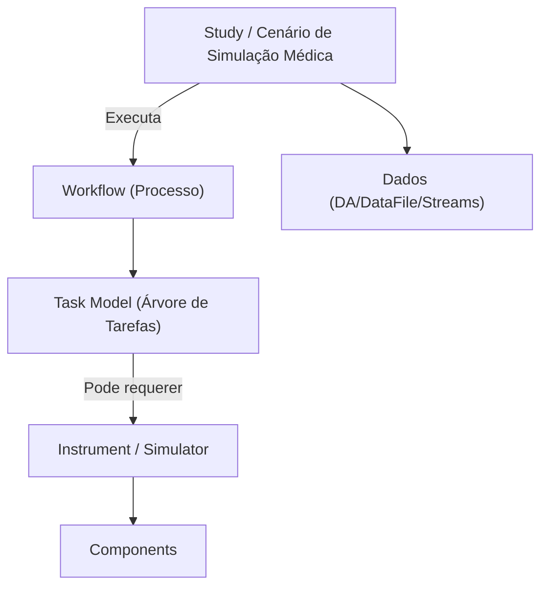
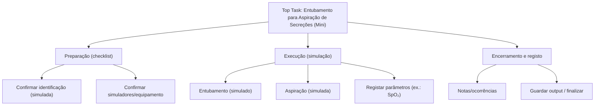

# Manual 7 - Como Criar e Utilizar Cenários de Simulação Médica (Studies)

**Módulo:** STD (Study Elements)  
**Contexto PMSR:** No PMSR, o elemento técnico **Study** é apresentado como **"Cenário de Simulação Médica"**  
**Versão:** 2.0 | Abril 2026

> 🌐 **Versão em inglês disponível:** [Open English version](07-MANUAL-STUDIES-SIMULATION-SCENARIOS-EN.md)

---

## Índice

1. [Visão Geral](#1-visão-geral)
2. [Terminologia e Conceitos-Chave](#2-terminologia-e-conceitos-chave)
3. [Aceder à Gestão de Cenários (Studies)](#3-aceder-à-gestão-de-cenários-studies)
4. [A Página de Gestão (Lista)](#4-a-página-de-gestão-lista)
5. [Criar um Novo Cenário](#5-criar-um-novo-cenário)
6. [Editar um Cenário](#6-editar-um-cenário)
7. [Gerir Elementos do Cenário (Manage Elements)](#7-gerir-elementos-do-cenário-manage-elements)
8. [Associar e Executar um Workflow no Cenário](#8-associar-e-executar-um-workflow-no-cenário)
9. [Resolução de Problemas](#9-resolução-de-problemas)

---

## 1. Visão Geral

Um **Cenário de Simulação Médica** (tecnicamente um **Study**) é a entidade que representa o *contexto de um estudo/simulação* dentro do PMSR.

Na prática, o Cenário serve para:
- Organizar e contextualizar recursos e dados de uma simulação
- Agregar “objetos de interesse” (ex.: **Object Collections**, **Virtual Columns**, **Roles**)
- Servir de ponto de entrada para executar um **Workflow** (processo) associado ao Cenário

> 🔗 Este manual explica como criar e gerir Cenários. Para criar e modelar Workflows (incluindo o editor de tarefas/CTT), consulte o 🔗 [Manual 8 - Workflows](08-MANUAL-WORKFLOWS.md).

### Diagrama conceptual (Cenário ↔ Workflow)



---

## 2. Terminologia e Conceitos-Chave

### Study vs. “Cenário de Simulação Médica”

- **Study** é o nome técnico (API/código) da entidade.
- **Cenário de Simulação Médica** é o nome funcional/semântico que aparece no PMSR por configuração (**Preferred Names**).

> **Nota:** dependendo do ambiente, os menus podem aparecer como **Study Elements → Manage Studies** ou como **Cenário(s) → Gerir Cenários**. Neste manual usamos a forma **Study/Cenário** para evitar ambiguidades.

### O que um Cenário contém (alto nível)

O Cenário agrega vários sub-elementos que dão estrutura ao “mundo” da simulação:
- **Object Collections (SOCs)**: coleções de objetos do estudo
- **Virtual Columns (Entities)**: entidades/colunas virtuais relevantes no estudo
- **Roles**: papéis no estudo (pode estar limitado/desativado em alguns ambientes)
- **Streams, STR, Data Files**: fluxos e ficheiros de dados associados

### Como o Cenário usa um Workflow

O **Workflow** descreve *o processo* (passos/tarefas) a executar. No PMSR:
- O Workflow é criado/gerido na lista de **Workflows** (STD)
- O “modelo de tarefas” do Workflow é editado no **CTT Workflow Editor**
- Ao executar, o Cenário abre o editor em modo de **Execution** (execução), para registo de respostas/valores

---

## 3. Aceder à Gestão de Cenários (Studies)

### Caminho de Navegação

```
Menu Principal → Study Elements → Manage Elements → Manage Studies
```

**URL direto (lista):** `https://www.pmsr.net/std/select/study/1/9`

---

## 4. A Página de Gestão (Lista)

A página **Manage Studies** apresenta os Cenários mantidos pelo seu utilizador.

### Modos de Visualização

| Botão | Descrição |
|-------|-----------|
| **Table View** | Vista em tabela com colunas e botões por linha |
| **Card View** | Vista em cartões para navegação mais visual |

### Ações disponíveis (Table View)

Em geral, cada linha apresenta:
- **View**: abre a página de descrição do Cenário (URI)
- **Edit**: abre o formulário de edição do Cenário
- **Manage Elements**: abre a página “Manage Study Elements” (gestão do Cenário)
- **Delete**: remove o Cenário (requer confirmação)

> ⚠️ **Atenção:** apagar um Cenário pode afetar dados e associações (streams/data files). Use apenas se tiver certeza.

---

## 5. Criar um Novo Cenário

### Sequência de criação (resumo)

📋 **Passo 1.** Aceda a **Manage Studies**.

📋 **Passo 2.** Clique em **Add New Study** (ou equivalente com Preferred Names).

📋 **Passo 3.** Preencha os campos e clique em **Save**.

**URL direto (criação):** `https://www.pmsr.net/std/manage/addstudy`

### Campos do Formulário

| Campo | Tipo | Obrigatório | Descrição |
|------|------|-------------|-----------|
| **Short Name** | Texto | **Sim** | Nome curto do Cenário (ex.: código interno, sigla). Usado frequentemente nas listas. |
| **Long Name** | Texto | **Sim** | Nome longo e descritivo do Cenário. |
| **PI** | Texto | Não | Investigador responsável (pode ser apenas texto, conforme configuração). |
| **Institution** | Texto com autocomplete | Não | Organização associada ao Cenário. Sugestões vêm do registo social (organization). |
| **Description** | Texto longo | Não | Descrição do contexto do Cenário. |

### Imagem e Documento (opcional)

Tal como noutros módulos do PMSR, o Cenário pode ter:
- **Image Type**: `URL` ou `Upload`
- **Web Document Type**: `URL` ou `Upload`

📋 **Passo 4 (opcional).** Se escolher **Upload**, carregue o ficheiro e mantenha-o selecionado até gravar.

> ⚠️ **Limites típicos:** PNG/JPG (imagem) e PDF/DOC/DOCX/TXT/XLS/XLSX (documento), até 2MB.

---

## 6. Editar um Cenário

📋 **Passo 1.** Na lista de Cenários, na linha do Cenário pretendido, clique em **Edit**.

📋 **Passo 2.** Atualize os campos necessários.

📋 **Passo 3.** Clique em **Save/Update** (dependendo do ambiente).

### Alterar Imagem/Documento

- Se o Cenário já tiver um ficheiro carregado (**Upload**) e escolher um novo ficheiro, o PMSR substitui o anterior.
- Se escolher **URL**, o sistema guarda o link.

> 💡 Se o botão **View Image / View Document** estiver disponível, pode pré-visualizar antes de gravar.

---

## 7. Gerir Elementos do Cenário (Manage Elements)

A página **Manage Study Elements** é o “dashboard” do Cenário.

📋 **Como aceder:** na lista de Cenários (Table View), clique em **Manage Elements**.

**URL técnico (padrão):** `https://www.pmsr.net/std/manage/managestudy/{studyuri}`  
> Nota: `{studyuri}` é passado codificado em Base64 pela interface.

### 7.1 Resumo do Cenário

No topo, existe um cartão-resumo com:
- **URI** do Cenário
- **Name** (Long Name)
- **PI**, **Institution**, **Description**

### 7.2 Objects of Interest

Nesta secção (normalmente em acordeão), encontra atalhos para:
- **Manage Object Collections** (SOCs)
- **Manage Virtual Columns** (Entities)
- **Manage Roles** (pode estar desativado/limitado)

> 🔗 Estas áreas são usadas para estruturar o Cenário. Em ambientes de simulação, podem ser pré-requisitos para execução ou para ingestão/organização de dados.

### 7.3 Streams, STR, Publications, Media

Dependendo do ambiente, o Cenário pode mostrar cartões e tabelas AJAX para:
- **Streams** (fluxos de dados)
- **STR**
- **Publications**
- **Media**

> 💡 Se o objetivo imediato é simulação, a secção mais crítica costuma ser **Workflow Executions**.

### 7.4 Workflow Executions

Existe uma secção **Workflow Executions** (ou equivalente com Preferred Names) com um cartão que permite iniciar uma execução.

- **Create Execution** abre um novo separador e inicia o fluxo de execução

---

## 8. Associar e Executar um Workflow no Cenário

Esta é a parte que “liga” Cenários (Studies) a Workflows.

### 8.1 Iniciar uma execução

📋 **Passo 1.** Abra **Manage Study Elements** do Cenário.

📋 **Passo 2.** Na secção **Workflow Executions**, clique em **Create Execution**.

Isto abre uma página do tipo:

`/ctt/execution/create/{studyuri}`

> Nota: `{studyuri}` está codificado em Base64.

### 8.2 Selecionar o Workflow (se solicitado)

Se o Cenário ainda não tiver um Workflow associado (ou se a associação anterior estiver inválida), o PMSR apresenta um formulário de seleção:

- Campo **Workflow / Process** (lista)
- Botão **Run**
- Botão **Cancel**

📋 **Passo 3.** Selecione o Workflow pretendido e clique em **Run**.

> ℹ️ O PMSR guarda a associação **Cenário → Workflow** localmente (no Drupal), para que futuras execuções possam reutilizar a escolha sem perguntar.

Se não existirem Workflows na lista, a página informa que deve **criar ou ingerir um Workflow** primeiro (ver 🔗 [Manual 8 - Workflows](08-MANUAL-WORKFLOWS.md)).

### 8.3 Execução no CTT Workflow Editor (modo Execution)

Após escolher o Workflow, o sistema abre o **CTT Workflow Editor** com:
- o Workflow selecionado
- o Cenário (Study) atual
- modo **execution** (execução)

Em modo de execução, o objetivo é **seguir a árvore de tarefas** do Workflow e **registar respostas/valores** conforme o modelo.

> ⚠️ **Permissões:** Para abrir o editor, o utilizador precisa de permissão **access ctt editor**. Se receber “Access denied”, contacte um administrador.

### 8.4 Guardar e obter resultados (saída)

Em ambientes onde a execução está ativa, o editor pode permitir:
- Guardar um resumo/saída da execução num **DA/DataFile** (ex.: ficheiro CSV)
- Fazer **download** do ficheiro gerado

> ℹ️ Os ficheiros gerados pela execução tendem a seguir uma convenção do tipo `DA-XXXXXX.csv` e ficam associados ao Cenário.

### 8.5 Exemplo completo (mini): “Entubamento para aspiração de secreções”

⚠️ **Nota de segurança (importante):** este exemplo serve apenas para demonstrar **como modelar e executar** um Workflow no PMSR/CTT num contexto de **simulação**. **Não** é um protocolo clínico nem deve ser usado para orientar cuidados a doentes.

**Objetivo (no PMSR):**
- Criar um Workflow “mini” com poucas tarefas
- Criar um Cenário (Study)
- Executar o Workflow no contexto do Cenário e **guardar um output** (ex.: DataFile/DA)

#### A) Criar o Workflow (metadados)

📋 **Passo 1.** Vá a **Manage Workflows**.

📋 **Passo 2.** Clique em **Add New Workflow**.

📋 **Passo 3.** Preencha um exemplo mínimo (ajuste ao seu ambiente):
- **Workflow Stem:** selecione um stem adequado
- **Name:** `Entubamento para Aspiração de Secreções (Mini)`
- **Description:** (ex.: “Workflow de demonstração para execução em Cenário PMSR; versão mini”) 
- **Top Task Name:** `Entubamento/Aspiração (Mini)`
- **Top Task Type:** selecione um tipo de tarefa aplicável

📋 **Passo 4.** Clique em **Save**.

> 🔗 Detalhe completo sobre criação/modelação do Workflow: consulte o 🔗 [Manual 8 - Workflows](08-MANUAL-WORKFLOWS.md).

#### B) Modelar a estrutura no CTT (mini)

📋 **Passo 5.** No Workflow criado, abra o **Model Task Editor** (CTT) e crie uma árvore simples como a seguinte:



> ℹ️ Se o seu editor CTT suportar associação de **Required Instruments/Simulators** a tarefas, use exemplos como “**Vital Signs Monitor**” e “**Aspiration System Checklist**” (ou equivalentes no seu ambiente) nas tarefas relevantes.

#### C) Criar o Cenário e executar

📋 **Passo 6.** Crie um Cenário em **Manage Studies** (ex.: Short Name `ENT-ASP-MINI-01`).

📋 **Passo 7.** Abra **Manage Study Elements** do Cenário.

📋 **Passo 8.** Em **Workflow Executions**, clique **Create Execution**.

📋 **Passo 9.** Se aparecer a seleção, escolha o Workflow `Entubamento para Aspiração de Secreções (Mini)` e clique **Run**.

📋 **Passo 10.** No CTT (modo execution), percorra as tarefas e registe os valores/observações conforme o modelo.

📋 **Passo 11.** No fim, se estiver disponível no seu ambiente, **guarde/extraia o output** (ex.: um `DA-XXXXXX.csv`) e confirme que ficou associado ao Cenário.

---

## 9. Resolução de Problemas

### “No workflows/processes were found for your user”

- Não existem Workflows criados/atribuídos ao seu utilizador.
- Solução: criar um Workflow em **Manage Workflows** e voltar a tentar (ver 🔗 [Manual 8](08-MANUAL-WORKFLOWS.md)).

### “Access denied” ao abrir o editor/execução

- Falta permissão **access ctt editor**.
- Solução: pedir a um administrador para atribuir a permissão/role adequada.

### A lista de Workflows não mostra o que espera

- A seleção é feita a partir de Workflows mantidos pelo seu utilizador (manager email).
- Se o Workflow foi criado por outro utilizador, pode não aparecer.

### O botão “Create Execution” abre um separador vazio

- Pode indicar falha de carregamento do bundle do editor CTT (JS) ou configuração.
- Solução: abrir a consola do browser e validar com a equipa técnica/configuração do CTT.

---

*Documentação criada para o Grupo de Trabalho PMSR - Abril 2026*
