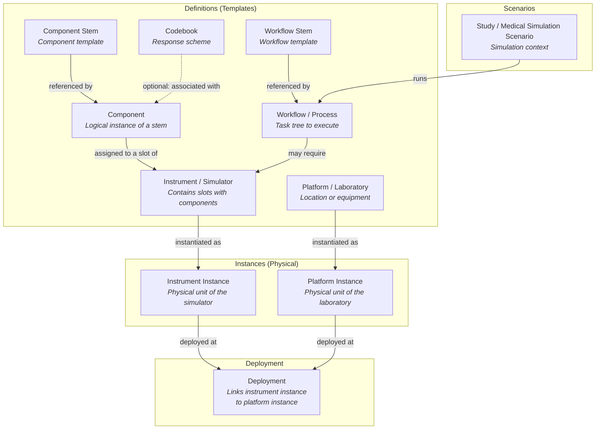
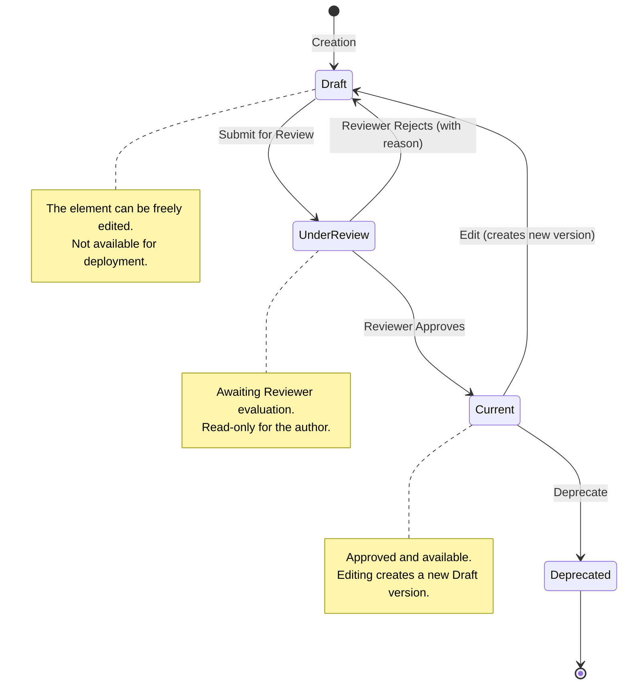
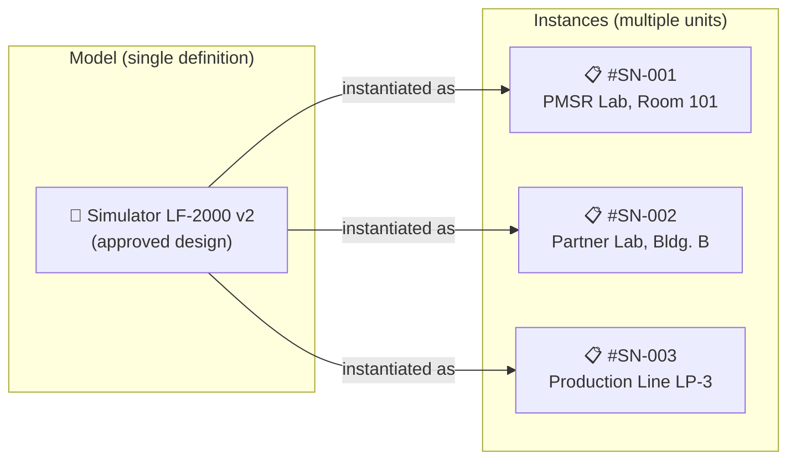

# 📘 User Manuals - PMSR (Platform for Semantic Resource Management)

**PMSR Working Group** | Version 2.0 | April 2026

> 🌐 **Portuguese version available:** [Open Portuguese version](INDEX.md)

---

## About this Documentation

This set of manuals provides detailed instructions for using the semantic instrument management system, covering components, platforms and their instances within the **PMSR** project context. The manuals are intended for system users and reviewers, covering everything from element creation to the review and approval workflow.

> **Note on PMSR terminology:** Within the PMSR context, the system's default terms may be customized by the administrator (Preferred Names). For example, "Instrument" appears as **"Simulator"**, "Platform" may appear as **"Laboratory"**, and "Study" may appear as **"Medical Simulation Scenario"**. In these manuals, we use both the technical names and the PMSR labels (e.g., Instrument/Simulator, Study/Scenario) for clarity.

---

## Complete Manual (Global)

- **Português (PT):** [V1](MANUAL-PMSR-COMPLETO-PT_V1.md) | [V2](MANUAL-PMSR-COMPLETO-PT_V2.md)
- **English (EN):** [V1](MANUAL-PMSR-COMPLETO-EN_V1.md) | [V2](MANUAL-PMSR-COMPLETO-EN_V2.md)

> ℹ️ **V2** includes the full integration of manuals **07 (Studies/Scenarios)** and **08 (Workflows)**, including a practical “mini” Workflow+Scenario example.

---

## Manual Index

| # | Manual | Description | Link |
|---|--------|-------------|------|
| 1 | **Instruments / Simulators** | How to create, edit, manage and submit for review Instruments (Simulators in PMSR). Includes container slots management and internal structure. | [Open Manual](01-MANUAL-INSTRUMENTS-SIMULATORS-EN.md) |
| 2 | **Component Stems** | How to create, edit and derive Component Stems - the reusable component templates. Prerequisite for creating Components. | [Open Manual](02-MANUAL-COMPONENT-STEMS-EN.md) |
| 3 | **Components** | How to create, edit and assign Components to slots. Details the relationship with Component Stems, Codebooks, and the review process. | [Open Manual](03-MANUAL-COMPONENTS-EN.md) |
| 4 | **Instrument / Simulator Instances** | How to create and manage physical instances of Instruments/Simulators for deployment. | [Open Manual](04-MANUAL-INSTRUMENT-SIMULATOR-INSTANCES-EN.md) |
| 5 | **Platforms / Laboratories** | How to create and edit Platforms (Laboratories in PMSR) - the locations or equipment where data collection takes place. | [Open Manual](05-MANUAL-PLATFORMS-LABORATORIES-EN.md) |
| 6 | **Platform / Laboratory Instances** | How to create and manage physical instances of Platforms/Laboratories for deployment. | [Open Manual](06-MANUAL-PLATFORM-LABORATORY-INSTANCES-EN.md) |
| 7 | **Studies / Medical Simulation Scenarios** | How to create, edit and manage Studies (Medical Simulation Scenarios in PMSR). Includes the "Manage Elements" dashboard and running Workflows in the Scenario context. | [Open Manual](07-MANUAL-STUDIES-SIMULATION-SCENARIOS-EN.md) |
| 8 | **Workflows** | How to create, edit and model Workflows (processes) and how to use them in Scenarios (Studies) through the task editor (CTT). | [Open Manual](08-MANUAL-WORKFLOWS-EN.md) |

---

## Entity Relationship Diagram

The diagram below illustrates how the different entities relate to each other in the system:

---

## Review and Approval Workflow

All elements of type **Instrument/Simulator**, **Component**, **Component Stem**, **Codebook** and **Response Option** follow a review workflow before becoming available for use (status *Current*):

### Roles in the Review Workflow

| Role | System Role | Description | Available Actions |
|------|------------|-------------|-------------------|
| **User / Author** | Authenticated User | Creates and edits elements. Submits for review. | Create, Edit, Submit for Review |
| **Reviewer** | Content Editor | Evaluates submitted elements. Can approve or reject. Requires a special permission assigned by an Administrator. | Approve, Reject (with mandatory notes) |

> **Note on permissions:** These manuals are aimed at users with the **Authenticated User** role. The review sections describe what the Reviewer does so you understand the full workflow, but the review action is only available to users with the **Content Editor** permission. Role management and system configuration are the Administrator's responsibility and are not covered in this documentation.

---

## Model vs. Instance - Key Concept

An essential concept for understanding the system is the distinction between **Model** (definition/design) and **Instance** (concrete unit).

| Concept | What it represents | PMSR Example |
|---------|-------------------|--------------|
| **Model (Definition)** | The design, the "blueprint" - describes *what it is* and *how it works*. It's abstract, serves as a template. It can contain slots, components, and goes through the review process. | "Lyophilization Simulator LF-2000" - the simulator definition, with its 5 slots and associated components. |
| **Instance (Physical Unit)** | A real, concrete unit of that model - with serial number, owner, location. It's the "object you can touch". | "Lyophilizer #SN-001 at PMSR Lab, acquired in 2025" - the physical machine in the laboratory. |

> **Why both?** Because the same simulator model can exist in multiple copies (physical units) across different laboratories. The model is defined and approved once; instances track each individual unit for operational control and deployment.

The same applies to **Platforms/Laboratories**: the model defines the type of laboratory, and each instance represents a specific, physical laboratory.

---

## General Prerequisites

- **Authentication:** All manuals assume that the user is authenticated in the system.
- **Minimum role:** Authenticated User. Review actions require the **Content Editor** permission, assigned by an Administrator.
- **PMSR Terminology:** The names displayed in the system (Simulator, Laboratory, etc.) have been configured by the administrator to reflect the PMSR context.

---

## Conventions used in this documentation

| Icon/Format | Meaning |
|-------------|---------|
| **Bold** | Button names, fields or menus in the system |
| `code` | URL paths, technical values |
| > Note | Important information or tips |
| ⚠️ | Warnings and precautions |
| 📋 | Step to follow in a sequence |
| 🔗 | Cross-reference to another manual |

---

*Documentation created for the PMSR Working Group - March 2026*
