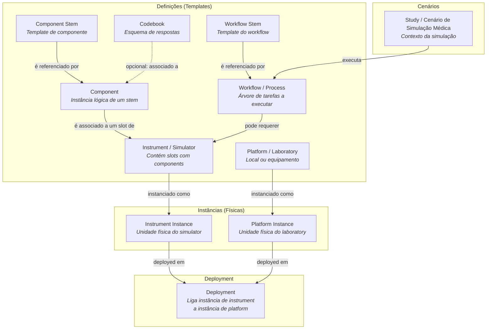
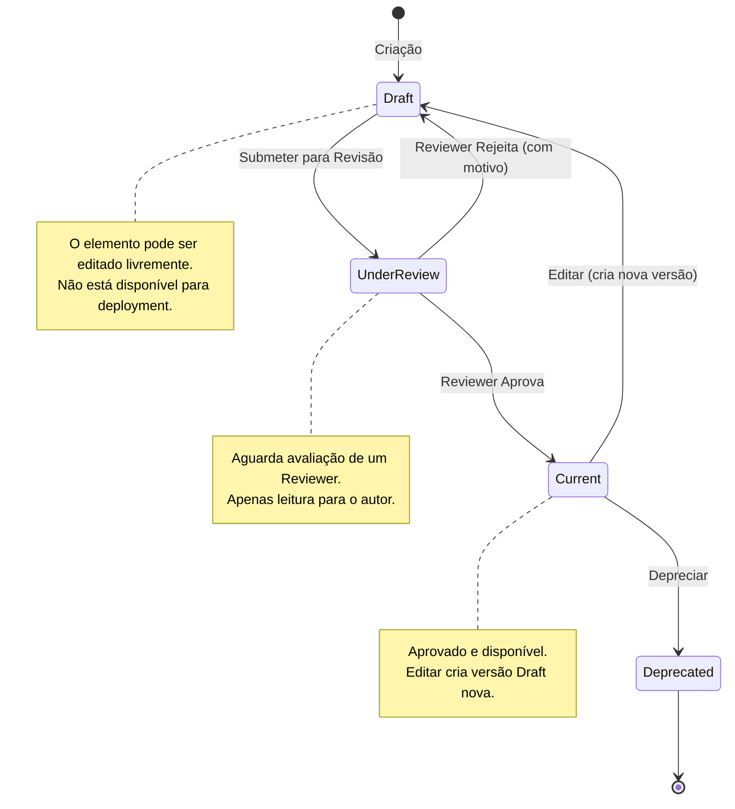
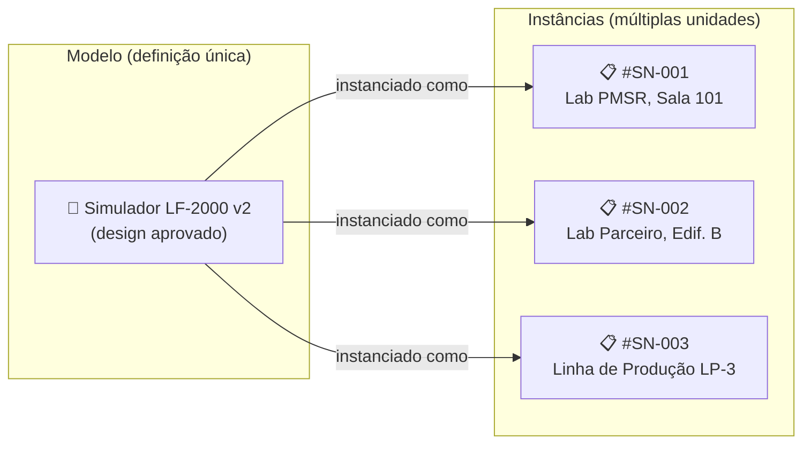

# 📘 Manuais de Utilizador - PMSR (Plataforma de Gestão Semântica de Recursos)

**Grupo de Trabalho PMSR** | Versão 2.0 | Abril 2026

> 🌐 **Versão em inglês disponível:** [Open English version](INDEX-EN.md)

---

## Sobre esta Documentação

Este conjunto de manuais fornece instruções detalhadas para a utilização do sistema de gestão de instrumentos semânticos, componentes, plataformas e suas instâncias no contexto do projeto **PMSR**. Os manuais são direcionados a utilizadores e revisores do sistema, cobrindo desde a criação de elementos até ao fluxo de revisão e aprovação.

> **Nota sobre terminologia PMSR:** No contexto do PMSR, os termos padrão do sistema podem ser customizados pelo administrador (Preferred Names). Por exemplo, "Instrument" aparece como **"Simulator"**, "Platform" pode aparecer como **"Laboratory"**, e "Study" pode aparecer como **"Cenário de Simulação Médica"**. Nestes manuais, usaremos as designações técnicas e as designações PMSR (ex: Instrument/Simulator, Study/Cenário) para clareza.

---

## Manual Completo (Global)

- **Português (PT):** [V1](MANUAL-PMSR-COMPLETO-PT_V1.md) | [V2](MANUAL-PMSR-COMPLETO-PT_V2.md)
- **English (EN):** [V1](MANUAL-PMSR-COMPLETO-EN_V1.md) | [V2](MANUAL-PMSR-COMPLETO-EN_V2.md)

> ℹ️ A versão **V2** inclui a integração completa dos manuais **07 (Studies/Cenários)** e **08 (Workflows)**, incluindo um exemplo prático “mini” de Workflow + Cenário.

---

## Índice de Manuais

| # | Manual | Descrição | Link |
|---|--------|-----------|------|
| 1 | **Instruments / Simulators** | Como criar, editar, gerir e submeter para revisão Instruments (Simulators no PMSR). Inclui gestão de container slots e estrutura interna. | [Abrir Manual](01-MANUAL-INSTRUMENTS-SIMULATORS.md) |
| 2 | **Component Stems** | Como criar, editar e derivar Component Stems - os templates reutilizáveis de componentes. Pré-requisito para criar Components. | [Abrir Manual](02-MANUAL-COMPONENT-STEMS.md) |
| 3 | **Components** | Como criar, editar e associar Components a slots. Detalha a relação com Component Stems, Codebooks, e o processo de revisão. | [Abrir Manual](03-MANUAL-COMPONENTS.md) |
| 4 | **Instâncias de Instruments / Simulators** | Como criar e gerir instâncias físicas de Instruments/Simulators para deployment. | [Abrir Manual](04-MANUAL-INSTRUMENT-SIMULATOR-INSTANCES.md) |
| 5 | **Platforms / Laboratories** | Como criar e editar Platforms (Laboratories no PMSR) - os locais ou equipamentos onde decorre a recolha de dados. | [Abrir Manual](05-MANUAL-PLATFORMS-LABORATORIES.md) |
| 6 | **Instâncias de Platforms / Laboratories** | Como criar e gerir instâncias físicas de Platforms/Laboratories para deployment. | [Abrir Manual](06-MANUAL-PLATFORM-LABORATORY-INSTANCES.md) |
| 7 | **Studies / Cenários de Simulação Médica** | Como criar, editar e gerir Studies (Cenários de Simulação Médica no PMSR). Inclui a página "Manage Elements" e a execução de Workflows no contexto do Cenário. | [Abrir Manual](07-MANUAL-STUDIES-SIMULATION-SCENARIOS.md) |
| 8 | **Workflows** | Como criar, editar e modelar Workflows (processos) e como utilizá-los em Cenários (Studies) através do editor de tarefas (CTT). | [Abrir Manual](08-MANUAL-WORKFLOWS.md) |

---

## Diagrama de Relação entre Entidades

O diagrama abaixo ilustra como as diferentes entidades se relacionam entre si no sistema:

---

## Fluxo de Revisão e Aprovação

Todos os elementos do tipo **Instrument/Simulator**, **Component**, **Component Stem**, **Codebook** e **Response Option** seguem um fluxo de revisão antes de ficarem disponíveis para utilização (estado *Current*):

### Papéis no Fluxo de Revisão

| Papel | Role no Sistema | Descrição | Ações Disponíveis |
|-------|----------------|-----------|-------------------|
| **Utilizador / Autor** | Authenticated User | Cria e edita elementos. Submete para revisão. | Criar, Editar, Submeter para Revisão |
| **Reviewer** | Content Editor | Avalia elementos submetidos. Pode aprovar ou rejeitar. Requer permissão especial atribuída por um Administrador. | Aprovar, Rejeitar (com notas obrigatórias) |

> **Nota sobre permissões:** Estes manuais são direcionados a utilizadores com role de **Authenticated User**. As secções relativas à revisão descrevem o que o Reviewer faz para que perceba o fluxo completo, mas a ação de revisão só está disponível a utilizadores com a permissão **Content Editor**. A gestão de roles e configurações do sistema é da responsabilidade dos Administradores e não é coberta nesta documentação.

---

## Modelo vs. Instância - Conceito Fundamental

Um conceito essencial para compreender o sistema é a distinção entre **Modelo** (definição/design) e **Instância** (unidade concreta).

| Conceito | O que representa | Exemplo PMSR |
|----------|------------------|--------------|
| **Modelo (Definição)** | O design, o "projeto" - descreve *o que é* e *como funciona*. É abstrato, serve de template. Pode conter slots, componentes, e passar por revisão. | "Simulador de Liofilização LF-2000" - a definição do simulador, com os seus 5 slots e componentes associados. |
| **Instância (Unidade Física)** | Uma unidade real e concreta desse modelo - com número de série, proprietário, localização. É o "objeto que se pode tocar". | "Liofilizador #SN-001 do Lab PMSR, adquirido em 2025" - a máquina física no laboratório. |

> **Porquê ambos?** Porque o mesmo modelo de simulador pode existir em várias cópias (unidades físicas) em diferentes laboratórios. O modelo é definido e aprovado uma vez; as instâncias registam cada unidade individual para controlo operacional e deployment.

O mesmo aplica-se a **Platforms/Laboratories**: o modelo define o tipo de laboratório, e cada instância representa um laboratório concreto.

---

## Pré-requisitos Gerais

- **Autenticação:** Todos os manuais pressupõem que o utilizador está autenticado no sistema.
- **Role mínimo:** Utilizador autenticado (Authenticated User). Ações de revisão requerem a permissão **Content Editor**, atribuída por um Administrador.
- **Terminologia PMSR:** Os nomes exibidos no sistema (Simulator, Laboratory, etc.) foram configurados pelo administrador para refletir o contexto PMSR.

---

## Convenções utilizadas nesta documentação

| Ícone/Formato | Significado |
|---------------|-------------|
| **Negrito** | Nomes de botões, campos ou menus no sistema |
| `código` | Caminhos URL, valores técnicos |
| > Nota | Informações importantes ou dicas |
| ⚠️ | Avisos e precauções |
| 📋 | Passo a seguir numa sequência |
| 🔗 | Referência cruzada para outro manual |

---

*Documentação criada para o Grupo de Trabalho PMSR - Março 2026*
