# PMSR Complete Manual (English)

> This document is the complete English manual for PMSR, covering general concepts and all operational workflows from definitions to instances and deployments.

---

## 1. General Introduction

---

## About this Documentation

This set of manuals provides detailed instructions for using the semantic instrument management system, covering components, platforms and their instances within the **PMSR** project context. The manuals are intended for system users and reviewers, covering everything from element creation to the review and approval workflow.

> **Note on PMSR terminology:** Within the PMSR context, the system's default terms have been customized by the administrator. For example, "Instrument" appears as **"Simulator"**, and "Platform" may appear as **"Laboratory"**. In these manuals, we use both designations (e.g., Instrument/Simulator) for clarity.

---

## Entity Relationship Diagram

The diagram below illustrates how the different entities relate to each other in the system:

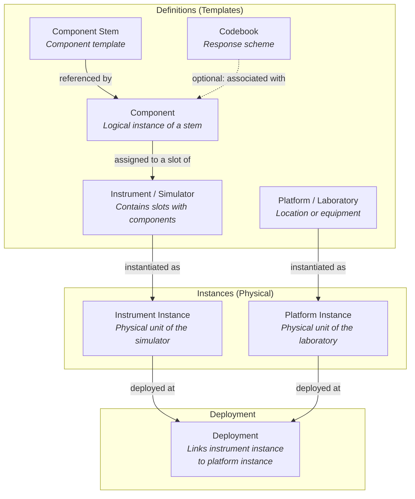
```mermaid
graph TB
    subgraph "Definitions (Templates)"
        CS["Component Stem<br/><i>Component template</i>"]
        CB["Codebook<br/><i>Response scheme</i>"]
        COMP["Component<br/><i>Logical instance of a stem</i>"]
        INST["Instrument / Simulator<br/><i>Contains slots with components</i>"]
        PLAT["Platform / Laboratory<br/><i>Location or equipment</i>"]
    end

    subgraph "Instances (Physical)"
        II["Instrument Instance<br/><i>Physical unit of the simulator</i>"]
        PI["Platform Instance<br/><i>Physical unit of the laboratory</i>"]
    end

    subgraph "Deployment"
        DEP["Deployment<br/><i>Links instrument instance<br/>to platform instance</i>"]
    end

    CS -->|"referenced by"| COMP
    CB -.->|"optional: associated with"| COMP
    COMP -->|"assigned to a slot of"| INST
    INST -->|"instantiated as"| II
    PLAT -->|"instantiated as"| PI
    II -->|"deployed at"| DEP
    PI -->|"deployed at"| DEP
```
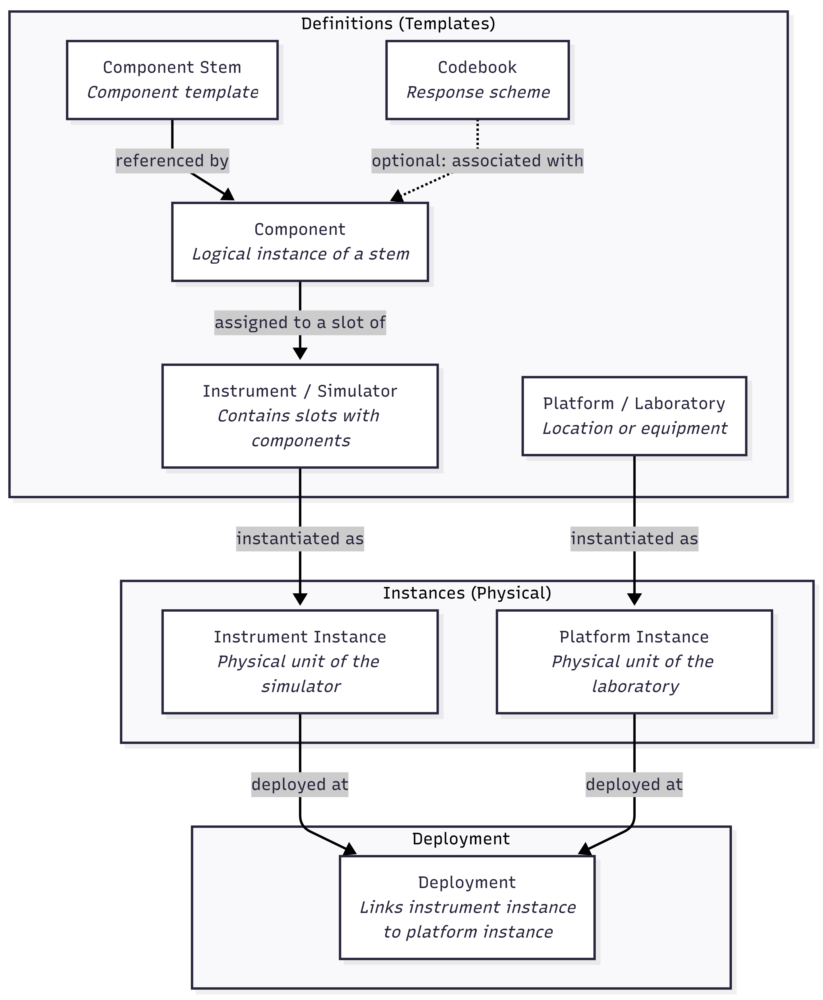
> _PNG equivalent of the Mermaid diagram above. Place the file with this name under docs/images/diagrams/en/._


---

## Review and Approval Workflow

All elements of type **Instrument/Simulator**, **Component**, **Component Stem**, **Codebook** and **Response Option** follow a review workflow before becoming available for use (status *Current*):

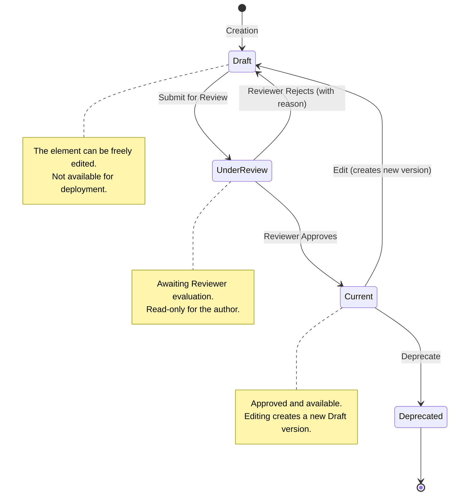
```mermaid
stateDiagram-v2
    [*] --> Draft : Creation
    Draft --> UnderReview : Submit for Review
    UnderReview --> Current : Reviewer Approves
    UnderReview --> Draft : Reviewer Rejects (with reason)
    Current --> Draft : Edit (creates new version)
    Current --> Deprecated : Deprecate
    Deprecated --> [*]

    note right of Draft
        The element can be freely edited.
        Not available for deployment.
    end note

    note right of UnderReview
        Awaiting Reviewer evaluation.
        Read-only for the author.
    end note

    note right of Current
        Approved and available.
        Editing creates a new Draft version.
    end note
```
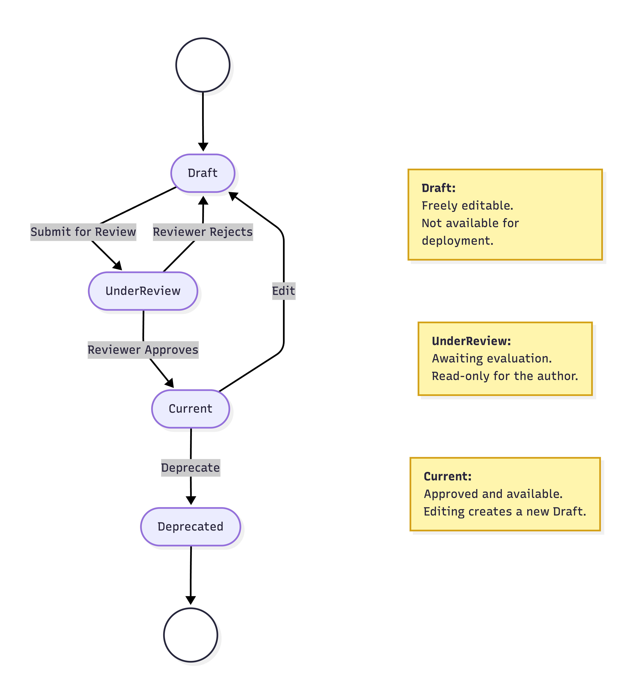
> _PNG equivalent of the Mermaid diagram above. Place the file with this name under docs/images/diagrams/en/._


### Roles in the Review Workflow

| Role | System Role | Description | Available Actions |
|------|------------|-------------|-------------------|
| **User / Author** | Authenticated User | Creates and edits elements. Submits for review. | Create, Edit, Submit for Review |
| **Reviewer** | Content Editor | Evaluates submitted elements. Can approve or reject. Requires a special permission assigned by an Administrator. | Approve, Reject (with mandatory notes) |

> **Note on permissions:** These manuals are aimed at users with the **Authenticated User** role. The review sections describe what the Reviewer does so you understand the full workflow, but the review action is only available to users with the **Content Editor** permission. Role management and system configuration are the Administrator's responsibility and are not covered in this documentation.

---

## Model vs. Instance - Key Concept

An essential concept for understanding the system is the distinction between **Model** (definition/design) and **Instance** (concrete unit).

| Concept | What it represents | PMSR Example |
|---------|-------------------|--------------|
| **Model (Definition)** | The design, the "blueprint" - describes *what it is* and *how it works*. It's abstract, serves as a template. It can contain slots, components, and goes through the review process. | "Lyophilization Simulator LF-2000" - the simulator definition, with its 5 slots and associated components. |
| **Instance (Physical Unit)** | A real, concrete unit of that model - with serial number, owner, location. It's the "object you can touch". | "Lyophilizer #SN-001 at PMSR Lab, acquired in 2025" - the physical machine in the laboratory. |

> **Why both?** Because the same simulator model can exist in multiple copies (physical units) across different laboratories. The model is defined and approved once; instances track each individual unit for operational control and deployment.

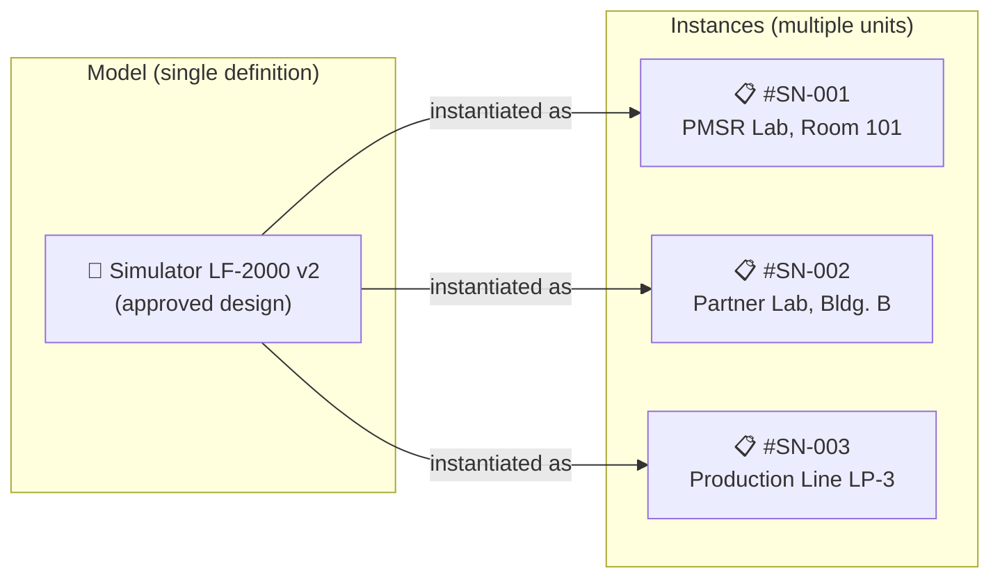
```mermaid
graph LR
    subgraph "Model (single definition)"
        M["🧪 Simulator LF-2000 v2\n(approved design)"]
    end
    subgraph "Instances (multiple units)"
        I1["📋 #SN-001\nPMSR Lab, Room 101"]
        I2["📋 #SN-002\nPartner Lab, Bldg. B"]
        I3["📋 #SN-003\nProduction Line LP-3"]
    end
    M -->|"instantiated as"| I1
    M -->|"instantiated as"| I2
    M -->|"instantiated as"| I3
```
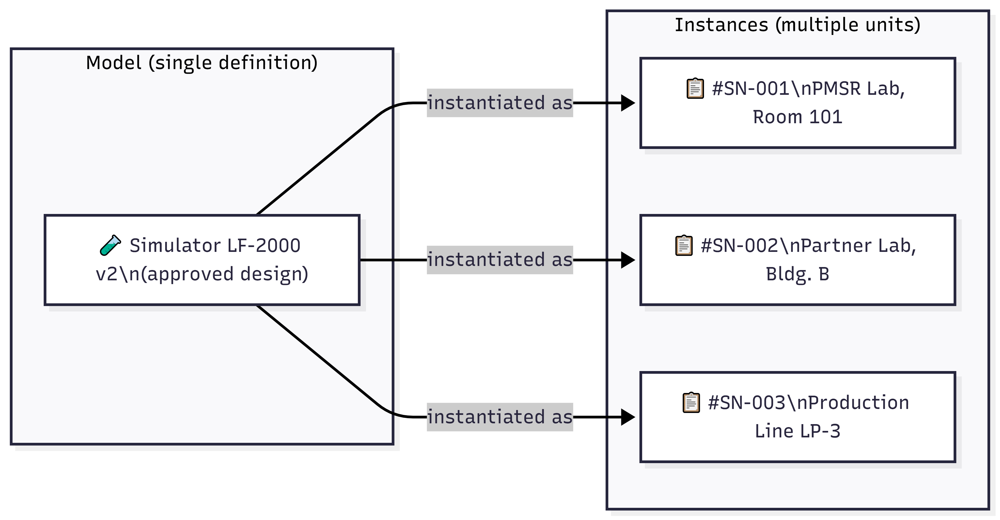
> _PNG equivalent of the Mermaid diagram above. Place the file with this name under docs/images/diagrams/en/._


The same applies to **Platforms/Laboratories**: the model defines the type of laboratory, and each instance represents a specific, physical laboratory.

---

## General Prerequisites

- **Authentication:** All manuals assume that the user is authenticated in the system.
- **Minimum role:** Authenticated User. Review actions require the **Content Editor** permission, assigned by an Administrator.
- **PMSR Terminology:** The names displayed in the system (Simulator, Laboratory, etc.) have been configured by the administrator to reflect the PMSR context.

---

## Conventions used in this documentation

| Icon/Format | Meaning |
|-------------|---------|
| **Bold** | Button names, fields or menus in the system |
| `code` | URL paths, technical values |
| > Note | Important information or tips |
| ⚠️ | Warnings and precautions |
| 📋 | Step to follow in a sequence |
| 🔗 | Cross-reference to another section in this manual |

---

## 2. Instruments / Simulators

**Module:** SIR (Semantic Instrument Repository)  
**PMSR Context:** In PMSR, "Instrument" is typically referred to as **"Simulator"**

---

## 1. Overview

An **Instrument** (or **Simulator** in the PMSR context) represents a measurement instrument, questionnaire, simulator, or data collection device in the semantic system. Examples in PMSR include pharmaceutical process simulators, quality measurement instruments, or assessment questionnaires.

Each Instrument/Simulator:
- Has a unique automatically generated **URI**
- Is classified by a **hierarchical type** (Parent Type)
- Contains **Container Slots** that hold **Components** or **sub-containers**, enabling recursive hierarchies (see 🔗 [Section 4 - Components](#4-components))
- Follows a **review workflow**: Draft → Under Review → Current
- Has **automatic versioning**

> 📘 **Model vs. Instance:** An Instrument/Simulator is a **model (definition/design)** - it describes the instrument's structure, slots, and components. Think of it as a blueprint. To register **concrete physical units** of this model (with serial number, owner, location), see [Section 5 - Instrument / Simulator Instances](#5-instrument--simulator-instances). The same model can have multiple instances across different laboratories.

### Conceptual Diagram

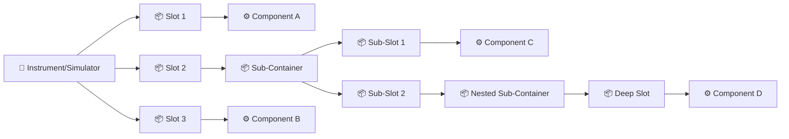
```mermaid
graph LR
    INST["🧪 Instrument/Simulator"]
    INST --> SLOT1["📦 Slot 1"]
    INST --> SLOT2["📦 Slot 2"]
    INST --> SLOT3["📦 Slot 3"]
    SLOT1 --> COMP1["⚙️ Component A"]
    SLOT2 --> SUBC["📦 Sub-Container"]
    SLOT3 --> COMP2["⚙️ Component B"]
    SUBC --> SUBS1["📦 Sub-Slot 1"]
    SUBC --> SUBS2["📦 Sub-Slot 2"]
    SUBS1 --> COMP3["⚙️ Component C"]
    SUBS2 --> NEST["📦 Nested Sub-Container"]
    NEST --> NS1["📦 Deep Slot"]
    NS1 --> COMP4["⚙️ Component D"]
```
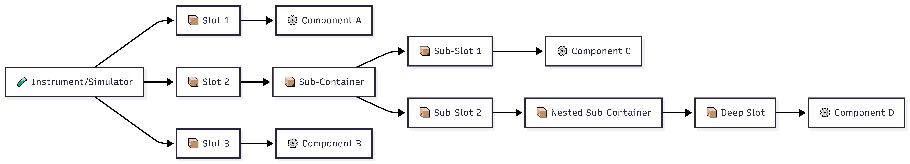
> _PNG equivalent of the Mermaid diagram above. Place the file with this name under docs/images/diagrams/en/._


> **PMSR Note:** The term displayed in the menu and forms depends on the **Preferred Names** configuration. If configured as "Simulator", all menus and labels will show "Simulator" instead of "Instrument".

---

## 2. Accessing Instrument/Simulator Management

### Navigation Path

```
Main Menu → Instrument Elements → Manage Elements → Manage Instruments
```

**Direct URL:** `https://www.pmsr.net/sir/select/instrument/1/9`

### Detailed Steps:

📋 **Step 1.** In the main navigation bar of the site, locate and click on **"Instrument Elements"** (or the name configured by PMSR).

📋 **Step 2.** In the submenu that appears, hover over **"Manage Elements"**.

📋 **Step 3.** Click on **"Manage Instruments"** (or "Manage Simulators" if configured).

You will be directed to the management page with the list of all Instruments you manage.

---

## 3. The Management Page (List)

The management page displays a list of Instruments/Simulators for which you are the author. It offers two views and several filtering options.

### Display Modes

| Button | Description |
|--------|-------------|
| **Table View** | Table view with detailed columns (recommended for management) |
| **Card View** | Card view with visual preview |

### Available Filters

| Filter | Description | Options |
|--------|-------------|---------|
| **Text Filter** | Keyword search by name/URI | Free text field |
| **Language** | Filters by instrument language | All / English / Português / etc. |
| **Status** | Filters by lifecycle state | All Status / Draft / Under Review / Current / Deprecated |

### Table Columns (Table View)

| Column | Description |
|--------|-------------|
| **URI** | Unique identifier (clickable link to the description page) |
| **Parent Type** | Hierarchical type of the instrument (clickable link) |
| **Abbreviation** | Short code/abbreviation |
| **Name** | Instrument name + version |
| **Language** | Language |
| **Downloads** | Download links in formats: TXT, HTML, RDF, FHIR (when applicable) |
| **Status** | Current state: Draft, Under Review, Current, Deprecated |

> **Tip:** If an element was rejected by the Reviewer, the status will appear as **"Draft (Already Reviewed)"** to indicate that it has already been reviewed and returned.

### Action Buttons

| Button | Function | Condition |
|--------|----------|-----------|
| **Add New Instrument** | Opens the creation form | Always available |
| **Edit Selected** | Opens the editing form for the selected element | Requires selection of 1 element |
| **Delete Selected** | Deletes the selected element | Requires selection + confirmation |
| **Send for Review** | Submits for review | Only for elements in **Draft** state |

---

## 4. Creating a New Instrument/Simulator

### Creation Sequence

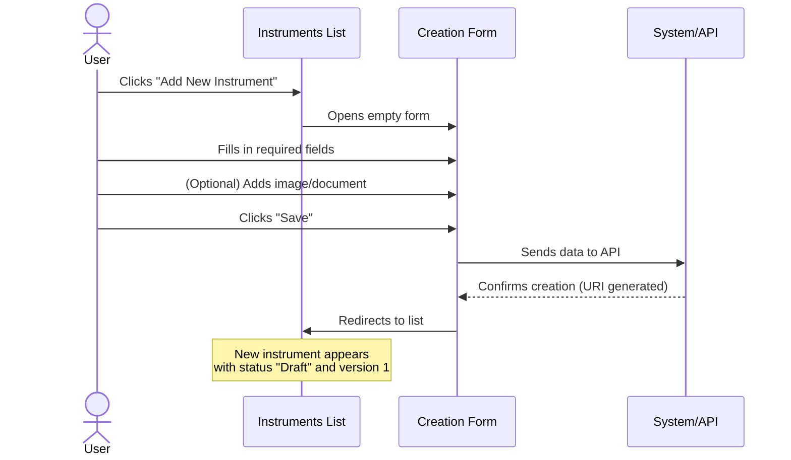
```mermaid
sequenceDiagram
    actor U as User
    participant L as Instruments List
    participant F as Creation Form
    participant S as System/API

    U->>L: Clicks "Add New Instrument"
    L->>F: Opens empty form
    U->>F: Fills in required fields
    U->>F: (Optional) Adds image/document
    U->>F: Clicks "Save"
    F->>S: Sends data to API
    S-->>F: Confirms creation (URI generated)
    F->>L: Redirects to list
    Note over L: New instrument appears<br/>with status "Draft" and version 1
```
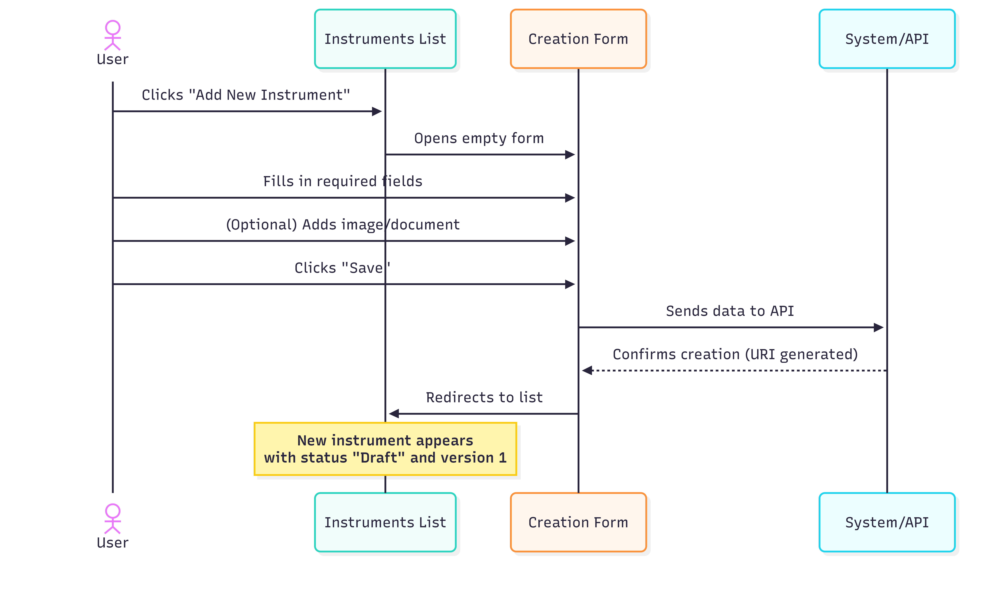
> _PNG equivalent of the Mermaid diagram above. Place the file with this name under docs/images/diagrams/en/._


### Detailed Steps

📋 **Step 1.** On the management page, click the **"Add New Instrument"** (or "Add New Simulator") button.

📋 **Step 2.** Fill in the creation form with the following fields:

#### Form Fields

| Field | Type | Required | Detailed Description |
|-------|------|----------|----------------------|
| **Parent Type** | Modal selection (tree) | No | Defines the hierarchical type of the instrument. When clicked, a modal window opens with a tree of available types in the ontology. Select the most specific applicable type (e.g., `vstoi:Questionnaire`, `vstoi:Simulator`). If you are unsure which to choose, consult the administrator. |
| **Name** | Text field | **Yes** | Descriptive name of the instrument. Should be clear and unique within your context. E.g., "PHQ-9 Depression Screening", "Lyophilization Process Simulator". |
| **Abbreviation** | Text field | No | Short code or acronym. E.g., "PHQ-9", "SIM-LIO-01". Useful for quick reference. |
| **Maker** | Text field with autocomplete | No | Manufacturing/creating organization. Start typing and select from the list of registered organizations. |
| **Informant** | Dropdown list | No | Defines the language informant (e.g., en_US for American English). |
| **Language** | Dropdown list | **Yes** | Primary language of the instrument. Default: English (en). |
| **Version** | Field (read-only) | Auto | Automatic value: starts at 1. Increments automatically when editing Current versions. |
| **Description** | Text area | No | Detailed description of the instrument, its purpose, usage context, and any relevant notes. |

#### Image Fields

| Field | Description |
|-------|-------------|
| **Image Type** | Choose between **URL** (external link) or **Upload** (upload file) |
| **Image (URL)** | If you chose URL: paste the full image address |
| **Upload Image** | If you chose Upload: click to select a file. Accepted formats: PNG, JPG, JPEG. Maximum size: 2 MB |

#### Web Document Fields

| Field | Description |
|-------|-------------|
| **Web Document Type** | Choose between **URL** (external link) or **Upload** (upload file) |
| **Web Document (URL)** | If you chose URL: paste the full document address |
| **Upload Document** | If you chose Upload: click to select a file. Accepted formats: PDF, DOC, DOCX, TXT, XLS, XLSX. Maximum size: 2 MB |

📋 **Step 3.** After filling in all required fields, click **"Save"**.

📋 **Step 4.** The system creates the instrument with:
- Automatically generated **URI**
- **Version** = 1
- **Status** = Draft
- **Author** = your user email

You will be redirected to the management page, where the new instrument appears in the list.

> ⚠️ **Important:** The instrument is created in **Draft** state. For it to become available for use (Current state), it must be [submitted for review](#7-submitting-for-review) and approved by a Reviewer.

### Parent Type Selection (Tree Modal)

When you click the **Parent Type** field, a modal window opens with an 800px width containing a hierarchical type tree:

```
vstoi:Instrument
├── vstoi:Questionnaire
│   ├── vstoi:SelfAdministeredQuestionnaire
│   └── vstoi:InterviewerAdministeredQuestionnaire
├── vstoi:Simulator
│   ├── vstoi:ProcessSimulator
│   └── vstoi:PharmaceuticalSimulator
├── vstoi:PhysicalDevice
│   ├── vstoi:Sensor
│   └── vstoi:MeasurementDevice
└── ...
```

> **Note:** The type tree is defined by the system's ontology. Available types may vary depending on your environment's configuration.

**To select:** Click on the desired type in the tree. The field will be automatically populated and the modal window will close.

---

## 5. Editing an Instrument/Simulator

### How to Access Editing

📋 **Step 1.** On the management page, select the instrument you want to edit by clicking the corresponding radio button in the table.

📋 **Step 2.** Click the **"Edit Selected"** button.

📋 **Step 3.** The editing form opens with all fields populated with the current data.

### Editing Form

The editing form contains all the fields from the creation form, with the following differences:

| Difference | Description |
|------------|-------------|
| **URI** | Displayed as a read-only field (clickable link to the description page) |
| **Version** | Automatically calculated: if the current state is Current or Deprecated, the displayed version will be incremented (+1) |
| **Container Elements** | Additional section showing the internal structure of slots and components (see [section 6](#6-container-slot-management-internal-structure)) |
| **Review Notes** | If the instrument has already been reviewed, shows the Reviewer's notes (read-only) |
| **Reviewer Email** | Email of the last Reviewer (read-only) |

### Editing Process Diagram

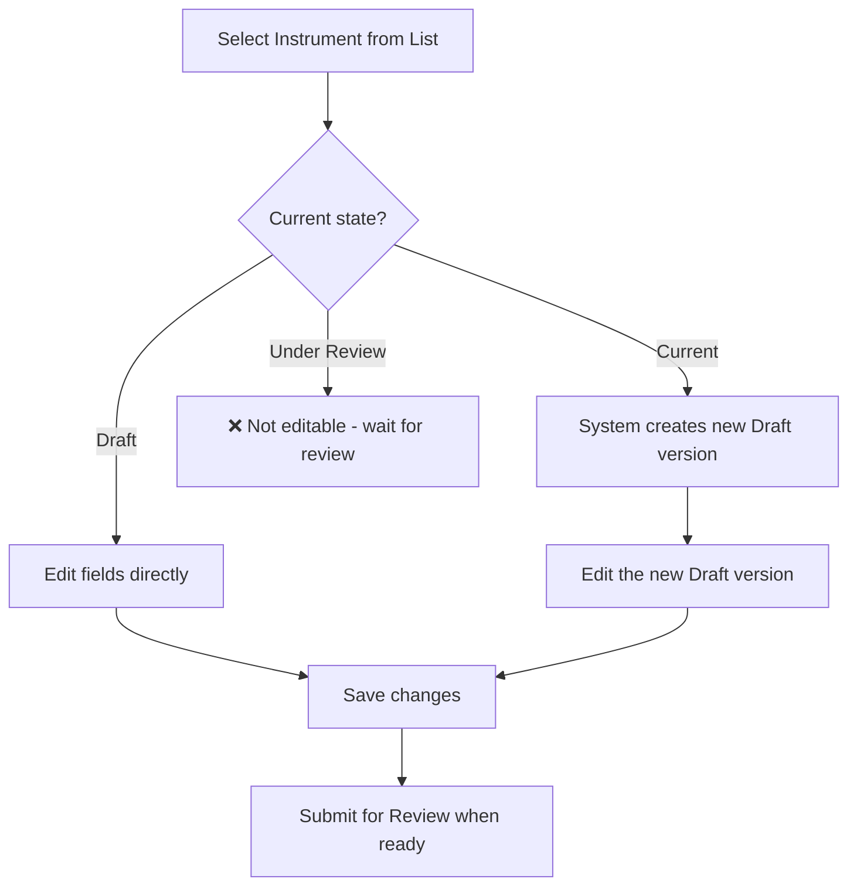
```mermaid
flowchart TD
    A[Select Instrument from List] --> B{Current state?}
    B -->|Draft| C[Edit fields directly]
    B -->|Current| D[System creates new Draft version]
    B -->|Under Review| E[❌ Not editable - wait for review]
    C --> F[Save changes]
    D --> G[Edit the new Draft version]
    G --> F
    F --> H[Submit for Review when ready]
```
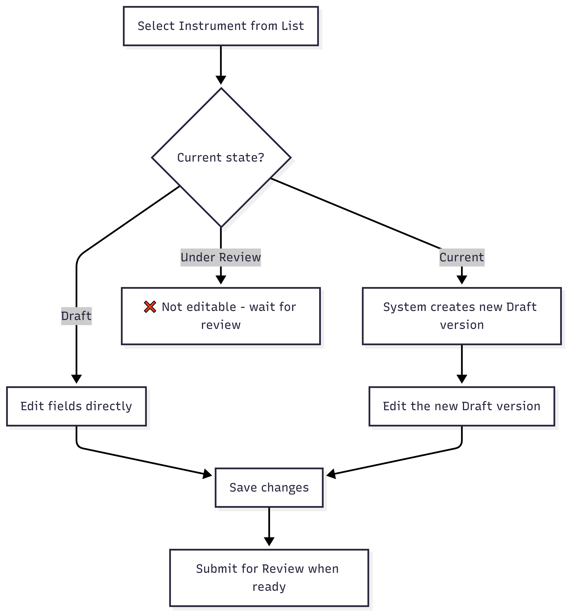
> _PNG equivalent of the Mermaid diagram above. Place the file with this name under docs/images/diagrams/en/._


> ⚠️ **Editing a Current instrument:** When you edit an instrument with **Current** status, the system automatically creates a new version in **Draft** state with an incremented version number. The Current version remains unchanged until the new version is approved.

#### Editing Form Buttons

| Button | Function |
|--------|----------|
| **Update** | Saves changes and redirects to the list |
| **Cancel** | Discards changes and returns to the list |

---

## 6. Container Slot Management (Internal Structure)

An Instrument/Simulator contains **Container Slots** - numbered positions where **Components** or **sub-containers** are associated. The structure is recursive: a sub-container can contain additional slots, which can in turn hold components or more sub-containers, allowing deep hierarchies. This section appears in the editing form, within the **"Container Elements"** section.

### Container Slots Concept

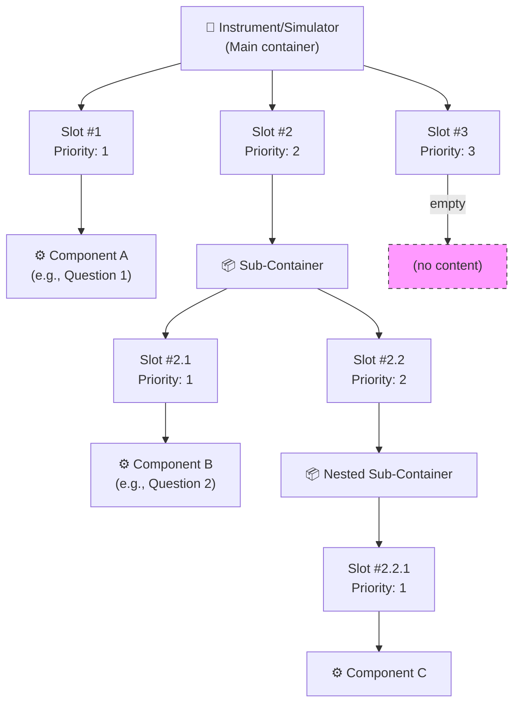
```mermaid
graph TD
    INST["🧪 Instrument/Simulator<br/>(Main container)"]
    INST --> S1["Slot #1<br/>Priority: 1"]
    INST --> S2["Slot #2<br/>Priority: 2"]
    INST --> S3["Slot #3<br/>Priority: 3"]
    S1 --> C1["⚙️ Component A<br/>(e.g., Question 1)"]
    S2 --> SUB["📦 Sub-Container"]
    S3 -->|"empty"| EMPTY["(no content)"]
    SUB --> SS1["Slot #2.1<br/>Priority: 1"]
    SUB --> SS2["Slot #2.2<br/>Priority: 2"]
    SS1 --> C2["⚙️ Component B<br/>(e.g., Question 2)"]
    SS2 --> SUB2["📦 Nested Sub-Container"]
    SUB2 --> SSS1["Slot #2.2.1<br/>Priority: 1"]
    SSS1 --> C3["⚙️ Component C"]

    style EMPTY fill:#f9f,stroke:#333,stroke-dasharray: 5 5
```
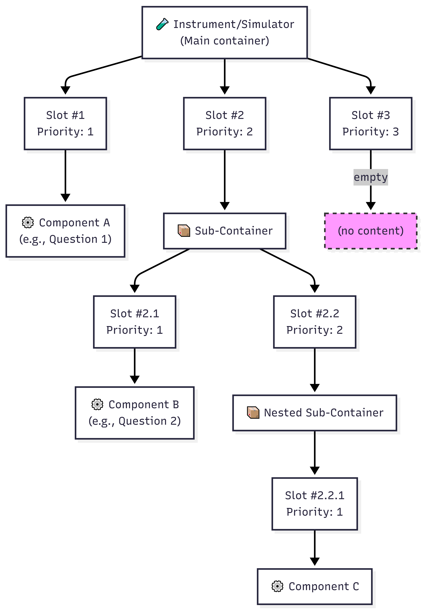
> _PNG equivalent of the Mermaid diagram above. Place the file with this name under docs/images/diagrams/en/._


### 6.1 Adding Slots to an Instrument

📋 **Step 1.** In the Instrument editing form, locate the **"Container Elements"** section.

📋 **Step 2.** Click the **"Add Slots"** button (or + icon).

📋 **Step 3.** In the form that opens:

| Field | Description |
|-------|-------------|
| **Container** | URI of the instrument (automatically filled, read-only) |
| **Number of Slots** | Number of slots to add. Enter a positive integer. |

📋 **Step 4.** Click **"Save"**. The slots are created with sequential priorities.

> **Example:** Adding 5 slots creates Slot #1, Slot #2, ..., Slot #5 in the instrument.

### 6.2 Associating a Component with a Slot

📋 **Step 1.** In the **"Container Elements"** section of the Instrument editing form, identify the desired slot.

📋 **Step 2.** Click the slot's edit button (pencil icon or "Edit Slot").

📋 **Step 3.** In the slot editing form:

| Field | Description |
|-------|-------------|
| **Slot URI** | Slot identifier (read-only) |
| **Priority** | Slot priority/order (read-only) |
| **Component** | Click to open the component selection modal. In the tree, select the desired Component. |

📋 **Step 4.** Available options:

| Button | Function |
|--------|----------|
| **New Item** | Creates a new Component and associates it with this slot (redirects to the Component creation form - see 🔗 [Section 4 - Components](#4-components)) |
| **Reset this Item** | Removes the Component currently associated with the slot (frees the slot) |
| **Update** | Saves the selected Component association (only active when a component is selected) |
| **Cancel** | Returns without making changes |

> ⚠️ **Recursive structure:** A slot can point to a Component **or** a sub-container. When it points to a sub-container, that sub-container has its own slots and can be nested further as needed.

### 6.3 Visual Structure of Container Slots

When editing an Instrument, the Container Elements section displays a hierarchical view similar to:

```
📦 Container Elements
├── Slot #1 (Priority: 1) - ⚙️ Component: "Inlet Temperature" [Edit] [Remove]
├── Slot #2 (Priority: 2) - 📦 Sub-Container: "Pressure Measurements" [Edit] [Remove]
│   ├── Slot #2.1 (Priority: 1) - ⚙️ Component: "Chamber Pressure" [Edit] [Remove]
│   └── Slot #2.2 (Priority: 2) - 📦 Sub-Container: "Fine Control" [Edit] [Remove]
│       └── Slot #2.2.1 (Priority: 1) - ⚙️ Component: "Pillow Pressure" [Edit] [Remove]
├── Slot #3 (Priority: 3) - 🔲 (empty) [Edit] [Add Component or Sub-Container]
└── [+ Add More Slots]
```

---

## 7. Submitting for Review

> ℹ️ **Note on permissions:** Submitting for review can be done by the element's author (authenticated user). Approval or rejection requires the **Content Editor** (Reviewer) permission.

After creating or editing an Instrument/Simulator in **Draft** state, you need to submit it for review so it can advance to the **Current** state.

### Submission Sequence

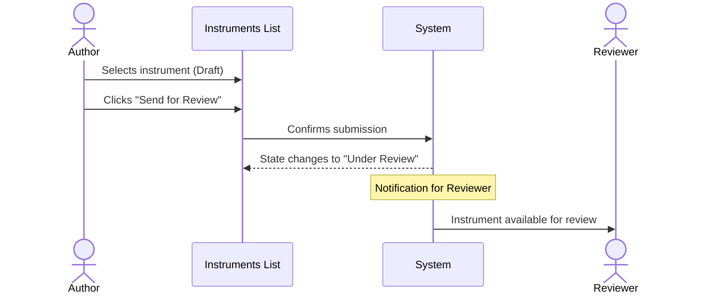
```mermaid
sequenceDiagram
    actor A as Author
    participant L as Instruments List
    participant S as System
    actor R as Reviewer

    A->>L: Selects instrument (Draft)
    A->>L: Clicks "Send for Review"
    L->>S: Confirms submission
    S-->>L: State changes to "Under Review"
    Note over S: Notification for Reviewer
    S->>R: Instrument available for review
```
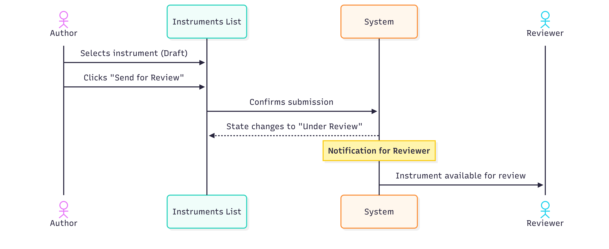
> _PNG equivalent of the Mermaid diagram above. Place the file with this name under docs/images/diagrams/en/._


### Detailed Steps

📋 **Step 1.** On the management page, filter by **Status: Draft** to locate instruments ready for review.

📋 **Step 2.** Select the instrument you want to submit by clicking the corresponding radio button.

📋 **Step 3.** Click the **"Send for Review"** button.

📋 **Step 4.** A confirmation dialog appears: *"Are you sure you want to submit for Review selected entry?"*

📋 **Step 5.** Confirm by clicking **OK**.

📋 **Step 6.** The instrument's state changes to **Under Review**. From this moment:
- The instrument **cannot be edited** by the author
- The instrument becomes available for evaluation by a **Reviewer**
- The submission is **recursive**: all Components associated with the instrument are also submitted for review

> ⚠️ **Recursive submission:** When you submit an Instrument for review, all Components in its slots are automatically submitted as well. Make sure all Components are complete before submitting the Instrument.

---

## 8. The Review Process (Reviewer's Perspective)

> ⚠️ **Required permission:** This section describes actions available only to users with the **Content Editor** (Reviewer) role. It is included so you understand the full review workflow.

### Who is the Reviewer?

The **Reviewer** is a user with the **content_editor** role in the system. Their function is to evaluate whether submitted elements are compliant and correct before approving them for general use.

### Accessing the Review

```
Main Menu → Instrument Elements → Review Elements → Review Instruments
```

The Reviewer navigates to the list of Instruments with **Under Review** status.

### Review Form

The review form presents the instrument in **read-only mode** (the Reviewer does not edit the data), organized into:

1. **Vertical Tabs** with all instrument fields (name, type, description, image, document, etc.)
2. **Container Elements** - visualization of the slots and components structure
3. **Review Section** - Reviewer action fields

### Review Section Fields

| Field | Type | Required | Description |
|-------|------|----------|-------------|
| **Review Notes** | Text area | Yes (for rejection) | Reviewer's notes and comments. Required in case of rejection to indicate the reason. Optional in case of approval. |
| **Reviewer Email** | Text field (read-only) | Auto | Current Reviewer's email, automatically filled. |

### Reviewer Actions

| Action | Button | Notes Required? | Result |
|--------|--------|-----------------|--------|
| **Approve** | **Approve** | No (optional) | State → **Current**. The instrument becomes available for instantiation and deployment. Confirms that the instrument is compliant. |
| **Reject** | **Reject** | **Yes** (required) | State → **Draft**. The instrument returns to the author with the Reviewer's notes explaining the reasons for rejection. The rejection is **recursive**: all associated Components are rejected as well. |

### Review Flow Diagram

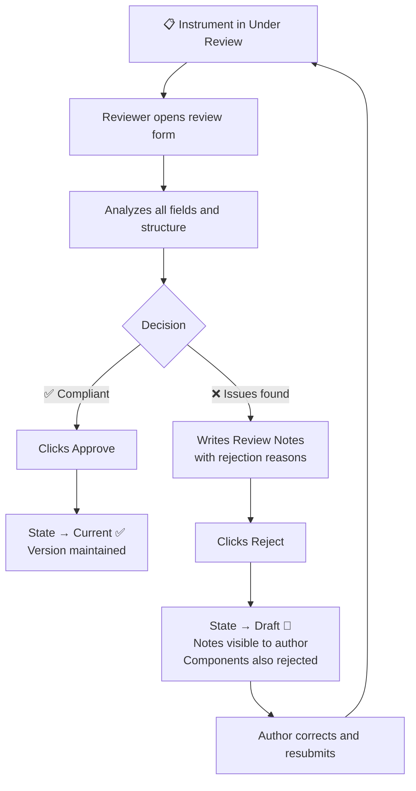
```mermaid
flowchart TD
    A["📋 Instrument in Under Review"] --> B["Reviewer opens review form"]
    B --> C["Analyzes all fields and structure"]
    C --> D{Decision}
    D -->|"✅ Compliant"| E["Clicks Approve"]
    D -->|"❌ Issues found"| F["Writes Review Notes<br/>with rejection reasons"]
    E --> G["State → Current ✅<br/>Version maintained"]
    F --> H["Clicks Reject"]
    H --> I["State → Draft 📝<br/>Notes visible to author<br/>Components also rejected"]
    I --> J["Author corrects and resubmits"]
    J --> A
```
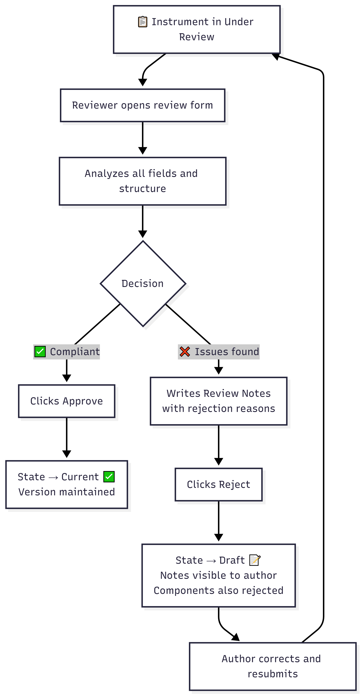
> _PNG equivalent of the Mermaid diagram above. Place the file with this name under docs/images/diagrams/en/._


> **Tip for Reviewers:** When rejecting, be specific in the Review Notes. Indicate exactly which fields or aspects need correction so the author can resolve issues quickly.

---

## 9. Lifecycle and Versioning

### Possible States

| State | Description | Can Edit? | Can Deploy? |
|-------|-------------|-----------|-------------|
| **Draft** | Work in progress | ✅ Yes | ❌ No |
| **Under Review** | Awaiting Reviewer evaluation | ❌ No | ❌ No |
| **Current** | Approved and available for use | ⚠️ Creates new version | ✅ Yes |
| **Deprecated** | Discontinued, replaced by a newer version | ❌ No | ❌ No |

### Automatic Versioning

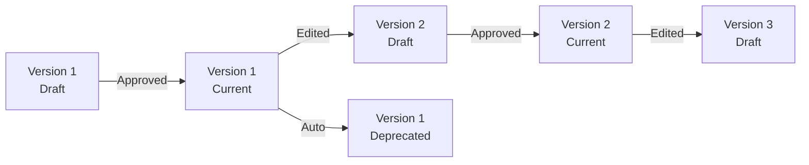
```mermaid
graph LR
    V1["Version 1<br/>Draft"] -->|Approved| V1C["Version 1<br/>Current"]
    V1C -->|Edited| V2["Version 2<br/>Draft"]
    V2 -->|Approved| V2C["Version 2<br/>Current"]
    V1C -->|"Auto"| V1D["Version 1<br/>Deprecated"]
    V2C -->|Edited| V3["Version 3<br/>Draft"]
```
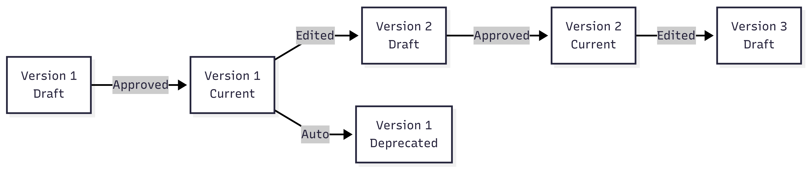
> _PNG equivalent of the Mermaid diagram above. Place the file with this name under docs/images/diagrams/en/._


- **Creation:** Version starts at 1
- **Editing a Current version:** Creates a new version (incremented) in Draft state
- **Approval of new version:** Previous version is automatically Deprecated

---

## 10. Field Reference

### Complete Field Table - Creation Form

| Field | Technical Name | HTML Type | Required | Default Value | Validation |
|-------|---------------|-----------|----------|---------------|------------|
| Parent Type | `instrument_type` | Modal textfield | No | (empty) | Valid ontology URI |
| Name | `instrument_name` | Textfield | Yes | (empty) | Not empty |
| Abbreviation | `instrument_abbreviation` | Textfield | No | (empty) | - |
| Maker | `instrument_maker` | Textfield + autocomplete | No | (empty) | Valid organization |
| Informant | `instrument_informant` | Select | No | (empty) | Informants list |
| Language | `instrument_language` | Select | Yes | en | Languages list |
| Version | `instrument_version` | Textfield (disabled) | Auto | 1 | Positive integer |
| Description | `instrument_description` | Textarea | No | (empty) | - |
| Image Type | `instrument_image_type` | Select | No | (empty) | URL / Upload |
| Image URL | `instrument_image_url` | Textfield | Conditional | (empty) | Valid URL |
| Image Upload | `instrument_image_upload` | Managed file | Conditional | (empty) | PNG/JPG/JPEG, max 2MB |
| Web Doc Type | `instrument_webdocument_type` | Select | No | (empty) | URL / Upload |
| Web Doc URL | `instrument_webdocument_url` | Textfield | Conditional | (empty) | Valid URL |
| Web Doc Upload | `instrument_webdocument_upload` | Managed file | Conditional | (empty) | PDF/DOC/DOCX/TXT/XLS/XLSX, max 2MB |

---

## 11. Troubleshooting

| Problem | Possible Cause | Solution |
|---------|---------------|----------|
| I cannot see the "Send for Review" button | The instrument is not in Draft state | Check the state in the Status column. Only Draft elements can be submitted. |
| The instrument was rejected | The Reviewer found issues | Open the editing form and check the "Review Notes" field to see the reason for rejection. Correct and resubmit. |
| The Parent Type modal is empty | Connection issue with the ontology | Contact the system administrator. |
| The image does not upload | Invalid format or size | Check: PNG/JPG/JPEG, maximum 2MB. |
| I cannot edit - the fields are locked | The instrument is in Under Review state | Wait for the Reviewer's decision. Editing is not possible during review. |
| The version changed automatically | You edited a Current instrument | Expected behavior: the system creates a new (incremented) version in Draft. |

---

🔗 **Internal Navigation:**
[Components](#4-components) • [Component Stems](#3-component-stems) • [Instrument / Simulator Instances](#5-instrument--simulator-instances) • [Internal Table of Contents](#internal-table-of-contents)

---

## 3. Component Stems

**Module:** SIR (Semantic Instrument Repository)  
**PMSR Context:** Component Stems are the reusable base templates for components

---

## 1. Overview

A **Component Stem** is a reusable template that defines the base properties of a component. It works as a "mold" from which concrete **Components** are created. Before creating a Component, it is **mandatory** that at least one suitable Component Stem exists.

> ⚠️ **Important dependency:** Creating Components depends on the existence of Component Stems. If you need to create a Component and cannot find a suitable Stem, you must first create the Stem following this manual, and then follow 🔗 [Section 4 - Components](#4-components).

> 📘 **What is a Component Stem?** A Component Stem is a **reusable template** - a "recipe" or base model for components. It defines the content (question, text, measurement) that can be reused across multiple Components and Instruments/Simulators. Think of it as a building block that can be adapted, translated, or derived for different contexts.

### Practical Analogy

Imagine a questionnaire:
- The **Component Stem** would be the *model question* (e.g., "How often do you feel X?")
- The **Component** would be the *concrete usage* of that question in a specific instrument (e.g., in a PHQ-9 questionnaire)

---

## 2. What is a Component Stem?

### Definition

A Component Stem is a semantic entity that defines:
- **Textual content** (the question, indicator, or base description)
- **Hierarchical type** in the ontology (e.g., `vstoi:ComponentStem`)
- **Language** of the content
- **Origin** (original or derived from another Stem)
- **Associated documentation** (images and documents)

### Relationship with other elements

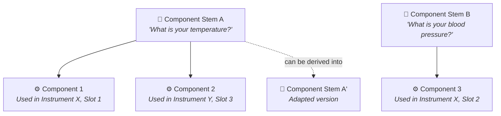
```mermaid
graph TD
    CS1["📄 Component Stem A<br/><i>'What is your temperature?'</i>"]
    CS2["📄 Component Stem B<br/><i>'What is your blood pressure?'</i>"]
    
    CS1 --> COMP1["⚙️ Component 1<br/><i>Used in Instrument X, Slot 1</i>"]
    CS1 --> COMP2["⚙️ Component 2<br/><i>Used in Instrument Y, Slot 3</i>"]
    CS2 --> COMP3["⚙️ Component 3<br/><i>Used in Instrument X, Slot 2</i>"]

    CS1 -.->|"can be derived into"| CS3["📄 Component Stem A'<br/><i>Adapted version</i>"]
```
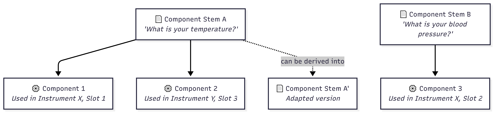
> _PNG equivalent of the Mermaid diagram above. Place the file with this name under docs/images/diagrams/en/._


> **A Component Stem can be used by multiple Components** across different Instruments. This promotes reuse and consistency.

### Note on historical terminology

> ⚠️ **Updated ontology:** The old term **"DetectorStem"** (prefix `DSM`) has been **discontinued**. Always use **"ComponentStem"** (prefix `CST`). If you encounter old entities with the `DSM` prefix, these reflect the previous naming convention and may need migration.

---

## 3. Accessing Component Stem Management

### Navigation Path

```
Main Menu → Instrument Elements → Manage Elements → Manage Component Stems
```

**Direct URL:** `https://www.pmsr.net/sir/select/componentstem/1/9`

### Detailed steps:

📋 **Step 1.** In the main navigation bar, click on **"Instrument Elements"**.

📋 **Step 2.** Hover over **"Manage Elements"**.

📋 **Step 3.** Click on **"Manage Component Stems"**.

---

## 4. The Management Page (List)

The page displays the list of Component Stems for which you are a user/author.

### Available Filters

| Filter | Description | Options |
|--------|-------------|---------|
| **Text Filter** | Keyword search in content/URI | Free text field |
| **Language** | Filter by language | All / English / Português / etc. |
| **Status** | Filter by state | All Status / Draft / Under Review / Current / Deprecated |

### Table Columns

| Column | Description |
|--------|-------------|
| **URI** | Unique identifier (clickable link) |
| **Content** | The text/content of the Stem (label) |
| **Version** | Version number |
| **Status** | Current state: Draft, Under Review, Current, Deprecated |

### Action Buttons

| Button | Function | Description |
|--------|----------|-------------|
| **Add New Component Stem** | Creates an original Stem | Opens creation form |
| **Derive New Component Stem** | Creates a Stem derived from the selected one | Opens pre-filled form with reference to the source Stem |
| **Edit Selected** | Edits the selected Stem | Opens editing form |
| **Delete Selected** | Deletes the selected Stem | With confirmation |
| **Send for Review** | Submits for review | Only for Stems in Draft state |

> **Note:** The **"Derive New Component Stem"** button is exclusive to Component Stems. It allows creating variants based on existing Stems.

---

## 5. Creating a New Component Stem

### Creation Sequence

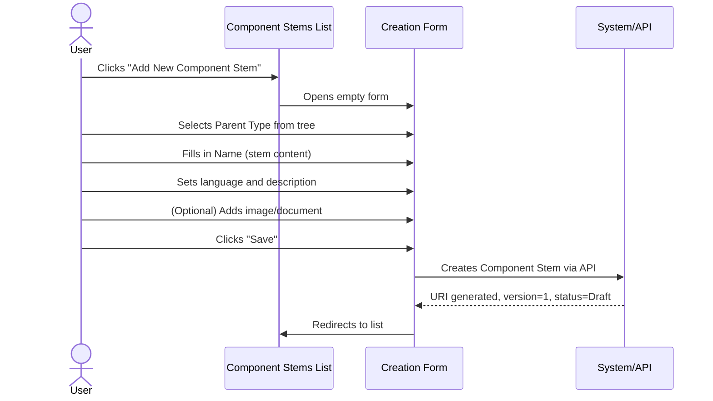
```mermaid
sequenceDiagram
    actor U as User
    participant L as Component Stems List
    participant F as Creation Form
    participant S as System/API

    U->>L: Clicks "Add New Component Stem"
    L->>F: Opens empty form
    U->>F: Selects Parent Type from tree
    U->>F: Fills in Name (stem content)
    U->>F: Sets language and description
    U->>F: (Optional) Adds image/document
    U->>F: Clicks "Save"
    F->>S: Creates Component Stem via API
    S-->>F: URI generated, version=1, status=Draft
    F->>L: Redirects to list
```
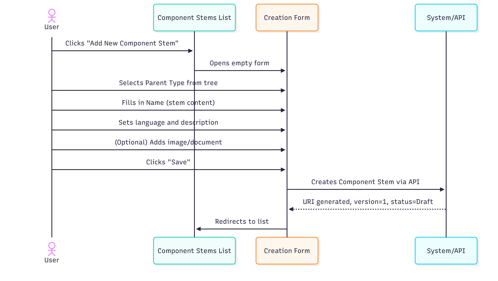
> _PNG equivalent of the Mermaid diagram above. Place the file with this name under docs/images/diagrams/en/._


### Detailed Steps

📋 **Step 1.** On the management page, click the **"Add New Component Stem"** button.

📋 **Step 2.** Fill in the form:

#### Creation Form Fields

| Field | Type | Required | Detailed Description |
|-------|------|----------|----------------------|
| **Parent Type** | Modal selection (tree) | **Yes** | Defines the Stem's hierarchical type in the ontology. When clicked, a modal window (800px) opens with the Component Stems type tree. Select the most appropriate type for your content. By default, the root type is `vstoi:ComponentStem`. |
| **Name** | Text field | **Yes** | The textual content of the Component Stem. This is the text that will be reused by Components referencing this Stem. **Example:** "How often do you experience headaches?", "Fluid inlet temperature (°C)", "Lyophilization chamber pressure". |
| **Language** | Selection list | **Yes** | Content language. Default: English (en). Select the language corresponding to the text in the Name field. |
| **Version** | Field (read-only) | Auto | Always starts at 1. Not editable. |
| **Description** | Text area | No | Additional description of the Stem: usage context, technical notes, scientific meaning, etc. |
| **Was Generated By** | Selection list | **Yes** | Indicates the Stem's origin. For Stems created from scratch, select **"ORIGINAL"**. Other options indicate derivation methods (automatic, adaptation, etc.). **Default: ORIGINAL.** |

#### Image Fields

| Field | Type | Description |
|-------|------|-------------|
| **Image Type** | Select | Choose between **URL** (external link) or **Upload** (upload file) |
| **Image (URL)** | Textfield | If URL: paste the full image address |
| **Upload Image** | File upload | If Upload: PNG, JPG, JPEG. Maximum 2 MB |

#### Web Document Fields

| Field | Type | Description |
|-------|------|-------------|
| **Web Document Type** | Select | Choose between **URL** or **Upload** |
| **Web Document (URL)** | Textfield | If URL: paste the full address |
| **Upload Document** | File upload | If Upload: PDF, DOC, DOCX, TXT, XLS, XLSX. Maximum 2 MB |

📋 **Step 3.** Click **"Save"** to create the Component Stem.

📋 **Step 4.** The system creates the Stem with:
- **URI** automatically generated (prefix `CST`)
- **Version** = 1
- **Status** = Draft
- **Was Generated By** = ORIGINAL

### Parent Type Selection (Tree Modal)

When clicking the **Parent Type** field, the modal opens with the hierarchical tree:

```
vstoi:ComponentStem
├── vstoi:QuestionStem
│   ├── vstoi:LikertQuestionStem
│   └── vstoi:OpenEndedQuestionStem
├── vstoi:SensorReadingStem
│   ├── vstoi:TemperatureStem
│   └── vstoi:PressureStem
└── ...
```

Click the desired type to select it. The field is populated and the modal closes.

---

## 6. Deriving a Component Stem

**Derivation** allows creating a new Component Stem based on an existing one, maintaining the reference to the source Stem. It is used when you want to create a variation (e.g., translation, adaptation, specialization).

### When to derive?

- Adapt a question for a different context
- Translate a Stem to another language
- Specialize a generic Stem for a specific domain

### Derivation Sequence

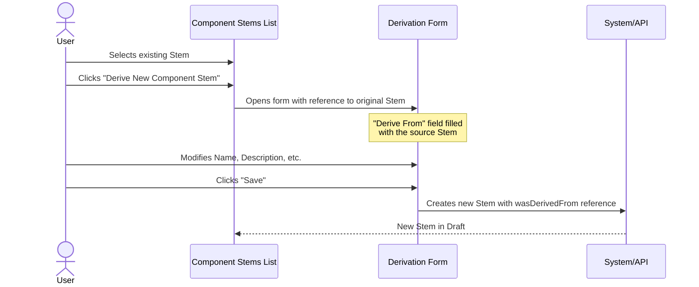
```mermaid
sequenceDiagram
    actor U as User
    participant L as Component Stems List
    participant F as Derivation Form
    participant S as System/API

    U->>L: Selects existing Stem
    U->>L: Clicks "Derive New Component Stem"
    L->>F: Opens form with reference to original Stem
    Note over F: "Derive From" field filled<br/>with the source Stem
    U->>F: Modifies Name, Description, etc.
    U->>F: Clicks "Save"
    F->>S: Creates new Stem with wasDerivedFrom reference
    S-->>L: New Stem in Draft
```
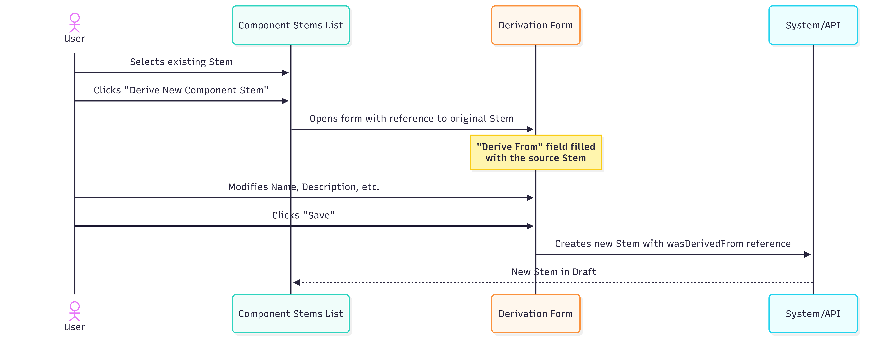
> _PNG equivalent of the Mermaid diagram above. Place the file with this name under docs/images/diagrams/en/._


### Detailed Steps

📋 **Step 1.** In the Component Stems list, select the Stem that will serve as the base (radio button).

📋 **Step 2.** Click the **"Derive New Component Stem"** button.

📋 **Step 3.** The form opens with differences compared to the normal creation form:

| Difference | Description |
|------------|-------------|
| **Type field label** | Changes from "Parent Type" to **"Derive From"** |
| **Reference to original** | The field shows the selected source Stem |
| **Was Generated By** | The "ORIGINAL" option is **removed**. You must select the derivation method (e.g., DERIVED, ADAPTED, TRANSLATED). |

📋 **Step 4.** Modify the fields as needed:
- Change the **Name** to the new content
- Adjust the **Language** if it is a translation
- Update the **Description** to reflect the nature of the derivation
- Select the method in **Was Generated By** (e.g., "DERIVED" for derivation, "ADAPTED" for adaptation)

📋 **Step 5.** Click **"Save"**.

The new Stem is created with a reference (`wasDerivedFrom`) to the original Stem, enabling traceability.

### Derivation Diagram

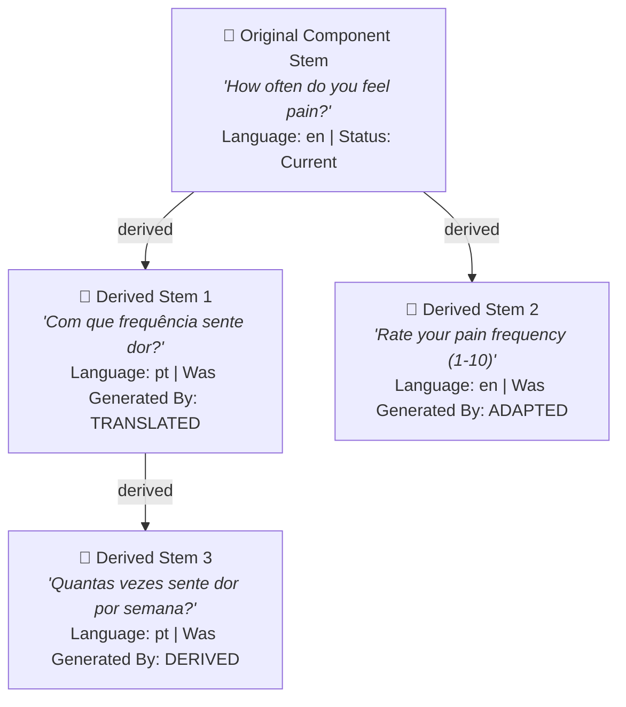
```mermaid
graph TD
    ORIGINAL["📄 Original Component Stem<br/><i>'How often do you feel pain?'</i><br/>Language: en | Status: Current"]
    
    ORIGINAL -->|"derived"| D1["📄 Derived Stem 1<br/><i>'Com que frequência sente dor?'</i><br/>Language: pt | Was Generated By: TRANSLATED"]
    ORIGINAL -->|"derived"| D2["📄 Derived Stem 2<br/><i>'Rate your pain frequency (1-10)'</i><br/>Language: en | Was Generated By: ADAPTED"]
    
    D1 -->|"derived"| D3["📄 Derived Stem 3<br/><i>'Quantas vezes sente dor por semana?'</i><br/>Language: pt | Was Generated By: DERIVED"]
```
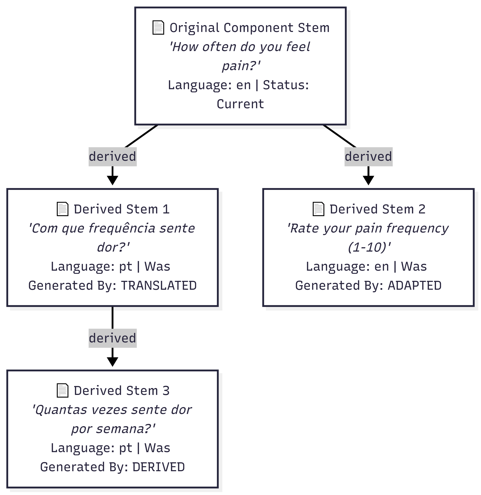
> _PNG equivalent of the Mermaid diagram above. Place the file with this name under docs/images/diagrams/en/._


---

## 7. Editing a Component Stem

### How to access editing

📋 **Step 1.** In the Component Stems list, select the Stem to edit (radio button).

📋 **Step 2.** Click **"Edit Selected"**.

### Editing Form

The editing form contains all the fields from the creation form, with additional elements:

| Additional Element | Description |
|--------------------|-------------|
| **URI** | Displayed as a read-only field (clickable link) |
| **Version** | If the state is Current or Deprecated, the version is automatically incremented |
| **Derived From** | If the Stem was derived, shows the source Stem URI with a **"Check Element"** button to view details |
| **Review Notes** | If previously reviewed, shows the Reviewer's notes (read-only) |
| **Reviewer Email** | Email of the last Reviewer (read-only) |

### Editing Flow

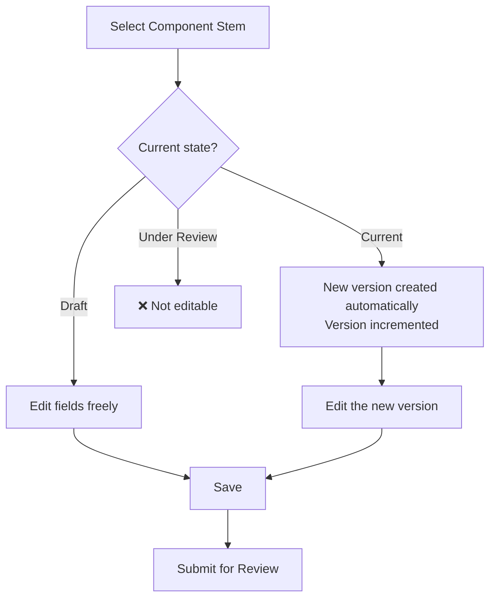
```mermaid
flowchart TD
    A[Select Component Stem] --> B{Current state?}
    B -->|Draft| C[Edit fields freely]
    B -->|Current| D[New version created automatically<br/>Version incremented]
    B -->|Under Review| E[❌ Not editable]
    C --> F[Save]
    D --> G[Edit the new version]
    G --> F
    F --> H[Submit for Review]
```
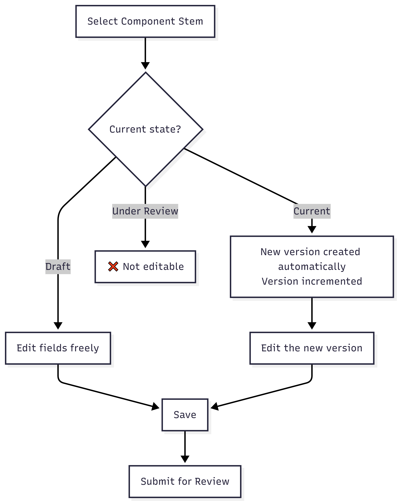
> _PNG equivalent of the Mermaid diagram above. Place the file with this name under docs/images/diagrams/en/._


> ⚠️ **Editing a Current Stem:** When editing a Component Stem with **Current** state, the system creates a new version in **Draft** with an incremented version number. The Current version remains until the new one is approved.

---

## 8. Submitting for Review

### Steps

📋 **Step 1.** In the list, filter by **Status: Draft**.

📋 **Step 2.** Select the Component Stem to submit.

📋 **Step 3.** Click **"Send for Review"**.

📋 **Step 4.** Confirm in the dialog box: *"Are you sure you want to submit for Review selected entry?"*

📋 **Step 5.** The state changes to **Under Review**.

> **Note:** Unlike Instruments, submitting a Component Stem is **individual** - it does not affect other elements.

> ℹ️ **Note on permissions:** Submitting for review can be done by the element's author (authenticated user). Approval or rejection requires the **Content Editor** (Reviewer) permission.

---

## 9. The Review Process (Reviewer's Perspective)

> ⚠️ **Required permission:** This section describes actions available only to users with the **Content Editor** (Reviewer) role. It is included so you understand the full review workflow.

### Accessing Component Stem Review

```
Main Menu → Instrument Elements → Review Elements → Review Component Stems
```

### Review Form

The Reviewer sees the Component Stem in **read-only** mode, with:

1. **Vertical Tabs** with: Type, Name, Language, Version, Description
2. **Derived From** (if applicable): link to the source Stem + "Check Element" button
3. **Was Derived By**: derivation/generation method
4. **Review Section**: Review Notes + Reviewer Email

### Reviewer Actions

| Action | Button | Notes Required? | Result |
|--------|--------|-----------------|--------|
| **Approve** | **Approve** | No | State → **Current**. The Stem becomes available for use in Components. |
| **Reject** | **Reject** | **Yes** | State → **Draft**. The author receives the notes with the reason for rejection. |

### What the Reviewer should verify

| Aspect | What to evaluate |
|--------|------------------|
| **Content (Name)** | Is the text clear, grammatically correct, and appropriate for the context? |
| **Type (Parent Type)** | Is the hierarchical type correct in the ontology? |
| **Language** | Does the selected language match the content? |
| **Derivation** | If derived, is the reference to the original valid? Is the derivation justified? |
| **Description** | Is the description sufficiently detailed? |

---

## 10. Lifecycle and Versioning

### State Diagram

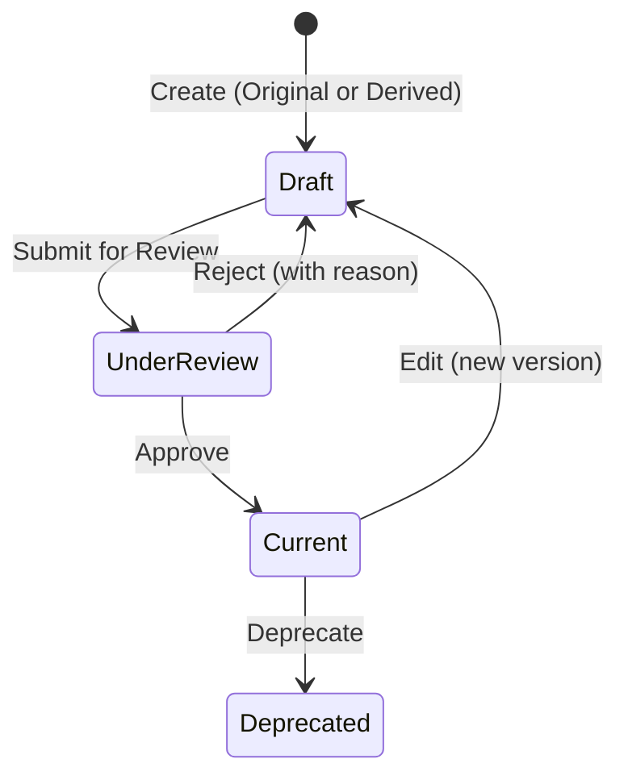
```mermaid
stateDiagram-v2
    [*] --> Draft : Create (Original or Derived)
    Draft --> UnderReview : Submit for Review
    UnderReview --> Current : Approve
    UnderReview --> Draft : Reject (with reason)
    Current --> Draft : Edit (new version)
    Current --> Deprecated : Deprecate
```
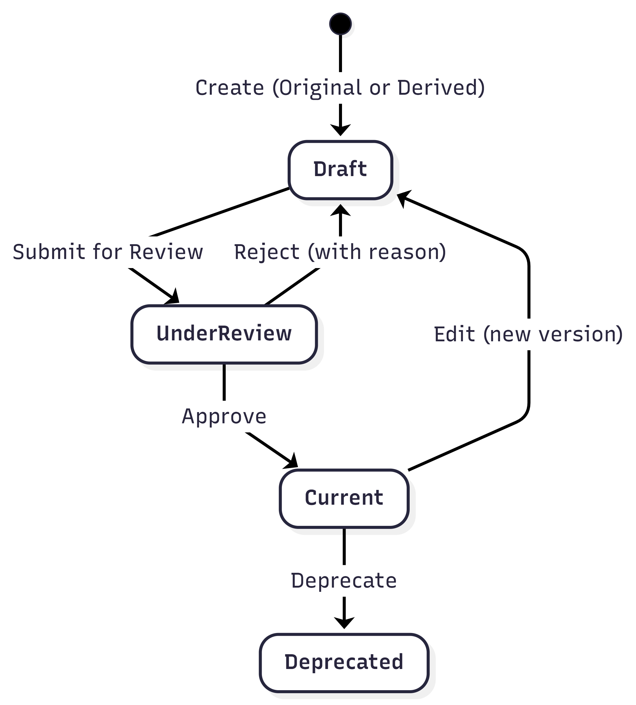
> _PNG equivalent of the Mermaid diagram above. Place the file with this name under docs/images/diagrams/en/._


### Impact on Dependent Components

> ⚠️ **Warning:** Changing or deprecating a Component Stem may impact all Components that reference it. Before deprecating a Stem, check whether there are active Components using it.

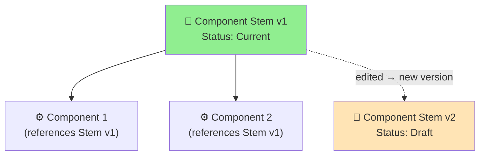
```mermaid
graph TD
    CS["📄 Component Stem v1<br/>Status: Current"]
    CS --> C1["⚙️ Component 1<br/>(references Stem v1)"]
    CS --> C2["⚙️ Component 2<br/>(references Stem v1)"]
    
    CS -.->|"edited → new version"| CS2["📄 Component Stem v2<br/>Status: Draft"]
    
    style CS fill:#90EE90
    style CS2 fill:#FFE4B5
```
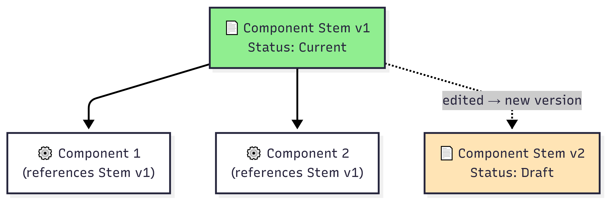
> _PNG equivalent of the Mermaid diagram above. Place the file with this name under docs/images/diagrams/en/._


---

## 11. Field Reference

### Complete Table - Creation Form

| Field | Technical Name | Type | Required | Default Value | Description |
|-------|---------------|------|----------|---------------|-------------|
| Parent Type | `componentstem_type` | Modal textfield | Yes | (empty) | Type in the ontology, selected via modal tree |
| Name | `componentstem_content` | Textfield | Yes | (empty) | Textual content of the Stem |
| Language | `componentstem_language` | Select | Yes | en | Content language |
| Version | `componentstem_version` | Hidden / Textfield (disabled) | Auto | 1 | Numeric version |
| Description | `componentstem_description` | Textarea | No | (empty) | Detailed description |
| Was Generated By | `componentstem_was_generated_by` | Select | Yes | ORIGINAL | Creation/derivation method |
| Image Type | `componentstem_image_type` | Select | No | (empty) | URL or Upload |
| Image URL | `componentstem_image_url` | Textfield | Conditional | (empty) | Image URL (if URL type) |
| Image Upload | `componentstem_image_upload` | Managed file | Conditional | (empty) | File (PNG/JPG/JPEG, max 2MB) |
| Web Doc Type | `componentstem_webdocument_type` | Select | No | (empty) | URL or Upload |
| Web Doc URL | `componentstem_webdocument_url` | Textfield | Conditional | (empty) | Document URL (if URL type) |
| Web Doc Upload | `componentstem_webdocument_upload` | Managed file | Conditional | (empty) | File (PDF/DOC/DOCX/TXT/XLS/XLSX, max 2MB) |

### Additional Editing Fields

| Field | Technical Name | Type | Description |
|-------|---------------|------|-------------|
| URI | `componentstem_uri` | Item (read-only) | Clickable link to the description page |
| Derived From | (display) | Markup + Button | Source Stem URI + "Check Element" button |
| Review Notes | `componentstem_hasreviewnote` | Textarea (read-only) | Reviewer's notes (if any) |
| Reviewer Email | `componentstem_haseditoremail` | Textfield (read-only) | Last Reviewer's email |

### "Was Generated By" Field Options

| Option | Description | When to use |
|--------|-------------|-------------|
| **ORIGINAL** | Stem created from scratch | Direct creation (not based on another Stem) |
| **DERIVED** | Derived from another Stem | Variation or evolution of an existing Stem |
| **ADAPTED** | Adapted from another Stem | Adaptation for a different context |
| **TRANSLATED** | Translated from another Stem | Translation to another language |

> **Note:** When using the derivation form (via the "Derive New" button), the ORIGINAL option is automatically removed, since the Stem is being derived.

---

## 12. Troubleshooting

| Problem | Possible Cause | Solution |
|---------|----------------|----------|
| I cannot find the Stem I need to create a Component | The Stem may not exist or may be in another language | Create a new Stem or use "Derive" to create an adapted version |
| The "Derive" button is disabled | No Stem is selected in the list | Select a Stem by clicking the radio button before clicking "Derive" |
| The "Was Generated By" field does not show "ORIGINAL" | You are using the derivation form | Expected behavior for derivations. Use "Add New" to create original Stems. |
| The version incremented on its own | You edited a Stem with Current state | Expected behavior - new Draft version created automatically |
| The Stem was rejected in review | The Reviewer found issues | Open the editing form and check the Review Notes to see the reason |

---

🔗 **Internal Navigation:**
[Components](#4-components) • [Instruments / Simulators](#2-instruments--simulators) • [Internal Table of Contents](#internal-table-of-contents)

---

## 4. Components

**Module:** SIR (Semantic Instrument Repository)  
**PMSR Context:** Components represent the functional elements of a Simulator (detectors, actuators, questions, etc.)

---

## 1. Overview

A **Component** is a logical instance of a **Component Stem** - the concrete materialization of a template in a specific context. Components are the "functional building blocks" that make up Instruments/Simulators, being associated with **Container Slots** (including slots inside sub-containers) within those instruments.

In the PMSR context, Components can represent:
- **Detectors** - sensors or questions that collect data (inputs)
- **Actuators** - elements that produce actions or outputs
- **Questionnaire questions** - assessment items
- **Measurements** - data collection points

> 📘 **Stem vs. Component:** A Component Stem (Manual 02) is the **reusable template** (the "recipe"). A Component is a **logical instance** of that template, associated with a specific slot within an Instrument/Simulator. When you place a Component Stem into an instrument's slot, a Component is created. Think of the Stem as the mold and the Component as the piece placed in the right position of the machine.

### Relationship Diagram

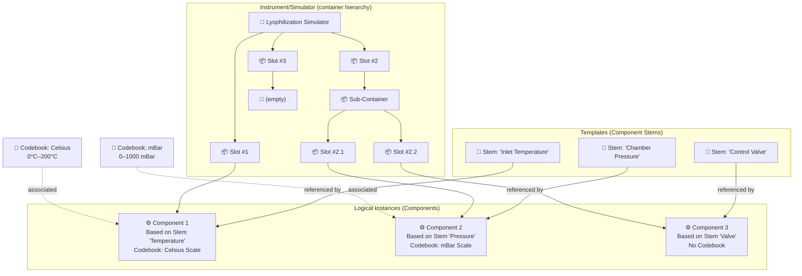
```mermaid
graph TD
    subgraph "Templates (Component Stems)"
        CS1["📄 Stem: 'Inlet Temperature'"]
        CS2["📄 Stem: 'Chamber Pressure'"]
        CS3["📄 Stem: 'Control Valve'"]
    end

    subgraph "Logical Instances (Components)"
        C1["⚙️ Component 1<br/>Based on Stem 'Temperature'<br/>Codebook: Celsius Scale"]
        C2["⚙️ Component 2<br/>Based on Stem 'Pressure'<br/>Codebook: mBar Scale"]
        C3["⚙️ Component 3<br/>Based on Stem 'Valve'<br/>No Codebook"]
    end

    subgraph "Instrument/Simulator (container hierarchy)"
        INST["🧪 Lyophilization Simulator"]
        S1["📦 Slot #1"]
        S2["📦 Slot #2"]
        S3["📦 Slot #3"]
        SUB["📦 Sub-Container"]
        SS1["📦 Slot #2.1"]
        SS2["📦 Slot #2.2"]
        EMPTY["🔲 (empty)"]
    end

    CS1 -->|"referenced by"| C1
    CS2 -->|"referenced by"| C2
    CS3 -->|"referenced by"| C3
    
    INST --> S1 --> C1
    INST --> S2 --> SUB
    SUB --> SS1 --> C2
    SUB --> SS2 --> C3
    INST --> S3 --> EMPTY

    CB1["📖 Codebook: Celsius<br/>0°C–200°C"]
    CB2["📖 Codebook: mBar<br/>0–1000 mBar"]
    
    CB1 -.->|"associated"| C1
    CB2 -.->|"associated"| C2
```
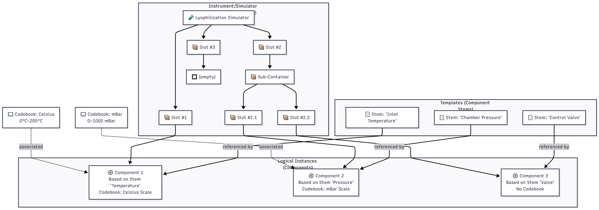
> _PNG equivalent of the Mermaid diagram above. Place the file with this name under docs/images/diagrams/en/._


---

## 2. What is a Component?

### Definition

A Component is an entity that:
- **Mandatorily references** a **Component Stem** (its template)
- **May have** an associated **Codebook** (response/value scheme)
- **Is associated** with a **Container Slot** (at any hierarchy level) within an Instrument/Simulator
- **Follows** the review workflow (Draft → Under Review → Current)
- **Has automatic** versioning

### Difference Between Component Stem and Component

| Aspect | Component Stem | Component |
|--------|---------------|-----------|
| **Nature** | Reusable template | Concrete instance |
| **Content** | Defines the "base text" (question, description) | Inherits content from the Stem |
| **Reusability** | Can be used by multiple Components | Belongs to a specific context |
| **Codebook** | Does not have a Codebook | May have an associated Codebook |
| **Slot** | Not associated with slots | Associated with a slot in an Instrument or sub-container |

---

## 3. Prerequisites

Before creating a Component, make sure that:

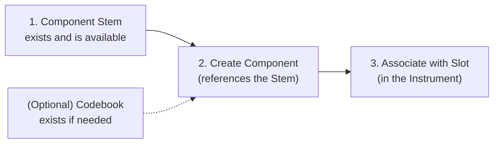
```mermaid
flowchart LR
    A["1. Component Stem<br/>exists and is available"] --> B["2. Create Component<br/>(references the Stem)"]
    B --> C["3. Associate with Slot<br/>(in the Instrument)"]
    
    CB["(Optional) Codebook<br/>exists if needed"] -.-> B
```
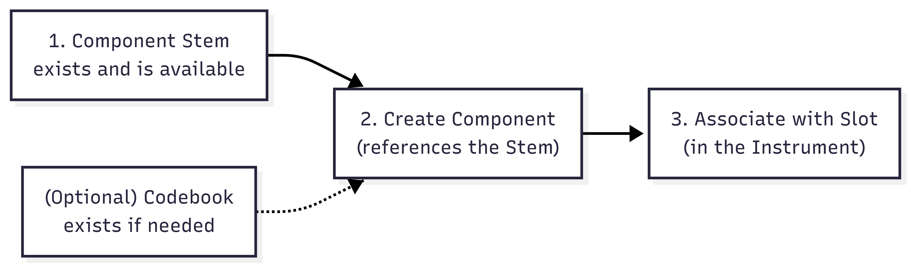
> _PNG equivalent of the Mermaid diagram above. Place the file with this name under docs/images/diagrams/en/._


| Prerequisite | Required? | Where to create? |
|--------------|-----------|-------------------|
| **Component Stem** | **Yes** | 🔗 [Section 3 - Component Stems](#3-component-stems) |
| **Codebook** | No | *Instrument Elements → Manage Elements → Manage Codebooks* |
| **Instrument/Simulator** (for slot association) | For association | 🔗 [Section 2 - Instruments / Simulators](#2-instruments--simulators) |

> ⚠️ **If you cannot find a suitable Component Stem**, you must create it first. Refer to 🔗 [Section 3 - Component Stems](#3-component-stems) and then return to this section.

---

## 4. Accessing Component Management

### Navigation Path

```
Main Menu → Instrument Elements → Manage Elements → Manage Component
```

**Direct URL:** `https://www.pmsr.net/sir/select/component/1/9`

### Steps:

📋 **Step 1.** In the navigation bar, click on **"Instrument Elements"**.

📋 **Step 2.** Hover over **"Manage Elements"**.

📋 **Step 3.** Click on **"Manage Component"**.

---

## 5. The Management Page (List)

### Available Filters

| Filter | Description | Options |
|--------|-------------|---------|
| **Text Filter** | Search by content or URI | Free text field |
| **Language** | Filter by language | All / English / etc. |
| **Status** | Filter by state | All Status / Draft / Under Review / Current / Deprecated |

### Table Columns

| Column | Description |
|--------|-------------|
| **URI** | Unique identifier (clickable link to the description page) |
| **Content** | Component content/label (inherited from the Stem) |
| **Version** | Version number |
| **Codebook** | Associated Codebook (if any) - clickable label |
| **Attribute Of** | "Attribute Of" reference (if configured) |
| **Status** | State: Draft, Under Review, Current, Deprecated |

### Action Buttons

| Button | Function | Condition |
|--------|----------|-----------|
| **Add New Component** | Creates a new Component | Always available |
| **Edit Selected** | Edits the selected Component | Requires selection |
| **Delete Selected** | Deletes the selected Component | With confirmation |
| **Send for Review** | Submits for review | Only for Draft state |

---

## 6. Creating a New Component

### Complete Creation Sequence

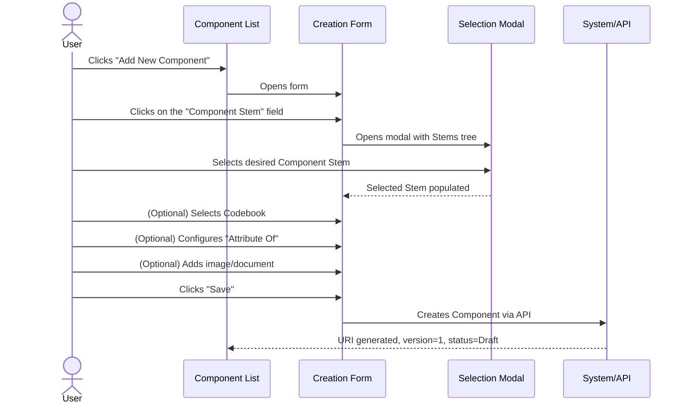
```mermaid
sequenceDiagram
    actor U as User
    participant L as Component List
    participant F as Creation Form
    participant M as Selection Modal
    participant S as System/API

    U->>L: Clicks "Add New Component"
    L->>F: Opens form
    U->>F: Clicks on the "Component Stem" field
    F->>M: Opens modal with Stems tree
    U->>M: Selects desired Component Stem
    M-->>F: Selected Stem populated
    U->>F: (Optional) Selects Codebook
    U->>F: (Optional) Configures "Attribute Of"
    U->>F: (Optional) Adds image/document
    U->>F: Clicks "Save"
    F->>S: Creates Component via API
    S-->>L: URI generated, version=1, status=Draft
```
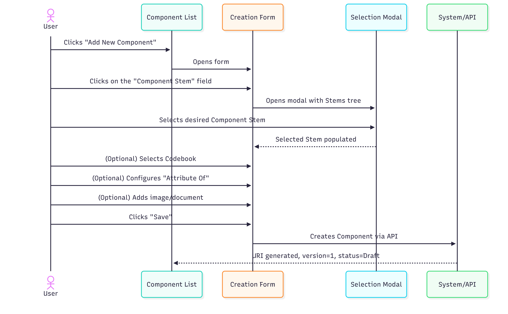
> _PNG equivalent of the Mermaid diagram above. Place the file with this name under docs/images/diagrams/en/._


### Detailed Steps

📋 **Step 1.** On the management page, click on **"Add New Component"**.

📋 **Step 2.** Fill in the form:

#### Creation Form Fields

| Field | Type | Required | Detailed Description |
|-------|------|----------|----------------------|
| **Component Stem** | Modal selection (tree) | **Yes** | The base template for this Component. Click on the field to open the modal with the tree of available Component Stems. Select the Stem that best matches the function of this Component. **If you cannot find a suitable Stem, close the form and create it first** (🔗 [Section 3 - Component Stems](#3-component-stems)). |
| **Codebook** | Autocomplete field | No | Response/value scheme associated with the Component. Start typing the Codebook name and select from the suggestion list. **E.g.:** "5-point Likert Scale", "Celsius Scale 0-200". Leave blank if the component does not require coded responses. |
| **Maker** | Autocomplete field | No | Manufacturer organization. |
| **Version** | Hidden (automatic) | Auto | Starts at 1. |
| **Attribute Of** | Modal selection (tree) | No | Optional: allows linking this Component as an attribute of another Component. Used to create measurement hierarchies (e.g., a sub-indicator belongs to a main indicator). |

#### Image Fields

| Field | Type | Description |
|-------|------|-------------|
| **Image Type** | Select | **URL** or **Upload** |
| **Image (URL)** | Textfield | Full image address (if URL) |
| **Upload Image** | File upload | PNG, JPG, JPEG. Maximum 2 MB |

#### Web Document Fields

| Field | Type | Description |
|-------|------|-------------|
| **Web Document Type** | Select | **URL** or **Upload** |
| **Web Document (URL)** | Textfield | Document address (if URL) |
| **Upload Document** | File upload | PDF, DOC, DOCX, TXT, XLS, XLSX. Maximum 2 MB |

📋 **Step 3.** Click on **"Save"**.

📋 **Step 4.** The Component is created with:
- **URI** generated automatically
- **Status** = Draft
- **Version** = 1

### Component Stem Selection (Modal)

When clicking on the **Component Stem** field, a modal (800px) opens with the hierarchical Stem tree:

```
vstoi:ComponentStem
├── vstoi:QuestionStem
│   ├── "How often do you...?"
│   ├── "Rate on a scale of 1 to 5..."
│   └── ...
├── vstoi:SensorReadingStem
│   ├── "Inlet temperature"
│   ├── "Chamber pressure"
│   └── ...
└── ...
```

Click on the desired Stem to select it. The field is populated automatically.

### Codebook Selection (Autocomplete)

In the **Codebook** field, start typing the Codebook name:

```
Codebook: [Likert Sc...]
           ├── 5-point Likert Scale (pmsr:/CB001)
           ├── 7-point Likert Scale (pmsr:/CB002)
           └── Likert Frequency (pmsr:/CB003)
```

Select the desired Codebook from the suggestion list. Each suggestion format includes the name and URI for clear identification.

---

## 7. Associating a Component with a Slot (Container Slot)

After creating a Component, it needs to be **associated with a Container Slot** within an Instrument/Simulator to become functional. This association can happen at the root instrument level or inside nested **sub-containers**.

### Association Methods

There are **two paths** to associate a Component with a Slot:

#### Method 1: From the Instrument (Recommended)

```mermaid
flowchart TD
    A["Open Instrument in Edit mode"] --> B["'Container Elements' section"]
    B --> C["Identify target slot<br/>(root or sub-container)"]
    C --> D["Click 'Edit Slot'"]
    D --> E["In the modal, select Component<br/>or Sub-Container"]
    E --> F["Click 'Update'"]
    F --> G{"Selected type?"}
    G -->|"Component"| H["✅ Component associated with slot"]
    G -->|"Sub-Container"| I["Open sub-container and repeat<br/>inside its sub-slots"]
```
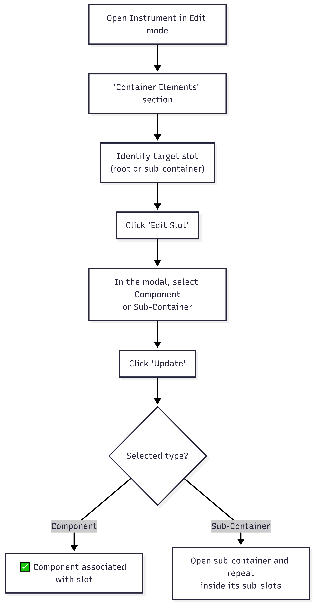
> _PNG equivalent of the Mermaid diagram above. Place the file with this name under docs/images/diagrams/en/._


📋 **Step 1.** Navigate to the Instrument editing page (🔗 see [Section 2 - Instruments / Simulators](#2-instruments--simulators), section 5).

📋 **Step 2.** In the **"Container Elements"** section, identify the slot to which you want to associate the Component.

📋 **Step 3.** Click the slot edit button (**"Edit Slot"** or pencil icon).

📋 **Step 4.** In the slot edit form, click on the **"Component"** field to open the selection modal.

📋 **Step 5.** Select the desired Component from the tree.

📋 **Step 6.** Click **"Update"** to confirm the association.

#### Method 2: Create Component Directly in the Slot

📋 **Step 1.** In the Slot edit form, instead of selecting an existing Component, click on **"New Item"**.

📋 **Step 2.** The system redirects to the Component creation form, already pre-configured for association with this slot.

📋 **Step 3.** Fill in the Component fields (as in [section 6](#6-creating-a-new-component)).

📋 **Step 4.** Upon saving, the Component is created AND automatically associated with the slot.

### Container Slot Edit Form

| Field | Type | Description |
|-------|------|-------------|
| **Slot URI** | Text (read-only) | Slot identifier |
| **Priority** | Text (read-only) | Slot order/priority within the Instrument |
| **Component** | Modal (tree) | Associated Component - click to select |

| Button | Function |
|--------|----------|
| **New Item** | Creates a new Component and associates it with this slot |
| **Reset this Item** | Removes the Component from the slot (slot becomes empty) |
| **Update** | Saves the association (active only with a Component selected) |
| **Cancel** | Closes without changes |

> ⚠️ **Recursive structure:** The edited slot can belong to the main container or to a sub-container. The hierarchy can be nested across multiple levels.

### Complete Structure Visualization

After associating Components with Slots, the "Container Elements" section of the Instrument shows:

```
📦 Container Elements of the Lyophilization Simulator
│
├── Slot #1 (Priority: 1)
│   └── ⚙️ Component: "Inlet Temperature" (Stem: 'Inlet Temp.', Codebook: Celsius)
│       [Edit Component] [Remove from Slot]
│
├── Slot #2 (Priority: 2)
│   └── 📦 Sub-Container: "Pressure Measurements"
│       ├── Slot #2.1 (Priority: 1)
│       │   └── ⚙️ Component: "Chamber Pressure" (Stem: 'Chamber Pressure', Codebook: mBar)
│       │       [Edit Component] [Remove from Slot]
│       └── Slot #2.2 (Priority: 2)
│           └── 📦 Sub-Container: "Fine Control"
│               └── Slot #2.2.1 (Priority: 1)
│                   └── ⚙️ Component: "Pillow Pressure" [Edit Component] [Remove from Slot]
│
├── Slot #3 (Priority: 3)
│   └── 🔲 (empty)
│       [Add Component or Sub-Container] [Edit Slot]
│
└── [+ Add More Slots]
```

---

## 8. Understanding Detectors and Actuators

In the context of PMSR and the VSTOI ontology, Components can assume different roles depending on their **hierarchical type** (defined by the Component Stem):

### Detectors

**What they are:** Components that function as **sensors, inputs, or data collectors**. They capture information from the environment or from the user.

| PMSR Examples | Description |
|---------------|-------------|
| Temperature Sensor | Collects the inlet fluid temperature |
| Questionnaire Question | Collects the participant's response |
| Pressure Sensor | Measures the chamber pressure |
| Input Field | Receives numerical data from the operator |

### Actuators

**What they are:** Components that function as **action, output, or control elements**. They produce effects on the system or the environment.

| PMSR Examples | Description |
|---------------|-------------|
| Control Valve | Controls fluid flow |
| Result Display | Presents calculated results |
| Threshold Alert | Triggers a notification when a value exceeds a limit |
| Mechanical Actuator | Activates a physical component of the simulator |

### How is the Classification Done?

The classification as Detector or Actuator is determined by the **Component Stem** selected, which belongs to a specific branch of the ontology:

```mermaid
graph TD
    ROOT["vstoi:ComponentStem"]
    ROOT --> DET["vstoi:ComponentStem<br/>(Detector branch)"]
    ROOT --> ACT["vstoi:ComponentStem<br/>(Actuator branch)"]
    
    DET --> D1["Temperature Sensor"]
    DET --> D2["Questionnaire Question"]
    DET --> D3["Measurement Field"]
    
    ACT --> A1["Control Valve"]
    ACT --> A2["Output Display"]
    ACT --> A3["Mechanical Actuator"]
```
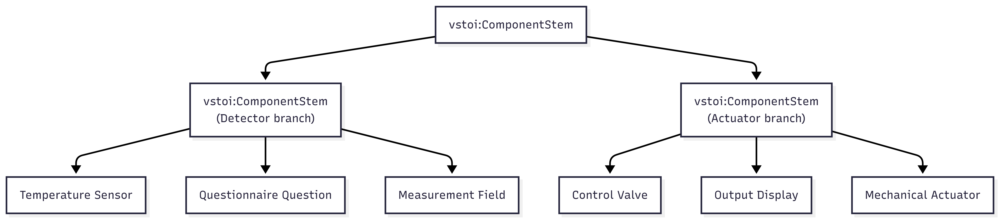
> _PNG equivalent of the Mermaid diagram above. Place the file with this name under docs/images/diagrams/en/._


> **In practice:** When creating a Component, the classification as Detector or Actuator is **implicit** - it depends on the selected Component Stem. Choose the correct Stem and the classification will be automatic.

> **Note:** The current system interface does not explicitly display "Detector" or "Actuator" as labels in the forms. The distinction is made at the ontology level and is visible in the type hierarchy when selecting the Component Stem in the tree modal.

---

## 9. Editing a Component

### How to Access

📋 **Step 1.** In the Component list, select the Component to edit.

📋 **Step 2.** Click on **"Edit Selected"**.

### Edit Form

The form includes all creation fields, with additions:

| Additional Element | Description |
|--------------------|-------------|
| **URI** | Read-only link to the description page |
| **Component Stem** | Editable via modal - the associated Stem can be changed |
| **Codebook** | Shows label + URI of the current Codebook; editable |
| **Version** | Automatically incremented if state is Current/Deprecated |
| **Review Notes** | Reviewer's notes (read-only, if any) |
| **Reviewer Email** | Reviewer's email (read-only) |

### Edit Flow

```mermaid
flowchart TD
    A["Select Component"] --> B{State?}
    B -->|Draft| C["Edit freely"]
    B -->|Current| D["New Draft version created<br/>(version incremented)"]
    B -->|Under Review| E["❌ Locked"]
    C --> F["Save"]
    D --> G["Edit the new version"]
    G --> F
    F --> H["Submit for Review"]
```
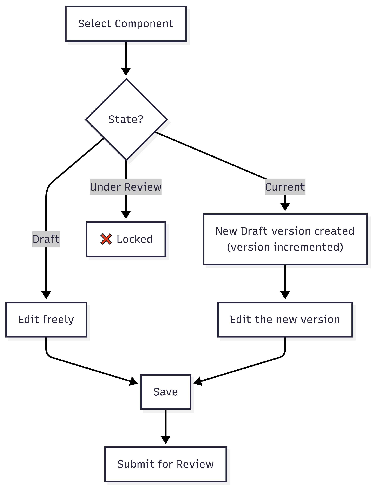
> _PNG equivalent of the Mermaid diagram above. Place the file with this name under docs/images/diagrams/en/._


---

## 10. Submitting for Review

### Steps

📋 **Step 1.** In the Component list, filter by **Status: Draft**.

📋 **Step 2.** Select the Component to submit.

📋 **Step 3.** Click on **"Send for Review"**.

📋 **Step 4.** Confirm: *"Are you sure you want to submit for Review selected entry?"*

📋 **Step 5.** The state changes to **Under Review**.

> **Note:** Components can also be submitted **automatically** when the Instrument containing them is submitted for review (recursive submission). See 🔗 [Section 2 - Instruments / Simulators](#2-instruments--simulators), section 7.

> ℹ️ **Note on permissions:** Submitting for review can be done by the element's author (authenticated user). Approval or rejection requires the **Content Editor** (Reviewer) permission.

---

## 11. The Review Process (Reviewer's Perspective)

> ⚠️ **Required permission:** This section describes actions available only to users with the **Content Editor** (Reviewer) role. It is included so you understand the full review workflow.

### Accessing the Review

```
Main Menu → Instrument Elements → Review Elements → Review Components
```

### Review Form

The Reviewer sees the Component in **read-only** mode:

1. **Component Details**: Associated Stem, Codebook, Attribute Of, version
2. **Reference links**: Clickable links to the associated Stem and Codebook
3. **Review Section**: Review Notes and Reviewer Email

### Reviewer Actions

| Action | Button | Notes Required? | Result |
|--------|--------|-----------------|--------|
| **Approve** | **Approve** | No | State → **Current** |
| **Reject** | **Reject** | **Yes** | State → **Draft** + reason notes |

### What the Reviewer Should Verify

| Aspect | What to Evaluate |
|--------|------------------|
| **Component Stem** | Is the selected Stem appropriate? Is it in Current state? |
| **Codebook** | Is the associated Codebook correct for this type of Component? |
| **Attribute Of** | Does the attribute relationship make sense in context? |
| **Completeness** | Are all necessary fields filled in? |

> ⚠️ **Recursive Instrument rejection:** If a Reviewer rejects an Instrument, all associated Components are automatically rejected as well. The Instrument's rejection notes are propagated.

---

## 12. Lifecycle and Versioning

```mermaid
stateDiagram-v2
    [*] --> Draft : Create
    Draft --> UnderReview : Submit for Review
    Draft --> UnderReview : (or via Instrument submission)
    UnderReview --> Current : Approve
    UnderReview --> Draft : Reject (with reason)
    Current --> Draft : Edit (new version)
    Current --> Deprecated : Deprecate
```
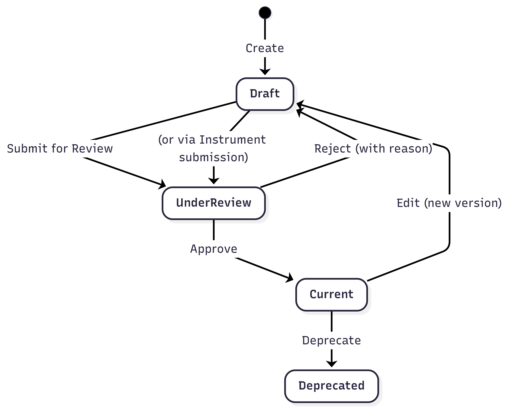
> _PNG equivalent of the Mermaid diagram above. Place the file with this name under docs/images/diagrams/en/._


### Relationship with the Instrument Lifecycle

```mermaid
graph TD
    subgraph "Instrument"
        I_DRAFT["Instrument: Draft"]
        I_REVIEW["Instrument: Under Review"]
        I_CURRENT["Instrument: Current"]
    end
    
    subgraph "Instrument's Components"
        C_DRAFT["Components: Draft"]
        C_REVIEW["Components: Under Review"]
        C_CURRENT["Components: Current"]
    end
    
    I_DRAFT -->|"Send for Review<br/>(recursive)"| I_REVIEW
    C_DRAFT -->|"automatic"| C_REVIEW
    
    I_REVIEW -->|"Approve"| I_CURRENT
    C_REVIEW -->|"automatic"| C_CURRENT
    
    I_REVIEW -->|"Reject<br/>(recursive)"| I_DRAFT
    C_REVIEW -->|"automatic"| C_DRAFT
```
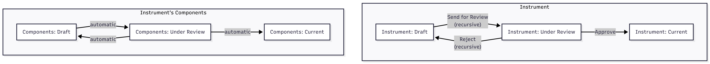
> _PNG equivalent of the Mermaid diagram above. Place the file with this name under docs/images/diagrams/en/._


---

## 13. Field Reference

### Complete Table - Creation Form

| Field | Technical Name | Type | Required | Default Value | Description |
|-------|---------------|------|----------|---------------|-------------|
| Component Stem | `component_stem` | Modal textfield | **Yes** | (empty) | Base template selected via modal tree |
| Codebook | `component_codebook` | Textfield + autocomplete | No | (empty) | Response/value scheme |
| Maker | `component_maker` | Textfield + autocomplete | No | (empty) | Manufacturer organization |
| Version | `component_version` | Hidden | Auto | 1 | Numeric version |
| Attribute Of | `component_isAttributeOf` | Modal textfield | No | (empty) | Parent component (attribute hierarchy) |
| Image Type | `component_image_type` | Select | No | (empty) | URL or Upload |
| Image URL | `component_image_url` | Textfield | Conditional | (empty) | Image URL |
| Image Upload | `component_image_upload` | Managed file | Conditional | (empty) | PNG/JPG/JPEG, max 2MB |
| Web Doc Type | `component_webdocument_type` | Select | No | (empty) | URL or Upload |
| Web Doc URL | `component_webdocument_url` | Textfield | Conditional | (empty) | Document URL |
| Web Doc Upload | `component_webdocument_upload` | Managed file | Conditional | (empty) | PDF/DOC/DOCX/TXT/XLS/XLSX, max 2MB |

### Route Parameters (Contextual)

| Parameter | Encoding | Description |
|-----------|----------|-------------|
| `{sourcecomponenturi}` | Base64 | Source Component URI (for derivation) |
| `{containersloturi}` | Base64 | Destination slot URI (for direct association) |

---

## 14. Troubleshooting

| Problem | Possible Cause | Solution |
|---------|----------------|----------|
| I cannot find the Component Stem I need | The Stem may not exist | Create it first: 🔗 [Section 3 - Component Stems](#3-component-stems) |
| The Codebook field does not show suggestions | No Codebooks have been created or the search term does not match | Check in *Manage Codebooks* whether Codebooks exist. Create one if needed. |
| I cannot associate the Component with the Slot | The slot may already be occupied or the Component is not correctly selected | Use "Reset this Item" on the slot to free it, then select again |
| The Component was rejected | Individual or recursive rejection (via Instrument) | Check the Review Notes in the edit form |
| "Attribute Of" - I don't know what to select | Optional field for measurement hierarchies | Leave blank unless the Component is a sub-attribute of another one |
| The "Update" button on the slot is disabled | No Component was selected in the modal | Open the Component field modal and select an item |

---

🔗 **Internal Navigation:**
[Component Stems](#3-component-stems) • [Instruments / Simulators](#2-instruments--simulators) • [Instrument / Simulator Instances](#5-instrument--simulator-instances) • [Internal Table of Contents](#internal-table-of-contents)

---

## 5. Instrument / Simulator Instances

**Module:** DPL (Deployment)  
**PMSR Context:** Instances represent physical/concrete units of a Simulator

---

## 1. Overview

An **Instrument Instance** (or **Simulator Instance** in PMSR) represents a **physical or concrete unit** of a previously defined and approved Instrument/Simulator. While the Instrument is the "definition" (the design), the Instance is a "real copy" of that design - a specific piece of equipment, with a serial number, acquisition date, owner, etc.

### Analogy

| Concept | Analogy |
|---------|---------|
| **Instrument/Simulator** | The *model* of a car (e.g., Toyota Corolla 2026) |
| **Instrument Instance** | A *specific car* of that model (e.g., license plate AA-00-BB, purchased on 03/15/2026) |

### Position in the General Flow

```mermaid
graph LR
    A["1. Define Instrument<br/>(Draft → Current)"] --> B["2. Create Instance<br/>(physical unit)"]
    B --> C["3. Deploy<br/>(associate with Platform Instance)"]
    
    style A fill:#90EE90
    style B fill:#87CEEB
    style C fill:#DDA0DD
```
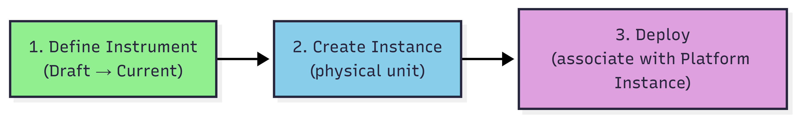
> _PNG equivalent of the Mermaid diagram above. Place the file with this name under docs/images/diagrams/en/._


> **Important note:** Instrument Instances **do not follow the review flow** (Draft → Under Review → Current). They are created directly as operational records. The review flow applies only to the **definition** of the Instrument/Simulator.

> 📘 **Why create Instances?**
>
> In Manual 01, you created an **Instrument/Simulator** - this is the **model (definition/design)**, which describes the structure, slots, and components. It's like the engineering blueprint for a machine.
>
> An **Instance** is a **concrete physical unit** of that model. Each real machine in your laboratory is an instance:
> - The model "Lyophilization Simulator LF-2000" is defined **once**, approved once.
> - But you may have **3 physical machines** of that model: #SN-001 in Room 101, #SN-002 in Room 205, #SN-003 on the production line.
>
> Each instance has its own **serial number**, **owner**, and can be **deployed** (associated with a specific laboratory for operation).
>
> **Analogy:** The model is like a car model (e.g., "Toyota Corolla 2025"). The instance is the specific car you bought, with its own license plate and mileage.

---

## 2. What is an Instrument/Simulator Instance?

An Instance contains:
- **Reference to the source Instrument/Simulator** (the type/design)
- **Identification number** (serial number / ID)
- **Acquisition date**
- **Owner** (organization)
- **Maintenance responsible** (person)
- **Status** (operational or damaged)
- **Additional description**

### Relationship with Deployments

```mermaid
graph TD
    INST["🧪 Simulator: Lyophilizer LF-2000<br/><i>(approved definition - Current)</i>"]
    
    INST -->|"instantiated"| I1["📋 Instance #SN-001<br/>Acquired: 2025-01-15<br/>Owner: PMSR Lab"]
    INST -->|"instantiated"| I2["📋 Instance #SN-002<br/>Acquired: 2025-06-20<br/>Owner: Partner Lab"]
    
    PLAT["🏭 Platform Instance: Lab A"]
    
    I1 -->|"deployed at"| DEP["🔗 Deployment<br/>Simulator #SN-001 @ Lab A"]
    PLAT -->|"deployed at"| DEP
```
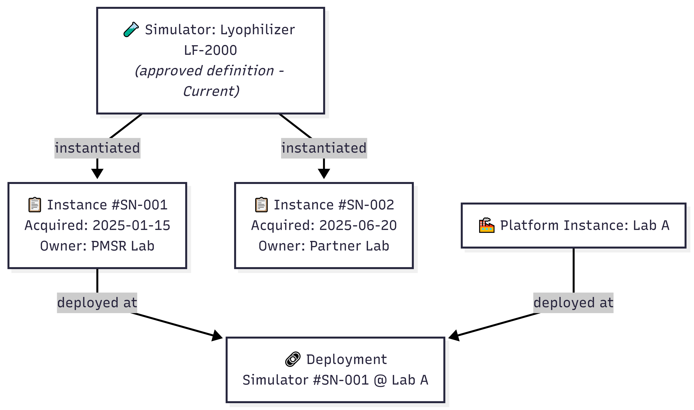
> _PNG equivalent of the Mermaid diagram above. Place the file with this name under docs/images/diagrams/en/._


---

## 3. Prerequisites

| Prerequisite | Required? | Description |
|--------------|-----------|-------------|
| **Instrument/Simulator in Current state** | **Yes** | You can only instantiate Instruments that have been approved (Current state). See 🔗 [Section 2 - Instruments / Simulators](#2-instruments--simulators) |
| **Platform Instance** | For deploy | Only required if you want to create a Deployment. See 🔗 [Section 7 - Platform / Laboratory Instances](#7-platform--laboratory-instances) |

---

## 4. Accessing Instance Management

### Navigation Path

```
Main Menu → Deployment Elements → Manage Elements → Manage Instrument Instances
```

> **PMSR Note:** The menu may show **"Manage Simulator Instances"** depending on the Preferred Names configuration, as configured by the system administrator.

**Direct URL:** `https://www.pmsr.net/dpl/select/instrumentinstance/1/9`

### Steps:

📋 **Step 1.** In the navigation bar, click on **"Deployment Elements"**.

📋 **Step 2.** Hover over **"Manage Elements"**.

📋 **Step 3.** Click on **"Manage Instrument Instances"** (or "Manage Simulator Instances").

---

## 5. The Management Page (List)

### View Modes

| Button | Description |
|--------|-------------|
| **Table View** | Table view |
| **Card View** | Card view |

### Table Columns

Columns are dynamically generated by the system. They typically include:

| Column | Description |
|--------|-------------|
| **URI** | Unique identifier of the instance |
| **Type** | Type of the source Instrument/Simulator |
| **ID Number** | Serial number / identification |
| **Label** | Automatically generated name (format: "Type with #ID (serial_number)") |
| **Owner** | Owner organization |
| **Status** | Operational status |

### Action Buttons

| Button | Function |
|--------|----------|
| **Add New [Simulator] Instance** | Opens creation form (modal) |
| **Back** | Returns to previous page |
| **Load More** | Loads more items (card view) |

---

## 6. Creating a New Instance

> 🔑 **Required Role:** You must be an **authenticated user** (User / Author) to create Instrument/Simulator instances.

### Creation Sequence

```mermaid
sequenceDiagram
    actor U as User
    participant L as Instance List
    participant M as Creation Modal
    participant T as Type Modal (Tree)
    participant S as System/API

    U->>L: Clicks "Add New Simulator Instance"
    L->>M: Opens modal form
    U->>M: Clicks "Simulator Type" field
    M->>T: Opens Instruments/Simulators tree
    U->>T: Selects the desired Simulator
    T-->>M: Type filled in
    U->>M: Fills in ID Number
    U->>M: (Optional) Acquisition date, Owner, etc.
    U->>M: Clicks "Save"
    M->>S: Creates instance via API
    S-->>L: Instance created with auto-generated label
```
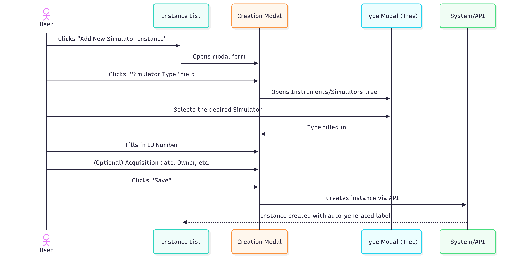
> _PNG equivalent of the Mermaid diagram above. Place the file with this name under docs/images/diagrams/en/._


### Detailed Steps

📋 **Step 1.** On the management page, click on **"Add New Simulator Instance"** (or "Add New Instrument Instance").

📋 **Step 2.** A **modal form** (overlay window) opens.

📋 **Step 3.** Fill in the fields:

#### Creation Form Fields

| Field | Type | Required | Detailed Description |
|-------|------|----------|----------------------|
| **Simulator Type** (or Instrument Type) | Selection by modal (tree) | **Yes** | The Instrument/Simulator that this instance represents. Click to open the type tree. **Only elements in Current state are shown.** Select the specific design (e.g., "Lyophilizer LF-2000 v2"). |
| **ID Number** | Text field | **Yes** | Serial number or unique identification of this physical unit. **Examples:** "SN-001", "LF2000-PT-003", "EQ-2026-0042". This number must be unique and allow physical identification of the equipment. |
| **Acquisition Date** | Date picker | No | Date when this equipment was acquired/received. Format: calendar with day selection. |
| **Owner** | Field with autocomplete | No | Organization that owns the equipment. Start typing and select from the list of organizations registered in the system. |
| **Maintainer** | Field with autocomplete | No | Person responsible for equipment maintenance. Start typing and select from the list of people. |
| **Description** | Text area | No | Additional notes about this instance: location, condition, operational notes, etc. |

📋 **Step 4.** Click **"Save"**.

📋 **Step 5.** The instance is created with:
- **URI** automatically generated
- **Label** automatically generated in the format: `"[Type] with #ID ([serial_number])"`
  - Example: "Lyophilizer LF-2000 with #ID (SN-001)"
- **Version** = 1

### Type Selection (Modal)

When clicking on the type field, the modal shows the Instruments/Simulators tree in **Current** state:

```
Available Instruments / Simulators
├── Lyophilizer LF-2000 v2 (Current)
├── Compression Simulator SC-500 v1 (Current)
├── PHQ-9 Questionnaire v3 (Current)
└── ...
```

> ⚠️ **Only Instruments/Simulators in Current state** appear in the list. If the design you need does not appear, make sure it has been approved (see 🔗 [Section 2 - Instruments / Simulators](#2-instruments--simulators)).

---

## 7. Editing an Instance

> 🔑 **Required Role:** You must be an **authenticated user** (User / Author) to edit Instrument/Simulator instances.

### How to Access

📋 **Step 1.** In the instance list, select the instance to edit.

📋 **Step 2.** Click the edit button (pencil icon or "Edit").

### Edit Form

The form includes all the creation fields, plus:

| Additional Field | Type | Description |
|-----------------|------|-------------|
| **Damaged** | Checkbox | Check if the equipment is damaged |
| **Damage Date** | Date picker | Date of damage (visible only when Damaged is checked) |

### Editable Fields

| Field | Editable? | Notes |
|-------|-----------|-------|
| Simulator Type | Yes | You can change the source type/design |
| ID Number | Yes | You can correct the serial number |
| Acquisition Date | Yes | |
| Owner | Yes | |
| Maintainer | Yes | |
| Description | Yes | |
| Damaged | Yes | Check/uncheck damage status |
| Damage Date | Conditional | Appears only when Damaged is checked |

📋 After editing, click **"Save"** to save the changes.

---

## 8. Deployments - Associating Instances

> 🔑 **Required Role:** You must be an **authenticated user** (User / Author) to create and manage Deployments.

After creating instances of Instruments/Simulators and Platforms/Laboratories, you can create **Deployments** to associate a Simulator with a Laboratory.

### What is a Deployment?

A **Deployment** is the record that an Instrument/Simulator instance is **installed/operational** at a Platform/Laboratory instance.

```mermaid
graph LR
    II["📋 Simulator Instance<br/>#SN-001"] --> DEP["🔗 Deployment<br/><i>'Lyophilizer #SN-001 @ Lab A'</i>"]
    PI["🏭 Platform Instance<br/>Lab A"] --> DEP
```
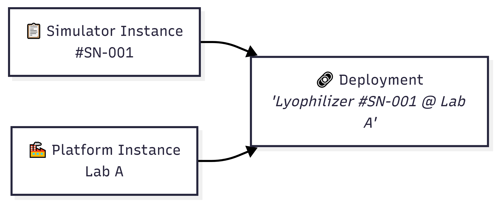
> _PNG equivalent of the Mermaid diagram above. Place the file with this name under docs/images/diagrams/en/._


### Creating a Deployment

```
Main Menu → Deployment Elements → Manage Elements → Manage Deployments
```

📋 **Step 1.** In Deployment management, click on **"Add New Deployment"**.

📋 **Step 2.** Fill in:

| Field | Type | Required | Description |
|-------|------|----------|-------------|
| **Platform Instance** | Autocomplete | **Yes** | The Platform/Laboratory instance where the equipment is installed |
| **Simulator Instance** | Autocomplete | **Yes** | The Instrument/Simulator instance to install |
| **Version** | Automatic | Auto | Version 1 |
| **Description** | Textarea | No | Notes about the deployment |

📋 **Step 3.** Click **"Save"**.

The system automatically generates the label: `"[Instrument Label] @ [Platform Label]"`.

---

## 9. Field Reference

### Creation Form - Complete Fields

| Field | Technical Name | Type | Required | Description |
|-------|---------------|------|----------|-------------|
| Type | `instance_type` | Modal textfield | Yes | Source Instrument/Simulator |
| ID Number | `instance_serial_number` | Textfield | Yes | Unique serial number |
| Acquisition Date | `instance_acquisition_date` | Date | No | Acquisition date |
| Owner | `instance_owner` | Textfield + autocomplete | No | Owner organization |
| Maintainer | `instance_maintainer` | Textfield + autocomplete | No | Person responsible for maintenance |
| Description | `instance_description` | Textarea | No | Additional notes |

### Edit Form - Additional Fields

| Field | Technical Name | Type | Description |
|-------|---------------|------|-------------|
| Damaged | `instance_damaged` | Checkbox | Equipment damage status |
| Damage Date | `instance_damage_date` | Date | Date of damage (conditional) |

---

## 10. Troubleshooting

| Problem | Possible Cause | Solution |
|---------|----------------|----------|
| The Instrument/Simulator I need does not appear in the type selection | The Instrument is not in Current state | Submit the Instrument for review and wait for approval. See 🔗 [Section 2 - Instruments / Simulators](#2-instruments--simulators) |
| The creation form appears as a very small modal | Normal behavior for instances | Instance creation uses a modal form (compact) |
| I cannot create a Deployment | Missing Platform or Instrument instances | Create both instances first: 🔗 [Section 7 - Platform / Laboratory Instances](#7-platform--laboratory-instances) |
| The Owner/Maintainer field does not show suggestions | The Social module is not active or there are no registered organizations/people | Contact the administrator to check the Social module |
| The generated label is not correct | The ID Number may be incorrect | Edit the instance and correct the ID Number field |

---

🔗 **Internal Navigation:**
[Instruments / Simulators](#2-instruments--simulators) • [Platforms / Laboratories](#6-platforms--laboratories) • [Platform / Laboratory Instances](#7-platform--laboratory-instances) • [Internal Table of Contents](#internal-table-of-contents)

---

## 6. Platforms / Laboratories

**Module:** DPL (Deployment)  
**PMSR Context:** In PMSR, "Platform" can represent a **"Laboratory"** or operational site

---

## 1. Overview

A **Platform** (or **Laboratory** in the PMSR context) represents a **location, space, or infrastructure equipment** where instruments/simulators operate and data is collected. In PMSR, Platforms typically correspond to laboratories, simulation rooms, or industrial units.

### Position in the General Flow

```mermaid
graph TD
    subgraph "Definitions"
        PLAT["🏭 Platform / Laboratory<br/><i>(site/equipment design)</i>"]
        INST["🧪 Instrument / Simulator<br/><i>(instrument design)</i>"]
    end
    
    subgraph "Instances"
        PI["🏭 Platform Instance<br/><i>(concrete site)</i>"]
        II["📋 Instrument Instance<br/><i>(concrete equipment)</i>"]
    end
    
    subgraph "Operation"
        DEP["🔗 Deployment<br/><i>(instrument operational at a site)</i>"]
    end
    
    PLAT -->|"instantiated"| PI
    INST -->|"instantiated"| II
    PI --> DEP
    II --> DEP
    
    style PLAT fill:#FFD700
    style PI fill:#87CEEB
```
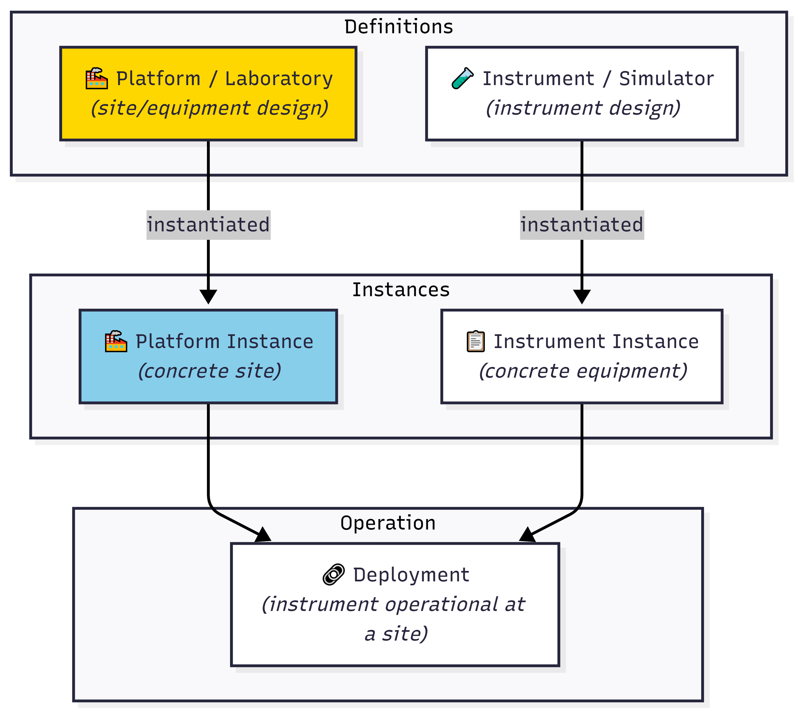
> _PNG equivalent of the Mermaid diagram above. Place the file with this name under docs/images/diagrams/en/._


> **Note:** Unlike Instruments and Components, Platforms **do not follow the full review flow** (Draft → Under Review → Current). Platform management is more streamlined.

> 📘 **Model vs. Instance:** A Platform/Laboratory is a **model (definition)** - it describes the type of platform or laboratory (e.g., "Lyophilization Laboratory Type A"). To register a **specific, concrete laboratory** (e.g., "Lyophilization Laboratory, Building B, Room 203"), create an **Instance** - see [Section 7 - Platform / Laboratory Instances](#7-platform--laboratory-instances). The same model can have multiple instances across different locations.

---

## 2. What is a Platform / Laboratory?

### Definition

A Platform defines:
- **Hierarchical type** in the ontology (e.g., Laboratory, Clean Room, Production Floor)
- **Name** of the location or equipment
- **Version** of the design
- **Description** of the purpose and characteristics

### Examples in PMSR

| Type | Platform Example | Description |
|------|------------------|-------------|
| Laboratory | PMSR Lab - Room 101 | Main pharmaceutical simulation laboratory |
| Clean Room | Clean Room Class 100 | Clean room for sterile production |
| Industrial Unit | Production Line PL-3 | Lyophilized production line |
| Workstation | Control Station CS-2 | Process control station |

### Type Hierarchy

The Platform type selection is done through a **hierarchical tree** from the ontology:

```mermaid
graph TD
    ROOT["Platform Types"]
    ROOT --> LAB["Laboratory"]
    ROOT --> PROD["Production Facility"]
    ROOT --> FIELD["Field Station"]
    
    LAB --> LAB1["Research Laboratory"]
    LAB --> LAB2["Quality Control Lab"]
    LAB --> LAB3["Clean Room"]
    
    PROD --> PROD1["Manufacturing Line"]
    PROD --> PROD2["Packaging Line"]
    
    FIELD --> FIELD1["Remote Monitoring Station"]
    FIELD --> FIELD2["Mobile Unit"]
```

> _PNG equivalent of the Mermaid diagram above. Place the file with this name under docs/images/diagrams/en/._


> In the PMSR context, "Laboratory" is typically the most commonly used type. The displayed naming depends on the **Preferred Names** configuration.

---

## 3. Accessing Platform Management

### Navigation Path

```
Main Menu → Deployment Elements → Manage Elements → Manage Platforms
```

**Direct URL:** `https://www.pmsr.net/dpl/select/platform/1/9`

### Steps:

📋 **Step 1.** In the main navigation bar, click on **"Deployment Elements"**.

📋 **Step 2.** Hover over **"Manage Elements"**.

📋 **Step 3.** Click on **"Manage Platforms"**.

---

## 4. The Management Page (List)

### View Modes

| Button | Description |
|--------|-------------|
| **Table View** | Table view (recommended) |
| **Card View** | Card view |

### Table Columns

| Column | Description |
|--------|-------------|
| **URI** | Unique identifier of the Platform |
| **Name** | Name of the Platform/Laboratory |
| **Version** | Design version |

### Action Buttons

| Button | Function |
|--------|----------|
| **Add New Platform** | Opens the creation form |
| **Back** | Returns to the previous page |
| **Load More** | Loads more items (card view) |

---

## 5. Creating a New Platform / Laboratory

### Creation Sequence

```mermaid
sequenceDiagram
    actor U as User
    participant L as Platform List
    participant F as Creation Form
    participant T as Type Modal (Tree)
    participant S as System/API

    U->>L: Clicks "Add New Platform"
    L->>F: Opens form
    U->>F: Clicks "Platform Type" field
    F->>T: Opens type tree
    U->>T: Selects type (e.g., Laboratory)
    T-->>F: Type populated
    U->>F: Fills in Name
    U->>F: (Optional) Description
    U->>F: Clicks "Save"
    F->>S: Creates Platform via API
    S-->>L: Platform created
```
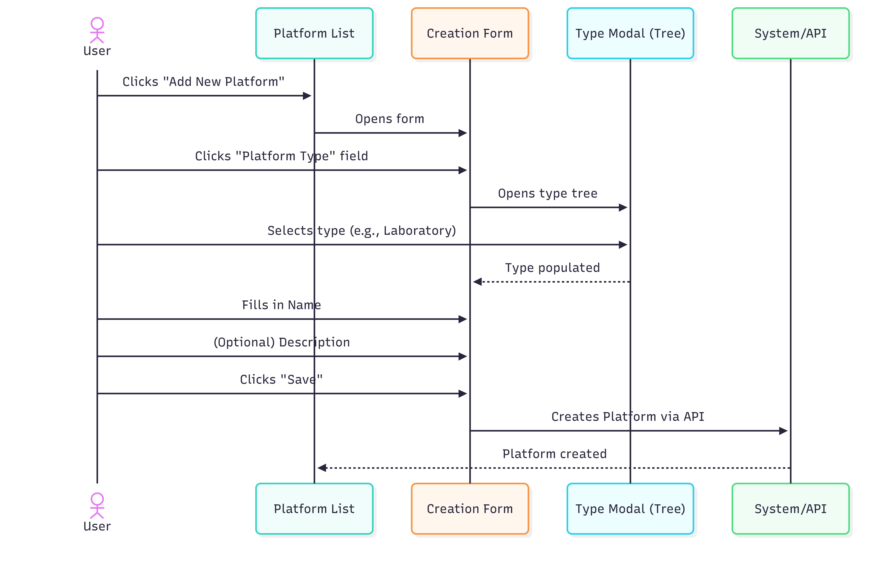
> _PNG equivalent of the Mermaid diagram above. Place the file with this name under docs/images/diagrams/en/._


> 🔐 **Required permission:** Creating and editing Platforms/Laboratories requires an authenticated user.

### Detailed Steps

📋 **Step 1.** On the management page, click **"Add New Platform"**.

📋 **Step 2.** The creation form opens.

📋 **Step 3.** Fill in the fields:

#### Form Fields

| Field | Type | Required | Detailed Description |
|-------|------|----------|----------------------|
| **Platform Type** | Selection via modal (tree) | **Yes** | Defines the hierarchical type of the Platform. When clicked, a modal window (800px) opens with the tree of available types in the ontology. **In PMSR, typically select "Laboratory" or the most specific subtype.** The tree shows the entire hierarchy of Platform types defined in the system. |
| **Name** | Text field | **Yes** | Descriptive and identifiable name for the Platform/Laboratory. Must be unique and clear. **Examples:** "PMSR Simulation Laboratory - Room 101", "GMP Clean Room - Building B", "Main Control Station CS-Main". |
| **Version** | Field (read-only) | Auto | Starts at 1. Not editable by the user. Increments automatically on subsequent edits. |
| **Description** | Text area | No | Detailed description of the Platform: physical location, capabilities, fixed equipment, access restrictions, environmental conditions, etc. |

📋 **Step 4.** Click **"Save"** to create.

📋 **Step 5.** The Platform is created and the system redirects to the management list.

### Platform Type Selection (Modal)

When clicking the **Platform Type** field, the modal displays the hierarchical tree:

```
Platform Types (Ontology)
├── 🏭 Laboratory
│   ├── Research Laboratory
│   ├── Quality Control Laboratory
│   ├── Clinical Laboratory
│   └── Clean Room
├── 🏗️ Production Facility
│   ├── Manufacturing Line
│   └── Packaging Area
├── 📡 Field Station
│   ├── Remote Monitoring Station
│   └── Mobile Unit
└── 💻 Workstation
    ├── Control Station
    └── Analysis Terminal
```

**To select:** Navigate through the tree and click on the desired type. The field is automatically populated and the modal closes.

> **PMSR Tip:** For most PMSR scenarios, select **"Laboratory"** or one of its subtypes. Consult the team if you are unsure which type to use.

---

## 6. Editing a Platform / Laboratory

> 🔐 **Required permission:** Creating and editing Platforms/Laboratories requires an authenticated user.

### How to Access

📋 **Step 1.** In the Platform list, locate the Platform you wish to edit.

📋 **Step 2.** Select it (radio button or click).

📋 **Step 3.** Click the edit button (or double-click).

### Edit Form

The form is similar to the creation form, with all fields editable:

| Field | Editable? | Notes |
|-------|-----------|-------|
| **Platform Type** | Yes | You can change the type via the tree modal |
| **Name** | Yes | You can change the name |
| **Version** | Read-only | Increments automatically if the current version is Current/Deprecated |
| **Description** | Yes | You can update the description |

### Buttons

| Button | Function |
|--------|----------|
| **Update** | Saves the changes |
| **Cancel** | Discards and returns to the list |

### Edit Flow

```mermaid
flowchart TD
    A["Select Platform from List"] --> B["Open Edit Form"]
    B --> C["Change fields as needed"]
    C --> D{"Save?"}
    D -->|Yes| E["Click Update"]
    D -->|No| F["Click Cancel"]
    E --> G["Changes saved<br/>Redirects to list"]
    F --> G
```
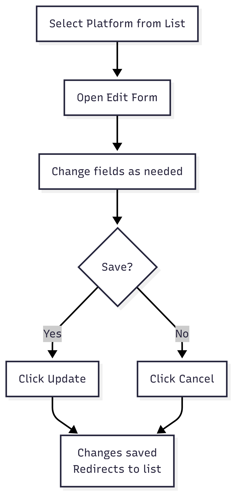
> _PNG equivalent of the Mermaid diagram above. Place the file with this name under docs/images/diagrams/en/._


---

## 7. Field Reference

### Creation and Edit Form

| Field | Technical Name | HTML Type | Required | Default Value | Validation |
|-------|---------------|-----------|----------|---------------|------------|
| Platform Type | `platform_type` | Modal textfield | Yes | (empty) | Valid ontology URI |
| Name | `platform_name` | Textfield | Yes | (empty) | Not empty |
| Version | `platform_version` | Textfield (disabled) | Auto | 1 | Positive integer, managed by the system |
| Description | `platform_description` | Textarea | No | (empty) | - |

### Comparison with Instruments

| Aspect | Platform | Instrument |
|--------|----------|------------|
| **Number of fields** | 4 (simple) | 15+ (complex) |
| **Image/Document** | No | Yes |
| **Review flow** | No | Yes (Draft → Under Review → Current) |
| **Container Slots** | No | Yes |
| **Maker/Language** | No | Yes |

---

## 8. Troubleshooting

| Problem | Possible Cause | Solution |
|---------|----------------|----------|
| The Platform Type modal is empty | Connection issue with the ontology | Contact the system administrator |
| Cannot find the "Laboratory" type | The ontology may not have this exact subtype | Browse through the tree or contact the administrator to verify the available types |
| I want to add more details to the Platform | The form only has 4 fields | Use the Description field to include detailed information. Operational details are managed in Instances (🔗 [Section 7 - Platform / Laboratory Instances](#7-platform--laboratory-instances)) |
| The version incremented on its own | Expected behavior when editing Current versions | Normal: the system creates a new version automatically |
| Cannot delete the Platform | There may be associated instances | Delete the associated instances and deployments first |

---

🔗 **Internal Navigation:**
[Platform / Laboratory Instances](#7-platform--laboratory-instances) • [Instruments / Simulators](#2-instruments--simulators) • [Instrument / Simulator Instances](#5-instrument--simulator-instances) • [Internal Table of Contents](#internal-table-of-contents)

---

## 7. Platform / Laboratory Instances

**Module:** DPL (Deployment)  
**PMSR Context:** Instances represent physical/concrete units of a Laboratory

---

## 1. Overview

A **Platform Instance** (or **Laboratory Instance** in PMSR) represents a **concrete physical unit** of a previously defined Platform. While the Platform is the "design" or "type" of the location/infrastructure, the Instance is the **actual, specific, and identifiable location**.

### Analogy

| Concept | Analogy |
|---------|---------|
| **Platform / Laboratory** | The *blueprint* of a laboratory type (e.g., "Class 100 Clean Room") |
| **Platform Instance** | A *concrete laboratory* of that type (e.g., "Clean Room - Bldg. B, Room 204, ID: CR-204") |

### Position in the Pipeline

```mermaid
graph LR
    A["1. Define Platform<br/>(type/design)"]
    B["2. Create Instance<br/>(concrete location)"]
    C["3. Deploy<br/>(associate simulator instance)"]
    
    A --> B --> C
    
    style A fill:#FFD700
    style B fill:#87CEEB
    style C fill:#DDA0DD
```
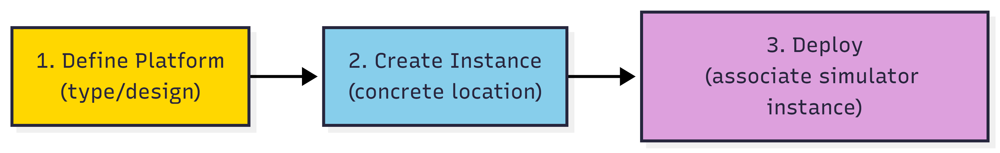
> _PNG equivalent of the Mermaid diagram above. Place the file with this name under docs/images/diagrams/en/._


> 📘 **Why create Instances?**
>
> In Manual 05, you created a **Platform/Laboratory** - this is the **model (definition)**, which describes the type of platform or laboratory. It's like the standard blueprint for a laboratory.
>
> An **Instance** is a **specific, concrete laboratory** of that model:
> - The model "Lyophilization Laboratory Type A" is defined **once**.
> - But you may have **2 physical laboratories** of that type: one in Building B, Room 203 and another in Building D, Room 105.
>
> Each instance has its own **location**, **responsible person**, and can receive **deployments** (association of instrument/simulator instances).
>
> **Analogy:** The model is like the type of classroom (e.g., "Chemistry Laboratory"). The instance is the specific room (e.g., "Chemistry Lab, Block C, Room 301").

---

## 2. What is a Platform / Laboratory Instance?

A Platform Instance records:
- **Reference to the type** of Platform (the design/category)
- **Identification number** (unique ID of the location)
- **Acquisition/creation date**
- **Owner** (organization)
- **Maintenance responsible** (maintainer)
- **Status** (operational or damaged)
- **Operational description**

### Relationship with Deployments

```mermaid
graph TD
    PLAT["🏭 Platform: Class 100 Clean Room<br/><i>(definition/type)</i>"]
    
    PLAT -->|"instantiated"| PI1["🏭 Instance: CR-Room-204<br/>ID: CR-204<br/>Owner: Production Dept."]
    PLAT -->|"instantiated"| PI2["🏭 Instance: CR-Room-305<br/>ID: CR-305<br/>Owner: QC Dept."]
    
    II["📋 Simulator Instance<br/>#SN-001"]
    
    PI1 --> DEP["🔗 Deployment<br/>Simulator #SN-001 @ CR-Room-204"]
    II --> DEP
    
    style PLAT fill:#FFD700
    style PI1 fill:#87CEEB
    style PI2 fill:#87CEEB
```
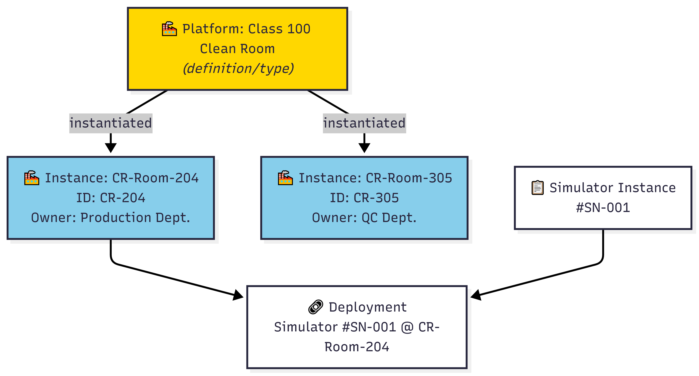
> _PNG equivalent of the Mermaid diagram above. Place the file with this name under docs/images/diagrams/en/._


---

## 3. Prerequisites

| Prerequisite | Required? | Description |
|-------------|-----------|-------------|
| **Platform / Laboratory defined** | **Yes** | The Platform must exist in the system. See 🔗 [Section 6 - Platforms / Laboratories](#6-platforms--laboratories) |
| **Instrument/Simulator Instance** | For deploy | Only needed to create Deployments. See 🔗 [Section 5 - Instrument / Simulator Instances](#5-instrument--simulator-instances) |

---

## 4. Accessing Instance Management

### Navigation Path

```
Main Menu → Deployment Elements → Manage Elements → Manage Platform Instances
```

**Direct URL:** `https://www.pmsr.net/dpl/select/platforminstance/1/9`

### Steps:

📋 **Step 1.** In the navigation bar, click on **"Deployment Elements"**.

📋 **Step 2.** Hover over **"Manage Elements"**.

📋 **Step 3.** Click on **"Manage Platform Instances"**.

---

## 5. The Management Page (List)

### View Modes

| Button | Description |
|--------|-------------|
| **Table View** | Table view (recommended for management) |
| **Card View** | Card view with a more compact layout |

### Table Columns

| Column | Description |
|--------|-------------|
| **URI** | Unique identifier of the instance |
| **Type** | Source Platform type |
| **ID Number** | Location identification number |
| **Label** | Automatically generated name |
| **Owner** | Owning organization |
| **Status** | Operational status |

### Action Buttons

| Button | Function |
|--------|----------|
| **Add New Platform Instance** | Opens the creation form (modal) |
| **Back** | Returns to the previous page |
| **Load More** | Loads more items (card view) |

---

## 6. Creating a New Instance

> 🔐 **Required permission:** Creating instances requires an authenticated user.

### Creation Sequence

```mermaid
sequenceDiagram
    actor U as User
    participant L as Instance List
    participant M as Creation Modal
    participant T as Type Modal (Tree)
    participant S as System/API

    U->>L: Clicks "Add New Platform Instance"
    L->>M: Opens modal form
    U->>M: Clicks "Platform Type" field
    M->>T: Opens tree of available Platforms
    U->>T: Selects Platform (e.g., Laboratory)
    T-->>M: Type filled in
    U->>M: Fills in ID Number
    U->>M: (Optional) Date, Owner, Maintainer
    U->>M: Clicks "Save"
    M->>S: Creates instance via API
    S-->>L: Instance created
```
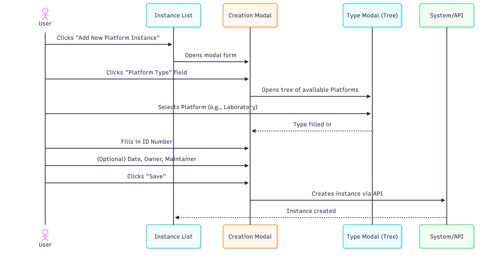
> _PNG equivalent of the Mermaid diagram above. Place the file with this name under docs/images/diagrams/en/._


### Detailed Steps

📋 **Step 1.** On the management page, click **"Add New Platform Instance"**.

📋 **Step 2.** A **modal form** (overlay window) opens.

📋 **Step 3.** Fill in the fields:

#### Creation Form Fields

| Field | Type | Required | Detailed Description |
|-------|------|----------|---------------------|
| **Platform Type** | Modal selection (tree) | **Yes** | The Platform that this instance materializes. Click to open the tree of Platforms defined in the system. Select the appropriate Platform type. **PMSR Example:** Select "Class 100 Clean Room" or "Simulation Laboratory". |
| **ID Number** | Text field | **Yes** | Unique identifier for this instance/location. Must allow unambiguous identification. **Examples:** "ROOM-101", "CR-204", "LAB-PMSR-01", "LP3-EAST". Use a consistent naming convention within your organization. |
| **Acquisition Date** | Date picker | No | Date of inauguration, acquisition, or start of operation of the location. Click the field to open the calendar and select the date. |
| **Owner** | Autocomplete field | No | Owning organization or entity responsible for the location. Start typing the organization name and select from the list. **Example:** "PMSR Production Department". |
| **Maintainer** | Autocomplete field | No | Person responsible for maintenance and management of the space. Start typing the name and select from the list. |
| **Description** | Text area | No | Additional information: exact location (building, floor, wing), capacity, special conditions (controlled temperature, pressure, classification), operating hours, access restrictions, etc. |

📋 **Step 4.** Click **"Save"**.

📋 **Step 5.** The instance is created with:
- **URI** automatically generated
- **Label** automatically set: `"[Type] with #ID ([ID Number])"`
  - Example: "Class 100 Clean Room with #ID (CR-204)"
- **Version** = 1

### Platform Type Selection (Modal)

When clicking the type field, the modal shows the available Platforms:

```
Available Platforms
├── 🏭 Laboratory - PMSR Simulation Laboratory
├── 🏭 Class 100 Clean Room
├── 🏭 Production Line LP-3
├── 🏭 Main Control Station
└── ...
```

Select the appropriate Platform by clicking on it.

---

## 7. Editing an Instance

> 🔐 **Required permission:** Creating instances requires an authenticated user.

### How to Access

📋 **Step 1.** In the instance list, select the instance to edit.

📋 **Step 2.** Click the edit button.

### Edit Form

All creation fields are available for editing, plus additional fields:

| Field | Editable? | Notes |
|-------|-----------|-------|
| **Platform Type** | Yes | You can change the Platform type |
| **ID Number** | Yes | You can correct the identifier |
| **Acquisition Date** | Yes | |
| **Owner** | Yes | |
| **Maintainer** | Yes | |
| **Description** | Yes | |
| **Damaged** | Yes | Checkbox to mark damage status |
| **Damage Date** | Conditional | Only visible when Damaged is checked |

### Marking as Damaged

If the location/equipment suffers damage:

📋 **Step 1.** Open the edit form for the instance.

📋 **Step 2.** Check the **"Damaged"** checkbox.

📋 **Step 3.** The **"Damage Date"** field appears. Select the date when the damage occurred.

📋 **Step 4.** (Optional) Update the **Description** with details about the damage.

📋 **Step 5.** Click **"Save"**.

```mermaid
flowchart LR
    A["Normal State"] -->|"Mark Damaged"| B["Damaged State"]
    B -->|"Unmark Damaged"| A
    
    B --> C["Damage Date recorded"]
    B --> D["Impact on Deployments"]
```
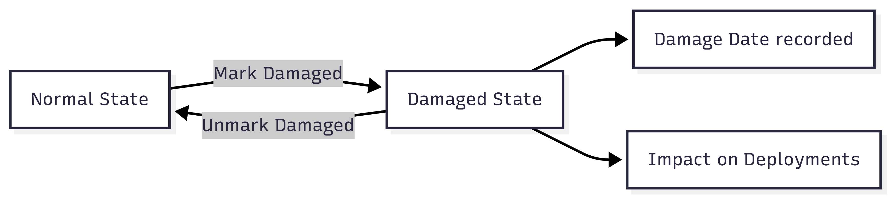
> _PNG equivalent of the Mermaid diagram above. Place the file with this name under docs/images/diagrams/en/._


> ⚠️ **Impact:** Marking a Platform Instance as damaged may affect active Deployments at that location. Check the associated Deployments before making this change.

---

## 8. Complete Scenario: From Laboratory to Deployment

> 🔐 **Required permission:** Deployment management may require additional permissions beyond the basic authenticated user.

This scenario demonstrates the complete flow for a PMSR user, from defining a Laboratory to Deploying a Simulator at that location.

### Scenario Steps

```mermaid
graph TD
    A["📋 Step 1: Create Platform 'Laboratory'<br/><i>Deployment Elements → Manage Platforms</i>"]
    B["📋 Step 2: Create Platform Instance<br/><i>'Lab PMSR Room 101' - ID: LAB-101</i>"]
    C["📋 Step 3: Create Instrument 'Simulator'<br/><i>Instrument Elements → Manage Instruments</i>"]
    D["📋 Step 4: Approve Simulator<br/><i>(Draft → Under Review → Current)</i>"]
    E["📋 Step 5: Create Instrument Instance<br/><i>'Lyophilizer #SN-001'</i>"]
    F["📋 Step 6: Create Deployment<br/><i>'Lyophilizer #SN-001 @ Lab PMSR Room 101'</i>"]
    
    A --> B
    C --> D --> E
    B --> F
    E --> F
    
    style A fill:#FFD700
    style B fill:#87CEEB
    style C fill:#90EE90
    style D fill:#FFA07A
    style E fill:#87CEEB
    style F fill:#DDA0DD
```
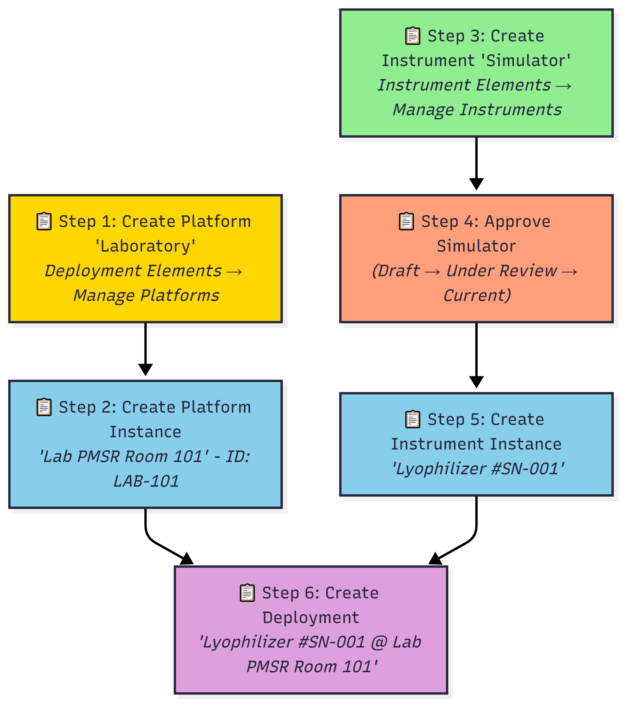
> _PNG equivalent of the Mermaid diagram above. Place the file with this name under docs/images/diagrams/en/._


| Step | Action | Reference Manual |
|------|--------|-----------------|
| 1 | Create Platform "Laboratory" | 🔗 [Section 6 - Platforms / Laboratories](#6-platforms--laboratories), section 5 |
| 2 | Create Platform Instance "Lab PMSR Room 101" | This manual, [section 6](#6-creating-a-new-instance) |
| 3 | Create Instrument/Simulator | 🔗 [Section 2 - Instruments / Simulators](#2-instruments--simulators) |
| 4 | Submit and approve the Simulator | 🔗 [Section 2 - Instruments / Simulators](#2-instruments--simulators), sections 7-8 |
| 5 | Create Instrument Instance | 🔗 [Section 5 - Instrument / Simulator Instances](#5-instrument--simulator-instances) |
| 6 | Create Deployment | 🔗 [Section 5 - Instrument / Simulator Instances](#5-instrument--simulator-instances), section 8 |

### Final Result

After completing all steps:

```
🔗 Deployment: "Lyophilizer LF-2000 #SN-001 @ Lab PMSR Room 101"
├── 📋 Simulator Instance: Lyophilizer #SN-001
│   └── 🧪 Simulator: Lyophilizer LF-2000 v2 (Current)
│       ├── ⚙️ Component: Inlet Temperature (Slot #1)
│       ├── ⚙️ Component: Chamber Pressure (Slot #2)
│       └── ⚙️ Component: Control Valve (Slot #3)
└── 🏭 Platform Instance: Lab PMSR Room 101 (LAB-101)
    └── 🏭 Platform: PMSR Simulation Laboratory
```

---

## 9. Field Reference

### Creation Form

| Field | Technical Name | Type | Required | Default Value | Description |
|-------|---------------|------|----------|---------------|-------------|
| Platform Type | `instance_type` | Modal textfield | Yes | (empty) | Source Platform |
| ID Number | `instance_serial_number` | Textfield | Yes | (empty) | Unique identifier |
| Acquisition Date | `instance_acquisition_date` | Date | No | (empty) | Acquisition/inauguration date |
| Owner | `instance_owner` | Textfield + autocomplete | No | (empty) | Owning organization |
| Maintainer | `instance_maintainer` | Textfield + autocomplete | No | (empty) | Responsible person |
| Description | `instance_description` | Textarea | No | (empty) | Operational description |

### Edit Form - Additional Fields

| Field | Technical Name | Type | Description |
|-------|---------------|------|-------------|
| Damaged | `instance_damaged` | Checkbox | Indicates whether the location is damaged |
| Damage Date | `instance_damage_date` | Date | Date of damage (conditional) |

---

## 10. Troubleshooting

| Problem | Possible Cause | Solution |
|---------|---------------|----------|
| I cannot find the Platform I need in the type selection | The Platform has not been created yet | Create the Platform first: 🔗 [Section 6 - Platforms / Laboratories](#6-platforms--laboratories) |
| The Owner/Maintainer field does not show suggestions | Social module not active or no registered organizations | Contact the administrator |
| I want to associate a Simulator to this instance | You need to create a Deployment | Use *Manage Deployments* and follow the instructions in 🔗 [Section 5 - Instrument / Simulator Instances](#5-instrument--simulator-instances), section 8 |
| I marked as Damaged by mistake | - | Open the edit form, uncheck the Damaged checkbox and Save |
| I cannot see Platform Instances | There may be no instances created | Create the first instance with "Add New Platform Instance" |
| The form appears too small | Normal behavior - instances use a modal | The modal form is compact by design |

---

🔗 **Internal Navigation:**
[Platforms / Laboratories](#6-platforms--laboratories) • [Instruments / Simulators](#2-instruments--simulators) • [Instrument / Simulator Instances](#5-instrument--simulator-instances) • [Internal Table of Contents](#internal-table-of-contents)

---

*PMSR Working Group - March 2026*
