# MANUAL PMSR COMPLETO (PT)

> Manual completo em português para o PMSR, cobrindo conceitos gerais e todos os fluxos operacionais, das definições às instâncias e deployments.

---

## 1. Introdução Geral

---

## Sobre esta Documentação

Este conjunto de manuais fornece instruções detalhadas para a utilização do sistema de gestão de instrumentos semânticos, componentes, plataformas e suas instâncias no contexto do projeto **PMSR**. Os manuais são direcionados a utilizadores e revisores do sistema, cobrindo desde a criação de elementos até ao fluxo de revisão e aprovação.

> **Nota sobre terminologia PMSR:** No contexto do PMSR, os termos padrão do sistema foram customizados pelo administrador. Por exemplo, "Instrument" aparece como **"Simulator"**, e "Platform" pode aparecer como **"Laboratory"**. Nestes manuais, usaremos ambas as designações (ex: Instrument/Simulator) para clareza.

---
## Diagrama de Relação entre Entidades

O diagrama abaixo ilustra como as diferentes entidades se relacionam entre si no sistema:

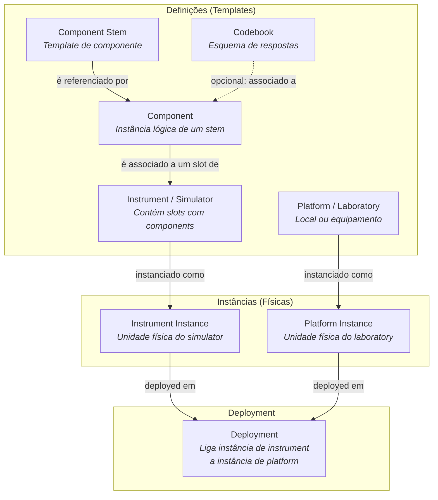
```mermaid
graph TB
    subgraph "Definições (Templates)"
        CS["Component Stem<br/><i>Template de componente</i>"]
        CB["Codebook<br/><i>Esquema de respostas</i>"]
        COMP["Component<br/><i>Instância lógica de um stem</i>"]
        INST["Instrument / Simulator<br/><i>Contém slots com components</i>"]
        PLAT["Platform / Laboratory<br/><i>Local ou equipamento</i>"]
    end

    subgraph "Instâncias (Físicas)"
        II["Instrument Instance<br/><i>Unidade física do simulator</i>"]
        PI["Platform Instance<br/><i>Unidade física do laboratory</i>"]
    end

    subgraph "Deployment"
        DEP["Deployment<br/><i>Liga instância de instrument<br/>a instância de platform</i>"]
    end

    CS -->|"é referenciado por"| COMP
    CB -.->|"opcional: associado a"| COMP
    COMP -->|"é associado a um slot de"| INST
    INST -->|"instanciado como"| II
    PLAT -->|"instanciado como"| PI
    II -->|"deployed em"| DEP
    PI -->|"deployed em"| DEP
```
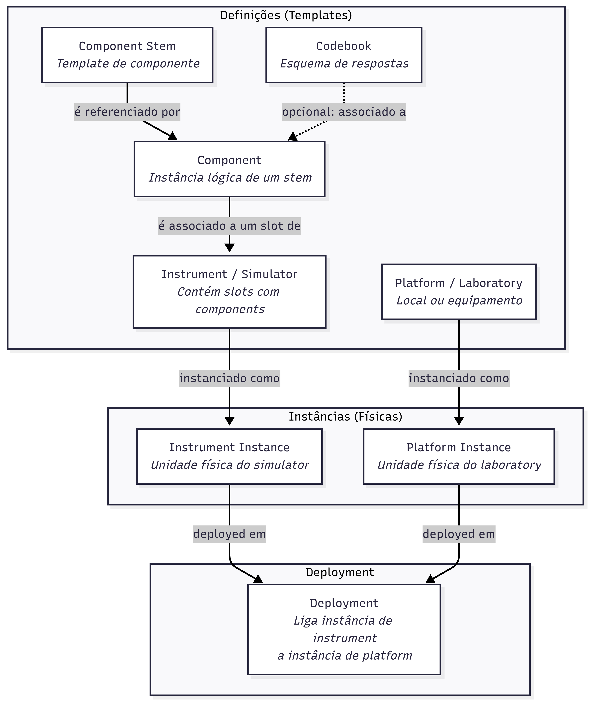
> _Imagem PNG equivalente ao diagrama Mermaid acima. Coloque o ficheiro com este nome em docs/images/diagrams/pt/._

---

## Fluxo de Revisão e Aprovação

Todos os elementos do tipo **Instrument/Simulator**, **Component**, **Component Stem**, **Codebook** e **Response Option** seguem um fluxo de revisão antes de ficarem disponíveis para utilização (estado *Current*):

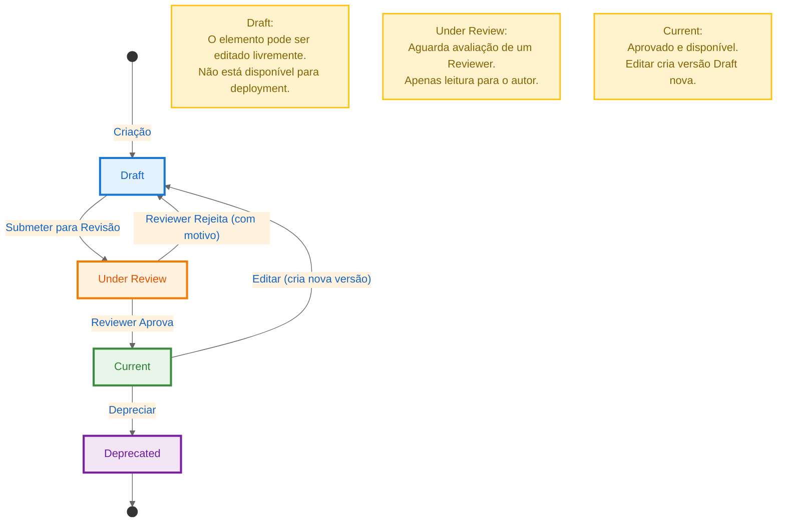
```mermaid
%%{init: {"theme":"base","themeVariables":{"primaryColor":"#e3f2fd","primaryTextColor":"#1565c0","primaryBorderColor":"#1976d2","lineColor":"#666","secondaryColor":"#fff3e0","tertiaryColor":"#e8f5e9"}}}%%
flowchart TB
    START(( )):::startEnd
    Draft[Draft]:::draftStyle
    UnderReview[Under Review]:::reviewStyle
    Current[Current]:::currentStyle
    Deprecated[Deprecated]:::deprecatedStyle
    END(( )):::startEnd
    
    Note1["Draft:<br/>O elemento pode ser editado livremente.<br/>Não está disponível para deployment."]:::noteStyle
    Note2["Under Review:<br/>Aguarda avaliação de um Reviewer.<br/>Apenas leitura para o autor."]:::noteStyle
    Note3["Current:<br/>Aprovado e disponível.<br/>Editar cria versão Draft nova."]:::noteStyle
    
    START -->|"Criação"| Draft
    Draft -->|"Submeter para Revisão"| UnderReview
    UnderReview -->|"Reviewer Aprova"| Current
    UnderReview -->|"Reviewer Rejeita (com motivo)"| Draft
    Current -->|"Editar (cria nova versão)"| Draft
    Current -->|"Depreciar"| Deprecated
    Deprecated --> END
    
    classDef startEnd fill:#333,stroke:#333,color:#333
    classDef draftStyle fill:#e3f2fd,stroke:#1976d2,stroke-width:3px,color:#1565c0
    classDef reviewStyle fill:#fff3e0,stroke:#f57c00,stroke-width:3px,color:#e65100
    classDef currentStyle fill:#e8f5e9,stroke:#388e3c,stroke-width:3px,color:#2e7d32
    classDef deprecatedStyle fill:#f3e5f5,stroke:#7b1fa2,stroke-width:3px,color:#6a1b9a
    classDef noteStyle fill:#fff3cd,stroke:#ffc107,stroke-width:2px,color:#856404
```
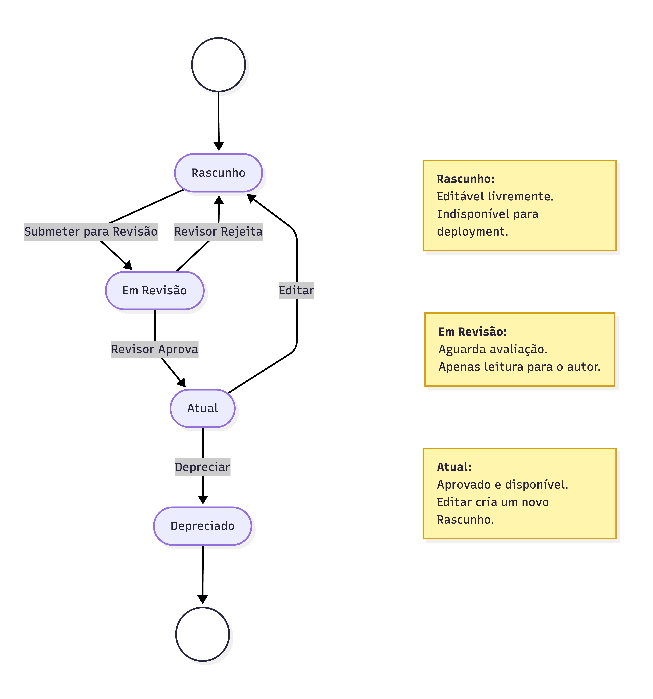
> _Imagem PNG equivalente ao diagrama Mermaid acima. Coloque o ficheiro com este nome em docs/images/diagrams/pt/._

### Papéis no Fluxo de Revisão

| Papel | Role no Sistema | Descrição | Ações Disponíveis |
|-------|----------------|-----------|-------------------|
| **Utilizador / Autor** | Authenticated User | Cria e edita elementos. Submete para revisão. | Criar, Editar, Submeter para Revisão |
| **Reviewer** | Content Editor | Avalia elementos submetidos. Pode aprovar ou rejeitar. Requer permissão especial atribuída por um Administrador. | Aprovar, Rejeitar (com notas obrigatórias) |

> **Nota sobre permissões:** Estes manuais são direcionados a utilizadores com role de **Authenticated User**. As secções relativas à revisão descrevem o que o Reviewer faz para que perceba o fluxo completo, mas a ação de revisão só está disponível a utilizadores com a permissão **Content Editor**. A gestão de roles e configurações do sistema é da responsabilidade dos Administradores e não é coberta nesta documentação.

---

## Modelo vs. Instância - Conceito Fundamental

Um conceito essencial para compreender o sistema é a distinção entre **Modelo** (definição/design) e **Instância** (unidade concreta).

| Conceito | O que representa | Exemplo PMSR |
|----------|------------------|--------------|
| **Modelo (Definição)** | O design, o "projeto" - descreve *o que é* e *como funciona*. É abstrato, serve de template. Pode conter slots, componentes, e passar por revisão. | "Simulador de Liofilização LF-2000" - a definição do simulador, com os seus 5 slots e componentes associados. |
| **Instância (Unidade Física)** | Uma unidade real e concreta desse modelo - com número de série, proprietário, localização. É o "objeto que se pode tocar". | "Liofilizador #SN-001 do Lab PMSR, adquirido em 2025" - a máquina física no laboratório. |

> **Porquê ambos?** Porque o mesmo modelo de simulador pode existir em várias cópias (unidades físicas) em diferentes laboratórios. O modelo é definido e aprovado uma vez; as instâncias registam cada unidade individual para controlo operacional e deployment.

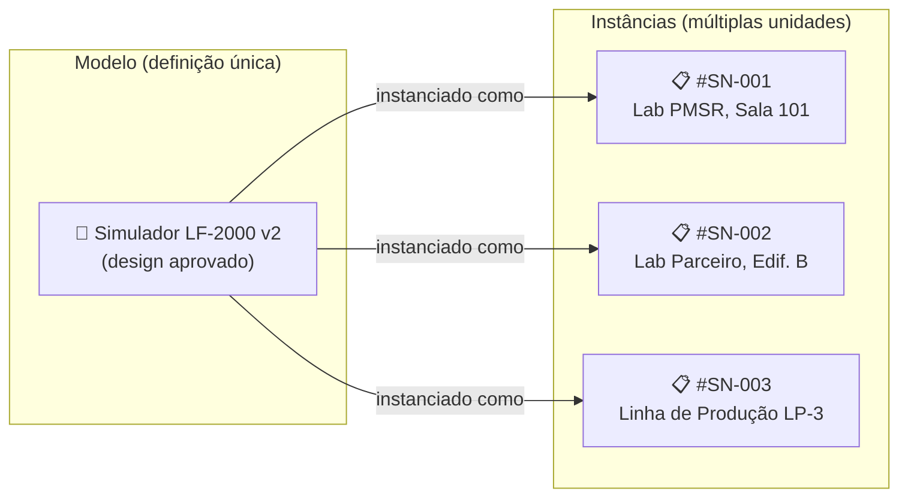
```mermaid
graph LR
    subgraph "Modelo (definição única)"
        M["🧪 Simulador LF-2000 v2\n(design aprovado)"]
    end
    subgraph "Instâncias (múltiplas unidades)"
        I1["📋 #SN-001\nLab PMSR, Sala 101"]
        I2["📋 #SN-002\nLab Parceiro, Edif. B"]
        I3["📋 #SN-003\nLinha de Produção LP-3"]
    end
    M -->|"instanciado como"| I1
    M -->|"instanciado como"| I2
    M -->|"instanciado como"| I3
```
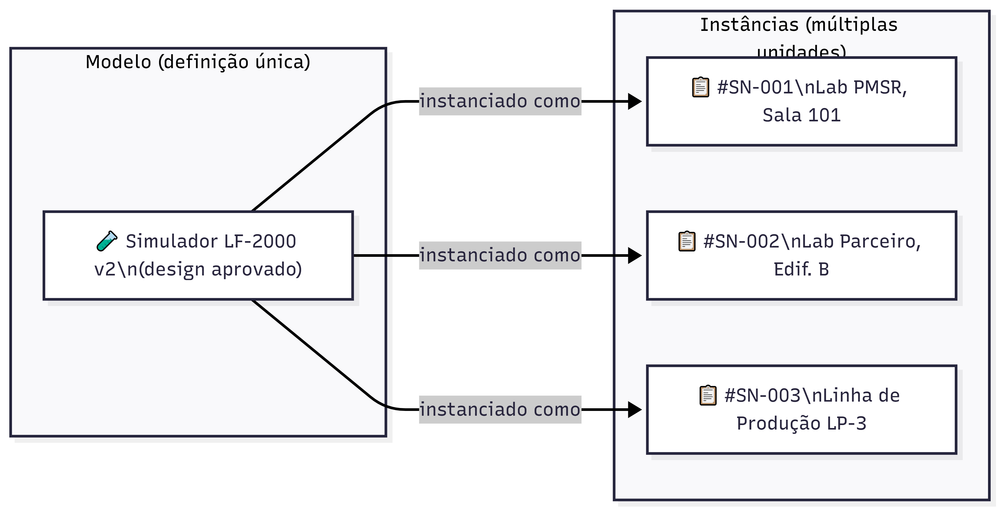
> _Imagem PNG equivalente ao diagrama Mermaid acima. Coloque o ficheiro com este nome em docs/images/diagrams/pt/._

O mesmo aplica-se a **Platforms/Laboratories**: o modelo define o tipo de laboratório, e cada instância representa um laboratório concreto.

---

## Pré-requisitos Gerais

- **Autenticação:** Todos os manuais pressupõem que o utilizador está autenticado no sistema.
- **Role mínimo:** Utilizador autenticado (Authenticated User). Ações de revisão requerem a permissão **Content Editor**, atribuída por um Administrador.
- **Terminologia PMSR:** Os nomes exibidos no sistema (Simulator, Laboratory, etc.) foram configurados pelo administrador para refletir o contexto PMSR.

---

## Convenções utilizadas nesta documentação

| Ícone/Formato | Significado |
|---------------|-------------|
| **Negrito** | Nomes de botões, campos ou menus no sistema |
| `código` | Caminhos URL, valores técnicos |
| > Nota | Informações importantes ou dicas |
| ⚠️ | Avisos e precauções |
| 📋 | Passo a seguir numa sequência |
| 🔗 | Referência cruzada para outra secção do manual |

---

## 2. Instruments / Simulators

**Módulo:** SIR (Semantic Instrument Repository)  
**Contexto PMSR:** No PMSR, "Instrument" é tipicamente referido como **"Simulator"**  

---
## 1. Visão Geral

Um **Instrument** (ou **Simulator** no contexto PMSR) representa um instrumento de medição, questionário, simulador ou dispositivo de recolha de dados no sistema semântico. Exemplos no PMSR incluem simuladores de processos farmacêuticos, instrumentos de medição de qualidade, ou questionários de avaliação.

Cada Instrument/Simulator:
- Possui um **URI** único gerado automaticamente
- É classificado por um **tipo hierárquico** (Parent Type)
- Contém **Container Slots** que alojam **Components** ou **sub-containers**, permitindo estruturas recursivas (ver 🔗 [Secção 4 - Components](#4-components))
- Segue um **fluxo de revisão**: Draft → Under Review → Current
- Tem **versionamento automático**

> 📘 **Modelo vs. Instância:** Um Instrument/Simulator é um **modelo (definição/design)** - descreve a estrutura, slots e componentes do instrumento. É como um projeto ou blueprint. Para registar **unidades físicas concretas** deste modelo (com número de série, proprietário, localização), consulte a [Secção 5 - Instâncias de Instruments / Simulators](#5-instâncias-de-instruments--simulators). O mesmo modelo pode ter múltiplas instâncias em diferentes laboratórios.

### Diagrama Conceptual

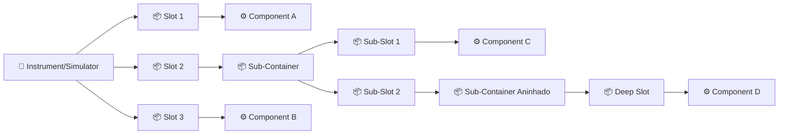
```mermaid
graph LR
    INST["🧪 Instrument/Simulator"]
    INST --> SLOT1["📦 Slot 1"]
    INST --> SLOT2["📦 Slot 2"]
    INST --> SLOT3["📦 Slot 3"]
    SLOT1 --> COMP1["⚙️ Component A"]
    SLOT2 --> SUBC["📦 Sub-Container"]
    SLOT3 --> COMP2["⚙️ Component B"]
    SUBC --> SUBS1["📦 Sub-Slot 1"]
    SUBC --> SUBS2["📦 Sub-Slot 2"]
    SUBS1 --> COMP3["⚙️ Component C"]
    SUBS2 --> NEST["📦 Sub-Container Aninhado"]
    NEST --> NS1["📦 Deep Slot"]
    NS1 --> COMP4["⚙️ Component D"]
```
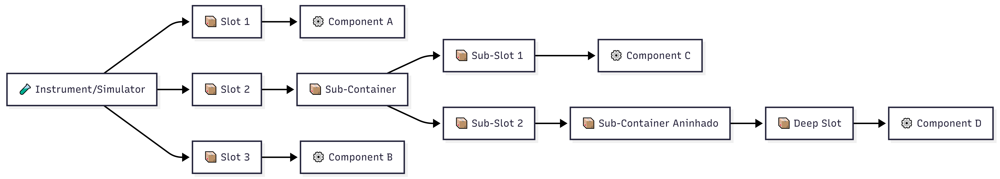
> _Imagem PNG equivalente ao diagrama Mermaid acima. Coloque o ficheiro com este nome em docs/images/diagrams/pt/._

> **Nota PMSR:** O termo exibido no menu e formulários depende da configuração de **Preferred Names**. Se configurado como "Simulator", todos os menus e labels mostrarão "Simulator" em vez de "Instrument".

---

## 2. Aceder à Gestão de Instruments/Simulators

### Caminho de Navegação

```
Menu Principal → Instrument Elements → Manage Elements → Manage Instruments
```

**URL direto:** `https://www.pmsr.net/sir/select/instrument/1/9`

### Passos detalhados:

📋 **Passo 1.** Na barra de navegação principal do site, localize e clique em **"Instrument Elements"** (ou o nome configurado pelo PMSR).

📋 **Passo 2.** No submenu que aparece, passe o cursor sobre **"Manage Elements"**.

📋 **Passo 3.** Clique em **"Manage Instruments"** (ou "Manage Simulators" se configurado).

Será direcionado para a página de gestão com a lista de todos os Instruments que gere.

---

## 3. A Página de Gestão (Lista)

A página de gestão apresenta uma lista dos Instruments/Simulators dos quais é utilizador/autor. Oferece duas vistas e várias opções de filtragem.

### Modos de Visualização

| Botão | Descrição |
|-------|-----------|
| **Table View** | Vista em tabela com colunas detalhadas (recomendado para gestão) |
| **Card View** | Vista em cartões com pré-visualização visual |

### Filtros Disponíveis

| Filtro | Descrição | Opções |
|--------|-----------|--------|
| **Filtro de Texto** | Pesquisa por palavra-chave no nome/URI | Campo de texto livre |
| **Language** | Filtra por idioma do instrumento | All / English / Português / etc. |
| **Status** | Filtra pelo estado do ciclo de vida | All Status / Draft / Under Review / Current / Deprecated |

### Colunas da Tabela (Table View)

| Coluna | Descrição |
|--------|-----------|
| **URI** | Identificador único (link clicável para página de descrição) |
| **Parent Type** | Tipo hierárquico do instrumento (link clicável) |
| **Abbreviation** | Abreviatura/código curto |
| **Name** | Nome do instrumento + versão |
| **Language** | Idioma |
| **Downloads** | Links para download em formatos: TXT, HTML, RDF, FHIR (quando aplicável) |
| **Status** | Estado atual: Draft, Under Review, Current, Deprecated |

> **Dica:** Se um elemento foi rejeitado pelo Reviewer, o status aparecerá como **"Draft (Already Reviewed)"** para indicar que já passou por revisão e foi devolvido.

### Botões de Ação

| Botão | Função | Condição |
|-------|--------|----------|
| **Add New Instrument** | Abre o formulário de criação | Sempre disponível |
| **Edit Selected** | Abre o formulário de edição do elemento selecionado | Requer seleção de 1 elemento |
| **Delete Selected** | Elimina o elemento selecionado | Requer seleção + confirmação |
| **Send for Review** | Submete para revisão | Apenas para elementos em estado **Draft** |

---

## 4. Criar um Novo Instrument/Simulator

### Sequência de Criação

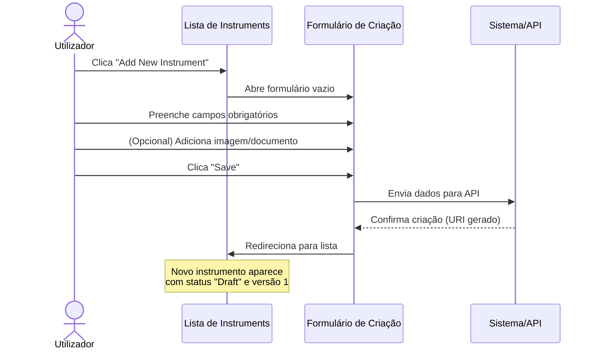
```mermaid
sequenceDiagram
    actor U as Utilizador
    participant L as Lista de Instruments
    participant F as Formulário de Criação
    participant S as Sistema/API

    U->>L: Clica "Add New Instrument"
    L->>F: Abre formulário vazio
    U->>F: Preenche campos obrigatórios
    U->>F: (Opcional) Adiciona imagem/documento
    U->>F: Clica "Save"
    F->>S: Envia dados para API
    S-->>F: Confirma criação (URI gerado)
    F->>L: Redireciona para lista
    Note over L: Novo instrumento aparece<br/>com status "Draft" e versão 1
```
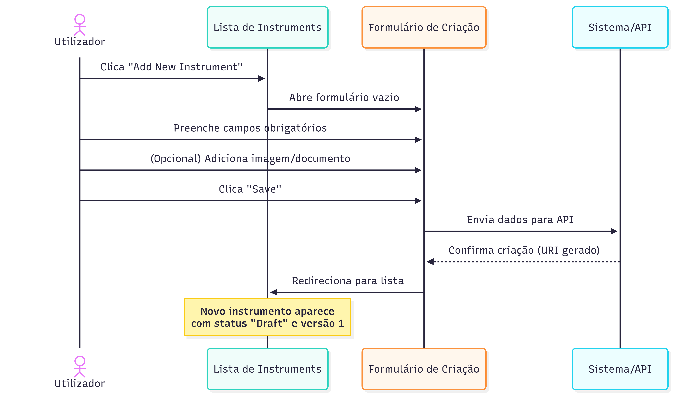
> _Imagem PNG equivalente ao diagrama Mermaid acima. Coloque o ficheiro com este nome em docs/images/diagrams/pt/._

### Passos Detalhados

📋 **Passo 1.** Na página de gestão, clique no botão **"Add New Instrument"** (ou "Add New Simulator").

📋 **Passo 2.** Preencha o formulário de criação com os seguintes campos:

#### Campos do Formulário

| Campo | Tipo | Obrigatório | Descrição Detalhada |
|-------|------|-------------|---------------------|
| **Parent Type** | Seleção por modal (árvore) | Não | Define o tipo hierárquico do instrumento. Ao clicar, abre uma janela modal com uma árvore de tipos disponíveis na ontologia. Selecione o tipo mais específico aplicável (ex: `vstoi:Questionnaire`, `vstoi:Simulator`). Se não souber qual escolher, consulte o administrador. |
| **Name** | Campo de texto | **Sim** | Nome descritivo do instrumento. Deve ser claro e único dentro do seu contexto. Ex: "PHQ-9 Depression Screening", "Simulador de Processo de Liofilização". |
| **Abbreviation** | Campo de texto | Não | Código curto ou sigla. Ex: "PHQ-9", "SIM-LIO-01". Útil para referência rápida. |
| **Maker** | Campo de texto com autocomplete | Não | Organização fabricante/criadora. Comece a escrever e selecione da lista de organizações registadas. |
| **Informant** | Lista de seleção | Não | Define o informante do idioma (ex: en_US para inglês americano). |
| **Language** | Lista de seleção | **Sim** | Idioma principal do instrumento. Predefinido: English (en). |
| **Version** | Campo (somente leitura) | Auto | Valor automático: começa em 1. Incrementa automaticamente em edições de versões Current. |
| **Description** | Área de texto | Não | Descrição detalhada do instrumento, seu propósito, contexto de utilização, e quaisquer notas relevantes. |

#### Campos de Imagem

| Campo | Descrição |
|-------|-----------|
| **Image Type** | Escolha entre **URL** (link externo) ou **Upload** (carregar ficheiro) |
| **Image (URL)** | Se escolheu URL: cole o endereço completo da imagem |
| **Upload Image** | Se escolheu Upload: clique para selecionar ficheiro. Formatos aceites: PNG, JPG, JPEG. Tamanho máximo: 2 MB |

#### Campos de Documento Web

| Campo | Descrição |
|-------|-----------|
| **Web Document Type** | Escolha entre **URL** (link externo) ou **Upload** (carregar ficheiro) |
| **Web Document (URL)** | Se escolheu URL: cole o endereço completo do documento |
| **Upload Document** | Se escolheu Upload: clique para selecionar ficheiro. Formatos aceites: PDF, DOC, DOCX, TXT, XLS, XLSX. Tamanho máximo: 2 MB |

📋 **Passo 3.** Após preencher todos os campos necessários, clique em **"Save"**.

📋 **Passo 4.** O sistema cria o instrumento com:
- **URI** gerado automaticamente
- **Versão** = 1
- **Status** = Draft
- **Utilizador** = o seu email de utilizador

Será redirecionado para a página de gestão, onde o novo instrumento aparece na lista.

> ⚠️ **Importante:** O instrumento é criado em estado **Draft**. Para que fique disponível para uso (estado Current), é necessário [submeter para revisão](#7-submeter-para-revisão) e ser aprovado por um Reviewer.

### Seleção do Parent Type (Modal de Árvore)

Quando clica no campo **Parent Type**, abre-se uma janela modal com largura de 800px contendo uma árvore hierárquica de tipos:

```
vstoi:Instrument
├── vstoi:Questionnaire
│   ├── vstoi:SelfAdministeredQuestionnaire
│   └── vstoi:InterviewerAdministeredQuestionnaire
├── vstoi:Simulator
│   ├── vstoi:ProcessSimulator
│   └── vstoi:PharmaceuticalSimulator
├── vstoi:PhysicalDevice
│   ├── vstoi:Sensor
│   └── vstoi:MeasurementDevice
└── ...
```

> **Nota:** A árvore de tipos é definida pela ontologia do sistema. Os tipos disponíveis podem variar conforme a configuração do seu ambiente.

**Para selecionar:** Clique no tipo desejado na árvore. O campo será preenchido automaticamente e a janela modal fecha-se.

---

## 5. Editar um Instrument/Simulator

### Como aceder à edição

📋 **Passo 1.** Na página de gestão, selecione o instrumento que deseja editar clicando no radio button correspondente na tabela.

📋 **Passo 2.** Clique no botão **"Edit Selected"**.

📋 **Passo 3.** O formulário de edição abre com todos os campos preenchidos com os dados atuais.

### Formulário de Edição

O formulário de edição contém todos os campos do formulário de criação, com as seguintes diferenças:

| Diferença | Descrição |
|-----------|-----------|
| **URI** | Exibido como campo somente leitura (link clicável para a página de descrição) |
| **Version** | Calculado automaticamente: se o estado atual é Current ou Deprecated, a versão exibida será incrementada (+1) |
| **Container Elements** | Secção adicional que mostra a estrutura interna de slots e componentes (ver [secção 6](#6-gestão-de-container-slots-estrutura-interna)) |
| **Review Notes** | Se o instrumento já foi revisto, mostra as notas do Reviewer (somente leitura) |
| **Reviewer Email** | Email do último Reviewer (somente leitura) |

### Diagrama do Processo de Edição

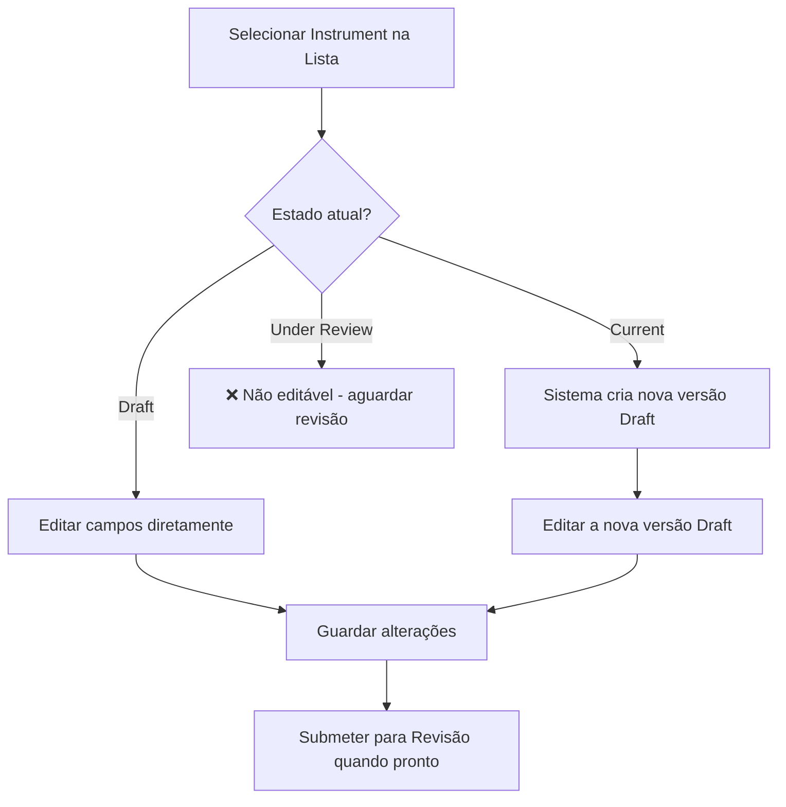
```mermaid
flowchart TD
    A[Selecionar Instrument na Lista] --> B{Estado atual?}
    B -->|Draft| C[Editar campos diretamente]
    B -->|Current| D[Sistema cria nova versão Draft]
    B -->|Under Review| E[❌ Não editável - aguardar revisão]
    C --> F[Guardar alterações]
    D --> G[Editar a nova versão Draft]
    G --> F
    F --> H[Submeter para Revisão quando pronto]
```
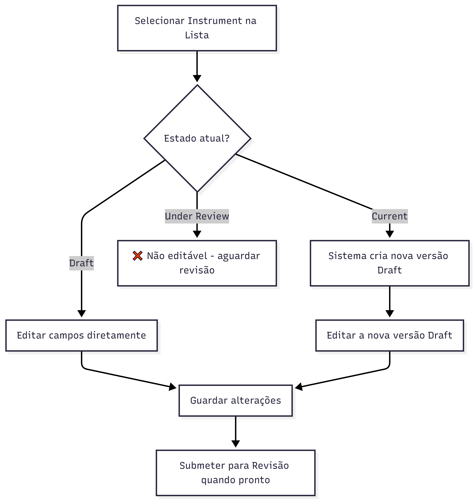
> _Imagem PNG equivalente ao diagrama Mermaid acima. Coloque o ficheiro com este nome em docs/images/diagrams/pt/._

> ⚠️ **Editar um instrumento Current:** Quando edita um instrumento com estado **Current**, o sistema cria automaticamente uma nova versão em estado **Draft** com a versão incrementada. A versão Current permanece inalterada até que a nova versão seja aprovada.

#### Botões do Formulário de Edição

| Botão | Função |
|-------|--------|
| **Update** | Guarda as alterações e redireciona para a lista |
| **Cancel** | Descarta alterações e volta à lista |

---

## 6. Gestão de Container Slots (Estrutura Interna)

Um Instrument/Simulator contém **Container Slots** - posições numeradas onde se associam **Components** ou **sub-containers**. A estrutura é recursiva: um sub-container pode conter novos slots, que por sua vez podem conter components ou novos sub-containers, formando hierarquias profundas. Esta secção aparece no formulário de edição, dentro da secção **"Container Elements"**.

### Conceito de Container Slots

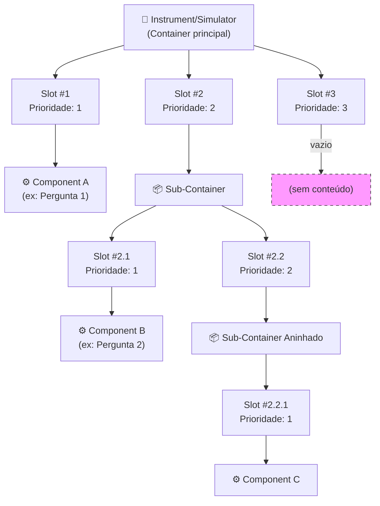
```mermaid
graph TD
    INST["🧪 Instrument/Simulator<br/>(Container principal)"]
    INST --> S1["Slot #1<br/>Prioridade: 1"]
    INST --> S2["Slot #2<br/>Prioridade: 2"]
    INST --> S3["Slot #3<br/>Prioridade: 3"]
    S1 --> C1["⚙️ Component A<br/>(ex: Pergunta 1)"]
    S2 --> SUB["📦 Sub-Container"]
    S3 -->|"vazio"| EMPTY["(sem conteúdo)"]
    SUB --> SS1["Slot #2.1<br/>Prioridade: 1"]
    SUB --> SS2["Slot #2.2<br/>Prioridade: 2"]
    SS1 --> C2["⚙️ Component B<br/>(ex: Pergunta 2)"]
    SS2 --> SUB2["📦 Sub-Container Aninhado"]
    SUB2 --> SSS1["Slot #2.2.1<br/>Prioridade: 1"]
    SSS1 --> C3["⚙️ Component C"]

    style EMPTY fill:#f9f,stroke:#333,stroke-dasharray: 5 5
```
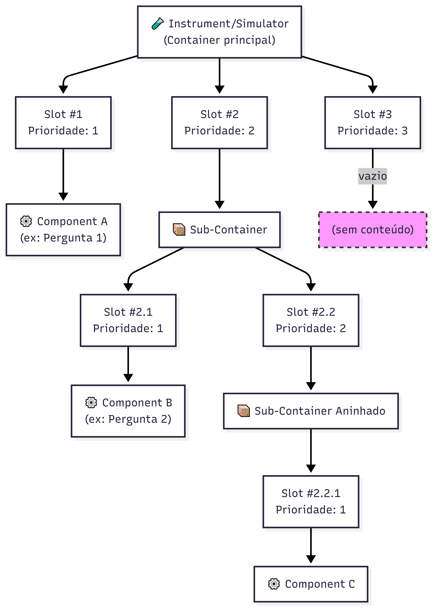
> _Imagem PNG equivalente ao diagrama Mermaid acima. Coloque o ficheiro com este nome em docs/images/diagrams/pt/._

### 6.1 Adicionar Slots a um Instrument

📋 **Passo 1.** No formulário de edição do Instrument, localize a secção **"Container Elements"**.

📋 **Passo 2.** Clique no botão **"Add Slots"** (ou ícone de +).

📋 **Passo 3.** No formulário que abre:

| Campo | Descrição |
|-------|-----------|
| **Container** | URI do instrumento (preenchido automaticamente, somente leitura) |
| **Number of Slots** | Quantidade de slots a adicionar. Insira um número inteiro positivo. |

📋 **Passo 4.** Clique em **"Save"**. Os slots são criados com prioridades sequenciais.

> **Exemplo:** Adicionar 5 slots cria Slot #1, Slot #2, ..., Slot #5 no instrumento.

### 6.2 Associar um Component a um Slot

📋 **Passo 1.** Na secção **"Container Elements"** da edição do Instrument, identifique o slot desejado.

📋 **Passo 2.** Clique no botão de edição do slot (ícone de lápis ou "Edit Slot").

📋 **Passo 3.** No formulário de edição do slot:

| Campo | Descrição |
|-------|-----------|
| **Slot URI** | Identificador do slot (somente leitura) |
| **Priority** | Prioridade/ordem do slot (somente leitura) |
| **Component** | Clique para abrir a modal de seleção de componentes. Na árvore, selecione o Component desejado. |

📋 **Passo 4.** Opções disponíveis:

| Botão | Função |
|-------|--------|
| **New Item** | Cria um novo Component e associa-o a este slot (redireciona para o formulário de criação de Components - ver 🔗 [Secção 4 - Components](#4-components)) |
| **Reset this Item** | Remove o Component atualmente associado ao slot (liberta o slot) |
| **Update** | Guarda a associação do Component selecionado (só ativo quando um componente está selecionado) |
| **Cancel** | Volta sem alterar |

> ⚠️ **Estrutura recursiva:** Um slot pode apontar para um Component **ou** para um sub-container. Quando aponta para sub-container, esse sub-container terá os seus próprios slots e poderá continuar a ser aninhado conforme necessário.

### 6.3 Estrutura Visual dos Container Slots

Na edição de um Instrument, a secção Container Elements apresenta uma vista hierárquica semelhante a:

```
📦 Container Elements
├── Slot #1 (Prioridade: 1) - ⚙️ Component: "Temperatura de Entrada" [Edit] [Remove]
├── Slot #2 (Prioridade: 2) - 📦 Sub-Container: "Medições de Pressão" [Edit] [Remove]
│   ├── Slot #2.1 (Prioridade: 1) - ⚙️ Component: "Pressão de Câmara" [Edit] [Remove]
│   └── Slot #2.2 (Prioridade: 2) - 📦 Sub-Container: "Controlo Fino" [Edit] [Remove]
│       └── Slot #2.2.1 (Prioridade: 1) - ⚙️ Component: "Pressão de Almofada" [Edit] [Remove]
├── Slot #3 (Prioridade: 3) - 🔲 (vazio) [Edit] [Add Component ou Sub-Container]
└── [+ Add More Slots]
```

---

## 7. Submeter para Revisão

> ℹ️ **Nota sobre permissões:** A submissão para revisão pode ser feita pelo autor do elemento (utilizador autenticado). A aprovação ou rejeição requer a permissão **Content Editor** (Reviewer).

Após criar ou editar um Instrument/Simulator em estado **Draft**, é necessário submetê-lo para revisão para que possa avançar para o estado **Current**.

### Sequência de Submissão

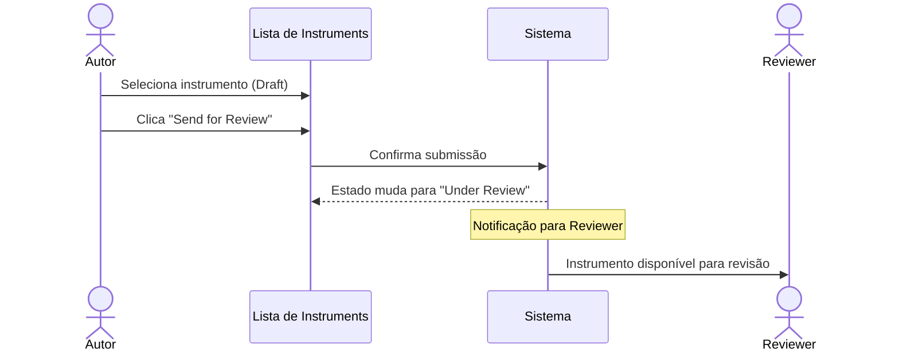
```mermaid
sequenceDiagram
    actor A as Autor
    participant L as Lista de Instruments
    participant S as Sistema
    actor R as Reviewer

    A->>L: Seleciona instrumento (Draft)
    A->>L: Clica "Send for Review"
    L->>S: Confirma submissão
    S-->>L: Estado muda para "Under Review"
    Note over S: Notificação para Reviewer
    S->>R: Instrumento disponível para revisão
```
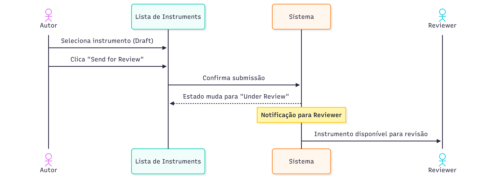
> _Imagem PNG equivalente ao diagrama Mermaid acima. Coloque o ficheiro com este nome em docs/images/diagrams/pt/._

### Passos Detalhados

📋 **Passo 1.** Na página de gestão, filtre por **Status: Draft** para localizar instrumentos prontos para revisão.

📋 **Passo 2.** Selecione o instrumento que deseja submeter clicando no radio button correspondente.

📋 **Passo 3.** Clique no botão **"Send for Review"**.

📋 **Passo 4.** Uma caixa de confirmação aparece: *"Are you sure you want to submit for Review selected entry?"*

📋 **Passo 5.** Confirme clicando **OK**.

📋 **Passo 6.** O estado do instrumento muda para **Under Review**. A partir deste momento:
- O instrumento **não pode ser editado** pelo autor
- O instrumento fica disponível para avaliação por um **Reviewer**
- A submissão é **recursiva**: todos os Components associados ao instrumento são também submetidos para revisão

> ⚠️ **Submissão recursiva:** Quando submete um Instrument para revisão, todos os Components nos seus slots são automaticamente submetidos também. Certifique-se de que todos os Components estão completos antes de submeter o Instrument.

---

## 8. O Processo de Revisão (Perspetiva do Reviewer)

> ⚠️ **Permissão necessária:** Esta secção descreve ações disponíveis apenas para utilizadores com a role **Content Editor** (Reviewer). É incluída para que compreenda o fluxo completo de revisão.

### Quem é o Reviewer?

O **Reviewer** é um utilizador com o papel **content_editor** no sistema. A sua função é avaliar se os elementos submetidos estão conformes e corretos antes de os aprovar para utilização geral.

### Aceder à Revisão

```
Menu Principal → Instrument Elements → Review Elements → Review Instruments
```

O Reviewer navega para a lista de Instruments com estado **Under Review**.

### Formulário de Revisão

O formulário de revisão apresenta o instrumento em **modo somente leitura** (o Reviewer não edita os dados), organizado em:

1. **Vertical Tabs** com todos os campos do instrumento (nome, tipo, descrição, imagem, documento, etc.)
2. **Container Elements** - visualização da estrutura de slots e componentes
3. **Secção de Revisão** - campos de ação do Reviewer

### Campos da Secção de Revisão

| Campo | Tipo | Obrigatório | Descrição |
|-------|------|-------------|-----------|
| **Review Notes** | Área de texto | Sim (para rejeição) | Notas e comentários do Reviewer. Obrigatórias em caso de rejeição para indicar o motivo. Opcionais em caso de aprovação. |
| **Reviewer Email** | Campo de texto (somente leitura) | Auto | Email do Reviewer atual, preenchido automaticamente. |

### Ações do Reviewer

| Ação | Botão | Notas Obrigatórias? | Resultado |
|------|-------|---------------------|-----------|
| **Aprovar** | **Approve** | Não (opcional) | Estado → **Current**. O instrumento fica disponível para instanciação e deployment. Confirma que o instrumento está conforme. |
| **Rejeitar** | **Reject** | **Sim** (obrigatórias) | Estado → **Draft**. O instrumento volta para o autor com as notas do Reviewer explicando os motivos da rejeição. A rejeição é **recursiva**: todos os Components associados são rejeitados também. |

### Diagrama do Fluxo de Revisão

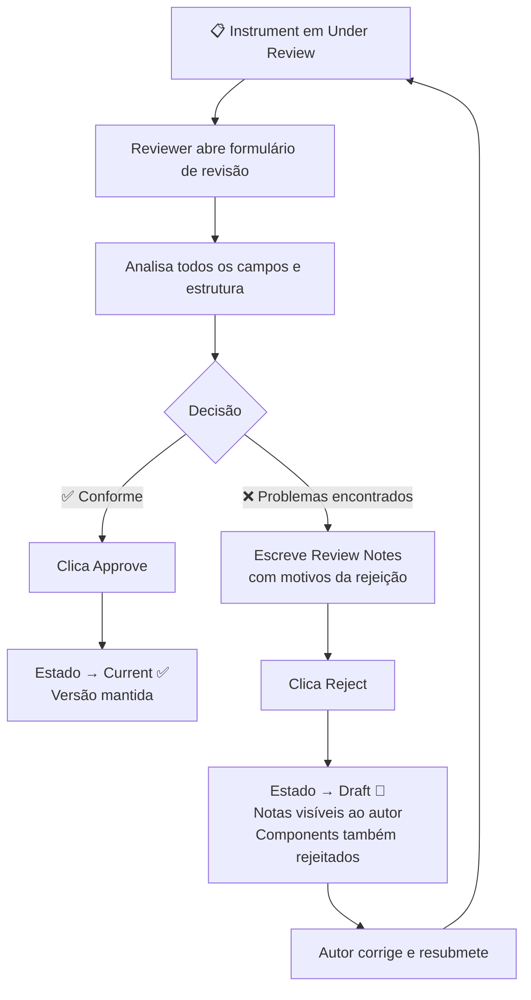
```mermaid
flowchart TD
    A["📋 Instrument em Under Review"] --> B["Reviewer abre formulário de revisão"]
    B --> C["Analisa todos os campos e estrutura"]
    C --> D{Decisão}
    D -->|"✅ Conforme"| E["Clica Approve"]
    D -->|"❌ Problemas encontrados"| F["Escreve Review Notes<br/>com motivos da rejeição"]
    E --> G["Estado → Current ✅<br/>Versão mantida"]
    F --> H["Clica Reject"]
    H --> I["Estado → Draft 📝<br/>Notas visíveis ao autor<br/>Components também rejeitados"]
    I --> J["Autor corrige e resubmete"]
    J --> A
```
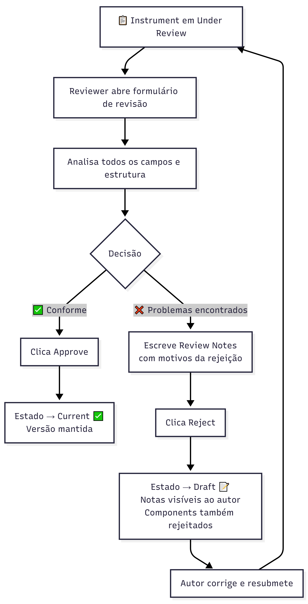
> _Imagem PNG equivalente ao diagrama Mermaid acima. Coloque o ficheiro com este nome em docs/images/diagrams/pt/._

> **Dica para Reviewers:** Ao rejeitar, seja específico nas Review Notes. Indique exatamente que campos ou aspetos precisam de correção para que o autor possa resolver rapidamente.

---

## 9. Ciclo de Vida e Versionamento

### Estados Possíveis

| Estado | Descrição | Pode Editar? | Pode Deploy? |
|--------|-----------|--------------|--------------|
| **Draft** | Rascunho em preparação | ✅ Sim | ❌ Não |
| **Under Review** | Aguarda avaliação do Reviewer | ❌ Não | ❌ Não |
| **Current** | Aprovado e disponível para uso | ⚠️ Cria nova versão | ✅ Sim |
| **Deprecated** | Descontinuado, substituído por versão mais recente | ❌ Não | ❌ Não |

### Versionamento Automático

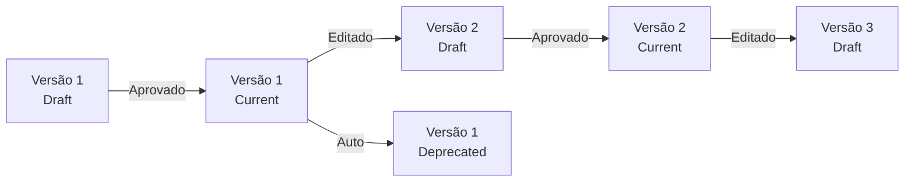
```mermaid
graph LR
    V1["Versão 1<br/>Draft"] -->|Aprovado| V1C["Versão 1<br/>Current"]
    V1C -->|Editado| V2["Versão 2<br/>Draft"]
    V2 -->|Aprovado| V2C["Versão 2<br/>Current"]
    V1C -->|"Auto"| V1D["Versão 1<br/>Deprecated"]
    V2C -->|Editado| V3["Versão 3<br/>Draft"]
```
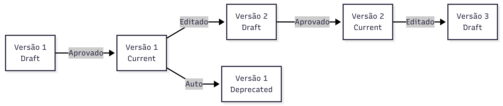
> _Imagem PNG equivalente ao diagrama Mermaid acima. Coloque o ficheiro com este nome em docs/images/diagrams/pt/._

- **Criação:** Versão começa em 1
- **Edição de Current:** Cria nova versão (incrementada) em estado Draft
- **Aprovação de nova versão:** Versão anterior é automaticamente Deprecated

---

## 10. Referência de Campos

### Tabela Completa de Campos - Formulário de Criação

| Campo | Nome Técnico | Tipo HTML | Obrigatório | Valor Padrão | Validação |
|-------|-------------|-----------|-------------|--------------|-----------|
| Parent Type | `instrument_type` | Modal textfield | Não | (vazio) | URI válido da ontologia |
| Name | `instrument_name` | Textfield | Sim | (vazio) | Não vazio |
| Abbreviation | `instrument_abbreviation` | Textfield | Não | (vazio) | - |
| Maker | `instrument_maker` | Textfield + autocomplete | Não | (vazio) | Organização válida |
| Informant | `instrument_informant` | Select | Não | (vazio) | Lista de informantes |
| Language | `instrument_language` | Select | Sim | en | Lista de idiomas |
| Version | `instrument_version` | Textfield (disabled) | Auto | 1 | Inteiro positivo |
| Description | `instrument_description` | Textarea | Não | (vazio) | - |
| Image Type | `instrument_image_type` | Select | Não | (vazio) | URL / Upload |
| Image URL | `instrument_image_url` | Textfield | Condicional | (vazio) | URL válido |
| Image Upload | `instrument_image_upload` | Managed file | Condicional | (vazio) | PNG/JPG/JPEG, max 2MB |
| Web Doc Type | `instrument_webdocument_type` | Select | Não | (vazio) | URL / Upload |
| Web Doc URL | `instrument_webdocument_url` | Textfield | Condicional | (vazio) | URL válido |
| Web Doc Upload | `instrument_webdocument_upload` | Managed file | Condicional | (vazio) | PDF/DOC/DOCX/TXT/XLS/XLSX, max 2MB |

---

## 11. Resolução de Problemas

| Problema | Causa Possível | Solução |
|----------|----------------|---------|
| Não consigo ver o botão "Send for Review" | O instrumento não está em estado Draft | Verifique o estado na coluna Status. Apenas elementos Draft podem ser submetidos. |
| O instrumento foi rejeitado | O Reviewer encontrou problemas | Abra o formulário de edição e consulte o campo "Review Notes" para ver o motivo da rejeição. Corrija e resubmeta. |
| A modal do Parent Type está vazia | Problema de conexão com a ontologia | Contacte o administrador do sistema. |
| A imagem não carrega | Formato ou tamanho inválido | Verifique: PNG/JPG/JPEG, máximo 2MB. |
| Não consigo editar - os campos estão bloqueados | O instrumento está em Under Review | Aguarde a decisão do Reviewer. Não é possível editar durante a revisão. |
| A versão mudou automaticamente | Editou um instrumento Current | Comportamento esperado: o sistema cria uma versão nova (incrementada) em Draft. |

---

🔗 **Navegação Interna:**
[Components](#4-components) • [Component Stems](#3-component-stems) • [Instâncias de Instruments / Simulators](#5-instâncias-de-instruments--simulators) • [Índice Interno](#índice-interno)

---

## 3. Component Stems

**Módulo:** SIR (Semantic Instrument Repository)  
**Contexto PMSR:** Component Stems são os templates reutilizáveis base dos componentes  

---
## 1. Visão Geral

Um **Component Stem** é um template reutilizável que define as propriedades base de um componente. Funciona como um "molde" a partir do qual se criam **Components** concretos. Antes de criar um Component, é **obrigatório** que exista pelo menos um Component Stem adequado.

> ⚠️ **Dependência importante:** A criação de Components depende da existência de Component Stems. Se precisar de criar um Component e não encontrar um Stem adequado, terá de criar primeiro o Stem seguindo este manual, e depois seguir a 🔗 [Secção 4 - Components](#4-components).

> 📘 **O que é um Component Stem?** Um Component Stem é um **template reutilizável** - uma "receita" ou modelo base para componentes. Define o conteúdo (pergunta, texto, medição) que pode ser reutilizado em múltiplos Components e Instruments/Simulators. Pense nele como um bloco de construção que pode ser adaptado, traduzido ou derivado para diferentes contextos.

### Analogia Prática

Imagine um questionário:
- O **Component Stem** seria a *pergunta modelo* (ex: "Qual a frequência com que sente X?")
- O **Component** seria a *utilização concreta* dessa pergunta num instrumento específico (ex: num questionário PHQ-9)

---

## 2. O que é um Component Stem?

### Definição

Um Component Stem é uma entidade semântica que define:
- **Conteúdo textual** (a pergunta, indicador ou descrição base)
- **Tipo hierárquico** na ontologia (ex: `vstoi:ComponentStem`)
- **Idioma** do conteúdo
- **Origem** (original ou derivado de outro Stem)
- **Documentação** associada (imagens e documentos)

### Relação com outros elementos

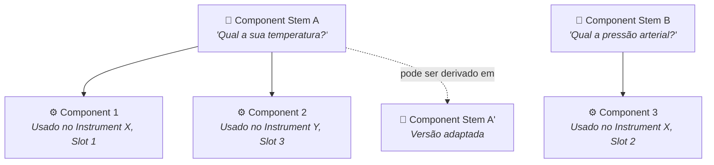
```mermaid
graph TD
    CS1["📄 Component Stem A<br/><i>'Qual a sua temperatura?'</i>"]
    CS2["📄 Component Stem B<br/><i>'Qual a pressão arterial?'</i>"]
    
    CS1 --> COMP1["⚙️ Component 1<br/><i>Usado no Instrument X, Slot 1</i>"]
    CS1 --> COMP2["⚙️ Component 2<br/><i>Usado no Instrument Y, Slot 3</i>"]
    CS2 --> COMP3["⚙️ Component 3<br/><i>Usado no Instrument X, Slot 2</i>"]

    CS1 -.->|"pode ser derivado em"| CS3["📄 Component Stem A'<br/><i>Versão adaptada</i>"]
```
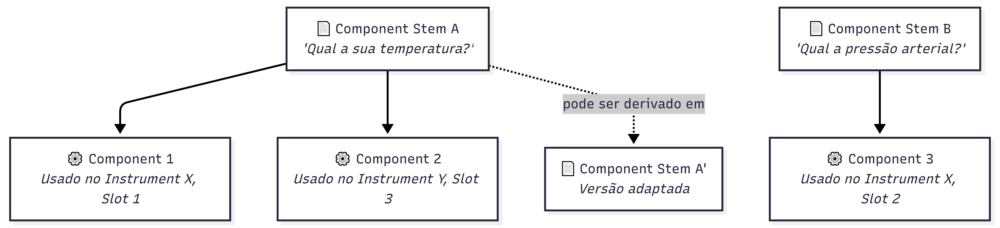
> _Imagem PNG equivalente ao diagrama Mermaid acima. Coloque o ficheiro com este nome em docs/images/diagrams/pt/._

> **Um Component Stem pode ser utilizado por múltiplos Components** em diferentes Instruments. Isso promove a reutilização e consistência.

### Nota sobre terminologia histórica

> ⚠️ **Ontologia atualizada:** O termo antigo **"DetectorStem"** (prefixo `DSM`) foi **descontinuado**. Utilize sempre **"ComponentStem"** (prefixo `CST`). Se encontrar entidades antigas com o prefixo `DSM`, estas refletem a nomenclatura anterior e podem necessitar de migração.

---

## 3. Aceder à Gestão de Component Stems

### Caminho de Navegação

```
Menu Principal → Instrument Elements → Manage Elements → Manage Component Stems
```

**URL direto:** `https://www.pmsr.net/sir/select/componentstem/1/9`

### Passos detalhados:

📋 **Passo 1.** Na barra de navegação principal, clique em **"Instrument Elements"**.

📋 **Passo 2.** Passe o cursor sobre **"Manage Elements"**.

📋 **Passo 3.** Clique em **"Manage Component Stems"**.

---

## 4. A Página de Gestão (Lista)

A página apresenta a lista de Component Stems dos quais é utilizador.

### Filtros Disponíveis

| Filtro | Descrição | Opções |
|--------|-----------|--------|
| **Filtro de Texto** | Pesquisa por palavra-chave no conteúdo/URI | Campo de texto livre |
| **Language** | Filtra por idioma | All / English / Português / etc. |
| **Status** | Filtra pelo estado | All Status / Draft / Under Review / Current / Deprecated |

### Colunas da Tabela

| Coluna | Descrição |
|--------|-----------|
| **URI** | Identificador único (link clicável) |
| **Content** | O texto/conteúdo do Stem (label) |
| **Version** | Número da versão |
| **Status** | Estado atual: Draft, Under Review, Current, Deprecated |

### Botões de Ação

| Botão | Função | Descrição |
|-------|--------|-----------|
| **Add New Component Stem** | Cria um Stem original | Abre formulário de criação |
| **Derive New Component Stem** | Cria um Stem derivado do selecionado | Abre formulário pré-preenchido com referência ao Stem de origem |
| **Edit Selected** | Edita o Stem selecionado | Abre formulário de edição |
| **Delete Selected** | Elimina o Stem selecionado | Com confirmação |
| **Send for Review** | Submete para revisão | Apenas para Stems em estado Draft |

> **Nota:** O botão **"Derive New Component Stem"** é exclusivo dos Component Stems. Permite criar variantes baseadas em Stems existentes.

---

## 5. Criar um Novo Component Stem

### Sequência de Criação

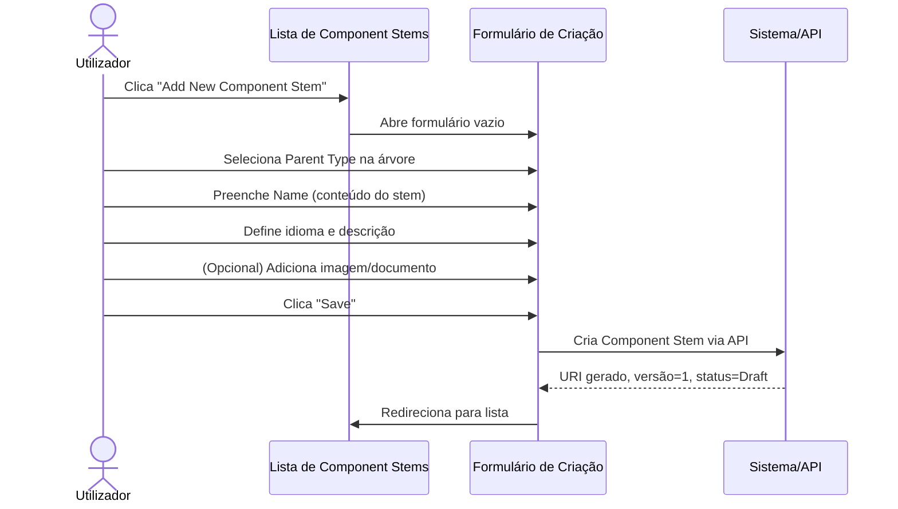
```mermaid
sequenceDiagram
    actor U as Utilizador
    participant L as Lista de Component Stems
    participant F as Formulário de Criação
    participant S as Sistema/API

    U->>L: Clica "Add New Component Stem"
    L->>F: Abre formulário vazio
    U->>F: Seleciona Parent Type na árvore
    U->>F: Preenche Name (conteúdo do stem)
    U->>F: Define idioma e descrição
    U->>F: (Opcional) Adiciona imagem/documento
    U->>F: Clica "Save"
    F->>S: Cria Component Stem via API
    S-->>F: URI gerado, versão=1, status=Draft
    F->>L: Redireciona para lista
```
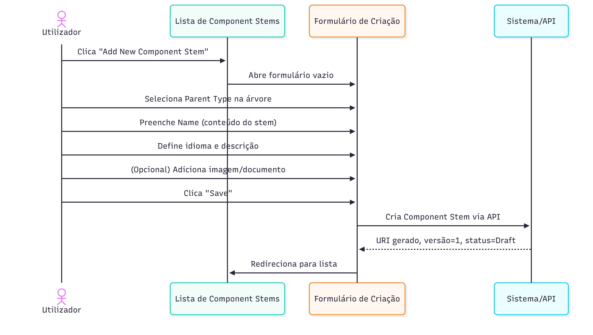
> _Imagem PNG equivalente ao diagrama Mermaid acima. Coloque o ficheiro com este nome em docs/images/diagrams/pt/._

### Passos Detalhados

📋 **Passo 1.** Na página de gestão, clique no botão **"Add New Component Stem"**.

📋 **Passo 2.** Preencha o formulário:

#### Campos do Formulário de Criação

| Campo | Tipo | Obrigatório | Descrição Detalhada |
|-------|------|-------------|---------------------|
| **Parent Type** | Seleção por modal (árvore) | **Sim** | Define o tipo hierárquico do Stem na ontologia. Ao clicar, abre-se uma janela modal (800px) com a árvore de tipos de Component Stems. Selecione o tipo mais adequado para o seu conteúdo. Por defeito, o tipo raiz é `vstoi:ComponentStem`. |
| **Name** | Campo de texto | **Sim** | O conteúdo textual do Component Stem. Este é o texto que será reutilizado pelos Components que referenciam este Stem. **Exemplo:** "Com que frequência sente dor de cabeça?", "Temperatura de entrada do fluido (°C)", "Pressão da câmara de liofilização". |
| **Language** | Lista de seleção | **Sim** | Idioma do conteúdo. Predefinido: English (en). Selecione o idioma correspondente ao texto do campo Name. |
| **Version** | Campo (somente leitura) | Auto | Sempre começa em 1. Não editável. |
| **Description** | Área de texto | Não | Descrição adicional do Stem: contexto de utilização, notas técnicas, significado científico, etc. |
| **Was Generated By** | Lista de seleção | **Sim** | Indica a origem do Stem. Para Stems criados de raiz, selecione **"ORIGINAL"**. Outras opções indicam métodos de derivação (automática, adaptação, etc.). **Predefinido: ORIGINAL.** |

#### Campos de Imagem

| Campo | Tipo | Descrição |
|-------|------|-----------|
| **Image Type** | Select | Escolha entre **URL** (link externo) ou **Upload** (carregar ficheiro) |
| **Image (URL)** | Textfield | Se URL: cole o endereço completo da imagem |
| **Upload Image** | File upload | Se Upload: PNG, JPG, JPEG. Máximo 2 MB |

#### Campos de Documento Web

| Campo | Tipo | Descrição |
|-------|------|-----------|
| **Web Document Type** | Select | Escolha entre **URL** ou **Upload** |
| **Web Document (URL)** | Textfield | Se URL: cole o endereço completo |
| **Upload Document** | File upload | Se Upload: PDF, DOC, DOCX, TXT, XLS, XLSX. Máximo 2 MB |

📋 **Passo 3.** Clique em **"Save"** para criar o Component Stem.

📋 **Passo 4.** O sistema cria o Stem com:
- **URI** gerado automaticamente (prefixo `CST`)
- **Versão** = 1
- **Status** = Draft
- **Was Generated By** = ORIGINAL

### Seleção do Parent Type (Modal de Árvore)

Ao clicar no campo **Parent Type**, abre-se a modal com a árvore hierárquica:

```
vstoi:ComponentStem
├── vstoi:QuestionStem
│   ├── vstoi:LikertQuestionStem
│   └── vstoi:OpenEndedQuestionStem
├── vstoi:SensorReadingStem
│   ├── vstoi:TemperatureStem
│   └── vstoi:PressureStem
└── ...
```

Clique no tipo desejado para selecionar. O campo é preenchido e a modal fecha.

---

## 6. Derivar um Component Stem

A **derivação** permite criar um novo Component Stem baseado num existente, mantendo a referência ao Stem de origem. Usado quando se pretende criar uma variação (ex: tradução, adaptação, especialização).

### Quando derivar?

- Adaptar uma pergunta para um contexto diferente
- Traduzir um Stem para outro idioma
- Especializar um Stem genérico para um domínio específico

### Sequência de Derivação

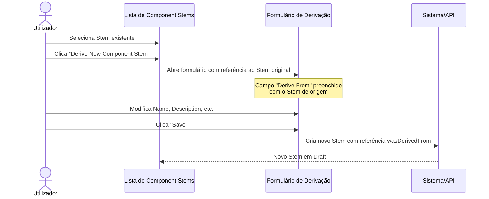
```mermaid
sequenceDiagram
    actor U as Utilizador
    participant L as Lista de Component Stems
    participant F as Formulário de Derivação
    participant S as Sistema/API

    U->>L: Seleciona Stem existente
    U->>L: Clica "Derive New Component Stem"
    L->>F: Abre formulário com referência ao Stem original
    Note over F: Campo "Derive From" preenchido<br/>com o Stem de origem
    U->>F: Modifica Name, Description, etc.
    U->>F: Clica "Save"
    F->>S: Cria novo Stem com referência wasDerivedFrom
    S-->>L: Novo Stem em Draft
```
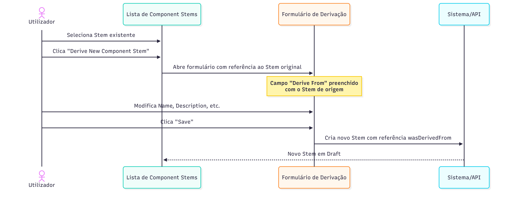
> _Imagem PNG equivalente ao diagrama Mermaid acima. Coloque o ficheiro com este nome em docs/images/diagrams/pt/._

### Passos Detalhados

📋 **Passo 1.** Na lista de Component Stems, selecione o Stem que servirá de base (radio button).

📋 **Passo 2.** Clique no botão **"Derive New Component Stem"**.

📋 **Passo 3.** O formulário abre com diferenças em relação ao formulário de criação normal:

| Diferença | Descrição |
|-----------|-----------|
| **Label do campo de tipo** | Muda de "Parent Type" para **"Derive From"** |
| **Referência ao original** | O campo mostra o Stem de origem selecionado |
| **Was Generated By** | A opção "ORIGINAL" é **removida**. Deve selecionar o método de derivação (ex: DERIVED, ADAPTED, TRANSLATED). |

📋 **Passo 4.** Modifique os campos conforme necessário:
- Altere o **Name** para o novo conteúdo
- Ajuste o **Language** se for uma tradução
- Atualize a **Description** para refletir a natureza da derivação
- Selecione o método em **Was Generated By** (ex: "DERIVED" para derivação, "ADAPTED" para adaptação)

📋 **Passo 5.** Clique em **"Save"**.

O novo Stem é criado com uma referência (`wasDerivedFrom`) ao Stem original, permitindo rastreabilidade.

### Diagrama de Derivação

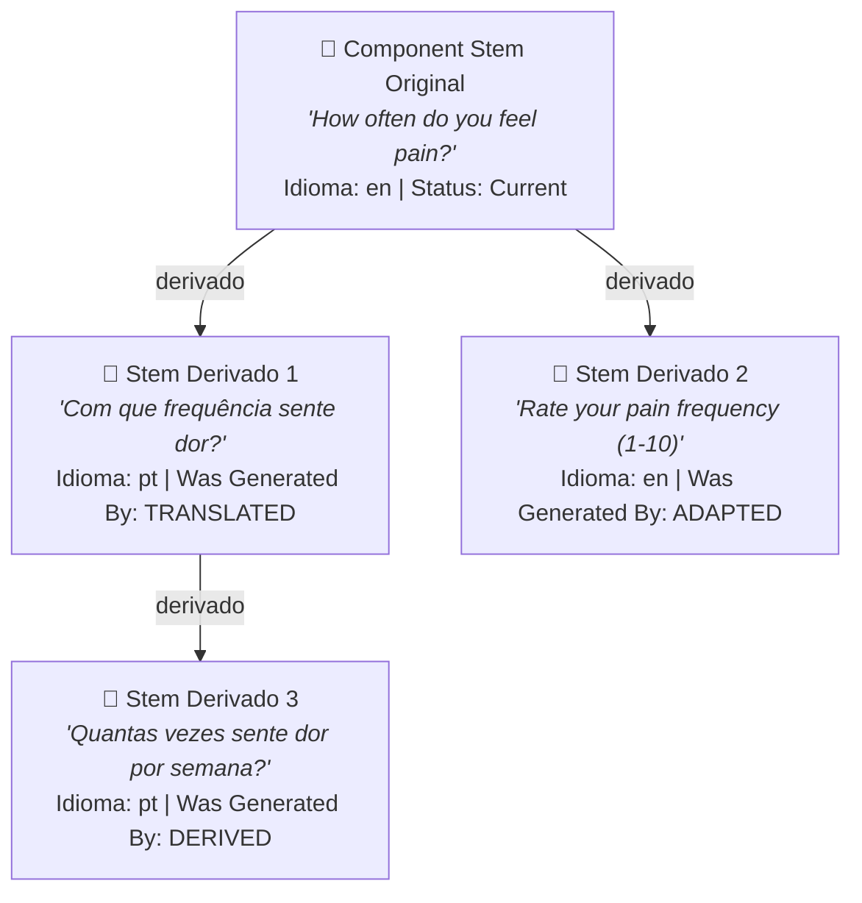
```mermaid
graph TD
    ORIGINAL["📄 Component Stem Original<br/><i>'How often do you feel pain?'</i><br/>Idioma: en | Status: Current"]
    
    ORIGINAL -->|"derivado"| D1["📄 Stem Derivado 1<br/><i>'Com que frequência sente dor?'</i><br/>Idioma: pt | Was Generated By: TRANSLATED"]
    ORIGINAL -->|"derivado"| D2["📄 Stem Derivado 2<br/><i>'Rate your pain frequency (1-10)'</i><br/>Idioma: en | Was Generated By: ADAPTED"]
    
    D1 -->|"derivado"| D3["📄 Stem Derivado 3<br/><i>'Quantas vezes sente dor por semana?'</i><br/>Idioma: pt | Was Generated By: DERIVED"]
```
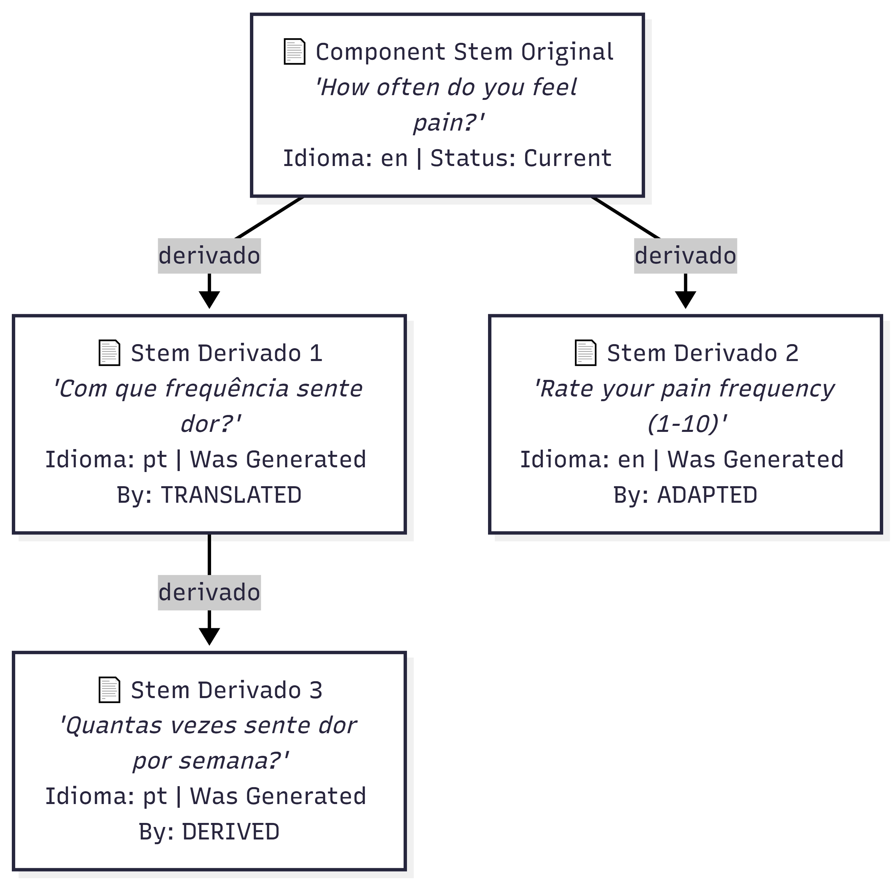
> _Imagem PNG equivalente ao diagrama Mermaid acima. Coloque o ficheiro com este nome em docs/images/diagrams/pt/._

---

## 7. Editar um Component Stem

### Como aceder à edição

📋 **Passo 1.** Na lista de Component Stems, selecione o Stem a editar (radio button).

📋 **Passo 2.** Clique em **"Edit Selected"**.

### Formulário de Edição

O formulário de edição contém todos os campos do formulário de criação, com elementos adicionais:

| Elemento Adicional | Descrição |
|--------------------|-----------|
| **URI** | Exibido como campo somente leitura (link clicável) |
| **Version** | Se o estado é Current ou Deprecated, a versão é automaticamente incrementada |
| **Derived From** | Se o Stem foi derivado, mostra o URI do Stem de origem com um botão **"Check Element"** para consultar detalhes |
| **Review Notes** | Se já foi revisto, mostra as notas do Reviewer (somente leitura) |
| **Reviewer Email** | Email do último Reviewer (somente leitura) |

### Fluxo de Edição

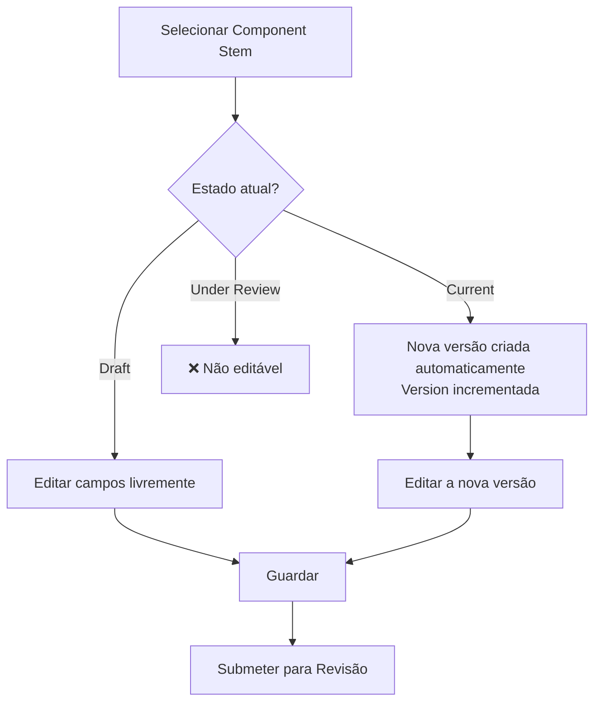
```mermaid
flowchart TD
    A[Selecionar Component Stem] --> B{Estado atual?}
    B -->|Draft| C[Editar campos livremente]
    B -->|Current| D[Nova versão criada automaticamente<br/>Version incrementada]
    B -->|Under Review| E[❌ Não editável]
    C --> F[Guardar]
    D --> G[Editar a nova versão]
    G --> F
    F --> H[Submeter para Revisão]
```
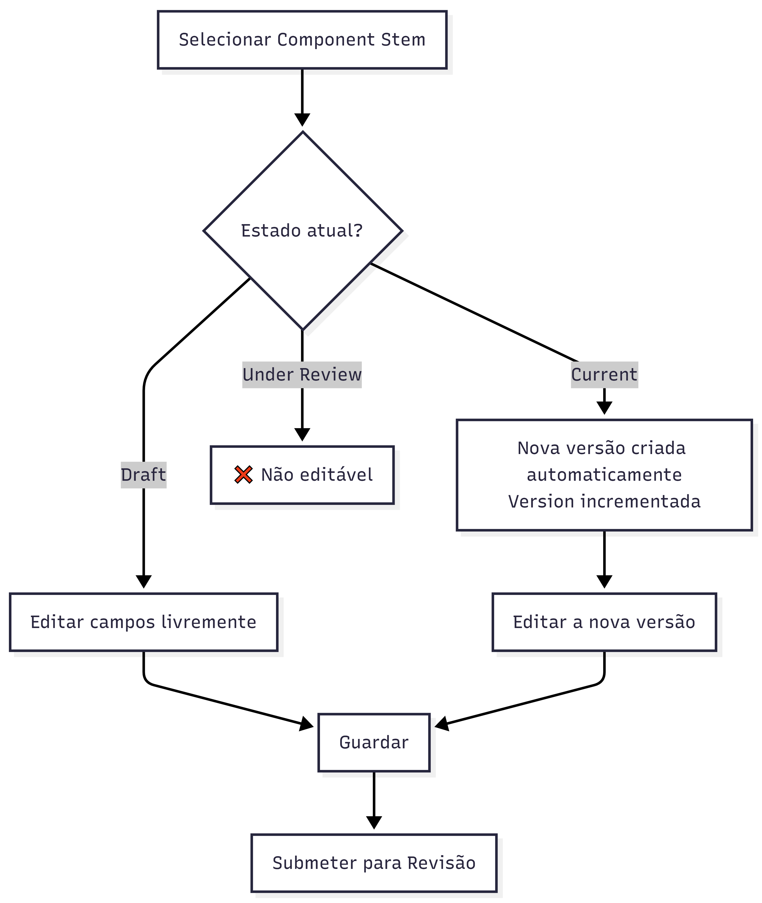
> _Imagem PNG equivalente ao diagrama Mermaid acima. Coloque o ficheiro com este nome em docs/images/diagrams/pt/._

> ⚠️ **Editar um Stem Current:** Ao editar um Component Stem com estado **Current**, o sistema cria uma nova versão em **Draft** com a versão incrementada. A versão Current permanece até que a nova seja aprovada.

---

## 8. Submeter para Revisão

### Passos

📋 **Passo 1.** Na lista, filtre por **Status: Draft**.

📋 **Passo 2.** Selecione o Component Stem a submeter.

📋 **Passo 3.** Clique em **"Send for Review"**.

📋 **Passo 4.** Confirme na caixa de diálogo: *"Are you sure you want to submit for Review selected entry?"*

📋 **Passo 5.** O estado muda para **Under Review**.

> **Nota:** Ao contrário dos Instruments, a submissão de um Component Stem é **individual** - não afeta outros elementos.

> ℹ️ **Nota sobre permissões:** A submissão para revisão pode ser feita pelo autor do elemento (utilizador autenticado). A aprovação ou rejeição requer a permissão **Content Editor** (Reviewer).

---

## 9. O Processo de Revisão (Perspetiva do Reviewer)

> ⚠️ **Permissão necessária:** Esta secção descreve ações disponíveis apenas para utilizadores com a role **Content Editor** (Reviewer). É incluída para que compreenda o fluxo completo de revisão.

### Aceder à Revisão de Component Stems

```
Menu Principal → Instrument Elements → Review Elements → Review Component Stems
```

### Formulário de Revisão

O Reviewer vê o Component Stem em modo **somente leitura**, com:

1. **Vertical Tabs** com: Type, Name, Language, Version, Description
2. **Derived From** (se aplicável): link para o Stem de origem + botão "Check Element"
3. **Was Derived By**: método de derivação/geração
4. **Secção de Revisão**: Review Notes + Reviewer Email

### Ações do Reviewer

| Ação | Botão | Notas Obrigatórias? | Resultado |
|------|-------|---------------------|-----------|
| **Aprovar** | **Approve** | Não | Estado → **Current**. O Stem fica disponível para uso em Components. |
| **Rejeitar** | **Reject** | **Sim** | Estado → **Draft**. O autor recebe as notas com o motivo da rejeição. |

### O que o Reviewer deve verificar

| Aspeto | O que avaliar |
|--------|---------------|
| **Conteúdo (Name)** | O texto é claro, gramaticalmente correto e adequado ao contexto? |
| **Tipo (Parent Type)** | O tipo hierárquico está correto na ontologia? |
| **Idioma** | O idioma selecionado corresponde ao conteúdo? |
| **Derivação** | Se derivado, a referência ao original é válida? A derivação é justificada? |
| **Descrição** | A descrição é suficientemente detalhada? |

---

## 10. Ciclo de Vida e Versionamento

### Diagrama de Estados

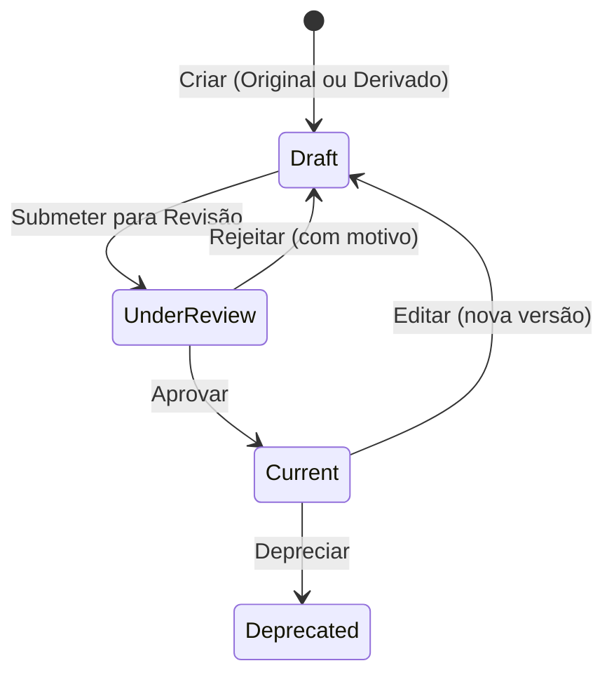
```mermaid
stateDiagram-v2
    [*] --> Draft : Criar (Original ou Derivado)
    Draft --> UnderReview : Submeter para Revisão
    UnderReview --> Current : Aprovar
    UnderReview --> Draft : Rejeitar (com motivo)
    Current --> Draft : Editar (nova versão)
    Current --> Deprecated : Depreciar
```
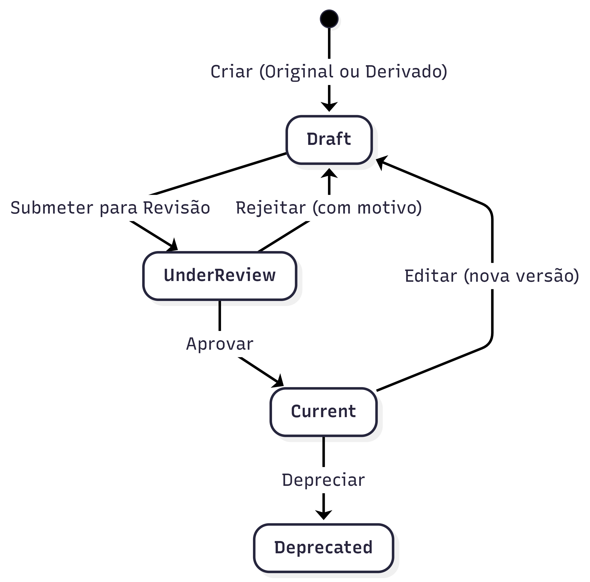
> _Imagem PNG equivalente ao diagrama Mermaid acima. Coloque o ficheiro com este nome em docs/images/diagrams/pt/._

### Impacto nos Components Dependentes

> ⚠️ **Atenção:** Alterar ou depreciar um Component Stem pode impactar todos os Components que o referenciam. Antes de depreciar um Stem, verifique se existem Components ativos que o utilizam.

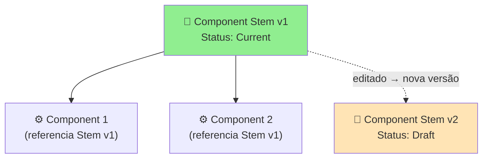
```mermaid
graph TD
    CS["📄 Component Stem v1<br/>Status: Current"]
    CS --> C1["⚙️ Component 1<br/>(referencia Stem v1)"]
    CS --> C2["⚙️ Component 2<br/>(referencia Stem v1)"]
    
    CS -.->|"editado → nova versão"| CS2["📄 Component Stem v2<br/>Status: Draft"]
    
    style CS fill:#90EE90
    style CS2 fill:#FFE4B5
```
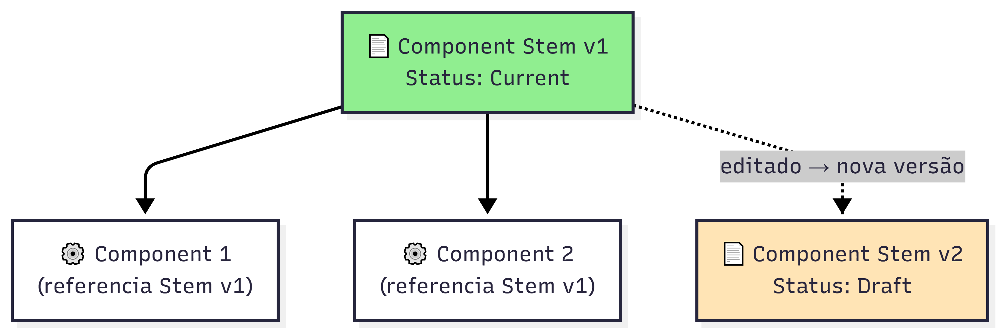
> _Imagem PNG equivalente ao diagrama Mermaid acima. Coloque o ficheiro com este nome em docs/images/diagrams/pt/._

---

## 11. Referência de Campos

### Tabela Completa - Formulário de Criação

| Campo | Nome Técnico | Tipo | Obrigatório | Valor Padrão | Descrição |
|-------|-------------|------|-------------|--------------|-----------|
| Parent Type | `componentstem_type` | Modal textfield | Sim | (vazio) | Tipo na ontologia, selecionado por árvore modal |
| Name | `componentstem_content` | Textfield | Sim | (vazio) | Conteúdo textual do Stem |
| Language | `componentstem_language` | Select | Sim | en | Idioma do conteúdo |
| Version | `componentstem_version` | Hidden / Textfield (disabled) | Auto | 1 | Versão numérica |
| Description | `componentstem_description` | Textarea | Não | (vazio) | Descrição detalhada |
| Was Generated By | `componentstem_was_generated_by` | Select | Sim | ORIGINAL | Método de criação/derivação |
| Image Type | `componentstem_image_type` | Select | Não | (vazio) | URL ou Upload |
| Image URL | `componentstem_image_url` | Textfield | Condicional | (vazio) | URL da imagem (se tipo URL) |
| Image Upload | `componentstem_image_upload` | Managed file | Condicional | (vazio) | Ficheiro (PNG/JPG/JPEG, max 2MB) |
| Web Doc Type | `componentstem_webdocument_type` | Select | Não | (vazio) | URL ou Upload |
| Web Doc URL | `componentstem_webdocument_url` | Textfield | Condicional | (vazio) | URL do documento (se tipo URL) |
| Web Doc Upload | `componentstem_webdocument_upload` | Managed file | Condicional | (vazio) | Ficheiro (PDF/DOC/DOCX/TXT/XLS/XLSX, max 2MB) |

### Campos Adicionais da Edição

| Campo | Nome Técnico | Tipo | Descrição |
|-------|-------------|------|-----------|
| URI | `componentstem_uri` | Item (read-only) | Link clicável para a página de descrição |
| Derived From | (display) | Markup + Button | URI do Stem de origem + botão "Check Element" |
| Review Notes | `componentstem_hasreviewnote` | Textarea (read-only) | Notas do Reviewer (se existirem) |
| Reviewer Email | `componentstem_haseditoremail` | Textfield (read-only) | Email do último Reviewer |

### Opções do Campo "Was Generated By"

| Opção | Descrição | Quando usar |
|-------|-----------|-------------|
| **ORIGINAL** | Stem criado de raiz | Criação direta (não baseado em outro Stem) |
| **DERIVED** | Derivado de outro Stem | Variação ou evolução de um Stem existente |
| **ADAPTED** | Adaptado de outro Stem | Adaptação para contexto diferente |
| **TRANSLATED** | Traduzido de outro Stem | Tradução para outro idioma |

> **Nota:** Quando se usa o formulário de derivação (via botão "Derive New"), a opção ORIGINAL é automaticamente removida, pois o Stem está a ser derivado.

---

## 12. Resolução de Problemas

| Problema | Causa Possível | Solução |
|----------|----------------|---------|
| Não encontro o Stem que preciso para criar um Component | O Stem pode não existir ou pode estar noutro idioma | Crie um novo Stem ou use "Derive" para criar uma versão adaptada |
| O botão "Derive" está desativado | Nenhum Stem está selecionado na lista | Selecione um Stem clicando no radio button antes de clicar "Derive" |
| O campo "Was Generated By" não mostra "ORIGINAL" | Está a usar o formulário de derivação | Comportamento esperado para derivações. Use "Add New" para criar Stems originais. |
| A versão incrementou sozinha | Editou um Stem com estado Current | Comportamento esperado - nova versão Draft criada automaticamente |
| O Stem foi rejeitado na revisão | O Reviewer encontrou problemas | Abra a edição e consulte as Review Notes para ver o motivo |

---

🔗 **Navegação Interna:**
[Components](#4-components) • [Instruments / Simulators](#2-instruments--simulators) • [Índice Interno](#índice-interno)

---

## 4. Components

**Módulo:** SIR (Semantic Instrument Repository)  
**Contexto PMSR:** Components representam os elementos funcionais de um Simulator (detectores, atuadores, perguntas, etc.)  

---
## 1. Visão Geral

Um **Component** é uma instância lógica de um **Component Stem** - a materialização concreta de um template num contexto específico. Os Components são os "blocos funcionais" que compõem os Instruments/Simulators, sendo associados a **Container Slots** (incluindo slots de sub-containers) dentro desses instrumentos.

No contexto PMSR, Components podem representar:
- **Detectores** - sensores ou perguntas que recolhem dados (inputs)
- **Atuadores** - elementos que produzem ações ou outputs
- **Perguntas de questionário** - itens de avaliação
- **Medições** - pontos de recolha de valores

> 📘 **Stem vs. Component:** Um Component Stem (Manual 02) é o **template reutilizável** (a "receita"). Um Component é uma **instância lógica** desse template, associada a um slot específico dentro de um Instrument/Simulator. Quando coloca um Component Stem num slot do instrumento, cria-se um Component. Pense no Stem como o molde e no Component como a peça colocada na posição certa da máquina.

### Diagrama de Relações

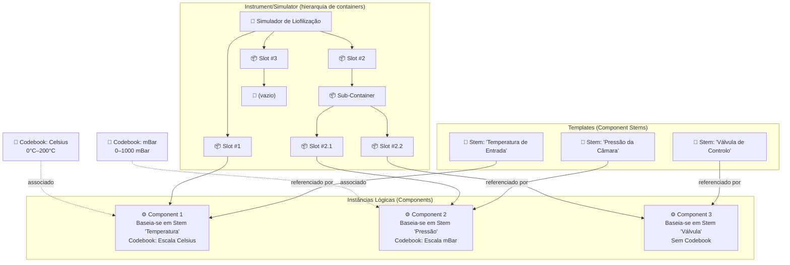
```mermaid
graph TD
    subgraph "Templates (Component Stems)"
        CS1["📄 Stem: 'Temperatura de Entrada'"]
        CS2["📄 Stem: 'Pressão da Câmara'"]
        CS3["📄 Stem: 'Válvula de Controlo'"]
    end

    subgraph "Instâncias Lógicas (Components)"
        C1["⚙️ Component 1<br/>Baseia-se em Stem 'Temperatura'<br/>Codebook: Escala Celsius"]
        C2["⚙️ Component 2<br/>Baseia-se em Stem 'Pressão'<br/>Codebook: Escala mBar"]
        C3["⚙️ Component 3<br/>Baseia-se em Stem 'Válvula'<br/>Sem Codebook"]
    end

    subgraph "Instrument/Simulator (hierarquia de containers)"
        INST["🧪 Simulador de Liofilização"]
        S1["📦 Slot #1"]
        S2["📦 Slot #2"]
        S3["📦 Slot #3"]
        SUB["📦 Sub-Container"]
        SS1["📦 Slot #2.1"]
        SS2["📦 Slot #2.2"]
        EMPTY["🔲 (vazio)"]
    end

    CS1 -->|"referenciado por"| C1
    CS2 -->|"referenciado por"| C2
    CS3 -->|"referenciado por"| C3
    
    INST --> S1 --> C1
    INST --> S2 --> SUB
    SUB --> SS1 --> C2
    SUB --> SS2 --> C3
    INST --> S3 --> EMPTY

    CB1["📖 Codebook: Celsius<br/>0°C–200°C"]
    CB2["📖 Codebook: mBar<br/>0–1000 mBar"]
    
    CB1 -.->|"associado"| C1
    CB2 -.->|"associado"| C2
```
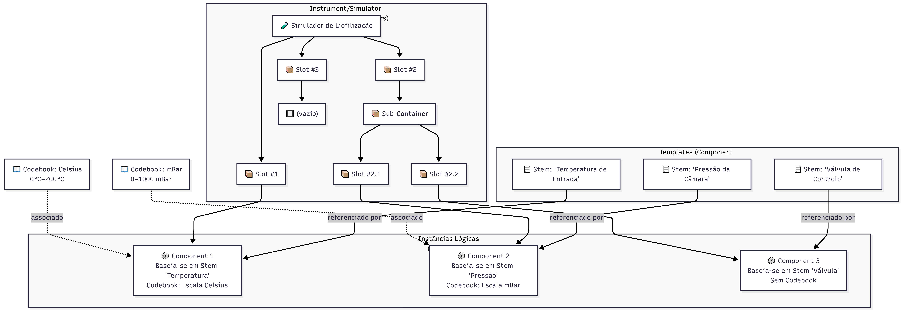
> _Imagem PNG equivalente ao diagrama Mermaid acima. Coloque o ficheiro com este nome em docs/images/diagrams/pt/._

---

## 2. O que é um Component?

### Definição

Um Component é uma entidade que:
- **Referencia obrigatoriamente** um **Component Stem** (o seu template)
- **Pode ter** um **Codebook** associado (esquema de respostas/valores)
- **É associado** a um **Container Slot** (em qualquer nível da hierarquia) dentro de um Instrument/Simulator
- **Segue** o fluxo de revisão (Draft → Under Review → Current)
- **Tem versionamento** automático

### Diferença entre Component Stem e Component

| Aspeto | Component Stem | Component |
|--------|---------------|-----------|
| **Natureza** | Template reutilizável | Instância concreta |
| **Conteúdo** | Define o "texto base" (pergunta, descrição) | Herda o conteúdo do Stem |
| **Reutilização** | Pode ser usado por múltiplos Components | Pertence a um contexto específico |
| **Codebook** | Não tem Codebook | Pode ter Codebook associado |
| **Slot** | Não é associado a slots | É associado a um slot num Instrument ou sub-container |

---

## 3. Pré-requisitos

Antes de criar um Component, certifique-se de que:

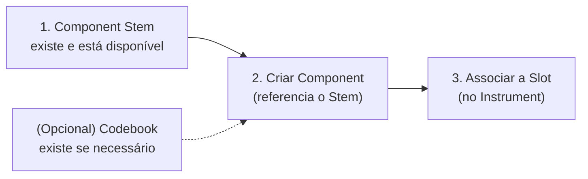
```mermaid
flowchart LR
    A["1. Component Stem<br/>existe e está disponível"] --> B["2. Criar Component<br/>(referencia o Stem)"]
    B --> C["3. Associar a Slot<br/>(no Instrument)"]
    
    CB["(Opcional) Codebook<br/>existe se necessário"] -.-> B
```
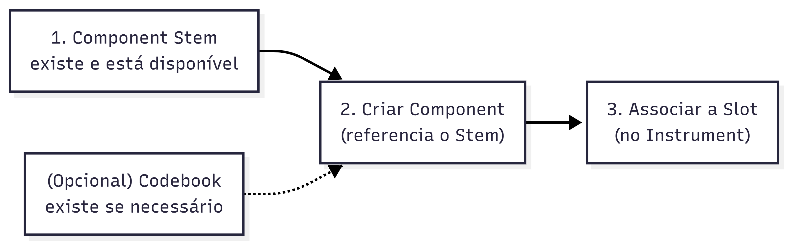
> _Imagem PNG equivalente ao diagrama Mermaid acima. Coloque o ficheiro com este nome em docs/images/diagrams/pt/._

| Pré-requisito | Obrigatório? | Onde criar? |
|---------------|-------------|-------------|
| **Component Stem** | **Sim** | 🔗 [Secção 3 - Component Stems](#3-component-stems) |
| **Codebook** | Não | *Instrument Elements → Manage Elements → Manage Codebooks* |
| **Instrument/Simulator** (para associação a slot) | Para associação | 🔗 [Secção 2 - Instruments / Simulators](#2-instruments--simulators) |

> ⚠️ **Se não encontrar um Component Stem adequado**, deve criá-lo primeiro. Consulte a 🔗 [Secção 3 - Component Stems](#3-component-stems) e depois volte a esta secção.

---

## 4. Aceder à Gestão de Components

### Caminho de Navegação

```
Menu Principal → Instrument Elements → Manage Elements → Manage Component
```

**URL direto:** `https://www.pmsr.net/sir/select/component/1/9`

### Passos:

📋 **Passo 1.** Na barra de navegação, clique em **"Instrument Elements"**.

📋 **Passo 2.** Passe o cursor sobre **"Manage Elements"**.

📋 **Passo 3.** Clique em **"Manage Component"**.

---

## 5. A Página de Gestão (Lista)

### Filtros Disponíveis

| Filtro | Descrição | Opções |
|--------|-----------|--------|
| **Filtro de Texto** | Pesquisa por conteúdo ou URI | Campo de texto livre |
| **Language** | Filtra por idioma | All / English / etc. |
| **Status** | Filtra por estado | All Status / Draft / Under Review / Current / Deprecated |

### Colunas da Tabela

| Coluna | Descrição |
|--------|-----------|
| **URI** | Identificador único (link clicável para página de descrição) |
| **Content** | Conteúdo/label do Component (herdado do Stem) |
| **Version** | Número da versão |
| **Codebook** | Codebook associado (se existir) - label clicável |
| **Attribute Of** | Referência "Attribute Of" (se configurada) |
| **Status** | Estado: Draft, Under Review, Current, Deprecated |

### Botões de Ação

| Botão | Função | Condição |
|-------|--------|----------|
| **Add New Component** | Cria um novo Component | Sempre disponível |
| **Edit Selected** | Edita o Component selecionado | Requer seleção |
| **Delete Selected** | Elimina o Component selecionado | Com confirmação |
| **Send for Review** | Submete para revisão | Apenas para estado Draft |

---

## 6. Criar um Novo Component

### Sequência Completa de Criação

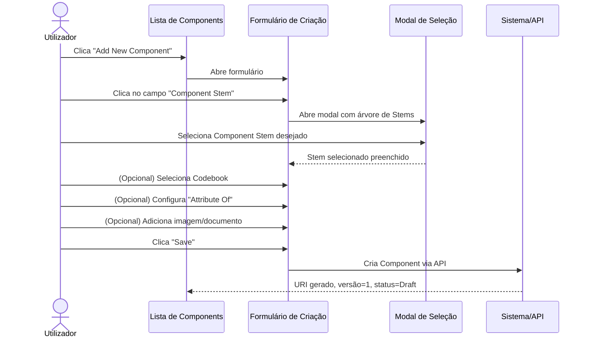
```mermaid
sequenceDiagram
    actor U as Utilizador
    participant L as Lista de Components
    participant F as Formulário de Criação
    participant M as Modal de Seleção
    participant S as Sistema/API

    U->>L: Clica "Add New Component"
    L->>F: Abre formulário
    U->>F: Clica no campo "Component Stem"
    F->>M: Abre modal com árvore de Stems
    U->>M: Seleciona Component Stem desejado
    M-->>F: Stem selecionado preenchido
    U->>F: (Opcional) Seleciona Codebook
    U->>F: (Opcional) Configura "Attribute Of"
    U->>F: (Opcional) Adiciona imagem/documento
    U->>F: Clica "Save"
    F->>S: Cria Component via API
    S-->>L: URI gerado, versão=1, status=Draft
```
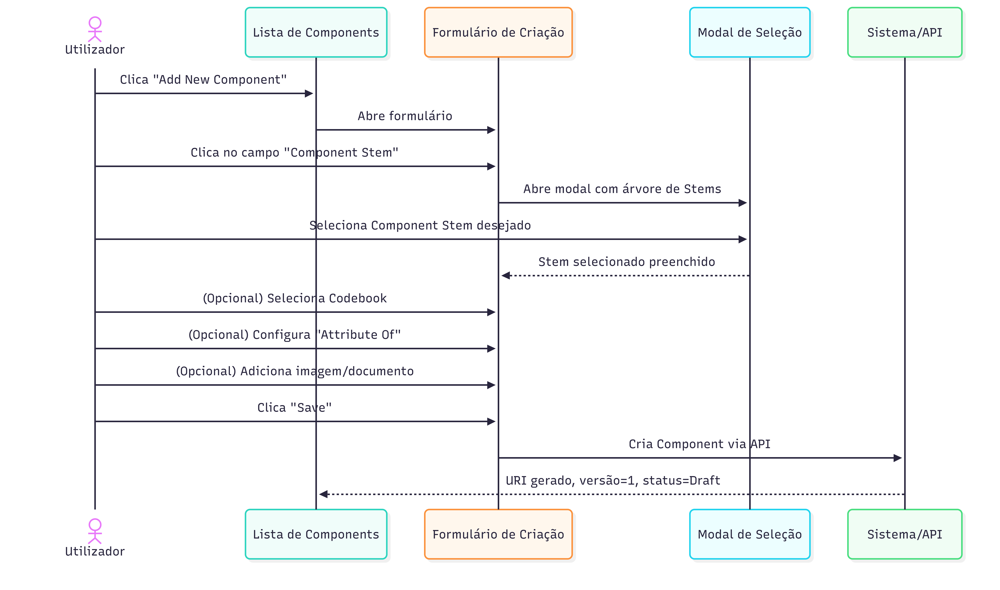
> _Imagem PNG equivalente ao diagrama Mermaid acima. Coloque o ficheiro com este nome em docs/images/diagrams/pt/._

### Passos Detalhados

📋 **Passo 1.** Na página de gestão, clique em **"Add New Component"**.

📋 **Passo 2.** Preencha o formulário:

#### Campos do Formulário de Criação

| Campo | Tipo | Obrigatório | Descrição Detalhada |
|-------|------|-------------|---------------------|
| **Component Stem** | Seleção por modal (árvore) | **Sim** | O template base deste Component. Clique no campo para abrir a modal com a árvore de Component Stems disponíveis. Selecione o Stem que melhor corresponde à função deste Component. **Se não encontrar um Stem adequado, feche o formulário e crie-o primeiro** (🔗 [Secção 3 - Component Stems](#3-component-stems)). |
| **Codebook** | Campo com autocomplete | Não | Esquema de respostas/valores associado ao Component. Comece a escrever o nome do Codebook e selecione da lista de sugestões. **Ex:** "Escala Likert 5 pontos", "Escala Celsius 0-200". Deixe em branco se o component não necessita de respostas codificadas. |
| **Maker** | Campo com autocomplete | Não | Organização fabricante. |
| **Version** | Hidden (automático) | Auto | Começa em 1. |
| **Attribute Of** | Seleção por modal (árvore) | Não | Opcional: permite ligar este Component como atributo de outro Component. Usado para criar hierarquias de medição (ex: um sub-indicador pertence a um indicador principal). |

#### Campos de Imagem

| Campo | Tipo | Descrição |
|-------|------|-----------|
| **Image Type** | Select | **URL** ou **Upload** |
| **Image (URL)** | Textfield | Endereço completo da imagem (se URL) |
| **Upload Image** | File upload | PNG, JPG, JPEG. Máximo 2 MB |

#### Campos de Documento Web

| Campo | Tipo | Descrição |
|-------|------|-----------|
| **Web Document Type** | Select | **URL** ou **Upload** |
| **Web Document (URL)** | Textfield | Endereço do documento (se URL) |
| **Upload Document** | File upload | PDF, DOC, DOCX, TXT, XLS, XLSX. Máximo 2 MB |

📋 **Passo 3.** Clique em **"Save"**.

📋 **Passo 4.** O Component é criado com:
- **URI** gerado automaticamente
- **Status** = Draft
- **Versão** = 1

### Seleção do Component Stem (Modal)

Ao clicar no campo **Component Stem**, abre-se a modal (800px) com a árvore hierárquica de Stems:

```
vstoi:ComponentStem
├── vstoi:QuestionStem
│   ├── "Qual a frequência de...?"
│   ├── "Avalie numa escala de 1 a 5..."
│   └── ...
├── vstoi:SensorReadingStem
│   ├── "Temperatura de entrada"
│   ├── "Pressão da câmara"
│   └── ...
└── ...
```

Clique no Stem desejado para selecionar. O campo é preenchido automaticamente.

### Seleção do Codebook (Autocomplete)

No campo **Codebook**, comece a escrever o nome do Codebook:

```
Codebook: [Escala Li...]
           ├── Escala Likert 5 pontos (pmsr:/CB001)
           ├── Escala Likert 7 pontos (pmsr:/CB002)
           └── Likert Frequência (pmsr:/CB003)
```

Selecione o Codebook desejado da lista de sugestões. O formato de cada sugestão inclui o nome e o URI para identificação clara.

---

## 7. Associar um Component a um Slot (Container Slot)

Após criar um Component, este precisa de ser **associado a um Container Slot** dentro de um Instrument/Simulator para se tornar funcional. Essa associação pode ocorrer no nível raiz do instrumento ou em **sub-containers** aninhados.

### Métodos de Associação

Existem **dois caminhos** para associar um Component a um Slot:

#### Método 1: A partir do Instrument (Recomendado)

```mermaid
flowchart TD
    A["Abrir Instrument em modo Edição"] --> B["Secção 'Container Elements'"]
    B --> C["Identificar slot alvo<br/>(raiz ou sub-container)"]
    C --> D["Clicar 'Edit Slot'"]
    D --> E["Na modal, selecionar Component<br/>ou Sub-Container"]
    E --> F["Clicar 'Update'"]
    F --> G{"Tipo selecionado?"}
    G -->|"Component"| H["✅ Component associado ao slot"]
    G -->|"Sub-Container"| I["Abrir sub-container e repetir<br/>nos seus sub-slots"]
```
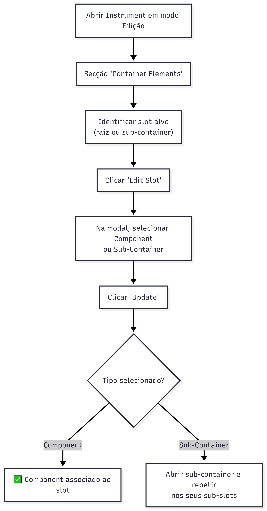
> _Imagem PNG equivalente ao diagrama Mermaid acima. Coloque o ficheiro com este nome em docs/images/diagrams/pt/._

📋 **Passo 1.** Navegue até a edição do Instrument (🔗 ver [Secção 2 - Instruments / Simulators](#2-instruments--simulators), secção 5).

📋 **Passo 2.** Na secção **"Container Elements"**, identifique o slot ao qual quer associar o Component.

📋 **Passo 3.** Clique no botão de edição do slot (**"Edit Slot"** ou ícone de lápis).

📋 **Passo 4.** No formulário de edição do slot, clique no campo **"Component"** para abrir a modal de seleção.

📋 **Passo 5.** Selecione o Component desejado na árvore.

📋 **Passo 6.** Clique em **"Update"** para confirmar a associação.

#### Método 2: Criar Component diretamente no Slot

📋 **Passo 1.** No formulário de edição do Slot, em vez de selecionar um Component existente, clique em **"New Item"**.

📋 **Passo 2.** O sistema redireciona para o formulário de criação de Component, já pré-configurado para associação a este slot.

📋 **Passo 3.** Preencha os campos do Component (como na [secção 6](#6-criar-um-novo-component)).

📋 **Passo 4.** Ao guardar, o Component é criado E automaticamente associado ao slot.

### Formulário de Edição de Container Slot

| Campo | Tipo | Descrição |
|-------|------|-----------|
| **Slot URI** | Texto (somente leitura) | Identificador do slot |
| **Priority** | Texto (somente leitura) | Ordem/prioridade do slot no Instrument |
| **Component** | Modal (árvore) | Component associado - clique para selecionar |

| Botão | Função |
|-------|--------|
| **New Item** | Cria novo Component e associa a este slot |
| **Reset this Item** | Remove o Component do slot (slot fica vazio) |
| **Update** | Guarda a associação (ativo apenas com Component selecionado) |
| **Cancel** | Fecha sem alterar |

> ⚠️ **Estrutura recursiva:** O slot editado pode pertencer ao container principal ou a um sub-container. A hierarquia pode ser aninhada em múltiplos níveis.

### Visualização da Estrutura Completa

Após associar Components aos Slots, a secção "Container Elements" do Instrument mostra:

```
📦 Container Elements do Simulador de Liofilização
│
├── Slot #1 (Prioridade: 1)
│   └── ⚙️ Component: "Temperatura de Entrada" (Stem: 'Temp. Entrada', Codebook: Celsius)
│       [Edit Component] [Remove from Slot]
│
├── Slot #2 (Prioridade: 2)
│   └── 📦 Sub-Container: "Medições de Pressão"
│       ├── Slot #2.1 (Prioridade: 1)
│       │   └── ⚙️ Component: "Pressão da Câmara" (Stem: 'Pressão Câmara', Codebook: mBar)
│       │       [Edit Component] [Remove from Slot]
│       └── Slot #2.2 (Prioridade: 2)
│           └── 📦 Sub-Container: "Controlo Fino"
│               └── Slot #2.2.1 (Prioridade: 1)
│                   └── ⚙️ Component: "Pressão de Almofada" [Edit Component] [Remove from Slot]
│
├── Slot #3 (Prioridade: 3)
│   └── 🔲 (vazio)
│       [Add Component ou Sub-Container] [Edit Slot]
│
└── [+ Add More Slots]
```

---

## 8. Entender Detectores e Atuadores

No contexto do PMSR e da ontologia VSTOI, os Components podem assumir papéis diferentes dependendo do seu **tipo hierárquico** (definido pelo Component Stem):

### Detectores (Detectors)

**O que são:** Components que funcionam como **sensores, entradas ou recolectores de dados**. Captam informação do ambiente ou do utilizador.

| Exemplos no PMSR | Descrição |
|-------------------|-----------|
| Sensor de Temperatura | Recolhe a temperatura de entrada do fluido |
| Pergunta de Questionário | Recolhe a resposta do participante |
| Sensor de Pressão | Mede a pressão na câmara |
| Campo de Input | Recebe dados numéricos do operador |

### Atuadores (Actuators)

**O que são:** Components que funcionam como **elementos de ação, saída ou controlo**. Produzem efeitos no sistema ou no ambiente.

| Exemplos no PMSR | Descrição |
|-------------------|-----------|
| Válvula de Controlo | Controla o fluxo de fluido |
| Display de Resultado | Apresenta resultados calculados |
| Alerta de Limiar | Dispara notificação quando valor excede limite |
| Atuador Mecânico | Aciona componente físico do simulador |

### Como é feita a classificação?

A classificação como Detector ou Atuador é determinada pelo **Component Stem** selecionado, que pertence a um ramo específico da ontologia:

```mermaid
graph TD
    ROOT["vstoi:ComponentStem"]
    ROOT --> DET["vstoi:ComponentStem<br/>(ramo Detector)"]
    ROOT --> ACT["vstoi:ComponentStem<br/>(ramo Atuador)"]
    
    DET --> D1["Sensor de Temperatura"]
    DET --> D2["Pergunta de Questionário"]
    DET --> D3["Campo de Medição"]
    
    ACT --> A1["Válvula de Controlo"]
    ACT --> A2["Display de Output"]
    ACT --> A3["Atuador Mecânico"]
```
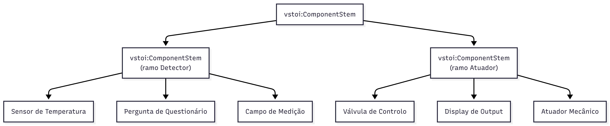
> _Imagem PNG equivalente ao diagrama Mermaid acima. Coloque o ficheiro com este nome em docs/images/diagrams/pt/._

> **Na prática:** Ao criar um Component, a classificação como Detector ou Atuador é **implícita** - depende do Component Stem selecionado. Escolha o Stem correto e a classificação será automática.

> **Nota:** A interface atual do sistema não exibe explicitamente "Detector" ou "Atuador" como labels nos formulários. A distinção é feita ao nível da ontologia e é visível na hierarquia de tipos ao selecionar o Component Stem na modal de árvore.

---

## 9. Editar um Component

### Como aceder

📋 **Passo 1.** Na lista de Components, selecione o Component a editar.

📋 **Passo 2.** Clique em **"Edit Selected"**.

### Formulário de Edição

O formulário inclui todos os campos da criação, com adições:

| Elemento Adicional | Descrição |
|--------------------|-----------|
| **URI** | Link somente leitura para a página de descrição |
| **Component Stem** | Editável via modal - pode alterar o Stem associado |
| **Codebook** | Mostra label + URI do Codebook atual; editável |
| **Version** | Incrementada automaticamente se estado é Current/Deprecated |
| **Review Notes** | Notas do Reviewer (somente leitura, se existirem) |
| **Reviewer Email** | Email do Reviewer (somente leitura) |

### Fluxo de Edição

```mermaid
flowchart TD
    A["Selecionar Component"] --> B{Estado?}
    B -->|Draft| C["Editar livremente"]
    B -->|Current| D["Nova versão Draft criada<br/>(version incrementada)"]
    B -->|Under Review| E["❌ Bloqueado"]
    C --> F["Save"]
    D --> G["Editar a nova versão"]
    G --> F
    F --> H["Submeter para Revisão"]
```
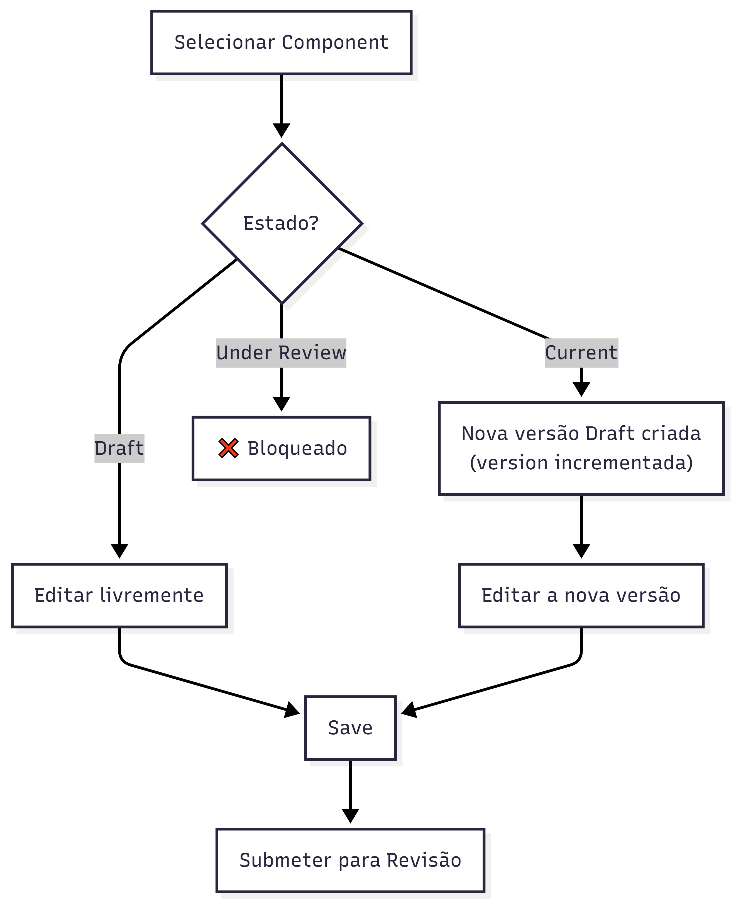
> _Imagem PNG equivalente ao diagrama Mermaid acima. Coloque o ficheiro com este nome em docs/images/diagrams/pt/._

---

## 10. Submeter para Revisão

### Passos

📋 **Passo 1.** Na lista de Components, filtre por **Status: Draft**.

📋 **Passo 2.** Selecione o Component a submeter.

📋 **Passo 3.** Clique em **"Send for Review"**.

📋 **Passo 4.** Confirme: *"Are you sure you want to submit for Review selected entry?"*

📋 **Passo 5.** O estado muda para **Under Review**.

> ℹ️ **Nota sobre permissões:** A submissão para revisão pode ser feita pelo autor do elemento (utilizador autenticado). A aprovação ou rejeição requer a permissão **Content Editor** (Reviewer).

> **Nota:** Components também podem ser submetidos **automaticamente** quando o Instrument que os contém é submetido para revisão (submissão recursiva). Ver 🔗 [Secção 2 - Instruments / Simulators](#2-instruments--simulators), secção 7.

---

## 11. O Processo de Revisão (Perspetiva do Reviewer)

> ⚠️ **Permissão necessária:** Esta secção descreve ações disponíveis apenas para utilizadores com a role **Content Editor** (Reviewer). É incluída para que compreenda o fluxo completo de revisão.

### Aceder à Revisão

```
Menu Principal → Instrument Elements → Review Elements → Review Components
```

### Formulário de Revisão

O Reviewer vê o Component em modo **somente leitura**:

1. **Detalhes do Component**: Stem associado, Codebook, Attribute Of, versão
2. **Links de referência**: Links clicáveis para o Stem e Codebook associados
3. **Secção de Revisão**: Review Notes e Reviewer Email

### Ações do Reviewer

| Ação | Botão | Notas Obrigatórias? | Resultado |
|------|-------|---------------------|-----------|
| **Aprovar** | **Approve** | Não | Estado → **Current** |
| **Rejeitar** | **Reject** | **Sim** | Estado → **Draft** + notas de motivo |

### O que o Reviewer deve verificar

| Aspeto | O que avaliar |
|--------|---------------|
| **Component Stem** | O Stem selecionado é adequado? Está em estado Current? |
| **Codebook** | O Codebook associado é correto para este tipo de Component? |
| **Attribute Of** | A relação de atributo faz sentido no contexto? |
| **Completude** | Todos os campos necessários estão preenchidos? |

> ⚠️ **Rejeição recursiva de Instruments:** Se um Reviewer rejeita um Instrument, todos os Components associados são automaticamente rejeitados também. As notas de rejeição do Instrument são propagadas.

---

## 12. Ciclo de Vida e Versionamento

```mermaid
stateDiagram-v2
    [*] --> Draft : Criar
    Draft --> UnderReview : Submeter para Revisão
    Draft --> UnderReview : (ou via submissão do Instrument)
    UnderReview --> Current : Aprovar
    UnderReview --> Draft : Rejeitar (com motivo)
    Current --> Draft : Editar (nova versão)
    Current --> Deprecated : Depreciar
```
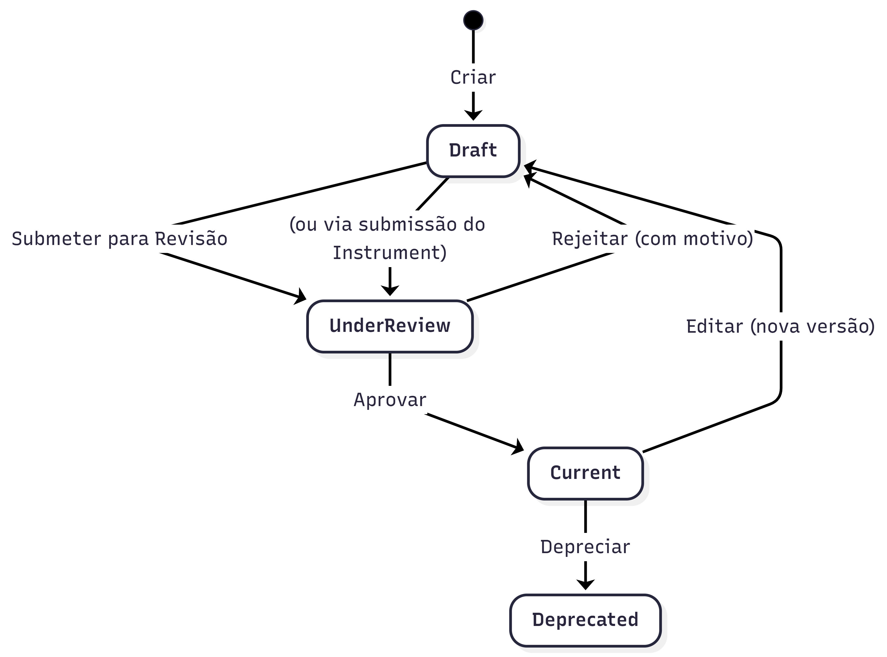
> _Imagem PNG equivalente ao diagrama Mermaid acima. Coloque o ficheiro com este nome em docs/images/diagrams/pt/._

### Relação com o Ciclo de Vida do Instrument

```mermaid
graph TD
    subgraph "Instrument"
        I_DRAFT["Instrument: Draft"]
        I_REVIEW["Instrument: Under Review"]
        I_CURRENT["Instrument: Current"]
    end
    
    subgraph "Components do Instrument"
        C_DRAFT["Components: Draft"]
        C_REVIEW["Components: Under Review"]
        C_CURRENT["Components: Current"]
    end
    
    I_DRAFT -->|"Send for Review<br/>(recursivo)"| I_REVIEW
    C_DRAFT -->|"automático"| C_REVIEW
    
    I_REVIEW -->|"Approve"| I_CURRENT
    C_REVIEW -->|"automático"| C_CURRENT
    
    I_REVIEW -->|"Reject<br/>(recursivo)"| I_DRAFT
    C_REVIEW -->|"automático"| C_DRAFT
```
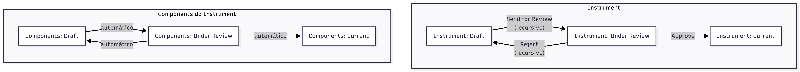
> _Imagem PNG equivalente ao diagrama Mermaid acima. Coloque o ficheiro com este nome em docs/images/diagrams/pt/._

---

## 13. Referência de Campos

### Tabela Completa - Formulário de Criação

| Campo | Nome Técnico | Tipo | Obrigatório | Valor Padrão | Descrição |
|-------|-------------|------|-------------|--------------|-----------|
| Component Stem | `component_stem` | Modal textfield | **Sim** | (vazio) | Template base selecionado por árvore modal |
| Codebook | `component_codebook` | Textfield + autocomplete | Não | (vazio) | Esquema de respostas/valores |
| Maker | `component_maker` | Textfield + autocomplete | Não | (vazio) | Organização fabricante |
| Version | `component_version` | Hidden | Auto | 1 | Versão numérica |
| Attribute Of | `component_isAttributeOf` | Modal textfield | Não | (vazio) | Componente pai (hierarquia de atributos) |
| Image Type | `component_image_type` | Select | Não | (vazio) | URL ou Upload |
| Image URL | `component_image_url` | Textfield | Condicional | (vazio) | URL da imagem |
| Image Upload | `component_image_upload` | Managed file | Condicional | (vazio) | PNG/JPG/JPEG, max 2MB |
| Web Doc Type | `component_webdocument_type` | Select | Não | (vazio) | URL ou Upload |
| Web Doc URL | `component_webdocument_url` | Textfield | Condicional | (vazio) | URL do documento |
| Web Doc Upload | `component_webdocument_upload` | Managed file | Condicional | (vazio) | PDF/DOC/DOCX/TXT/XLS/XLSX, max 2MB |

### Parâmetros de Rota (Contextuais)

| Parâmetro | Codificação | Descrição |
|-----------|-------------|-----------|
| `{sourcecomponenturi}` | Base64 | URI do Component de origem (para derivação) |
| `{containersloturi}` | Base64 | URI do slot destino (para associação direta) |

---

## 14. Resolução de Problemas

| Problema | Causa Possível | Solução |
|----------|----------------|---------|
| Não encontro o Component Stem que preciso | O Stem pode não existir | Crie-o primeiro: 🔗 [Secção 3 - Component Stems](#3-component-stems) |
| O campo Codebook não mostra sugestões | Não existem Codebooks criados ou o termo pesquisado não corresponde | Verifique em *Manage Codebooks* se existem Codebooks. Crie um se necessário. |
| Não consigo associar o Component ao Slot | O slot pode já estar ocupado ou o Component não está selecionado corretamente | Use "Reset this Item" no slot para libertá-lo, depois selecione novamente |
| O Component foi rejeitado | Rejeição individual ou recursiva (via Instrument) | Consulte as Review Notes no formulário de edição |
| "Attribute Of" - não sei o que selecionar | Campo opcional para hierarquias de medição | Deixe em branco a menos que o Component seja um sub-atributo de outro |
| O botão "Update" no slot está desativado | Nenhum Component foi selecionado na modal | Abra a modal do campo Component e selecione um item |

---

🔗 **Navegação Interna:**
[Component Stems](#3-component-stems) • [Instruments / Simulators](#2-instruments--simulators) • [Instâncias de Instruments / Simulators](#5-instâncias-de-instruments--simulators) • [Índice Interno](#índice-interno)

---

## 5. Instâncias de Instruments / Simulators

**Módulo:** DPL (Deployment)  
**Contexto PMSR:** Instâncias representam unidades físicas/concretas de um Simulator  

---
## 1. Visão Geral

Uma **Instância de Instrument** (ou **Instância de Simulator** no PMSR) representa uma **unidade física ou concreta** de um Instrument/Simulator previamente definido e aprovado. Enquanto o Instrument é a "definição" (o design), a Instância é uma "cópia real" desse design - um equipamento específico, com número de série, data de aquisição, proprietário, etc.

### Analogia

| Conceito | Analogia |
|----------|----------|
| **Instrument/Simulator** | O *modelo* de um carro (ex: Toyota Corolla 2026) |
| **Instância de Instrument** | Um *carro concreto* desse modelo (ex: matrícula AA-00-BB, comprado em 15/03/2026) |

### Posição no Fluxo Geral

```mermaid
graph LR
    A["1. Definir Instrument<br/>(Draft → Current)"] --> B["2. Criar Instância<br/>(unidade física)"]
    B --> C["3. Deploy<br/>(associar a Platform Instance)"]
    
    style A fill:#90EE90
    style B fill:#87CEEB
    style C fill:#DDA0DD
```
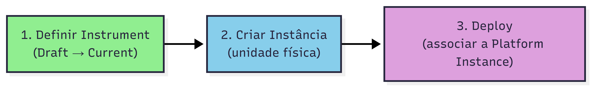
> _Imagem PNG equivalente ao diagrama Mermaid acima. Coloque o ficheiro com este nome em docs/images/diagrams/pt/._

> **Nota importante:** As instâncias de Instruments **não seguem o fluxo de revisão** (Draft → Under Review → Current). São criadas diretamente como registos operacionais. O fluxo de revisão aplica-se apenas à **definição** do Instrument/Simulator.

> 📘 **Porquê criar Instâncias?**
>
> No Manual 01, criou um **Instrument/Simulator** - este é o **modelo (definição/design)**, que descreve a estrutura, os slots e os componentes. É como o projeto de engenharia de uma máquina.
>
> Uma **Instância** é uma **unidade física concreta** desse modelo. Cada máquina real no seu laboratório é uma instância:
> - O modelo "Simulador de Liofilização LF-2000" é **um só**, aprovado uma vez.
> - Mas pode ter **3 máquinas físicas** desse modelo: #SN-001 na Sala 101, #SN-002 na Sala 205, #SN-003 na linha de produção.
>
> Cada instância tem o seu próprio **número de série**, **proprietário**, e pode ser **deployed** (associada a um laboratório específico para operação).
>
> **Analogia:** O modelo é como um modelo de carro (ex: "Toyota Corolla 2025"). A instância é o carro específico que comprou, com a sua matrícula e quilometragem.

---

## 2. O que é uma Instância de Instrument/Simulator?

Uma Instância contém:
- **Referência ao Instrument/Simulator** de origem (o tipo/design)
- **Número de identificação** (serial number / ID)
- **Data de aquisição**
- **Proprietário** (organização)
- **Responsável pela manutenção** (pessoa)
- **Estado** (operacional ou danificado)
- **Descrição** adicional

### Relação com Deployments

```mermaid
graph TD
    INST["🧪 Simulator: Liofilizador LF-2000<br/><i>(definição aprovada - Current)</i>"]
    
    INST -->|"instanciado"| I1["📋 Instância #SN-001<br/>Adquirido: 2025-01-15<br/>Proprietário: Lab PMSR"]
    INST -->|"instanciado"| I2["📋 Instância #SN-002<br/>Adquirido: 2025-06-20<br/>Proprietário: Lab Parceiro"]
    
    PLAT["🏭 Platform Instance: Lab A"]
    
    I1 -->|"deployed em"| DEP["🔗 Deployment<br/>Simulator #SN-001 @ Lab A"]
    PLAT -->|"deployed em"| DEP
```
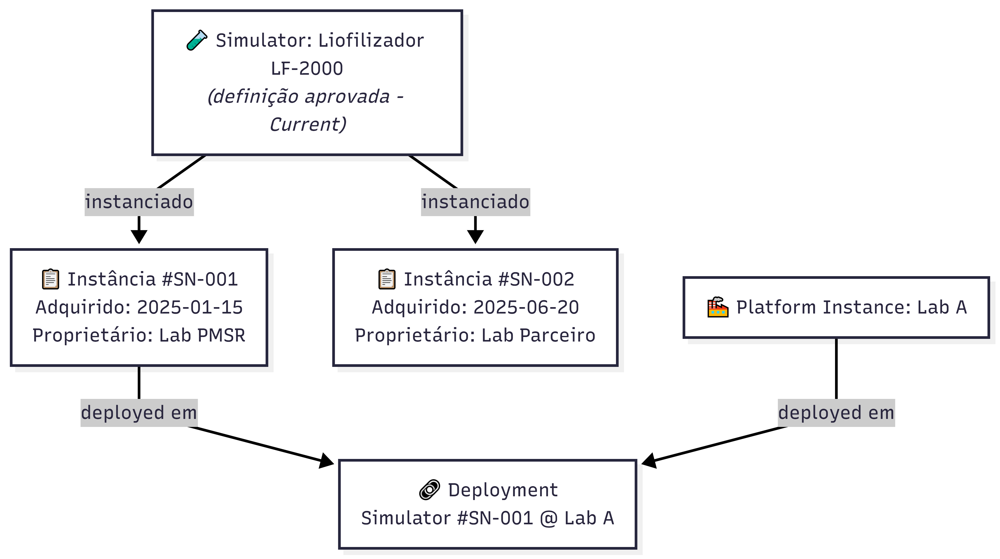
> _Imagem PNG equivalente ao diagrama Mermaid acima. Coloque o ficheiro com este nome em docs/images/diagrams/pt/._

---

## 3. Pré-requisitos

| Pré-requisito | Obrigatório? | Descrição |
|---------------|-------------|-----------|
| **Instrument/Simulator em estado Current** | **Sim** | Só é possível instanciar Instruments que foram aprovados (estado Current). Ver 🔗 [Secção 2 - Instruments / Simulators](#2-instruments--simulators) |
| **Platform Instance** | Para deploy | Necessária apenas se quiser criar um Deployment. Ver 🔗 [Secção 7 - Instâncias de Platforms / Laboratories](#7-instâncias-de-platforms--laboratories) |

---

## 4. Aceder à Gestão de Instâncias

### Caminho de Navegação

```
Menu Principal → Deployment Elements → Manage Elements → Manage Instrument Instances
```

> **Nota PMSR:** O menu pode mostrar **"Manage Simulator Instances"** conforme configurado pelo administrador do sistema.

**URL direto:** `https://www.pmsr.net/dpl/select/instrumentinstance/1/9`

### Passos:

📋 **Passo 1.** Na barra de navegação, clique em **"Deployment Elements"**.

📋 **Passo 2.** Passe o cursor sobre **"Manage Elements"**.

📋 **Passo 3.** Clique em **"Manage Instrument Instances"** (ou "Manage Simulator Instances").

---

## 5. A Página de Gestão (Lista)

### Modos de Visualização

| Botão | Descrição |
|-------|-----------|
| **Table View** | Vista em tabela |
| **Card View** | Vista em cartões |

### Colunas da Tabela

As colunas são geradas dinamicamente pelo sistema. Tipicamente incluem:

| Coluna | Descrição |
|--------|-----------|
| **URI** | Identificador único da instância |
| **Type** | Tipo do Instrument/Simulator de origem |
| **ID Number** | Número de série / identificação |
| **Label** | Nome gerado automaticamente (formato: "Tipo com #ID (serial_number)") |
| **Owner** | Organização proprietária |
| **Status** | Estado operacional |

### Botões de Ação

| Botão | Função |
|-------|--------|
| **Add New [Simulator] Instance** | Abre formulário de criação (modal) |
| **Back** | Volta à página anterior |
| **Load More** | Carrega mais itens (vista de cartões) |

---

## 6. Criar uma Nova Instância

> 🔐 **Papel necessário:** Utilizador autenticado. Qualquer utilizador com sessão iniciada pode criar instâncias de Instruments/Simulators.

### Sequência de Criação

```mermaid
sequenceDiagram
    actor U as Utilizador
    participant L as Lista de Instâncias
    participant M as Modal de Criação
    participant T as Modal de Tipo (Árvore)
    participant S as Sistema/API

    U->>L: Clica "Add New Simulator Instance"
    L->>M: Abre formulário modal
    U->>M: Clica campo "Simulator Type"
    M->>T: Abre árvore de Instruments/Simulators
    U->>T: Seleciona o Simulator pretendido
    T-->>M: Tipo preenchido
    U->>M: Preenche ID Number
    U->>M: (Opcional) Data de aquisição, Owner, etc.
    U->>M: Clica "Save"
    M->>S: Cria instância via API
    S-->>L: Instância criada com label auto-gerado
```
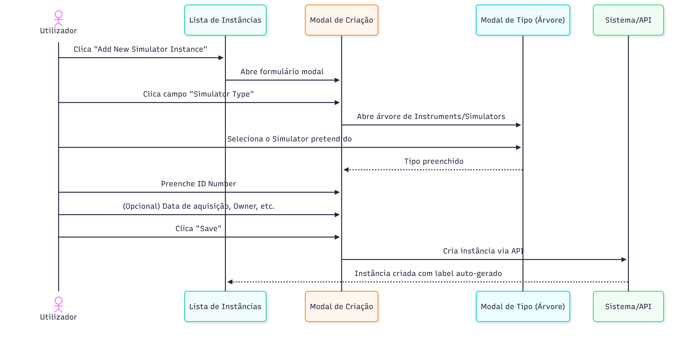
> _Imagem PNG equivalente ao diagrama Mermaid acima. Coloque o ficheiro com este nome em docs/images/diagrams/pt/._

### Passos Detalhados

📋 **Passo 1.** Na página de gestão, clique em **"Add New Simulator Instance"** (ou "Add New Instrument Instance").

📋 **Passo 2.** Um **formulário modal** (janela sobreposta) abre-se.

📋 **Passo 3.** Preencha os campos:

#### Campos do Formulário de Criação

| Campo | Tipo | Obrigatório | Descrição Detalhada |
|-------|------|-------------|---------------------|
| **Simulator Type** (ou Instrument Type) | Seleção por modal (árvore) | **Sim** | O Instrument/Simulator que esta instância representa. Clique para abrir a árvore de tipos. **Apenas elementos em estado Current são mostrados.** Selecione o design específico (ex: "Liofilizador LF-2000 v2"). |
| **ID Number** | Campo de texto | **Sim** | Número de série ou identificação única desta unidade física. **Exemplos:** "SN-001", "LF2000-PT-003", "EQ-2026-0042". Este número deve ser único e permitir identificar fisicamente o equipamento. |
| **Acquisition Date** | Seletor de data | Não | Data em que este equipamento foi adquirido/recebido. Formato: calendário com seleção de dia. |
| **Owner** | Campo com autocomplete | Não | Organização proprietária do equipamento. Comece a escrever e selecione da lista de organizações registadas no sistema. |
| **Maintainer** | Campo com autocomplete | Não | Pessoa responsável pela manutenção do equipamento. Comece a escrever e selecione da lista de pessoas. |
| **Description** | Área de texto | Não | Notas adicionais sobre esta instância: localização, condição, notas operacionais, etc. |

📋 **Passo 4.** Clique em **"Save"**.

📋 **Passo 5.** A instância é criada com:
- **URI** gerado automaticamente
- **Label** automático no formato: `"[Tipo] com #ID ([serial_number])"`
  - Exemplo: "Liofilizador LF-2000 com #ID (SN-001)"
- **Versão** = 1

### Seleção do Tipo (Modal)

Ao clicar no campo de tipo, a modal mostra a árvore de Instruments/Simulators em estado **Current**:

```
Instruments / Simulators Disponíveis
├── Liofilizador LF-2000 v2 (Current)
├── Simulador de Compressão SC-500 v1 (Current)
├── PHQ-9 Questionário v3 (Current)
└── ...
```

> ⚠️ **Apenas Instruments/Simulators em estado Current** aparecem na lista. Se o design que precisa não aparece, certifique-se de que foi aprovado (ver 🔗 [Secção 2 - Instruments / Simulators](#2-instruments--simulators)).

---

## 7. Editar uma Instância

> 🔐 **Papel necessário:** Utilizador autenticado. Apenas o utilizador que criou a instância ou um administrador pode editá-la.

### Como aceder

📋 **Passo 1.** Na lista de instâncias, selecione a instância a editar.

📋 **Passo 2.** Clique no botão de edição (ícone de lápis ou "Edit").

### Formulário de Edição

O formulário inclui todos os campos da criação, mais:

| Campo Adicional | Tipo | Descrição |
|----------------|------|-----------|
| **Damaged** | Checkbox | Marque se o equipamento está danificado |
| **Damage Date** | Seletor de data | Data do dano (visível apenas se Damaged está marcado) |

### Campos Editáveis

| Campo | Editável? | Notas |
|-------|-----------|-------|
| Simulator Type | Sim | Pode alterar o tipo/design de origem |
| ID Number | Sim | Pode corrigir o número de série |
| Acquisition Date | Sim | |
| Owner | Sim | |
| Maintainer | Sim | |
| Description | Sim | |
| Damaged | Sim | Marca/desmarca estado de dano |
| Damage Date | Condicional | Aparece apenas quando Damaged está marcado |

📋 Após editar, clique em **"Save"** para guardar as alterações.

---

## 8. Deployments - Associar Instâncias

> 🔐 **Papel necessário:** Utilizador autenticado com permissão de gestão de deployments. A criação de deployments pode requerer papel de administrador ou gestor de laboratório, conforme configurado pelo administrador do sistema.

Após criar instâncias de Instruments/Simulators e de Platforms/Laboratories, pode criar **Deployments** para associar um Simulator a um Laboratory.

### O que é um Deployment?

Um **Deployment** é o registo de que uma instância de Instrument/Simulator está **instalada/operacional** numa instância de Platform/Laboratory.

```mermaid
graph LR
    II["📋 Simulator Instance<br/>#SN-001"] --> DEP["🔗 Deployment<br/><i>'Liofilizador #SN-001 @ Lab A'</i>"]
    PI["🏭 Platform Instance<br/>Lab A"] --> DEP
```
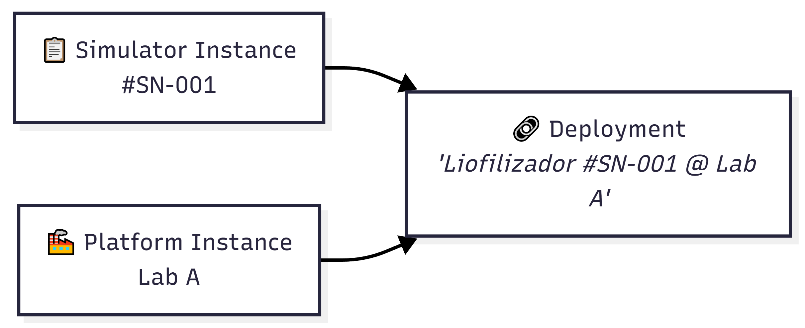
> _Imagem PNG equivalente ao diagrama Mermaid acima. Coloque o ficheiro com este nome em docs/images/diagrams/pt/._

### Criar um Deployment

```
Menu Principal → Deployment Elements → Manage Elements → Manage Deployments
```

📋 **Passo 1.** Na gestão de Deployments, clique em **"Add New Deployment"**.

📋 **Passo 2.** Preencha:

| Campo | Tipo | Obrigatório | Descrição |
|-------|------|-------------|-----------|
| **Platform Instance** | Autocomplete | **Sim** | A instância de Platform/Laboratory onde o equipamento está instalado |
| **Simulator Instance** | Autocomplete | **Sim** | A instância do Instrument/Simulator a instalar |
| **Version** | Automático | Auto | Versão 1 |
| **Description** | Textarea | Não | Notas sobre o deployment |

📋 **Passo 3.** Clique em **"Save"**.

O sistema gera automaticamente o label: `"[Instrument Label] @ [Platform Label]"`.

---

## 9. Referência de Campos

### Formulário de Criação - Campos Completos

| Campo | Nome Técnico | Tipo | Obrigatório | Descrição |
|-------|-------------|------|-------------|-----------|
| Type | `instance_type` | Modal textfield | Sim | Instrument/Simulator de origem |
| ID Number | `instance_serial_number` | Textfield | Sim | Número de série único |
| Acquisition Date | `instance_acquisition_date` | Date | Não | Data de aquisição |
| Owner | `instance_owner` | Textfield + autocomplete | Não | Organização proprietária |
| Maintainer | `instance_maintainer` | Textfield + autocomplete | Não | Pessoa responsável pela manutenção |
| Description | `instance_description` | Textarea | Não | Notas adicionais |

### Formulário de Edição - Campos Adicionais

| Campo | Nome Técnico | Tipo | Descrição |
|-------|-------------|------|-----------|
| Damaged | `instance_damaged` | Checkbox | Estado de dano do equipamento |
| Damage Date | `instance_damage_date` | Date | Data do dano (condicional) |

---

## 10. Resolução de Problemas

| Problema | Causa Possível | Solução |
|----------|----------------|---------|
| O Instrument/Simulator que preciso não aparece na seleção de tipo | O Instrument não está em estado Current | Submeta o Instrument para revisão e aguarde aprovação. Ver 🔗 [Secção 2 - Instruments / Simulators](#2-instruments--simulators) |
| O formulário de criação aparece como modal muito pequena | Comportamento normal para instâncias | A criação de instâncias usa formulário modal (compacto) |
| Não consigo criar Deployment | Faltam instâncias de Platform ou Instrument | Crie ambas as instâncias primeiro: 🔗 [Secção 7 - Instâncias de Platforms / Laboratories](#7-instâncias-de-platforms--laboratories) |
| O campo Owner/Maintainer não mostra sugestões | O módulo Social não está ativo ou não existem organizações/pessoas registadas | Contacte o administrador para verificar o módulo Social |
| O label gerado não está correto | O ID Number pode estar incorreto | Edite a instância e corrija o campo ID Number |

---

🔗 **Navegação Interna:**
[Instruments / Simulators](#2-instruments--simulators) • [Platforms / Laboratories](#6-platforms--laboratories) • [Instâncias de Platforms / Laboratories](#7-instâncias-de-platforms--laboratories) • [Índice Interno](#índice-interno)

---

## 6. Platforms / Laboratories

**Módulo:** DPL (Deployment)  
**Contexto PMSR:** No PMSR, "Platform" pode representar um **"Laboratory"** ou local de operação  

---
## 1. Visão Geral

Uma **Platform** (ou **Laboratory** no contexto PMSR) representa um **local, espaço ou equipamento de infraestrutura** onde instrumentos/simuladores operam e dados são recolhidos. No PMSR, Platforms tipicamente correspondem a laboratórios, salas de simulação, ou unidades industriais.

> 📘 **Modelo vs. Instância:** Uma Platform/Laboratory é um **modelo (definição)** - descreve o tipo de plataforma ou laboratório (ex: "Laboratório de Liofilização Tipo A"). Para registar um **laboratório concreto e específico** (ex: "Laboratório de Liofilização, Edifício B, Sala 203"), crie uma **Instância** - consulte a [Secção 7 - Instâncias de Platforms / Laboratories](#7-instâncias-de-platforms--laboratories). O mesmo modelo pode ter múltiplas instâncias em diferentes localizações.

### Posição no Fluxo Geral

```mermaid
graph TD
    subgraph "Definições"
        PLAT["🏭 Platform / Laboratory<br/><i>(design do local/equipamento)</i>"]
        INST["🧪 Instrument / Simulator<br/><i>(design do instrumento)</i>"]
    end
    
    subgraph "Instâncias"
        PI["🏭 Platform Instance<br/><i>(local concreto)</i>"]
        II["📋 Instrument Instance<br/><i>(equipamento concreto)</i>"]
    end
    
    subgraph "Operação"
        DEP["🔗 Deployment<br/><i>(instrumento operacional num local)</i>"]
    end
    
    PLAT -->|"instanciada"| PI
    INST -->|"instanciado"| II
    PI --> DEP
    II --> DEP
    
    style PLAT fill:#FFD700
    style PI fill:#87CEEB
```
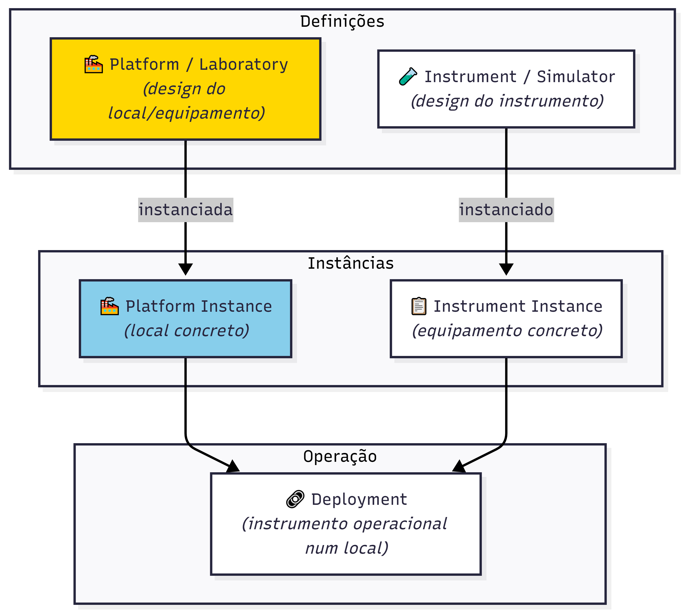
> _Imagem PNG equivalente ao diagrama Mermaid acima. Coloque o ficheiro com este nome em docs/images/diagrams/pt/._

> **Nota:** Ao contrário dos Instruments e Components, as Platforms **não seguem o fluxo de revisão** completo (Draft → Under Review → Current). A gestão de Platforms é mais simplificada.

---

## 2. O que é uma Platform / Laboratory?

### Definição

Uma Platform define:
- **Tipo hierárquico** na ontologia (ex: Laboratory, Clean Room, Production Floor)
- **Nome** do local ou equipamento
- **Versão** do design
- **Descrição** do propósito e características

### Exemplos no PMSR

| Tipo | Exemplo de Platform | Descrição |
|------|---------------------|-----------|
| Laboratório | Lab PMSR - Sala 101 | Laboratório principal de simulação farmacêutica |
| Sala Limpa | Clean Room Classe 100 | Sala limpa para produção estéril |
| Unidade Industrial | Linha de Produção LP-3 | Linha de produção de liofilizados |
| Estação de Trabalho | Estação de Controlo EC-2 | Estação de controlo de processos |

### Hierarquia de Tipos

A seleção do tipo de Platform é feita através de uma **árvore hierárquica** da ontologia:

```mermaid
graph TD
    ROOT["Platform Types"]
    ROOT --> LAB["Laboratory"]
    ROOT --> PROD["Production Facility"]
    ROOT --> FIELD["Field Station"]
    
    LAB --> LAB1["Research Laboratory"]
    LAB --> LAB2["Quality Control Lab"]
    LAB --> LAB3["Clean Room"]
    
    PROD --> PROD1["Manufacturing Line"]
    PROD --> PROD2["Packaging Line"]
    
    FIELD --> FIELD1["Remote Monitoring Station"]
    FIELD --> FIELD2["Mobile Unit"]
```
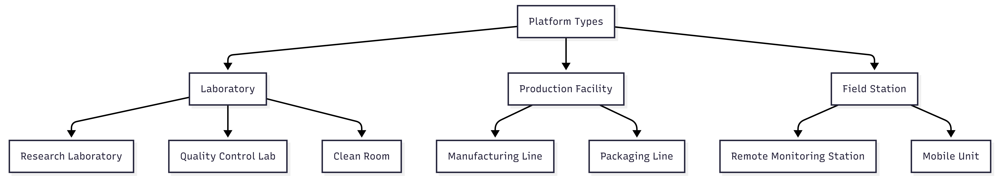
> _Imagem PNG equivalente ao diagrama Mermaid acima. Coloque o ficheiro com este nome em docs/images/diagrams/pt/._

> No contexto PMSR, "Laboratory" é tipicamente o tipo mais utilizado. A nomenclatura exibida depende da configuração de **Preferred Names**.

---

## 3. Aceder à Gestão de Platforms

### Caminho de Navegação

```
Menu Principal → Deployment Elements → Manage Elements → Manage Platforms
```

**URL direto:** `https://www.pmsr.net/dpl/select/platform/1/9`

### Passos:

📋 **Passo 1.** Na barra de navegação principal, clique em **"Deployment Elements"**.

📋 **Passo 2.** Passe o cursor sobre **"Manage Elements"**.

📋 **Passo 3.** Clique em **"Manage Platforms"**.

---

## 4. A Página de Gestão (Lista)

### Modos de Visualização

| Botão | Descrição |
|-------|-----------|
| **Table View** | Vista em tabela (recomendado) |
| **Card View** | Vista em cartões |

### Colunas da Tabela

| Coluna | Descrição |
|--------|-----------|
| **URI** | Identificador único da Platform |
| **Name** | Nome da Platform/Laboratory |
| **Version** | Versão do design |

### Botões de Ação

| Botão | Função |
|-------|--------|
| **Add New Platform** | Abre o formulário de criação |
| **Back** | Volta à página anterior |
| **Load More** | Carrega mais itens (vista de cartões) |

---

## 5. Criar uma Nova Platform / Laboratory

> 🔐 **Permissão necessária:** A criação e edição de Platforms/Laboratories requer um utilizador autenticado.

### Sequência de Criação

```mermaid
sequenceDiagram
    actor U as Utilizador
    participant L as Lista de Platforms
    participant F as Formulário de Criação
    participant T as Modal de Tipo (Árvore)
    participant S as Sistema/API

    U->>L: Clica "Add New Platform"
    L->>F: Abre formulário
    U->>F: Clica campo "Platform Type"
    F->>T: Abre árvore de tipos
    U->>T: Seleciona tipo (ex: Laboratory)
    T-->>F: Tipo preenchido
    U->>F: Preenche Name
    U->>F: (Opcional) Description
    U->>F: Clica "Save"
    F->>S: Cria Platform via API
    S-->>L: Platform criada
```
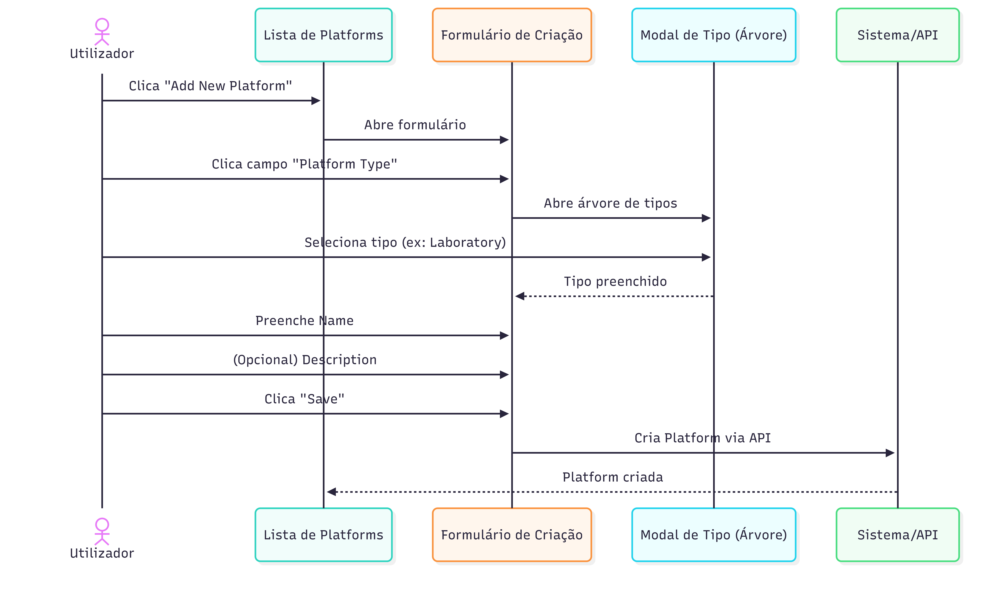
> _Imagem PNG equivalente ao diagrama Mermaid acima. Coloque o ficheiro com este nome em docs/images/diagrams/pt/._

### Passos Detalhados

📋 **Passo 1.** Na página de gestão, clique em **"Add New Platform"**.

📋 **Passo 2.** O formulário de criação abre-se.

📋 **Passo 3.** Preencha os campos:

#### Campos do Formulário

| Campo | Tipo | Obrigatório | Descrição Detalhada |
|-------|------|-------------|---------------------|
| **Platform Type** | Seleção por modal (árvore) | **Sim** | Define o tipo hierárquico da Platform. Ao clicar, abre-se uma janela modal (800px) com a árvore de tipos disponíveis na ontologia. **No PMSR, selecione tipicamente "Laboratory" ou o subtipo mais específico.** A árvore mostra toda a hierarquia de tipos de Platform definidos no sistema. |
| **Name** | Campo de texto | **Sim** | Nome descritivo e identificável da Platform/Laboratory. Deve ser único e claro. **Exemplos:** "Laboratório de Simulação PMSR - Sala 101", "Clean Room GMP - Edifício B", "Estação de Controlo EC-Principal". |
| **Version** | Campo (somente leitura) | Auto | Inicia em 1. Não editável pelo utilizador. Incrementa automaticamente em edições posteriores. |
| **Description** | Área de texto | Não | Descrição detalhada da Platform: localização física, capacidades, equipamentos fixos, restrições de acesso, condições ambientais, etc. |

📋 **Passo 4.** Clique em **"Save"** para criar.

📋 **Passo 5.** A Platform é criada e o sistema redireciona para a lista de gestão.

### Seleção do Platform Type (Modal)

Ao clicar no campo **Platform Type**, a modal apresenta a árvore hierárquica:

```
Platform Types (Ontologia)
├── 🏭 Laboratory
│   ├── Research Laboratory
│   ├── Quality Control Laboratory
│   ├── Clinical Laboratory
│   └── Clean Room
├── 🏗️ Production Facility
│   ├── Manufacturing Line
│   └── Packaging Area
├── 📡 Field Station
│   ├── Remote Monitoring Station
│   └── Mobile Unit
└── 💻 Workstation
    ├── Control Station
    └── Analysis Terminal
```

**Para selecionar:** Navegue pela árvore e clique no tipo desejado. O campo é preenchido automaticamente e a modal fecha-se.

> **Dica PMSR:** Para a maioria dos cenários PMSR, selecione **"Laboratory"** ou um dos seus subtipos. Consulte a equipa se não tiver a certeza de qual tipo usar.

---

## 6. Editar uma Platform / Laboratory

> 🔐 **Permissão necessária:** A criação e edição de Platforms/Laboratories requer um utilizador autenticado.

### Como aceder

📋 **Passo 1.** Na lista de Platforms, localize a Platform que pretende editar.

📋 **Passo 2.** Selecione-a (radio button ou clique).

📋 **Passo 3.** Clique no botão de edição (ou dê duplo-clique).

### Formulário de Edição

O formulário é semelhante ao de criação, com todos os campos editáveis:

| Campo | Editável? | Notas |
|-------|-----------|-------|
| **Platform Type** | Sim | Pode alterar o tipo via modal de árvore |
| **Name** | Sim | Pode alterar o nome |
| **Version** | Somente leitura | Incrementa automaticamente se a versão atual é Current/Deprecated |
| **Description** | Sim | Pode atualizar a descrição |

### Botões

| Botão | Função |
|-------|--------|
| **Update** | Guarda as alterações |
| **Cancel** | Descarta e volta à lista |

### Fluxo de Edição

```mermaid
flowchart TD
    A["Selecionar Platform na Lista"] --> B["Abrir Formulário de Edição"]
    B --> C["Alterar campos conforme necessário"]
    C --> D{"Guardar?"}
    D -->|Sim| E["Clicar Update"]
    D -->|Não| F["Clicar Cancel"]
    E --> G["Alterações guardadas<br/>Redireciona para lista"]
    F --> G
```
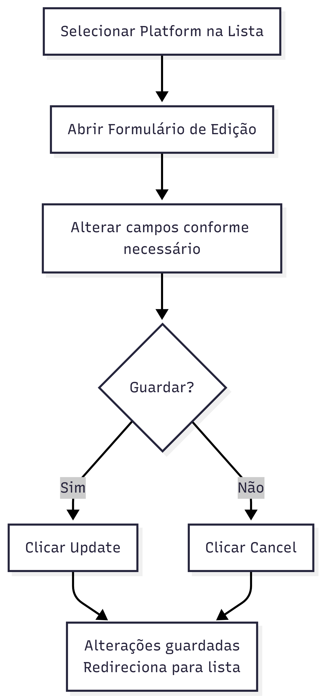
> _Imagem PNG equivalente ao diagrama Mermaid acima. Coloque o ficheiro com este nome em docs/images/diagrams/pt/._

---

## 7. Referência de Campos

### Formulário de Criação e Edição

| Campo | Nome Técnico | Tipo HTML | Obrigatório | Valor Padrão | Validação |
|-------|-------------|-----------|-------------|--------------|-----------|
| Platform Type | `platform_type` | Modal textfield | Sim | (vazio) | URI válido da ontologia |
| Name | `platform_name` | Textfield | Sim | (vazio) | Não vazio |
| Version | `platform_version` | Textfield (disabled) | Auto | 1 | Inteiro positivo, gerido pelo sistema |
| Description | `platform_description` | Textarea | Não | (vazio) | - |

### Comparação com Instruments

| Aspeto | Platform | Instrument |
|--------|----------|------------|
| **Nº de campos** | 4 (simples) | 15+ (complexo) |
| **Imagem/Documento** | Não | Sim |
| **Fluxo de revisão** | Não | Sim (Draft → Under Review → Current) |
| **Container Slots** | Não | Sim |
| **Maker/Language** | Não | Sim |

---

## 8. Resolução de Problemas

| Problema | Causa Possível | Solução |
|----------|----------------|---------|
| A modal do Platform Type está vazia | Problema de conexão com a ontologia | Contacte o administrador do sistema |
| Não encontro o tipo "Laboratory" | A ontologia pode não ter este subtipo exato | Navegue pela árvore ou contacte o administrador para verificar os tipos disponíveis |
| Quero adicionar mais detalhes à Platform | O formulário só tem 4 campos | Use o campo Description para incluir informação detalhada. Detalhes operacionais são geridos nas Instâncias (🔗 [Secção 7 - Instâncias de Platforms / Laboratories](#7-instâncias-de-platforms--laboratories)) |
| A versão incrementou sozinha | Comportamento esperado em edição de versões Current | Normal: o sistema cria nova versão automaticamente |
| Não consigo eliminar a Platform | Podem existir instâncias associadas | Elimine primeiro as instâncias e deployments associados |

---

🔗 **Navegação Interna:**
[Instâncias de Platforms / Laboratories](#7-instâncias-de-platforms--laboratories) • [Instruments / Simulators](#2-instruments--simulators) • [Instâncias de Instruments / Simulators](#5-instâncias-de-instruments--simulators) • [Índice Interno](#índice-interno)

---

## 7. Instâncias de Platforms / Laboratories

**Módulo:** DPL (Deployment)  
**Contexto PMSR:** Instâncias representam unidades físicas/concretas de um Laboratory  

---
## 1. Visão Geral

Uma **Instância de Platform** (ou **Instância de Laboratory** no PMSR) representa uma **unidade física concreta** de uma Platform previamente definida. Enquanto a Platform é o "design" ou "tipo" do local/infraestrutura, a Instância é o **local real, específico e identificável**.

### Analogia

| Conceito | Analogia |
|----------|----------|
| **Platform / Laboratory** | O *projeto* de um tipo de laboratório (ex: "Clean Room Classe 100") |
| **Instância de Platform** | Um *laboratório concreto* desse tipo (ex: "Clean Room - Edif. B, Sala 204, ID: CR-204") |

### Posição no Pipeline

```mermaid
graph LR
    A["1. Definir Platform<br/>(tipo/design)"]
    B["2. Criar Instância<br/>(local concreto)"]
    C["3. Deploy<br/>(associar simulator instance)"]
    
    A --> B --> C
    
    style A fill:#FFD700
    style B fill:#87CEEB
    style C fill:#DDA0DD
```
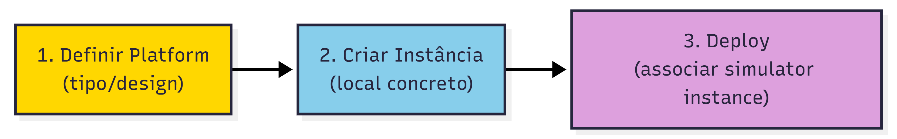
> _Imagem PNG equivalente ao diagrama Mermaid acima. Coloque o ficheiro com este nome em docs/images/diagrams/pt/._

> 📘 **Porquê criar Instâncias?**
> 
> No Manual 05, criou uma **Platform/Laboratory** - este é o **modelo (definição)**, que descreve o tipo de plataforma ou laboratório. É como a planta-tipo de um laboratório.
> 
> Uma **Instância** é um **laboratório concreto e específico** desse modelo:
> - O modelo "Laboratório de Liofilização Tipo A" é definido **uma vez**.
> - Mas pode ter **2 laboratórios físicos** desse tipo: um no Edifício B, Sala 203 e outro no Edifício D, Sala 105.
> 
> Cada instância tem a sua própria **localização**, **responsável** e pode receber **deployments** (associação de instâncias de instrumentos/simuladores).
> 
> **Analogia:** O modelo é como o tipo de sala de aula (ex: "Laboratório de Química"). A instância é a sala específica (ex: "Lab Química, Bloco C, Sala 301").

---

## 2. O que é uma Instância de Platform / Laboratory?

Uma Instância de Platform regista:
- **Referência ao tipo** de Platform (o design/categoria)
- **Número de identificação** (ID único do local)
- **Data de aquisição/criação**
- **Proprietário** (organização)
- **Responsável pela manutenção**
- **Estado** (operacional ou danificado)
- **Descrição** operacional

### Relação com Deployments

```mermaid
graph TD
    PLAT["🏭 Platform: Clean Room Classe 100<br/><i>(definição/tipo)</i>"]
    
    PLAT -->|"instanciada"| PI1["🏭 Instância: CR-Sala-204<br/>ID: CR-204<br/>Owner: Dept. Produção"]
    PLAT -->|"instanciada"| PI2["🏭 Instância: CR-Sala-305<br/>ID: CR-305<br/>Owner: Dept. QC"]
    
    II["📋 Simulator Instance<br/>#SN-001"]
    
    PI1 --> DEP["🔗 Deployment<br/>Simulator #SN-001 @ CR-Sala-204"]
    II --> DEP
    
    style PLAT fill:#FFD700
    style PI1 fill:#87CEEB
    style PI2 fill:#87CEEB
```
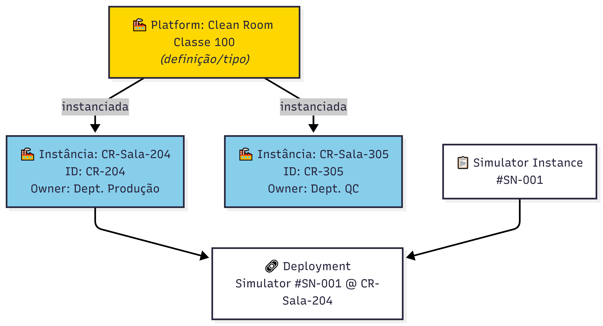
> _Imagem PNG equivalente ao diagrama Mermaid acima. Coloque o ficheiro com este nome em docs/images/diagrams/pt/._

---

## 3. Pré-requisitos

| Pré-requisito | Obrigatório? | Descrição |
|---------------|-------------|-----------|
| **Platform / Laboratory definida** | **Sim** | A Platform deve existir no sistema. Ver 🔗 [Secção 6 - Platforms / Laboratories](#6-platforms--laboratories) |
| **Instrument/Simulator Instance** | Para deploy | Necessária apenas para criar Deployments. Ver 🔗 [Secção 5 - Instâncias de Instruments / Simulators](#5-instâncias-de-instruments--simulators) |

---

## 4. Aceder à Gestão de Instâncias

### Caminho de Navegação

```
Menu Principal → Deployment Elements → Manage Elements → Manage Platform Instances
```

**URL direto:** `https://www.pmsr.net/dpl/select/platforminstance/1/9`

### Passos:

📋 **Passo 1.** Na barra de navegação, clique em **"Deployment Elements"**.

📋 **Passo 2.** Passe o cursor sobre **"Manage Elements"**.

📋 **Passo 3.** Clique em **"Manage Platform Instances"**.

---

## 5. A Página de Gestão (Lista)

### Modos de Visualização

| Botão | Descrição |
|-------|-----------|
| **Table View** | Vista em tabela (recomendado para gestão) |
| **Card View** | Vista em cartões com visual mais compacto |

### Colunas da Tabela

| Coluna | Descrição |
|--------|-----------|
| **URI** | Identificador único da instância |
| **Type** | Tipo de Platform de origem |
| **ID Number** | Número de identificação do local |
| **Label** | Nome gerado automaticamente |
| **Owner** | Organização proprietária |
| **Status** | Estado operacional |

### Botões de Ação

| Botão | Função |
|-------|--------|
| **Add New Platform Instance** | Abre formulário de criação (modal) |
| **Back** | Volta à página anterior |
| **Load More** | Carrega mais itens (vista de cartões) |

---

## 6. Criar uma Nova Instância

> 🔐 **Permissão necessária:** A criação de instâncias requer um utilizador autenticado.

### Sequência de Criação

```mermaid
sequenceDiagram
    actor U as Utilizador
    participant L as Lista de Instâncias
    participant M as Modal de Criação
    participant T as Modal de Tipo (Árvore)
    participant S as Sistema/API

    U->>L: Clica "Add New Platform Instance"
    L->>M: Abre formulário modal
    U->>M: Clica campo "Platform Type"
    M->>T: Abre árvore de Platforms disponíveis
    U->>T: Seleciona Platform (ex: Laboratory)
    T-->>M: Tipo preenchido
    U->>M: Preenche ID Number
    U->>M: (Opcional) Data, Owner, Maintainer
    U->>M: Clica "Save"
    M->>S: Cria instância via API
    S-->>L: Instância criada
```
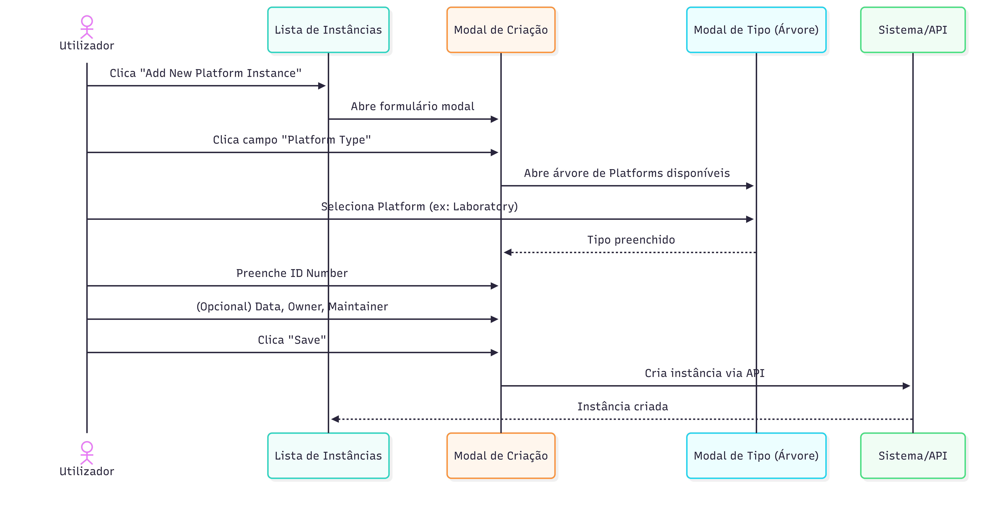
> _Imagem PNG equivalente ao diagrama Mermaid acima. Coloque o ficheiro com este nome em docs/images/diagrams/pt/._

### Passos Detalhados

📋 **Passo 1.** Na página de gestão, clique em **"Add New Platform Instance"**.

📋 **Passo 2.** Um **formulário modal** (janela sobreposta) abre-se.

📋 **Passo 3.** Preencha os campos:

#### Campos do Formulário de Criação

| Campo | Tipo | Obrigatório | Descrição Detalhada |
|-------|------|-------------|---------------------|
| **Platform Type** | Seleção por modal (árvore) | **Sim** | A Platform que esta instância materializa. Clique para abrir a árvore de Platforms definidas no sistema. Selecione o tipo de Platform adequado. **Exemplo PMSR:** Selecione "Clean Room Classe 100" ou "Laboratório de Simulação". |
| **ID Number** | Campo de texto | **Sim** | Identificador único desta instância/local. Deve permitir identificação inequívoca. **Exemplos:** "SALA-101", "CR-204", "LAB-PMSR-01", "LP3-EAST". Use uma convenção consistente na sua organização. |
| **Acquisition Date** | Seletor de data | Não | Data de inauguração, aquisição ou início de operação do local. Clique no campo para abrir o calendário e selecione a data. |
| **Owner** | Campo com autocomplete | Não | Organização proprietária ou responsável pelo local. Comece a escrever o nome da organização e selecione da lista. **Exemplo:** "Departamento de Produção PMSR". |
| **Maintainer** | Campo com autocomplete | Não | Pessoa responsável pela manutenção e gestão do espaço. Comece a escrever o nome e selecione da lista. |
| **Description** | Área de texto | Não | Informações adicionais: localização exata (edifício, andar, ala), capacidade, condições especiais (temperatura controlada, pressão, classificação), horário de funcionamento, restrições de acesso, etc. |

📋 **Passo 4.** Clique em **"Save"**.

📋 **Passo 5.** A instância é criada com:
- **URI** gerado automaticamente
- **Label** automático: `"[Tipo] com #ID ([ID Number])"`
  - Exemplo: "Clean Room Classe 100 com #ID (CR-204)"
- **Versão** = 1

### Seleção do Platform Type (Modal)

Ao clicar no campo de tipo, a modal mostra as Platforms disponíveis:

```
Platforms Disponíveis
├── 🏭 Laboratory - Laboratório de Simulação PMSR
├── 🏭 Clean Room Classe 100
├── 🏭 Linha de Produção LP-3
├── 🏭 Estação de Controlo Principal
└── ...
```

Selecione a Platform adequada clicando sobre ela.

---

## 7. Editar uma Instância

> 🔐 **Permissão necessária:** A criação de instâncias requer um utilizador autenticado.

### Como aceder

📋 **Passo 1.** Na lista de instâncias, selecione a instância a editar.

📋 **Passo 2.** Clique no botão de edição.

### Formulário de Edição

Todos os campos da criação estão disponíveis para edição, mais campos adicionais:

| Campo | Editável? | Notas |
|-------|-----------|-------|
| **Platform Type** | Sim | Pode alterar o tipo de Platform |
| **ID Number** | Sim | Pode corrigir o identificador |
| **Acquisition Date** | Sim | |
| **Owner** | Sim | |
| **Maintainer** | Sim | |
| **Description** | Sim | |
| **Damaged** | Sim | Checkbox para marcar estado de dano |
| **Damage Date** | Condicional | Visível apenas quando Damaged está marcado |

### Marcar como Danificado

Se o local/equipamento sofrer danos:

📋 **Passo 1.** Abra o formulário de edição da instância.

📋 **Passo 2.** Marque a checkbox **"Damaged"**.

📋 **Passo 3.** O campo **"Damage Date"** aparece. Selecione a data em que o dano ocorreu.

📋 **Passo 4.** (Opcional) Atualize a **Description** com detalhes sobre o dano.

📋 **Passo 5.** Clique em **"Save"**.

```mermaid
flowchart LR
    A["Estado Normal"] -->|"Marcar Damaged"| B["Estado Danificado"]
    B -->|"Desmarcar Damaged"| A
    
    B --> C["Damage Date registada"]
    B --> D["Impacto em Deployments"]
```
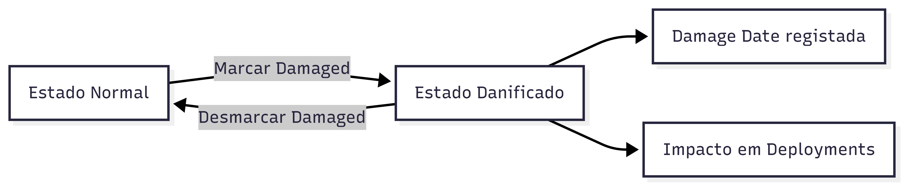
> _Imagem PNG equivalente ao diagrama Mermaid acima. Coloque o ficheiro com este nome em docs/images/diagrams/pt/._

> ⚠️ **Impacto:** Marcar uma Platform Instance como danificada pode afetar os Deployments ativos nesse local. Verifique os Deployments associados antes de efetuar esta alteração.

---

## 8. Cenário Completo: Do Laboratório ao Deployment

> 🔐 **Permissão necessária:** A gestão de deployments pode requerer permissões adicionais além do utilizador autenticado básico.

Este cenário demonstra o fluxo completo para um utilizador PMSR, desde a definição de um Laboratory até ao Deployment de um Simulator nesse local.

### Passos do Cenário

```mermaid
graph TD
    A["📋 Passo 1: Criar Platform 'Laboratory'<br/><i>Deployment Elements → Manage Platforms</i>"]
    B["📋 Passo 2: Criar Platform Instance<br/><i>'Lab PMSR Sala 101' - ID: LAB-101</i>"]
    C["📋 Passo 3: Criar Instrument 'Simulator'<br/><i>Instrument Elements → Manage Instruments</i>"]
    D["📋 Passo 4: Aprovar Simulator<br/><i>(Draft → Under Review → Current)</i>"]
    E["📋 Passo 5: Criar Instrument Instance<br/><i>'Liofilizador #SN-001'</i>"]
    F["📋 Passo 6: Criar Deployment<br/><i>'Liofilizador #SN-001 @ Lab PMSR Sala 101'</i>"]
    
    A --> B
    C --> D --> E
    B --> F
    E --> F
    
    style A fill:#FFD700
    style B fill:#87CEEB
    style C fill:#90EE90
    style D fill:#FFA07A
    style E fill:#87CEEB
    style F fill:#DDA0DD
```
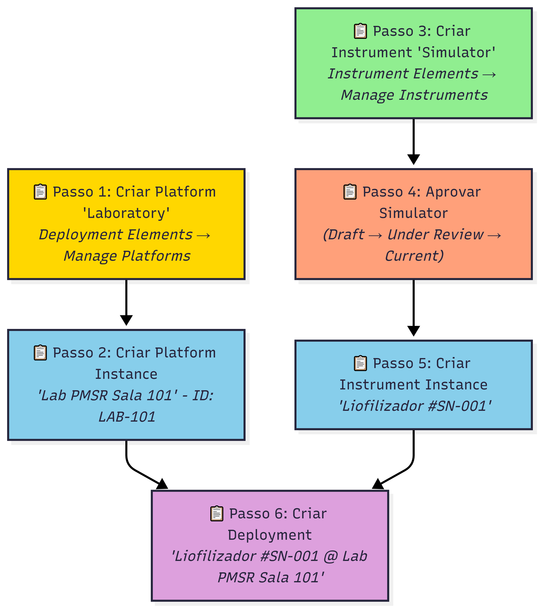
> _Imagem PNG equivalente ao diagrama Mermaid acima. Coloque o ficheiro com este nome em docs/images/diagrams/pt/._

| Passo | Ação | Manual de Referência |
|-------|------|---------------------|
| 1 | Criar Platform "Laboratory" | 🔗 [Secção 6 - Platforms / Laboratories](#6-platforms--laboratories), secção 5 |
| 2 | Criar Platform Instance "Lab PMSR Sala 101" | Este manual, [secção 6](#6-criar-uma-nova-instância) |
| 3 | Criar Instrument/Simulator | 🔗 [Secção 2 - Instruments / Simulators](#2-instruments--simulators) |
| 4 | Submeter e aprovar o Simulator | 🔗 [Secção 2 - Instruments / Simulators](#2-instruments--simulators), secções 7-8 |
| 5 | Criar Instrument Instance | 🔗 [Secção 5 - Instâncias de Instruments / Simulators](#5-instâncias-de-instruments--simulators) |
| 6 | Criar Deployment | 🔗 [Secção 5 - Instâncias de Instruments / Simulators](#5-instâncias-de-instruments--simulators), secção 8 |

### Resultado Final

Após completar todos os passos:

```
🔗 Deployment: "Liofilizador LF-2000 #SN-001 @ Lab PMSR Sala 101"
├── 📋 Simulator Instance: Liofilizador #SN-001
│   └── 🧪 Simulator: Liofilizador LF-2000 v2 (Current)
│       ├── ⚙️ Component: Temperatura de Entrada (Slot #1)
│       ├── ⚙️ Component: Pressão da Câmara (Slot #2)
│       └── ⚙️ Component: Válvula de Controlo (Slot #3)
└── 🏭 Platform Instance: Lab PMSR Sala 101 (LAB-101)
    └── 🏭 Platform: Laboratory de Simulação PMSR
```

---

## 9. Referência de Campos

### Formulário de Criação

| Campo | Nome Técnico | Tipo | Obrigatório | Valor Padrão | Descrição |
|-------|-------------|------|-------------|--------------|-----------|
| Platform Type | `instance_type` | Modal textfield | Sim | (vazio) | Platform de origem |
| ID Number | `instance_serial_number` | Textfield | Sim | (vazio) | Identificador único |
| Acquisition Date | `instance_acquisition_date` | Date | Não | (vazio) | Data de aquisição/inauguração |
| Owner | `instance_owner` | Textfield + autocomplete | Não | (vazio) | Organização proprietária |
| Maintainer | `instance_maintainer` | Textfield + autocomplete | Não | (vazio) | Pessoa responsável |
| Description | `instance_description` | Textarea | Não | (vazio) | Descrição operacional |

### Formulário de Edição - Campos Adicionais

| Campo | Nome Técnico | Tipo | Descrição |
|-------|-------------|------|-----------|
| Damaged | `instance_damaged` | Checkbox | Indica se o local está danificado |
| Damage Date | `instance_damage_date` | Date | Data do dano (condicional) |

---

## 10. Resolução de Problemas

| Problema | Causa Possível | Solução |
|----------|----------------|---------|
| Não encontro a Platform que preciso na seleção de tipo | A Platform ainda não foi criada | Crie a Platform primeiro: 🔗 [Secção 6 - Platforms / Laboratories](#6-platforms--laboratories) |
| O campo Owner/Maintainer não mostra sugestões | Módulo Social não ativo ou sem organizações registadas | Contacte o administrador |
| Quero associar um Simulator a esta instância | Precisa de criar um Deployment | Use *Manage Deployments* e siga as instruções na 🔗 [Secção 5 - Instâncias de Instruments / Simulators](#5-instâncias-de-instruments--simulators), secção 8 |
| Marquei como Damaged por engano | - | Abra a edição, desmarque a checkbox Damaged e Save |
| Não consigo ver Platform Instances | Pode não ter instâncias criadas | Crie a primeira instância com "Add New Platform Instance" |
| O formulário aparece muito pequeno | Comportamento normal - instâncias usam modal | O formulário modal é compacto por design |

---

🔗 **Navegação Interna:**
[Platforms / Laboratories](#6-platforms--laboratories) • [Instruments / Simulators](#2-instruments--simulators) • [Instâncias de Instruments / Simulators](#5-instâncias-de-instruments--simulators) • [Índice Interno](#índice-interno)

---

*Documento do Grupo de Trabalho PMSR - Março 2026*
